# ROS1 零基础自学指导书（最终版）

生成日期：2026-05-24

本书面向对 Ubuntu、Linux 命令行和 ROS 都没有经验的大学生，主线环境为 Ubuntu 20.04 Focal Fossa + ROS1 Noetic Ninjemys。写作目标不是让读者机械复制命令，而是帮助读者理解每个命令、每个节点、每条 topic、每个参数和每个配置文件在 ROS 系统中的作用。

ROS Noetic 已于 2025-05-31 到达官方 EOL。本书继续使用 Noetic，是为了学习 ROS1 体系、维护历史项目和理解现有机器人系统，不是建议新项目默认继续优先选择 ROS1。

## 使用说明

建议按章节顺序学习。每章都包含本章目标、概念解释、最小可运行实验、正确现象、常见错误、自测题、参考答案和延伸阅读。读者应在 Ubuntu 20.04 + ROS Noetic 环境中实际运行命令，并在每次实验后先独立回答自测题，再对照参考答案检查理解是否完整。

本书新增“学习成果验收与排障索引”，用于把每章学习内容转换成可观察交付物。自学时不要只看正文，应按索引保留命令输出、截图、系统图或 README 片段，作为自己真正完成实验的证据。

本书主线不展开后续平台部署主题，也不把高级算法推导作为主体。SLAM、定位、导航等内容只作为 ROS 系统集成案例出现。

## 总目录

0. 学习成果验收与排障索引
1. Ubuntu 与 Linux 入门
2. ROS1 基本概念
3. ROS1 安装方法完整说明
4. 第一个 ROS 系统
5. catkin 工作空间与功能包
6. Python 与 C++ 编写 ROS 节点
7. ROS 运行管理
8. 机器人坐标、模型与可视化
9. 仿真与移动机器人入门
10. 综合项目

---

# 学习成果验收与排障索引

## 为什么需要这份索引

成熟 ROS 入门资料通常有一个共同特点：它们不是只解释概念，而是让读者不断完成“运行一个东西、观察一个现象、解释一个关系、修复一个错误”的循环。ROS Wiki 的 beginner tutorials 用 turtlesim、topic、service、catkin 和 rosbag 逐步建立观察能力；`A Gentle Introduction to ROS` 适合用较慢节奏解释新手误解；TurtleBot3 e-Manual 强调用完整机器人系统把仿真、话题、TF、RViz 和 Gazebo 串起来；鱼香 ROS、Autolabor 等中文资料则更贴近国内学生遇到的安装、网络和课堂排障问题。

本书的目标不是把这些教程拼接起来，而是把它们的教学优点合成一条统一主线：每章读完以后，学生必须能拿出一个可观察成果，而不是只说“我看懂了”。如果某章没有成果，学习很容易停留在记忆命令；如果某个错误没有排障路径，学生下一次换环境就会再次卡住。

## 全书学习成果矩阵

| 章节 | 核心能力 | 必须完成的可观察成果 | 推荐保存的证据 |
|---:|---|---|---|
| 1 | Ubuntu 与 Linux 基础 | 能创建目录、编辑文件、安装软件、解释 `PATH` 和 `.bashrc` | `pwd`、`tree`、`which`、`tail ~/.bashrc` 的输出截图或文本 |
| 2 | ROS1 计算图概念 | 能解释 Master、Node、Topic、Service、Parameter 的职责边界 | `rosnode list`、`rostopic list`、`rosservice list`、`rosparam list` 的输出 |
| 3 | ROS1 安装与验证 | 能完成 Ubuntu 20.04 + Noetic 主线安装，并说明旁路安装方法的限制 | `rosversion -d`、`roscore`、`rosnode list`、turtlesim 启动截图 |
| 4 | 第一个 ROS 系统 | 能用 turtlesim 观察节点、话题、消息类型和计算图 | `rqt_graph` 图、`rostopic info /turtle1/cmd_vel`、`rostopic echo` 输出 |
| 5 | catkin 工程组织 | 能创建工作空间和功能包，解释 `src/build/devel` 的关系 | `tree ~/catkin_ws -L 2`、`catkin_make` 成功输出、`rospack find` |
| 6 | Python/C++ 节点编程 | 能写发布者、订阅者、服务端、客户端，并解释回调和消息类型 | talker/listener 运行日志、`rostopic hz`、`rossrv show`、service 调用输出 |
| 7 | 运行管理 | 能用 launch、YAML、remap、命名空间和 rosbag 组织可复现实验 | launch 文件、参数 YAML、`rosbag info`、回放时的 topic 输出 |
| 8 | 坐标、模型与可视化 | 能解释 TF 树、URDF link/joint、RViz Fixed Frame | `view_frames` 生成图、RViz RobotModel/TF 截图、URDF 文件 |
| 9 | 移动机器人仿真 | 能观察 `/cmd_vel`、`/odom`、`/scan`、`/tf`，区分 RViz 和 Gazebo | Gazebo/RViz 截图、`rostopic hz /scan`、`rosrun tf view_frames` |
| 10 | 综合项目 | 能交付一个可启动、可观察、可控制、可记录、可复现的小项目 | README、launch、YAML、RViz 配置、bag 文件说明和系统图 |

这张表可以作为教师验收表，也可以作为自学者的进度表。每完成一章，至少保留一组命令输出或截图。没有证据，就不能确认自己真的掌握了那一章。

## 跨章节排障总原则

ROS 新手最常见的问题不是“算法不会”，而是系统状态不可见。排障时不要先改代码，也不要先重装系统，应按层检查：

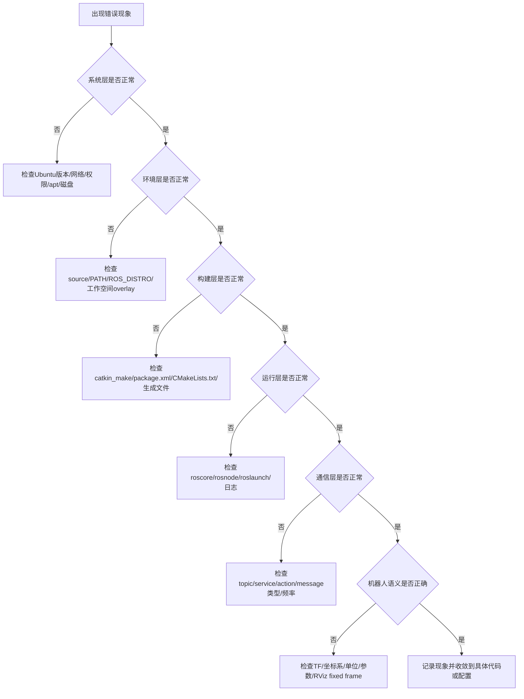

这条顺序背后的逻辑很简单：底层状态错误会伪装成上层错误。例如没有 source 工作空间时，`rosrun` 找不到节点；CMake 没有生成 service 头文件时，C++ 会报 include 错误；TF 缺少 `odom -> base_link` 时，RViz 里模型可能“消失”。如果不先分层，就会把所有问题都误判成“ROS 不稳定”。

## 从错误现象到第一条命令

| 现象 | 不要先做什么 | 第一条检查命令 | 下一步判断 |
|---|---|---|---|
| `roscore: command not found` | 不要直接重装 ROS | `which roscore`; `echo $ROS_DISTRO` | 若 source 后可用，问题在 shell 环境；若 `/opt/ros/noetic` 不存在，才考虑安装问题 |
| `Unable to communicate with master` | 不要修改代码 | `echo $ROS_MASTER_URI`; 查看 `roscore` 终端 | 单机保持默认 `http://localhost:11311`，多机再检查 IP/主机名 |
| `rosrun` 找不到包 | 不要把文件随便复制到别处 | `rospack find 包名` | 找不到则检查包是否在 `src/`、是否编译、是否 source `devel/setup.bash` |
| Python 节点无法执行 | 不要改 CMake | `ls -l scripts/节点.py`; `head -1 scripts/节点.py` | 检查执行权限、shebang、换行格式和包内路径 |
| C++ 节点没有生成 | 不要只看源码文件 | `grep add_executable CMakeLists.txt` | 检查是否写了构建规则和链接规则 |
| service 找不到 | 不要只看 `.srv` 文件 | `rosservice list`; `rossrv show 包/服务类型` | 区分“服务类型已生成”和“服务端节点已注册” |
| topic 存在但无数据 | 不要只看 `rostopic list` | `rostopic info 话题名`; `rostopic hz 话题名` | `list` 只说明名字存在，`info/hz/echo` 才能说明是否有发布者和数据流 |
| RViz 不显示模型 | 不要直接改 URDF 所有内容 | 检查 RViz `Fixed Frame`; `rosrun tf view_frames` | 先确认 fixed frame 是否存在，再查 TF 树和 robot_state_publisher |
| Gazebo 很慢或卡住 | 不要马上判定 ROS 安装失败 | `top`; `glxinfo -B` 或虚拟机图形设置 | 区分系统性能问题、图形加速问题和 ROS 节点错误 |
| rosbag 回放没效果 | 不要只看 bag 文件大小 | `rosbag info 文件.bag`; `rostopic list` | 确认 bag 中是否包含目标 topic，回放时订阅者是否已启动 |

## 每章学习时的固定闭环

每章都应按下面顺序完成：

1. 先读“本章解决什么问题”，明确本章不是在背命令，而是在补哪一种系统能力。
2. 读概念表时，把每个概念对应到一个观察命令。例如 topic 对应 `rostopic info`，TF 对应 `view_frames`。
3. 完成最小实验，不要跳过“正确现象”。如果正确现象说不清，就说明实验只是跑起来，还没有被理解。
4. 故意做一个小错误并修复。例如不 source 工作空间、写错 topic 名、关闭 roscore，再观察报错。
5. 完成本章自测。先独立作答，再看参考答案。参考答案不是背诵材料，而是检查你的解释是否覆盖原因、命令和现象。
6. 保存一份证据。可以是截图、命令输出、系统图、bag 信息或 README 片段。

## 参考资料的使用方式

| 资料 | 适合学什么 | 使用边界 |
|---|---|---|
| [ROS Wiki / ROS Wiki 镜像](https://mirror.umd.edu/roswiki/ROS%282f%29Tutorials.html) | 命令语义、官方教程、包概念 | Wiki 页面可能较旧，要结合 Noetic 和 Ubuntu 20.04 边界判断 |
| [ROS Index / docs.ros.org](https://docs.ros.org/en/noetic/) | 包信息、API、版本和依赖 | 适合核对包是否存在、文档版本是否对应 Noetic |
| [`ros_tutorials`](https://github.com/ros/ros_tutorials) | turtlesim、rospy/roscpp 教程源码 | 源码是事实依据之一，但教材要重新解释教学意图 |
| [`A Gentle Introduction to ROS`](https://jokane.net/agitr/) | 新手节奏、概念解释、常见误解 | 书中部分版本背景较旧，命令要按 Noetic 核对 |
| [TurtleBot3 e-Manual](https://emanual.robotis.com/docs/en/platform/turtlebot3/simulation/) | 移动机器人系统组织、仿真/RViz/Gazebo 对照 | 当前页面大量内容偏向 ROS2，ROS1 Noetic 命令必须按对应分支和包核对 |
| [鱼香 ROS](https://fishros.org.cn/) / [fishros/install](https://github.com/fishros/install) | 国内网络、rosdep、换源、一键安装经验 | 作为安装辅助和排障参考，不替代官方安装原理 |
| [Autolabor ROS 文档](https://autolaborcenter.github.io/pm1-docs-sphinx/user-guide/using-ros/doc.html) | 中文 ROS 实战节奏、移动机器人应用脉络 | 适合作为中文讲解补充，核心事实仍回到官方和上游仓库 |

## 教师或自学者最终验收清单

完成全书后，应能在不查完整教程的情况下完成下列任务：

- 新开一个终端，判断当前 ROS 环境是否正确。
- 启动 `roscore`，解释 `/rosout` 为什么会出现。
- 运行 turtlesim，用命令说明控制小乌龟的 topic 名、消息类型和发布频率。
- 创建 catkin 工作空间和功能包，解释每个目录由谁创建、能不能删除、是否应提交。
- 写一个 Python 发布者和订阅者，并用 `rostopic echo/hz/info` 验证。
- 写一个 C++ 发布者和订阅者，并解释为什么 C++ 需要 CMake 构建规则。
- 写一个 service，并区分 `.srv` 文件、生成的类型、server 注册和 client 调用。
- 用 launch 一次启动多个节点，给出参数和 remap 示例。
- 录制并回放 rosbag，说明 bag 里包含哪些 topic。
- 画出一个简单 TF 树，并解释 `map`、`odom`、`base_link` 的语义差异。
- 写一个最小 URDF，在 RViz 中显示 RobotModel。
- 启动一个移动机器人仿真，观察速度命令、里程计、激光雷达和 TF。
- 为综合项目写 README，说明启动方式、节点图、topic 表、参数表和排障方法。

如果这些任务能独立完成，才说明读者从“会复制命令”进入了“能解释并维护 ROS1 小系统”的阶段。

---

# 第 1 章 Ubuntu 与 Linux 入门

## 本章解决什么问题

学习 ROS1 的第一个门槛通常不是机器人算法，而是 Linux 环境。很多初学者第一次遇到 ROS 错误时，真正的问题并不在 ROS：可能是当前目录错了、没有权限、软件源不可用、包名写错、环境变量没有生效，或者新打开的终端没有重新加载配置。

本章先建立 Ubuntu 与命令行的基本心智模型。你不需要在这一章成为 Linux 专家，但必须能回答三个问题：我现在在哪个目录？这个命令会改动什么？如果命令失败，我先检查哪里？后面安装 ROS、创建 catkin 工作空间、运行节点、排查 `rosrun` 找不到包，都会依赖这些基础。

本书主线使用 **Ubuntu 20.04 Focal Fossa + ROS1 Noetic**。这是 ROS Noetic 的官方目标平台之一；REP-3 明确列出 Noetic 面向 Ubuntu Focal Fossa 20.04，并说明 Noetic 的目标语言环境包括 C++14 与 Python 3.8。不要把本章理解为“Linux 通用入门大全”，它服务于后续 ROS1 学习。

## 学完以后你应该能做到

- 解释 Linux、Ubuntu、发行版、桌面环境之间的关系。
- 区分原生 Ubuntu、虚拟机、WSL2、Docker 在学习 ROS 时的作用。
- 使用终端完成目录切换、文件创建、文件查看、软件安装和命令定位。
- 理解 `sudo`、普通用户、系统目录、用户目录之间的权限差异。
- 理解 `apt update` 与 `apt install` 的区别。
- 理解环境变量、`PATH`、`~/.bashrc` 和 `source` 的基本作用。
- 遇到命令失败时，能用最少的检查命令定位第一层原因。

## 1.1 Ubuntu、Linux 和 ROS 的关系

### Linux 是内核，不等于 Ubuntu

Linux 严格来说是操作系统内核。内核负责管理硬件、进程、内存、文件系统、网络等底层资源。普通用户平时接触到的“Linux 系统”，通常是一个完整发行版：内核 + 系统工具 + 包管理器 + 桌面环境 + 默认软件。

Ubuntu 是一个 Linux 发行版。你可以把 Ubuntu 理解为“把 Linux 内核和大量软件按某种规则打包、测试、发布出来的一整套系统”。ROS Noetic 的官方二进制安装路径主要围绕 Ubuntu 20.04 展开，所以本书先使用 Ubuntu，而不是任意 Linux 发行版。

### ROS 运行在 Ubuntu 之上

ROS 不是替代 Ubuntu 的操作系统。ROS 的节点、话题、服务、参数、launch、bag 等工具都运行在 Linux 进程、文件系统、网络和包管理机制之上。也就是说：

- Ubuntu 提供系统环境。
- Bash 提供命令行交互。
- APT 提供系统软件安装能力。
- ROS 在这些基础上提供机器人软件通信、构建、运行和调试工具。

后面你会执行很多类似下面的命令：

```bash
source /opt/ros/noetic/setup.bash
mkdir -p ~/catkin_ws/src
cd ~/catkin_ws
catkin_make
roscore
rosrun turtlesim turtlesim_node
```

如果你不知道 `source`、`~`、`cd`、当前目录、工作空间这些概念，那么 ROS 命令会变成不可解释的咒语。本章要避免这种情况。

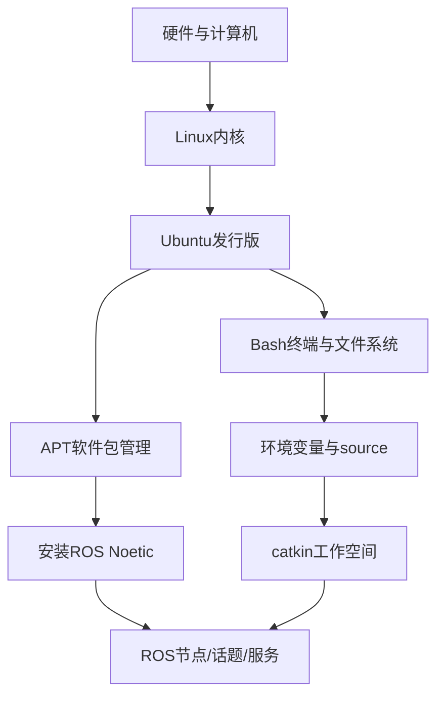

这张图是本书上册的基础依赖关系：Ubuntu 不是 ROS 的附属品，而是 ROS 运行、安装、构建和排障的底座。

## 1.2 学习 ROS 时的几种 Ubuntu 环境

本书后续安装章节会详细比较安装方法。这里先建立直觉。

| 环境 | 它是什么 | 适合谁 | 主要优点 | 主要限制 |
|---|---|---|---|---|
| 原生 Ubuntu 20.04 | 直接把 Ubuntu 安装在电脑硬盘上 | 实验室机器、双系统用户 | 性能好，硬件访问直接 | 安装系统有风险，误操作影响真实机器 |
| Ubuntu 20.04 虚拟机 | 在 Windows/macOS/Linux 里运行一个完整 Ubuntu | 零基础学生 | 可快照恢复，失败成本低 | 图形和仿真性能可能较弱 |
| WSL2 Ubuntu | Windows 上的 Linux 子系统 | Windows 学生前期学习 | 启动快，命令行方便 | GUI、USB、Gazebo、网络行为需要额外注意 |
| Docker ROS 镜像 | 容器化运行 ROS 环境 | 课堂批量复现、助教兜底 | 环境一致，容易清理 | GUI、数据持久化、硬件映射需要额外配置 |

本书主线建议：**第一次学习优先使用 Ubuntu 20.04 虚拟机或原生 Ubuntu 20.04**。WSL2 和 Docker 都值得学，但它们引入了额外抽象。对完全零基础学生，先在一个完整 Ubuntu 系统里理解目录、权限、APT 和终端更稳。

注意：不要把“能打开一个 Linux 终端”等同于“所有 ROS 实验都能稳定运行”。例如 WSL2 官方支持 Linux GUI 应用，但 Gazebo 这类图形和仿真负载仍可能受到显卡、显示服务和设备映射影响。

## 1.3 终端、Shell 和命令行

### 终端是什么

终端是你和 shell 交互的窗口。Ubuntu 官方命令行入门文档把“command line”解释为在终端中输入命令的一行；shell 则负责解释这些命令。你输入命令后，命令可能输出很多文字，也可能什么都不输出就返回提示符。没有输出不一定代表失败，很多命令成功时本来就很安静。

### Shell 是什么

Shell 是命令解释器。本书默认使用 Bash。Bash 会读取你输入的命令，展开变量，寻找可执行程序，然后启动进程。

查看当前 shell：

```bash
echo $SHELL
```

常见输出：

```text
/bin/bash
```

如果你使用 Zsh、Fish 或其他 shell，很多命令仍然相似，但 `~/.bashrc`、变量写法、自动补全和 source 行为可能不同。本书默认不处理这些差异。

### 命令大小写敏感

Linux 命令和文件名通常区分大小写。`pwd` 和 `PWD` 不是一回事，`README.md` 和 `readme.md` 也不是一回事。复制命令时要特别注意大小写、空格和英文标点。

## 1.4 目录：你现在在哪里

终端始终有一个“当前工作目录”。大多数相对路径操作都以这个目录为起点。Ubuntu 官方命令行教程也强调，`pwd` 的作用就是打印当前工作目录；在不确定当前位置时先执行 `pwd` 是安全习惯。

### 常用目录

| 路径 | 含义 | ROS 学习中的意义 |
|---|---|---|
| `/` | 根目录，整个文件系统起点 | 不要随意修改 |
| `/home/用户名` | 当前用户主目录 | 个人工作空间通常放这里 |
| `~` | 当前用户主目录的简写 | `~/catkin_ws` 很常见 |
| `/opt/ros/noetic` | ROS Noetic 默认安装位置 | 后续 source ROS 环境 |
| `/etc` | 系统配置目录 | 软件源、网络、服务配置常见位置 |
| `/usr/bin` | 系统命令常见位置 | `which` 常会指向这里 |
| `/tmp` | 临时目录 | 重启或清理后可能消失 |

### 观察当前目录

```bash
pwd
```

如果你刚打开终端，通常会看到：

```text
/home/你的用户名
```

### 切换目录

```bash
cd ~
pwd

cd /
pwd

cd -
pwd
```

解释：

- `cd ~`：进入当前用户主目录。
- `cd /`：进入根目录。
- `cd -`：回到上一次所在目录。

### 查看目录内容

```bash
ls
ls -l
ls -la
```

解释：

- `ls`：列出当前目录可见文件。
- `ls -l`：显示权限、所有者、大小、时间等详细信息。
- `ls -la`：连隐藏文件也显示出来。Linux 下以 `.` 开头的文件或目录默认隐藏，例如 `.bashrc`。

ROS 学习中经常要检查隐藏文件，因为环境配置通常写入 `~/.bashrc`。

## 1.5 文件和目录操作

### 创建实验目录

本章所有实验都放在用户主目录下，避免误改系统目录。

```bash
mkdir -p ~/ros_textbook_lab/ch01
cd ~/ros_textbook_lab/ch01
pwd
```

解释：

- `mkdir` 创建目录。
- `-p` 表示父目录不存在时一起创建；如果目录已存在，不报错。
- `~/ros_textbook_lab/ch01` 是本章实验目录。

正确现象：

```text
/home/你的用户名/ros_textbook_lab/ch01
```

### 创建和查看文件

```bash
echo "hello ubuntu" > note.txt
cat note.txt
```

解释：

- `echo` 输出一段文本。
- `>` 把输出重定向到文件。如果文件已存在，会覆盖原内容。
- `cat` 把文件内容打印到终端。

正确现象：

```text
hello ubuntu
```

追加内容：

```bash
echo "this is chapter 1" >> note.txt
cat note.txt
```

区别：

- `>` 覆盖文件。
- `>>` 追加到文件末尾。

这在 ROS 学习中很重要。写 `~/.bashrc` 时，如果你误用 `>`，可能把原来的配置全部覆盖；正确做法通常是用文本编辑器打开，或谨慎使用 `>>` 追加一行。

### 复制、移动和删除

```bash
cp note.txt note_backup.txt
mv note_backup.txt note_copy.txt
ls -l
rm note_copy.txt
ls -l
```

解释：

- `cp` 复制。
- `mv` 移动或重命名。
- `rm` 删除文件。

谨慎点：`rm` 删除后通常不会进入回收站。不要在不理解路径时执行 `rm -rf`。本书不会要求你用破坏性命令清理系统。

## 1.6 权限和 sudo

### 普通用户和超级用户

Ubuntu 默认不让普通用户随意修改系统目录。这样做是为了保护系统。比如 `/etc`、`/usr`、`/opt` 下的很多文件需要管理员权限才能修改。

查看当前用户名：

```bash
whoami
```

查看一个文件的权限：

```bash
ls -l note.txt
```

典型输出类似：

```text
-rw-rw-r-- 1 user user 31 May 19 10:00 note.txt
```

粗略理解：

- 第一个字符表示类型：`-` 是普通文件，`d` 是目录。
- 后面九个字符分三组：文件所有者、同组用户、其他用户的读写执行权限。
- `r` 是读，`w` 是写，`x` 是执行。

### sudo 的含义

`sudo` 表示以管理员权限运行后面的一个命令。Ubuntu 官方命令行教程提醒：使用 `sudo` 前要理解命令在做什么，因为它让该命令拥有超级用户级别的能力。

例子：

```bash
sudo apt update
```

这不是“让命令更强”的魔法，而是因为更新系统软件包索引需要访问系统级包管理数据库。

错误用法：

```bash
sudo cd /opt
```

这通常没有意义。`cd` 是 shell 内建命令，不是独立程序；即使某些 shell 接受这种写法，它也不会按你想象的方式改变当前终端目录。

ROS 学习中的原则：

- 安装系统包时通常需要 `sudo apt install ...`。
- 在自己的工作空间 `~/catkin_ws` 下写代码、编译，不应该依赖 `sudo`。
- 如果你在 `~/catkin_ws` 中必须用 `sudo` 才能修改文件，通常说明权限已经被你之前的错误命令污染。

检查文件所有者：

```bash
ls -l ~/catkin_ws 2>/dev/null
```

如果看到大量文件所有者是 `root root`，后续 catkin 编译可能出现权限问题。

## 1.7 APT：Ubuntu 的软件包管理

### apt 解决什么问题

APT 是 Ubuntu/Debian 系统常用的软件包管理工具。Ubuntu 官方文档说明，`apt` 可以安装新软件包、升级已有软件包、更新本地软件包索引。你可以把 APT 理解为系统级软件安装和依赖管理工具。

在 ROS 学习中，APT 很关键，因为官方二进制安装通常长这样：

```bash
sudo apt install ros-noetic-desktop-full
```

这行命令背后做了几件事：

- 从配置好的软件源中查找 `ros-noetic-desktop-full`。
- 计算它依赖哪些包。
- 下载包文件。
- 安装到系统目录。
- 更新系统包数据库。

### update 和 install 的区别

```bash
sudo apt update
sudo apt install tree
```

解释：

- `sudo apt update`：更新本机“软件包索引”。它不等于升级所有软件，也不等于安装新软件。
- `sudo apt install tree`：根据已有索引安装名为 `tree` 的软件包。

如果你刚添加了 ROS 软件源，却没有执行 `sudo apt update`，系统可能还不知道新源里有哪些包，于是报：

```text
Unable to locate package ros-noetic-...
```

这类错误不一定说明包不存在，第一步应检查软件源和索引。

### 安装 tree 和 git

```bash
sudo apt update
sudo apt install -y tree git
```

解释：

- `tree` 用树状结构显示目录，非常适合观察工作空间。
- `git` 用于下载和管理代码仓库，后续会用到。
- `-y` 自动回答 yes。课堂演示可以用，自己操作时建议先不加，观察 apt 准备安装哪些包。

验证：

```bash
which tree
which git
tree ~/ros_textbook_lab
git --version
```

正确现象：

- `which tree` 输出类似 `/usr/bin/tree`。
- `git --version` 输出 Git 版本。
- `tree` 显示本章实验目录结构。

## 1.8 命令从哪里来：PATH 和 which

当你输入：

```bash
tree
```

shell 需要知道去哪找 `tree` 这个程序。它会按环境变量 `PATH` 中列出的目录逐个查找。

查看 `PATH`：

```bash
echo $PATH
```

典型输出：

```text
/usr/local/sbin:/usr/local/bin:/usr/sbin:/usr/bin:/sbin:/bin
```

冒号 `:` 分隔多个目录。

查看命令位置：

```bash
which ls
which tree
which git
```

如果命令找不到：

```bash
which roscore
```

在未安装 ROS 或未 source ROS 环境时，可能没有输出。这不一定是“系统坏了”，只是 shell 当前找不到这个命令。

后面安装 ROS 后，`source /opt/ros/noetic/setup.bash` 会修改当前 shell 的环境，让 ROS 命令和包路径可见。

## 1.9 环境变量和 `.bashrc`

### 环境变量是什么

环境变量是进程启动时携带的一组键值对。程序可以通过环境变量判断当前系统配置。例如：

```bash
echo $HOME
echo $USER
echo $SHELL
echo $PATH
```

常见含义：

| 变量 | 含义 |
|---|---|
| `HOME` | 当前用户主目录 |
| `USER` | 当前用户名 |
| `SHELL` | 当前默认 shell |
| `PATH` | 命令搜索路径 |
| `ROS_DISTRO` | 当前 ROS 发行版，安装并 source ROS 后常见 |
| `ROS_MASTER_URI` | ROS1 Master 地址，后续会学 |

### 临时变量

```bash
export MY_ROS_NOTE="chapter1"
echo $MY_ROS_NOTE
```

这个变量只在当前 shell 及它启动的子进程中有效。关掉终端后，它就消失。

### `.bashrc` 是什么

`~/.bashrc` 是 Bash 在启动交互式 shell 时读取的配置文件。很多 ROS 安装教程会建议追加：

```bash
echo "source /opt/ros/noetic/setup.bash" >> ~/.bashrc
```

这表示：以后每次打开新的 Bash 终端，都自动加载 ROS Noetic 环境。

但要注意两点：

1. `source /opt/ros/noetic/setup.bash` 只影响当前 shell。
2. 写入 `~/.bashrc` 后，新终端才会自动生效；当前终端需要手动 `source ~/.bashrc` 或直接 source 对应文件。

查看 `.bashrc` 末尾：

```bash
tail ~/.bashrc
```

不要随便覆盖 `.bashrc`。如果要编辑，建议先备份：

```bash
cp ~/.bashrc ~/.bashrc.backup
```

## 1.10 文本编辑器：先会一种就够

ROS 学习会频繁编辑文件：`package.xml`、`CMakeLists.txt`、`.launch`、`.yaml`、Python 脚本、URDF。你至少需要熟练一种文本编辑器。

零基础建议：

- 图形界面：VS Code、gedit。
- 终端界面：nano。

用 nano 编辑文件：

```bash
nano note.txt
```

常用操作：

- 保存：`Ctrl + O`，回车确认。
- 退出：`Ctrl + X`。
- 取消：根据底部提示操作。

用 VS Code 打开当前目录：

```bash
code .
```

如果提示 `code: command not found`，说明 VS Code 命令行入口未安装或未配置。不要在这一章纠结，先用 `nano` 或 `gedit` 完成学习。

## 1.11 Git：为什么 ROS 学习需要它

Git 是版本控制工具。ROS 生态大量代码以 Git 仓库形式发布，例如 `ros_tutorials`、TurtleBot3、很多机器人驱动包。你不需要一开始掌握复杂分支模型，但要会克隆仓库和查看状态。

配置用户名和邮箱：

```bash
git config --global user.name "Your Name"
git config --global user.email "your_email@example.com"
```

查看配置：

```bash
git config --global --list
```

克隆一个小仓库的基本形式：

```bash
git clone https://github.com/ros/ros_tutorials.git
```

本章不要求你真的克隆 ROS 仓库；这只是说明后续会看到的命令结构。

## 1.12 本章最小可运行实验

### 实验目标

完成一个从目录创建、文件操作、软件安装、命令定位、环境变量观察到清理的闭环。这个实验不是为了“炫技”，而是让你获得后续 ROS 学习的最低操作能力。

### 前置条件

- 已进入 Ubuntu 20.04。
- 使用 Bash。
- 网络可访问 Ubuntu 软件源。
- 当前用户有 sudo 权限。

### 操作步骤

先确认系统和 shell：

```bash
lsb_release -a
echo $SHELL
whoami
pwd
```

创建实验目录：

```bash
mkdir -p ~/ros_textbook_lab/ch01
cd ~/ros_textbook_lab/ch01
pwd
```

创建并查看文件：

```bash
echo "hello ubuntu" > note.txt
echo "this directory is for ROS textbook chapter 1" >> note.txt
cat note.txt
ls -la
```

安装并使用工具：

```bash
sudo apt update
sudo apt install -y tree git
which tree
which git
tree ~/ros_textbook_lab
git --version
```

观察环境变量：

```bash
echo $HOME
echo $USER
echo $SHELL
echo $PATH
```

备份 `.bashrc`：

```bash
cp ~/.bashrc ~/.bashrc.backup
ls -l ~/.bashrc ~/.bashrc.backup
```

清理本章临时文件时，只删除本章实验目录：

```bash
rm -r ~/ros_textbook_lab/ch01
ls ~/ros_textbook_lab
```

如果你还想保留实验结果，可以不执行清理命令。

### 正确现象

- `lsb_release -a` 显示 Ubuntu 系统信息。若是本书主线环境，应能看到 Ubuntu 20.04 或 Focal。
- `pwd` 在创建目录后显示 `/home/用户名/ros_textbook_lab/ch01`。
- `cat note.txt` 能看到两行文本。
- `which tree` 和 `which git` 能显示可执行程序路径。
- `tree ~/ros_textbook_lab` 能以树状结构显示目录。
- `echo $PATH` 输出多个用冒号分隔的目录。
- `.bashrc.backup` 被成功创建。

### 如果失败，先检查什么

| 失败点 | 第一检查命令 | 判断 |
|---|---|---|
| `sudo apt update` 失败 | `ping -c 3 archive.ubuntu.com` | 判断是否网络或源问题 |
| `apt install tree` 找不到包 | `sudo apt update` | 先更新包索引 |
| `tree` 仍找不到 | `which tree` | 判断是否安装成功 |
| 写文件失败 | `pwd`; `ls -ld .` | 判断当前目录和权限 |
| 删除时报错 | `pwd`; `ls ~/ros_textbook_lab` | 确认只删除实验目录 |

## 1.13 命令与代码解释

### `pwd`

打印当前工作目录。后续 ROS 编译时，如果你不确定是否在 `~/catkin_ws`，先执行 `pwd`。

### `mkdir -p`

创建目录。`-p` 让命令在父目录不存在时自动创建父目录。创建 ROS 工作空间时会用：

```bash
mkdir -p ~/catkin_ws/src
```

### `cd`

切换目录。`cd ~/catkin_ws` 表示进入主目录下的 `catkin_ws`。如果目录不存在，会报错。

### `ls -la`

查看目录内容，包括隐藏文件。检查 `.bashrc`、`.git`、隐藏配置时常用。

### `echo`、`>`、`>>`

输出文本并可重定向到文件。`>` 覆盖，`>>` 追加。修改环境配置时要非常谨慎。

### `sudo apt update`

更新本地软件包索引。它不安装新软件，只让本机知道软件源中当前有哪些包和版本。

### `sudo apt install`

安装软件包。安装 ROS、Git、构建工具、驱动依赖时都会用。

### `which`

查看命令对应的可执行文件路径。遇到 `command not found` 或怀疑环境没有生效时，先用 `which`。

### `source`

在当前 shell 中执行一个脚本，并让脚本对当前环境的修改立即生效。后续 ROS 最常见命令之一是：

```bash
source /opt/ros/noetic/setup.bash
```

注意：`source` 当前终端生效，不自动影响已经打开的其他终端。

## 1.14 高频错误与排查

| 现象 | 高概率原因 | 第一检查命令 | 修复思路 |
|---|---|---|---|
| `Permission denied` | 当前用户没有写入目标目录的权限 | `pwd`; `ls -ld .` | 回到 `~` 下操作；不要在系统目录里建学习文件 |
| `Unable to locate package tree` | 包索引未更新或软件源不可用 | `sudo apt update` | 先更新索引；若仍失败，检查网络和软件源 |
| `command not found` | 软件未安装或不在 `PATH` 中 | `which 命令名`; `echo $PATH` | 安装软件，或检查环境变量 |
| `cd: no such file or directory` | 目录不存在或路径写错 | `ls`; `pwd` | 先确认父目录存在，注意大小写 |
| `.bashrc` 修改后没效果 | 当前终端未重新加载 | `tail ~/.bashrc` | 执行 `source ~/.bashrc` 或重开终端 |
| 后续在工作空间编译时权限异常 | 曾用 `sudo` 创建或编译用户文件 | `ls -l ~/catkin_ws` | 修复所有者；以后不要在用户工作空间滥用 `sudo` |
| 复制命令失败 | 中文标点、换行、大小写错误 | 逐字符检查命令 | 使用英文半角符号，先复制一行短命令测试 |

这张表不要当成孤立的“错误答案表”。真正排障时，应先判断错误属于哪一层：路径、权限、软件包、命令搜索路径，还是 shell 环境。比如 `command not found` 和 `Permission denied` 都表现为“命令不能正常运行”，但前者通常是系统找不到可执行文件，后者通常是文件存在却没有执行权限或当前用户没有访问权限。两类错误的第一检查命令完全不同。

可以把本章的排障顺序压缩成下面四步：

```text
pwd / ls      -> 先确认我在哪里、文件是否存在
ls -l         -> 再确认谁拥有它、我能不能读写执行
which / PATH  -> 再确认命令能不能被 shell 找到
source / env  -> 最后确认环境变量是否在当前终端生效
```

举例：以后如果你运行 `rosrun beginner_tutorials talker.py` 失败，不要第一反应去重装 ROS。先用 `rospack find beginner_tutorials` 看包是否被当前环境找到，再用 `ls -l scripts/talker.py` 看脚本是否有执行权限，再用 `head -1 scripts/talker.py` 看 shebang 是否正确。这样排查能把问题从“ROS 很玄学”变成几个可验证的系统状态。

## 1.15 本章自测

1. Linux 和 Ubuntu 是什么关系？为什么本书不直接说“安装 Linux”？
2. ROS Noetic 为什么要以 Ubuntu 20.04 作为主线学习环境？
3. `pwd` 的输出为什么会影响后续命令的意义？
4. `>` 和 `>>` 有什么区别？为什么修改 `.bashrc` 时要谨慎？
5. `sudo apt update` 和 `sudo apt install tree` 分别做了什么？
6. 如果 `roscore` 将来提示 `command not found`，你会先检查哪三个东西？
7. 为什么不建议在 `~/catkin_ws` 中随便使用 `sudo`？
8. `.bashrc` 修改后，为什么已经打开的终端可能还没有新配置？
9. 原生 Ubuntu、虚拟机、WSL2、Docker 的根本区别是什么？
10. 如果一个教程要求你执行 `curl ... | sudo bash`，你应该先问自己哪些问题？

### 参考答案

1. Linux 严格来说是内核，Ubuntu 是基于 Linux 内核并集成系统工具、包管理器、桌面环境和软件仓库的完整发行版。本书说“安装 Ubuntu 20.04”，是因为 ROS Noetic 的官方二进制安装、包名、系统依赖和教程都围绕这个发行版版本展开；只说“安装 Linux”会过于模糊，学生可能装到不匹配的发行版或版本。

2. ROS Noetic 的官方目标平台包含 Ubuntu 20.04 Focal，本书选择它可以让 apt 包、Python 3、C++14、ROS Wiki 教程和社区排障经验保持一致。Ubuntu 22.04/24.04 不是 Noetic 的新手主线目标，强行安装会引入源码构建、依赖版本和兼容性问题，不适合零基础阶段。

3. `pwd` 显示当前工作目录，而很多命令的意义都依赖当前位置。例如在 `~/catkin_ws` 执行 `catkin_make` 和在 `~/catkin_ws/src/beginner_tutorials` 执行 `catkin_make`，结果完全不同；复制、删除、创建文件也都受当前目录影响。排障时先看 `pwd`，可以避免把文件建到错误位置。

4. `>` 会覆盖目标文件，`>>` 会追加到目标文件末尾。修改 `.bashrc` 时要谨慎，是因为它会影响以后每次打开终端的初始化环境；如果用 `>` 误覆盖 `.bashrc`，可能丢失原有配置。如果要追加 ROS 环境，通常使用 `echo "source /opt/ros/noetic/setup.bash" >> ~/.bashrc`，并在追加后用 `tail ~/.bashrc` 检查。

5. `sudo apt update` 更新本机的软件包索引，让 apt 知道软件源里有哪些包和版本；它本身通常不安装软件。`sudo apt install tree` 根据当前索引下载并安装 `tree` 包及其依赖。安装 ROS 前必须先确保软件源和索引正确，否则会出现找不到包或安装旧信息的问题。

6. 先查三层：第一，`echo $ROS_DISTRO` 或 `ls /opt/ros/noetic` 判断 ROS 是否安装；第二，`echo $PATH` 和 `which roscore` 判断命令是否在当前 shell 可搜索路径中；第三，`source /opt/ros/noetic/setup.bash` 判断是否只是环境没有加载。如果 source 后可用，说明安装可能正常，问题在当前终端环境。

7. 不建议在 `~/catkin_ws` 随便用 `sudo`，因为可能把工作空间中的文件所有者变成 root，导致普通用户后续无法编辑、编译或删除生成文件。catkin 工作空间通常应由普通用户创建和编译；只有安装系统软件包、改系统目录时才需要 `sudo`。如果权限混乱，应先用 `ls -l ~/catkin_ws` 查所有者。

8. `.bashrc` 是新 Bash 交互 shell 启动时读取的配置文件，已经打开的终端不会自动重新执行它。修改后要么新开终端，要么在当前终端执行 `source ~/.bashrc`。因此“我已经写进 `.bashrc`，为什么当前终端还不生效”通常不是配置没写入，而是当前 shell 没重新加载。

9. 原生 Ubuntu 是直接安装在硬盘上的完整系统，性能和硬件访问最好；虚拟机是在现有系统里运行一个完整 Ubuntu，便于快照恢复但图形性能较弱；WSL2 是 Windows 上的 Linux 子系统，适合命令行和轻量实验但 GUI、USB、仿真有额外限制；Docker 是容器化环境，适合复现和隔离，但默认不持久保存工作空间，GUI 和硬件访问需要额外映射。

10. 先问：脚本来自哪里，是否官方或可信？脚本会改哪些文件、安装哪些软件、是否需要 root 权限？是否能先打开脚本内容阅读？失败后如何恢复？有没有更透明的手动安装步骤？`curl ... | sudo bash` 把网络下载内容直接交给 root 执行，风险比普通命令高，不能因为教程里有就盲目复制。

## 1.16 本章小结

本章没有正式进入 ROS，但已经建立了后续学习的底层操作能力。你应该记住：终端不是神秘工具，而是一个可观察、可推理的系统接口。当前目录决定相对路径，权限决定能否修改文件，APT 决定系统软件安装，环境变量决定命令和程序如何找到依赖。

后续学习 ROS 时，很多错误都可以回到本章方法排查：

- 找不到命令：查 `which` 和 `PATH`。
- 找不到包：查当前目录、工作空间、source。
- 安装失败：查 Ubuntu 版本、软件源、`apt update`。
- 权限失败：查 `pwd`、`ls -l`、是否误用 `sudo`。

掌握这些基础，下一章再看 ROS 的节点、话题、服务和参数时，命令就不再是孤立片段，而是可以解释的系统操作。

## 延伸阅读

- Ubuntu 官方命令行入门：https://documentation.ubuntu.com/desktop/en/latest/tutorial/the-linux-command-line-for-beginners/
- Ubuntu APT 包管理文档：https://ubuntu.com/server/docs/how-to/software/package-management/
- Ubuntu 环境变量社区文档：https://help.ubuntu.com/community/EnvironmentVariables
- REP-3 Target Platforms：https://www.ros.org/reps/rep-0003.html
- A Gentle Introduction to ROS：https://jokane.net/agitr/

---

# 第 2 章 ROS1 基本概念

## 本章解决什么问题

本章回答 ROS 入门时最关键的问题：ROS 到底是什么，以及一个 ROS1 系统为什么能由很多独立程序协同工作。很多初学者看到 “Robot Operating System” 这个名字，会以为 ROS 像 Ubuntu、Windows 一样是传统操作系统。这个理解不准确。ROS 不接管硬件，不调度 CPU，也不替代 Linux；它运行在 Ubuntu 之上，提供机器人软件开发中反复出现的通信、组织、构建、运行、调试和复用能力。

成熟 ROS 教程通常不会一上来讲复杂机器人算法，而是先让学习者理解计算图、节点、话题、服务、参数这些基本结构。原因很简单：如果你不能解释“谁在发布数据、谁在订阅数据、消息类型是什么、Master 做了什么”，后面写 Python/C++ 节点、launch 文件、TF、导航都会变成命令堆砌。

本章先建立 ROS1 的运行时心智模型。你会用最小系统观察 `roscore`、`rosnode`、`rostopic`、`rosservice` 和 `rosparam`，但重点不是记住命令，而是理解命令背后的系统结构。

## 学完以后你应该能做到

- 解释 ROS 为什么不是传统操作系统。
- 画出 ROS Master、Node、Topic、Message、Service、Action、Parameter Server 的关系。
- 区分发布订阅、请求响应、长时间任务三种通信方式。
- 解释为什么 ROS Master 不负责转发所有 topic 数据。
- 根据任务类型判断应使用 topic、service、action 还是 parameter。
- 用 `roscore`、`rosnode`、`rostopic`、`rosservice`、`rosparam` 观察最小 ROS1 系统。
- 遇到“连不上 Master”“topic 没数据”“参数改了没效果”等问题时，能先做第一层诊断。

## 2.1 ROS 在本书中的位置

第 1 章解决的是 Ubuntu 和终端基础。本章开始进入 ROS，但仍然不写代码。这个顺序很重要，因为 ROS 不是孤立存在的：

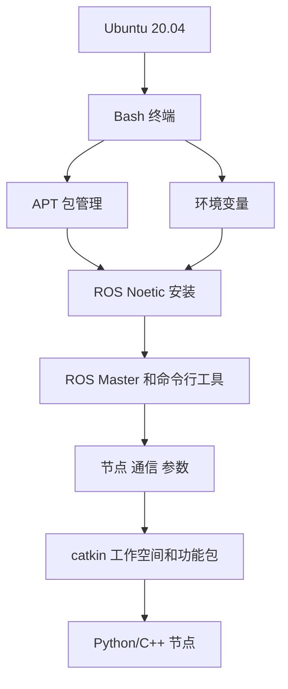

如果第 1 章的 `source`、`PATH`、`apt`、当前目录没有理解，第 2 章的 `roscore`、`rosnode list`、`rostopic echo` 就会变成不可解释的黑箱。反过来，如果本章没有理解 ROS 计算图，第 5、6、7 章的工程和编程也会失去上下文。

## 2.2 ROS 不是传统操作系统

传统操作系统负责管理硬件、内存、进程、文件系统、网络和权限。Ubuntu 就是这样的系统。ROS 不替代 Ubuntu，它只是运行在 Ubuntu 之上的一组机器人软件基础设施。

ROS 提供的是机器人软件开发常见能力：

| 能力 | ROS 中的典型工具或概念 | 解决的问题 |
|---|---|---|
| 进程通信 | topic、service、action | 节点之间如何交换数据 |
| 数据结构 | msg、srv、action 文件 | 数据格式如何约定 |
| 代码组织 | package、workspace | 代码和资源如何复用 |
| 构建 | catkin、CMake | C++、消息、服务如何编译生成 |
| 运行管理 | roslaunch、rosparam | 多节点和参数如何启动 |
| 调试观察 | rosnode、rostopic、rqt_graph、rosbag | 系统运行时如何观察 |
| 机器人生态 | driver、TF、URDF、RViz、Gazebo、导航包 | 常用机器人能力如何复用 |

可以把 ROS 理解为机器人软件的“公共基础设施”。它本身不等于一个完整机器人系统，但提供了搭建机器人系统所需的通信规则、工具和大量可复用模块。

### 反例：把 ROS 当成操作系统会导致什么误解

误解 1：以为 ROS 能直接控制硬件。
事实：ROS 节点通常通过 Linux 驱动、串口、USB、CAN、网络等接口间接访问硬件。硬件能否被系统识别，首先是 Ubuntu/Linux 层的问题。

误解 2：以为 ROS Master 负责一切。
事实：Master 主要负责注册和发现。节点之间的数据传输由节点直接协商连接完成。

误解 3：以为安装 ROS 就等于有了机器人能力。
事实：安装只是得到工具和包。真正的系统还需要节点、参数、模型、传感器数据、控制接口和启动文件。

## 2.3 为什么机器人软件需要 ROS

假设你要做一个移动机器人。即使是最简单的室内移动机器人，也可能包含：

- 激光雷达驱动：读取距离数据。
- 底盘驱动：接收速度命令并控制电机。
- 里程计模块：根据编码器估计机器人位移。
- 建图模块：根据激光和运动估计地图。
- 导航模块：规划路径并输出速度命令。
- 可视化工具：显示地图、机器人、路径和传感器数据。
- 记录工具：把运行数据保存下来，便于复现实验。

如果没有统一通信机制，每个模块都要自己定义网络连接、数据格式、启动顺序、日志输出和调试方式。系统小的时候还能凑合，系统一复杂就会变成大量互相依赖的专用代码。

ROS 的思路是把系统拆开，让每个模块只关心自己的输入输出：

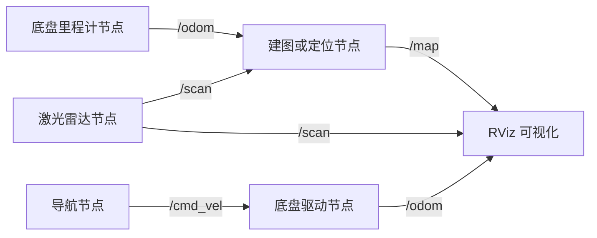

这个图里，RViz 不需要知道激光雷达驱动如何读取串口；导航节点也不需要知道底盘电机如何控制。只要接口一致，模块就能组合。

### 这一点为什么重要

ROS 的学习重点不是“背命令”，而是学会把机器人系统看成接口网络：

- 哪些节点生产数据？
- 哪些节点消费数据？
- 数据类型是什么？
- 运行配置在哪里？
- 出错时先观察哪个接口？

后面所有章节都围绕这个思路展开。

## 2.4 ROS 计算图

ROS1 中运行时的节点和通信关系称为 computation graph，即计算图。它不是神经网络图，也不是文件目录树，而是运行中的进程和通信关系。

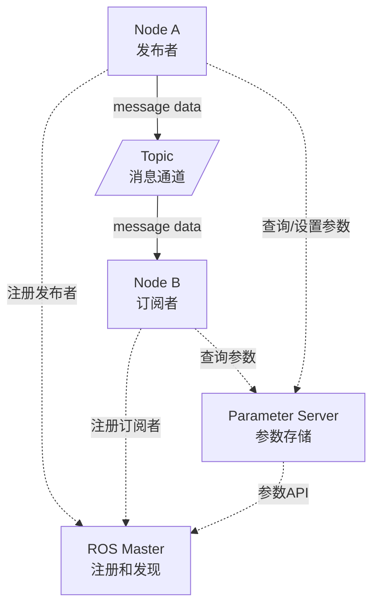

这张图要注意两种线：

- 虚线表示注册、发现、参数访问等控制信息。
- 实线表示 topic 消息数据流。

Master 参与发现，但 topic 数据不通过 Master 转发。ROS Technical Overview 说明，节点会通过 XMLRPC 协商连接，然后使用 TCPROS 等传输机制直接传输序列化消息数据。

## 2.5 必须理解的概念

| 概念 | 简明定义 | 容易误解的点 | 最小观察方法 |
|---|---|---|---|
| ROS Master | ROS1 的名称注册和发现服务 | Master 不是所有 topic 数据的转发中心 | `echo $ROS_MASTER_URI` |
| Node | 一个参与 ROS 通信的进程 | 节点不是 Python/C++ 文件本身，而是运行后的进程 | `rosnode list` |
| Topic | 异步发布订阅通道 | topic 不是变量，也不是文件 | `rostopic list` |
| Message | topic 上传输的数据结构 | 两端消息类型必须一致 | `rostopic type`; `rosmsg show` |
| Service | 同步请求响应接口 | 不适合持续高速数据流 | `rosservice list` |
| Action | 带目标、反馈、结果、取消的长任务接口 | 底层会展开成多个 topic | `rostopic list` |
| Parameter Server | 参数存储服务 | 适合配置，不适合大流量数据 | `rosparam list` |
| Package | ROS 功能包 | 包不是一个节点，包里可以有多个节点 | `rospack find` |
| Workspace | 工作空间 | 工作空间不是包，包通常放在 `src/` 下 | `tree ~/catkin_ws` |

本表先给最小定义。后面每个概念都要结合命令观察，不只停留在名词解释。

## 2.6 ROS Master：注册和发现，不是数据转发

ROS Master 是 ROS1 系统中的名称服务。节点启动后，会向 Master 注册自己发布了哪些 topic、订阅了哪些 topic、提供了哪些 service。其他节点也通过 Master 查找通信对象。

默认情况下，Master 的地址由环境变量 `ROS_MASTER_URI` 指定：

```bash
echo $ROS_MASTER_URI
```

单机默认常见值：

```text
http://localhost:11311
```

其中 `11311` 是 ROS1 Master 默认端口。

### 一个 topic 连接大致怎样建立

可以把连接过程理解成四步：

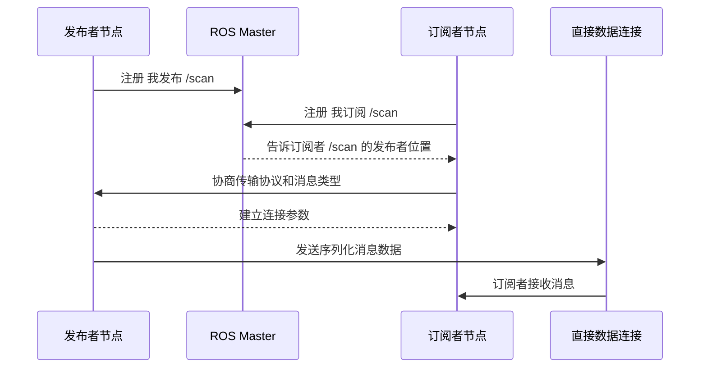

这个图有两个关键结论：

1. Master 参与“谁在哪里”的发现。
2. 数据传输发生在发布者和订阅者之间，不是由 Master 逐条转发。

### 为什么这对排障重要

如果 `rosnode list` 报无法连接 Master，说明注册/发现层就有问题。
如果 `rosnode list` 正常，但 `rostopic echo /scan` 没数据，问题可能在发布者、topic 名、消息类型或数据连接层。
这两类问题不能混为一谈。

## 2.7 Node：节点是运行中的进程

节点是 ROS 系统中的基本计算单元。一个节点通常做一件边界相对清晰的事：

- 摄像头节点：发布图像。
- 激光雷达节点：发布扫描数据。
- 底盘节点：订阅速度命令并发布里程计。
- 控制节点：根据目标输出速度命令。
- 可视化节点：订阅数据并显示。

节点不是源码文件。源码文件只有被执行后，才会产生运行中的节点。

查看当前节点：

```bash
rosnode list
```

查看某个节点信息：

```bash
rosnode info /rosout
```

`rosnode info` 的输出要重点看三块：

| 字段 | 含义 | 排障价值 |
|---|---|---|
| Publications | 该节点发布哪些 topic | 判断它是否真的产生数据 |
| Subscriptions | 该节点订阅哪些 topic | 判断它是否接收了期望输入 |
| Services | 该节点提供哪些 service | 判断能否被请求调用 |

### 节点名和程序名不是一回事

Python 文件可以叫 `talker.py`，运行后的节点名可以叫 `/talker`。C++ 可执行文件可以叫 `cpp_talker`，运行时也可以通过 remap 或 launch 改名。后续写 launch 文件时会经常遇到这一点。

## 2.8 Topic 和 Message：持续流动的数据

Topic 适合持续、异步、可能一对多的数据流。

典型 topic：

| topic | 常见消息类型 | 含义 | 类比 |
|---|---|---|---|
| `/cmd_vel` | `geometry_msgs/Twist` | 速度命令 | 方向盘和油门命令 |
| `/scan` | `sensor_msgs/LaserScan` | 激光雷达扫描 | 机器人周围距离 |
| `/odom` | `nav_msgs/Odometry` | 里程计 | 机器人根据自身估计的位置 |
| `/camera/image_raw` | `sensor_msgs/Image` | 原始图像 | 摄像头画面 |
| `/tf` | `tf2_msgs/TFMessage` | 坐标变换 | 坐标系之间的关系 |

查看 topic 列表：

```bash
rostopic list
```

查看某个 topic 的类型：

```bash
rostopic type /rosout
```

查看消息结构：

```bash
rosmsg show rosgraph_msgs/Log
```

理解 topic 时要抓住三点：

1. Topic 是通道名称。
2. Message 定义每条数据的结构。
3. 发布者和订阅者必须使用同一个消息类型。

### 反例：为什么不能只看 topic 名

假设两个系统里都有 `/state`。一个系统的 `/state` 可能是 `std_msgs/String`，另一个系统可能是自定义状态消息。只看到 topic 名不够，必须检查消息类型。

排障顺序：

```bash
rostopic list
rostopic info /某个话题
rostopic type /某个话题
rosmsg show 消息类型
```

## 2.9 Service：一次请求，一次响应

Service 适合同步请求响应。客户端发出请求，服务端处理后返回响应。

典型场景：

- 请求清空地图。
- 请求保存文件。
- 请求重置仿真。
- 请求查询某个状态。
- 请求切换模式。

查看 service：

```bash
rosservice list
```

查看 service 类型：

```bash
rosservice type /rosout/get_loggers
```

查看 srv 结构：

```bash
rossrv show roscpp/GetLoggers
```

Service 不适合激光雷达、图像、里程计这类连续数据。连续数据应使用 topic。

### Topic 和 Service 的选择

| 问题 | 更适合 topic | 更适合 service |
|---|---|---|
| 数据是否连续产生 | 是 | 否 |
| 是否需要每次明确响应 | 不一定 | 是 |
| 是否适合多个订阅者同时接收 | 是 | 通常不是重点 |
| 典型例子 | 激光、图像、里程计、速度命令 | 保存地图、重置仿真、查询日志 |

## 2.10 Action：可反馈、可取消的长任务

有些任务不是一次请求就能马上完成，例如：

- 让移动机器人导航到目标点。
- 让机械臂移动到某个姿态。
- 执行一个持续数秒甚至数分钟的任务。

如果只用 service，客户端发出请求后只能等待最终结果，中途很难获得进度，也很难取消。Action 解决的是这类问题：它包含目标、反馈、结果和取消机制。

入门阶段先记住：

| 通信方式 | 适合任务 | 例子 |
|---|---|---|
| Topic | 持续数据流 | `/scan`、`/odom`、`/cmd_vel` |
| Service | 短请求响应 | 重置仿真、查询状态 |
| Action | 长任务，有反馈和取消 | 导航到目标点、机械臂执行轨迹 |

后续导航章节再深入 action。现在不要急着写 action 代码，先能判断它解决的问题。

## 2.11 Parameter Server：配置不是数据流

Parameter Server 用来存储运行参数。参数通常是低频配置，例如：

- 机器人名称。
- 控制频率。
- 最大速度。
- 传感器端口。
- 坐标系名称。
- 是否启用某个功能。

查看参数：

```bash
rosparam list
```

设置参数：

```bash
rosparam set /chapter2_demo_rate 10
```

读取参数：

```bash
rosparam get /chapter2_demo_rate
```

删除参数：

```bash
rosparam delete /chapter2_demo_rate
```

不要把 Parameter Server 当数据库或高速通信通道。图像、激光、里程计都不应该放在参数服务器里。

### 参数为什么容易让初学者误解

参数服务器只负责存储值。节点是否读取参数、什么时候读取参数、参数变化后是否重新读取，由节点代码决定。你用 `rosparam set` 改了一个值，节点行为不一定立刻变化。

排查时先问：

- 参数是否真的存在？
- 参数名是否在正确命名空间？
- 节点是否读取这个参数？
- 节点是启动时读取，还是运行中周期读取？

## 2.12 通信方式选择决策表

当你不知道该用 topic、service、action 还是 parameter 时，可以按下面判断：

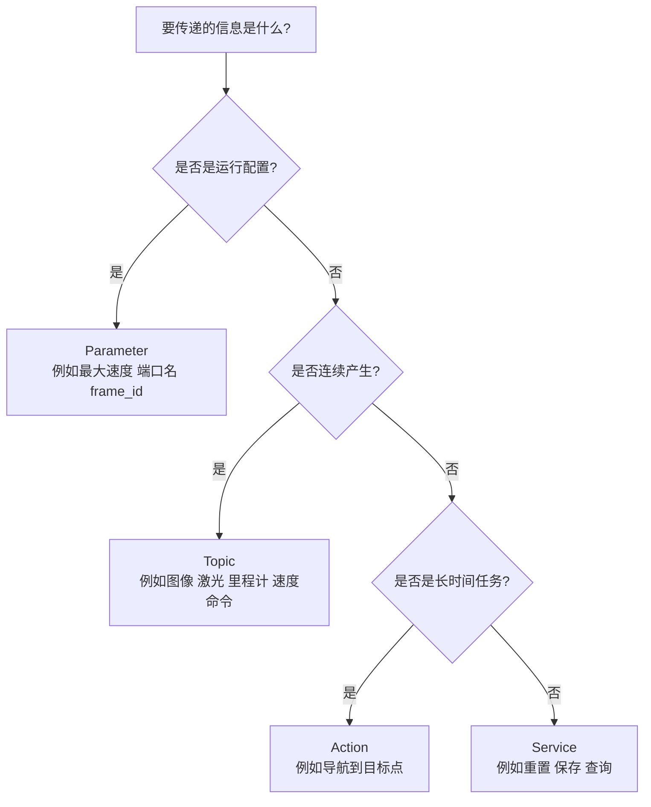

这张图不是绝对规则，但能避免初学者最常见的误用：

- 不要用 parameter 传传感器数据。
- 不要用 service 传连续图像。
- 不要用 topic 表达必须有明确返回值的短请求。
- 不要用普通 service 表达需要反馈和取消的长任务。

## 2.13 最小可运行实验

### 实验目标

启动一个最小 ROS1 系统，用命令观察 Master、节点、topic、service、parameter，并把观察结果和本章概念对应起来。

### 前置条件

- 已安装 ROS Noetic。
- 当前终端使用 Bash。
- 当前终端已加载 ROS 环境：

```bash
source /opt/ros/noetic/setup.bash
```

如果你已经把这行写入 `~/.bashrc` 并打开了新终端，可以用下面命令确认：

```bash
echo $ROS_DISTRO
```

正确输出应为：

```text
noetic
```

### 操作步骤

终端 1：启动 ROS Master。

```bash
source /opt/ros/noetic/setup.bash
roscore
```

保持这个终端不要关闭。`roscore` 是本实验的基础。

终端 2：观察系统。

```bash
source /opt/ros/noetic/setup.bash
echo $ROS_MASTER_URI
rosnode list
rosnode info /rosout
rostopic list
rostopic type /rosout
rosmsg show rosgraph_msgs/Log
rosservice list
rosparam list
```

设置并读取一个参数：

```bash
rosparam set /chapter2/student_name "ros_beginner"
rosparam get /chapter2/student_name
rosparam list | grep chapter2
rosparam delete /chapter2/student_name
```

### 正确现象

- `roscore` 终端持续运行，不应立即退出。
- `echo $ROS_MASTER_URI` 输出一个 HTTP URI，单机默认通常为 `http://localhost:11311`。
- `rosnode list` 至少能看到 `/rosout`。
- `rostopic list` 能看到 `/rosout` 等日志相关话题。
- `rostopic type /rosout` 能显示日志 topic 的消息类型。
- `rosmsg show rosgraph_msgs/Log` 能显示日志消息字段。
- `rosparam get /chapter2/student_name` 输出 `ros_beginner`。
- 删除参数后，`rosparam list | grep chapter2` 不再显示该参数。

### 实验复盘

把实验结果和概念对应起来：

| 你执行的命令 | 观察到的对象 | 对应概念 |
|---|---|---|
| `roscore` | 启动 Master 和基础日志服务 | Master |
| `rosnode list` | `/rosout` | Node |
| `rostopic list` | `/rosout` 等 | Topic |
| `rostopic type` | topic 的消息类型 | Message |
| `rosmsg show` | 消息字段结构 | Message 定义 |
| `rosservice list` | 系统服务 | Service |
| `rosparam set/get/list` | 参数写入和读取 | Parameter Server |

如果这张表能解释清楚，本章核心已经掌握。

### 如果失败，先检查什么

| 失败现象 | 第一检查命令 | 解释 |
|---|---|---|
| `rosnode list` 连接失败 | `roscore` 是否仍在运行 | 没有 Master，CLI 无法查询系统 |
| `roscore: command not found` | `echo $ROS_DISTRO`; `which roscore` | ROS 环境未加载或未安装 |
| `rosparam set` 报连接错误 | `echo $ROS_MASTER_URI` | 当前终端找不到 Master |
| `grep` 没有输出 | `rosparam list` | 可能参数已删除或名称写错 |

## 2.14 命令解释

### `roscore`

启动 ROS1 基础服务。初学阶段可以把它理解成启动 ROS Master 和基础日志服务。没有 `roscore`，大多数 ROS1 节点无法完成注册和发现。

### `rosnode list`

列出当前已经向 Master 注册的节点。它回答“现在有哪些节点在系统中运行”。

### `rosnode info`

查看某个节点发布什么、订阅什么、提供哪些 service、连接到了哪些节点。它是理解单个节点输入输出的第一工具。

### `rostopic list`

列出当前系统中可见的 topic。注意：topic 出现在列表中，不代表它一定有持续数据；可能只是有节点声明了发布或订阅。

### `rostopic info`

查看 topic 的发布者和订阅者。排查“有 topic 但没数据”时非常有用。

### `rostopic type`

查看 topic 使用的消息类型。调试 topic 时，先查名字，再查类型，再决定如何 echo 或 publish。

### `rosmsg show`

查看消息类型的字段结构。它回答“这条消息里到底有哪些字段”。

### `rosservice list`

查看当前系统提供的 service。

### `rosparam list/get/set/delete`

查看、读取、设置、删除参数。参数是配置，不是高速数据流。

## 2.15 高频错误与排查

| 现象 | 高概率原因 | 第一检查命令 | 修复思路 |
|---|---|---|---|
| `ERROR: Unable to communicate with master` | `roscore` 没启动，或 `ROS_MASTER_URI` 错误 | `echo $ROS_MASTER_URI`; 查看 roscore 终端 | 启动 `roscore`，单机先保持默认 URI |
| `rosnode list` 只有 `/rosout` | 系统里还没启动其他节点 | `ps aux | grep ros` | 这是正常的最小系统状态 |
| 以为 topic 数据经过 Master | 概念误解 | `rosnode info`; 阅读 Technical Overview | Master 负责发现，数据由节点间连接传输 |
| `rostopic echo` 没输出 | 没有发布者，或 topic 名写错 | `rostopic info 话题名` | 先确认 publishers 是否存在 |
| 参数改了但节点行为没变 | 节点只在启动时读取参数 | 查看节点文档或源码 | 重启节点，或确认是否支持动态读取 |
| 多终端行为不一致 | 有的终端没 source ROS 环境 | `echo $ROS_DISTRO` | 每个终端都 source，或写入 `.bashrc` |

ROS 概念排障要特别避免“只看名字”。`rostopic list` 看到 `/scan`，只能说明系统中出现过这个 topic 名；它不能证明有激光数据持续发布，也不能证明订阅者收到的数据类型正确。真正的检查应该分四层：

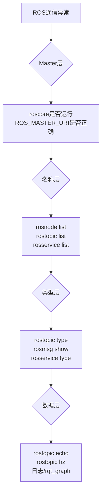

例如“机器人不动”不能只看 `/cmd_vel` 是否存在。最低限度要确认：控制节点是否在 `rosnode list` 中；`/cmd_vel` 的消息类型是不是 `geometry_msgs/Twist`；`rostopic echo /cmd_vel` 是否真的有非零速度；底盘或仿真节点是否订阅了同一个 topic；TF 和坐标参数是否让速度命令进入了正确机器人实例。只查 topic 名，最多能证明名字存在，不能证明控制链路成立。

## 2.16 本章自测

1. 为什么说 ROS 不是传统操作系统？
2. ROS Master 的职责是什么？它不负责什么？
3. Node 和源代码文件有什么区别？
4. Topic 和 Message 的关系是什么？
5. 哪些场景适合 topic？哪些场景适合 service？
6. Action 相比 service 多解决了什么问题？
7. Parameter Server 为什么不适合传输激光雷达数据？
8. 如果 `rostopic echo /scan` 没有输出，你会先查哪两个命令？
9. 为什么发布者和订阅者可以按任意顺序启动？
10. `ROS_MASTER_URI` 对单机和多机通信分别意味着什么？
11. 如果一个节点订阅 `/cmd_vel` 但机器人不动，为什么不能只看 topic 名？
12. 为什么参数变化后节点行为不一定立刻改变？

### 参考答案

1. ROS 不是传统操作系统，因为它不直接负责进程调度、内存管理、文件系统和硬件驱动这些内核职责。ROS 运行在 Ubuntu/Linux 之上，提供机器人软件常用的通信、构建、包管理、工具和生态。把 ROS 当成操作系统会导致误解，例如以为装了 ROS 就能直接控制电机或读取传感器。

2. ROS Master 负责名称注册和发现：节点向 Master 注册自己发布或订阅的 topic、提供的 service 等信息，其他节点通过 Master 找到连接对象。它不负责转发所有 topic 数据，也不负责执行节点代码、保存传感器数据或保证业务逻辑正确。节点发现彼此后，实际数据连接通常在节点之间建立。

3. 源代码文件是磁盘上的程序文本，例如 `talker.py` 或 `talker.cpp`；Node 是程序运行后加入 ROS 计算图的进程。同一个源码文件可以启动多个节点实例，不同节点名也可能来自同一个可执行文件。排查时应看 `rosnode list` 和 `rosnode info`，不能只看文件是否存在。

4. Topic 是通信通道的名字，Message 是这个通道中传输的数据类型和字段结构。例如 `/chatter` 是 topic，`std_msgs/String` 是消息类型；`/cmd_vel` 是 topic，`geometry_msgs/Twist` 是消息类型。只知道 topic 名不够，还必须确认消息类型一致，否则发布者和订阅者不能正确通信。

5. 持续、异步、高频或多接收者的数据适合 topic，例如激光雷达 `/scan`、里程计 `/odom`、速度命令 `/cmd_vel`。一次请求一次响应的操作适合 service，例如重置仿真、保存地图、查询状态、执行简单计算。判断标准不是“哪个更高级”，而是数据是否持续流动，以及调用方是否需要等待一个明确响应。

6. Action 适合可反馈、可取消、持续时间较长的任务。Service 发出请求后通常等待最终响应，不适合“导航到目标点”这类可能耗时很久、需要中途反馈进度、允许取消的任务。Action 在语义上补充了 goal、feedback、result、cancel 这些机制。

7. Parameter Server 适合存低频配置，例如发布频率、文件路径、阈值、开关参数；激光雷达数据是高频连续数据，应该通过 topic 发布。把 `/scan` 这类数据塞进参数服务器会造成更新频率、时间戳、数据同步和性能问题，也不符合 ROS 工具链的观察方式。

8. 先查 `rostopic info /scan`，确认是否有 publisher、subscriber 以及消息类型；再查 `rostopic list` 或 `rosnode list`，确认相关节点和 topic 是否存在。如果 topic 存在但无数据，再用 `rostopic hz /scan`、`rqt_graph` 或节点日志继续定位发布者是否真的在发。

9. 因为发布者和订阅者先向 Master 注册，节点启动顺序不是直接函数调用关系。发布者先启动时可以先注册等待订阅者，订阅者先启动时也可以先注册等待发布者；双方发现彼此后再建立连接。这也是 ROS 系统可以分布式启动的原因。

10. 单机时，`ROS_MASTER_URI` 通常指向本机 Master，例如 `http://localhost:11311`。多机时，所有参与通信的机器必须能访问同一个 Master 地址，并且网络、主机名解析和防火墙要允许节点之间建立连接。只改 `ROS_MASTER_URI` 不一定够，多机还要关注 `ROS_HOSTNAME` 或 `ROS_IP`。

11. 因为 `/cmd_vel` 只是名字，还要确认消息类型是否是 `geometry_msgs/Twist`、是否真的有 publisher、底盘或仿真节点是否订阅、速度值是否非零、控制器是否启用、机器人是否急停或仿真暂停。只看 topic 名会漏掉数据内容、连接关系和执行层问题。

12. 参数服务器只是存储参数，节点是否使用参数取决于代码。很多节点只在启动时读取一次参数，运行中参数变了也不会自动重新读取；有些节点需要重启，有些节点支持动态参数机制。排查时要同时看 `rosparam get` 和节点代码或文档，不能只看参数值是否已经改变。

## 2.17 本章小结

本章建立了 ROS1 的基本计算图模型。你现在应能把 ROS 系统理解成一组节点，以及节点之间通过 topic、service、action 和 parameter 建立的关系。

后续学习中，遇到任何 ROS 系统，先不要急着看代码。先问：

- 有哪些节点？
- 每个节点发布什么？
- 每个节点订阅什么？
- topic 的消息类型是什么？
- 哪些配置来自参数服务器？
- 系统是否需要 action 表示长任务？
- 数据是否真的在流动，还是只是 topic 名存在？

这套观察顺序比盲目修改代码更可靠。它也是后续 catkin、节点编程、launch、bag、TF 和移动机器人系统调试的共同基础。

## 延伸阅读

- ROS Tutorials：https://mirror.umd.edu/roswiki/ROS%282f%29Tutorials.html
- ROS Technical Overview：https://mirror.umd.edu/roswiki/ROS%282f%29Technical%2820%29Overview.html
- ROS Nodes：https://mirror.umd.edu/roswiki/Nodes.html
- ROS Topics：https://mirror.umd.edu/roswiki/Topics.html
- actionlib：https://mirror.umd.edu/roswiki/actionlib.html
- rosparam：https://mirror.umd.edu/roswiki/rosparam.html
- A Gentle Introduction to ROS：https://jokane.net/agitr/

---

# 第 3 章 ROS1 安装方法完整说明

## 本章解决什么问题

安装 ROS 是很多初学者第一次遇到的大障碍。网络、Ubuntu 版本、软件源、密钥、rosdep、桌面组件、虚拟机图形性能、WSL2 GUI、Docker 容器持久化，都可能导致“照着教程敲但失败”。

本章的目标不是只给一条命令，而是讲清楚多种安装方法各自解决什么问题、适合谁、不适合谁。主线仍然是 **Ubuntu 20.04 + ROS Noetic 官方 apt 安装**。鱼香 ROS 一键安装、Docker、WSL2、源码构建都可以提及和使用，但不能替代对官方安装机制的理解。

必须先明确事实边界：ROS Noetic 已经到达官方 EOL；REP-3 将 Noetic 的 Required Support 列为 Ubuntu Focal Fossa 20.04。选择 Noetic 是为了学习 ROS1 体系和维护历史项目，不是建议新项目默认继续优先选择 ROS1。

## 学完以后你应该能做到

- 解释为什么本书主线使用 Ubuntu 20.04 + ROS Noetic。
- 区分 `ros-base`、`desktop`、`desktop-full` 和单包安装。
- 完成官方 apt 安装并验证。
- 知道虚拟机、原生 Ubuntu、WSL2、Docker、鱼香 ROS、一键安装、源码构建的适用边界。
- 理解软件源、密钥、APT 索引、环境变量、rosdep 分别解决什么问题。
- 理解 `source /opt/ros/noetic/setup.bash` 和 `~/.bashrc` 的作用。
- 能根据错误现象检查 Ubuntu 版本、软件源、apt 索引、ROS 环境和 rosdep。

## 3.1 本章在全书中的位置

第 2 章已经解释了 ROS Master、Node、Topic、Service、Parameter。现在要把这些概念真正运行起来。安装不是独立任务，它决定后面所有实验是否可复现。

成熟 ROS 教程通常把安装和环境配置放在最前面，然后马上进入 ROS 文件系统、节点、话题等基础实验。这个顺序合理，因为安装后的第一目标不是“装完了”，而是能够运行最小系统并观察它。

本章的安装判断流程如下：

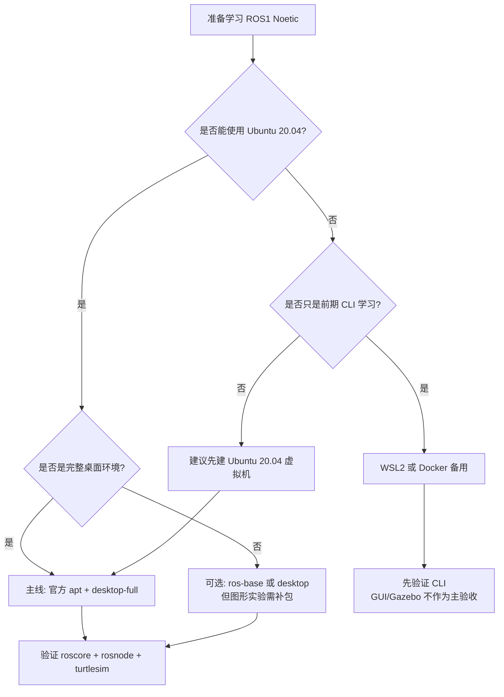

这张图表达一个原则：方法可以多，但主线不能乱。零基础教学首先追求可复现和可排障，而不是展示所有可能玩法。

## 3.2 安装前必须确认的事实

### ROS Noetic 的定位

ROS Noetic Ninjemys 是 ROS1 的最后一个 LTS 发行版。官方 EOL 说明指出 Noetic 已到达维护结束。EOL 之后，不应期待官方继续提供安全更新、bug 修复或新功能。

这并不意味着 Noetic 不能学习或不能运行。它仍然有大量历史项目、教材、驱动和机器人系统使用经验。本书选择它，是因为当前教材目标是 ROS1 基础教学。

### Ubuntu 版本不能随便换

Noetic 的官方目标平台是 Ubuntu 20.04 Focal。不要把“我的系统也是 Ubuntu”理解成“版本无所谓”。Ubuntu 22.04、24.04 上通过源码或容器做 Noetic 是高级路线，不是零基础主线。

查看系统版本：

```bash
lsb_release -a
```

主线环境应看到类似：

```text
Description:    Ubuntu 20.04.x LTS
Codename:       focal
```

如果 Codename 不是 `focal`，不要继续照抄本章官方 apt 安装命令。先换到 Ubuntu 20.04、使用虚拟机、使用 Docker，或等待后续高级说明。

### 二进制安装和源码安装不是一回事

ROS Wiki Noetic Ubuntu 安装文档说明，构建农场会为若干 Ubuntu 平台构建 Debian 包，用户可以直接安装这些包，而不需要从源代码编译。对新手来说，官方 apt 安装的优势是：

- 下载的是预编译包。
- 依赖由 APT 处理。
- 安装路径统一。
- 遇到问题时教程和社区答案最多。

源码安装则需要下载源码、解析依赖、编译和处理构建错误。它对理解系统有价值，但不适合作为第一次学习的主线。

## 3.3 安装方法总览

| 方法 | 本书定位 | 推荐对象 | 优点 | 限制 |
|---|---|---|---|---|
| 官方 apt 安装 | 主线 | 所有初学者 | 官方路径清晰，资料最多 | 要求 Ubuntu 20.04 |
| Ubuntu 20.04 虚拟机 | 推荐载体 | Windows/macOS 学生 | 易恢复，失败成本低 | 图形/仿真性能取决于电脑 |
| 原生 Ubuntu 20.04 | 推荐载体 | 实验室机器、双系统用户 | 性能好，硬件访问直接 | 系统安装风险高 |
| WSL2 | 备用 | Windows 用户前期学习 | 启动快，命令行方便 | GUI、USB、Gazebo 不总是稳 |
| Docker | 备用/助教 | 课堂批量复现、CI | 环境一致，容易清理 | GUI、网络、硬件映射复杂 |
| 鱼香 ROS 一键安装 | 辅助 | 国内网络装机、rosdep 问题 | 自动化程度高，适合兜底 | 不能替代官方原理 |
| 源码构建 | 高级 | 教师、挑战实验、跨架构预备 | 理解依赖和构建链 | 慢、难、错误多 |

### 如何选择

| 你的情况 | 建议 |
|---|---|
| 第一次学习 ROS，电脑是 Windows | 优先 Ubuntu 20.04 虚拟机 |
| 实验室电脑可以重装系统 | 原生 Ubuntu 20.04 |
| 只想先学命令行和 ROS CLI | WSL2 可作为备用 |
| 教师要给几十台机器统一环境 | Docker 可作为兜底 |
| 官方源/rosdep 经常失败 | 可参考鱼香 ROS 辅助 |
| 想研究移植或编译链 | 源码构建作为高级实验 |

## 3.4 推荐主线：Ubuntu 20.04 + 官方 apt

### 安装前准备

确认系统：

```bash
lsb_release -a
```

确认 shell：

```bash
echo $SHELL
```

更新软件包索引：

```bash
sudo apt update
```

如果这里已经失败，先不要安装 ROS。APT 基础不可用时，ROS 安装一定不可靠。

### 配置 Ubuntu 仓库

官方安装文档要求 Ubuntu 仓库启用 `restricted`、`universe`、`multiverse`。桌面版通常可以通过“Software & Updates”图形界面确认。也可以使用：

```bash
sudo apt install -y software-properties-common
sudo add-apt-repository universe
sudo add-apt-repository restricted
sudo add-apt-repository multiverse
sudo apt update
```

解释：

- `restricted` 包含受限制许可的软件。
- `universe` 包含社区维护的软件。
- `multiverse` 包含某些许可更受限的软件。
- ROS 的部分依赖可能来自这些仓库。

### 添加 ROS 软件源

```bash
sudo sh -c 'echo "deb http://packages.ros.org/ros/ubuntu $(lsb_release -sc) main" > /etc/apt/sources.list.d/ros-latest.list'
```

解释：

- 这行命令创建 `/etc/apt/sources.list.d/ros-latest.list`。
- `$(lsb_release -sc)` 在 Ubuntu 20.04 上应展开为 `focal`。
- 它告诉 APT：除了 Ubuntu 官方源，也去 packages.ros.org 查找 ROS 包。

检查文件内容：

```bash
cat /etc/apt/sources.list.d/ros-latest.list
```

正确内容应类似：

```text
deb http://packages.ros.org/ros/ubuntu focal main
```

如果这里不是 `focal`，说明系统版本不符合主线。

### 添加密钥

```bash
sudo apt install -y curl
curl -s https://raw.githubusercontent.com/ros/rosdistro/master/ros.asc | sudo apt-key add -
```

解释：

- APT 需要确认软件包来源可信。
- 这一步添加 ROS 软件源签名密钥。

注意：`apt-key` 在较新 Ubuntu 中已不推荐作为长期方式，但 ROS Noetic 官方安装文档仍使用这套历史流程。本书为 Noetic 主线保留官方文档方式。

### 更新索引并选择安装规模

```bash
sudo apt update
```

然后选择安装规模。

| 包名 | 内容 | 适用场景 |
|---|---|---|
| `ros-noetic-desktop-full` | Desktop + 2D/3D 仿真 + 感知包 | 本书推荐，覆盖 RViz/Gazebo 等 |
| `ros-noetic-desktop` | ROS-Base + rqt + RViz 等 | 图形工具够用，但仿真/感知少 |
| `ros-noetic-ros-base` | 打包、构建、通信库，无 GUI | 服务器、机器人本体、容器基础 |
| `ros-noetic-PACKAGE` | 单独安装某个包 | 后续补装功能包 |

官方文档把 `desktop-full` 描述为包含 Desktop、2D/3D 仿真和感知包的推荐安装。对本书来说，`desktop-full` 能减少后续 RViz、Gazebo、turtlesim 和常见工具缺失导致的干扰。

本书推荐：

```bash
sudo apt install -y ros-noetic-desktop-full
```

如果电脑磁盘或网络条件有限，可先安装：

```bash
sudo apt install -y ros-noetic-desktop
```

但后续 Gazebo 或某些功能包可能需要补装。

### 环境配置

临时生效：

```bash
source /opt/ros/noetic/setup.bash
```

检查：

```bash
echo $ROS_DISTRO
which roscore
```

正确现象：

```text
noetic
/opt/ros/noetic/bin/roscore
```

为了让每个新 Bash 终端自动加载 ROS Noetic：

```bash
echo "source /opt/ros/noetic/setup.bash" >> ~/.bashrc
source ~/.bashrc
```

严肃提醒：如果你的电脑装了多个 ROS 发行版，`~/.bashrc` 不应同时 source 多个发行版。一次只让一个 ROS 发行版成为默认环境。

### 安装构建依赖和 rosdep

官方文档说明，运行核心 ROS 包和创建/管理工作空间需要额外构建工具。

```bash
sudo apt install -y python3-rosdep python3-rosinstall python3-rosinstall-generator python3-wstool build-essential
```

初始化 rosdep：

```bash
sudo rosdep init
rosdep update
```

解释：

- `rosdep` 用来把 ROS 包依赖转换成系统依赖安装指令。
- 后续编译源码包时经常用它。

如果 `sudo rosdep init` 提示文件已存在，说明可能已经初始化过。不要重复乱删，先查看：

```bash
ls /etc/ros/rosdep/sources.list.d/
```

## 3.5 安装过程的系统状态变化

新手常见问题是只知道“照着敲”，不知道系统被改了哪里。可以按下面理解：


对应文件或状态：

| 步骤 | 影响对象 | 检查方法 |
|---|---|---|
| 添加 ROS 源 | `/etc/apt/sources.list.d/ros-latest.list` | `cat /etc/apt/sources.list.d/ros-latest.list` |
| 更新索引 | APT 本地包索引 | `sudo apt update` |
| 安装包 | `/opt/ros/noetic` 等系统目录 | `ls /opt/ros/noetic` |
| source 环境 | 当前 shell 环境变量 | `echo $ROS_DISTRO`; `which roscore` |
| 写入 `.bashrc` | Bash 启动配置 | `tail ~/.bashrc` |
| 初始化 rosdep | `/etc/ros/rosdep/sources.list.d/` | `ls /etc/ros/rosdep/sources.list.d/` |

这张表能帮助你判断失败发生在哪一层，而不是盲目重装。

## 3.6 安装验证

### 验证 ROS 发行版

```bash
rosversion -d
```

正确输出：

```text
noetic
```

### 验证 roscore

终端 1：

```bash
roscore
```

终端 2：

```bash
source /opt/ros/noetic/setup.bash
rosnode list
```

正确输出至少包含：

```text
/rosout
```

### 验证图形工具和 turtlesim

```bash
rosrun turtlesim turtlesim_node
```

正确现象：

- 出现 turtlesim 窗口。
- 窗口中有一只小乌龟。

如果你在 WSL2、Docker 或远程环境中执行，图形窗口失败不一定说明 ROS 安装失败，可能是显示服务没有配置。先在原生 Ubuntu 或虚拟机中验证。

### 安装完成的最低验收标准

不要只说“没有报错”。至少要满足：

```bash
echo $ROS_DISTRO
which roscore
rosversion -d
rosnode list
rosrun turtlesim turtlesim_node
```

如果前四个成功、turtlesim 图形失败，说明 ROS 基础安装可能可用，但图形环境需要单独排查。

## 3.7 虚拟机方法

虚拟机是在现有系统上运行一个完整 Ubuntu。对零基础学生，虚拟机的最大优势是可恢复：安装失败、配置错、环境乱了，可以回滚快照。

建议配置：

- Ubuntu 20.04 Desktop ISO。
- CPU：2 核或以上。
- 内存：4 GB 起步，8 GB 更好。
- 磁盘：40 GB 起步。
- 显示：开启 3D 加速，如果虚拟机软件支持。

建议流程：

1. 新建 Ubuntu 20.04 虚拟机。
2. 完成系统安装和更新。
3. 安装增强工具或 Guest Additions。
4. 拍摄“干净系统快照”。
5. 按官方 apt 安装 ROS。
6. 验证 `roscore` 和 turtlesim。
7. 拍摄“ROS 安装完成快照”。

不要把虚拟机里 Gazebo 运行慢误判为 ROS 安装错误。图形性能慢和 ROS 通信机制是两件事。

### 虚拟机适合教学的原因

虚拟机不是性能最强的方案，但教学稳定性高：

- 学生操作失败可以回滚。
- 教师可以统一截图和路径。
- 不会影响学生主系统。
- 适合先完成第 1 到第 7 章的大部分实验。

到 Gazebo 和移动机器人仿真时，教师可以再说明性能限制。

## 3.8 WSL2 方法

WSL2 适合 Windows 学生做前期 CLI 实验。它启动快，文件共享方便，也能支持一定的 Linux GUI 应用。但对 ROS 学习来说，它不是最简单路径。

WSL2 推荐用途：

- 学习 Bash、APT、Git。
- 运行 `roscore`、`rosnode`、`rostopic`。
- 轻量运行 RViz 或 rqt。

WSL2 谨慎用途：

- Gazebo 仿真。
- USB 传感器。
- 串口底盘。
- 多机网络通信。

本书不会把 WSL2 作为主验收环境。若 WSL2 中 GUI 出问题，先用虚拟机或原生 Ubuntu 确认同一命令是否正常。

### WSL2 中常见误判

| 现象 | 可能真实原因 | 不应立刻得出的结论 |
|---|---|---|
| RViz 不显示 | GUI/显卡/显示服务问题 | ROS 安装一定失败 |
| USB 设备不可见 | 设备映射问题 | 驱动包一定有 bug |
| Gazebo 很卡 | 图形性能问题 | ROS topic 通信有问题 |
| 多机通信异常 | WSL 网络模式问题 | ROS Master 概念错了 |

## 3.9 Docker 方法

Docker 容器适合课堂批量复现和助教兜底。官方 Docker Hub 提供 ROS 镜像。

最小验证：

```bash
docker pull ros:noetic
docker run -it --rm ros:noetic roscore
```

解释：

- `docker pull ros:noetic` 下载 ROS Noetic 镜像。
- `docker run -it --rm` 启动临时交互容器，退出后自动删除。
- 容器内运行 `roscore`，说明基础 ROS 环境可用。

Docker 的关键限制：

- 容器默认不保存你在里面创建的工作空间，除非挂载 volume。
- GUI 程序需要额外配置显示。
- 访问摄像头、雷达、串口、USB 设备需要设备映射和权限。
- 容器网络与宿主机网络不同，多节点通信要谨慎。

因此 Docker 适合作为“可复现环境”，不是零基础学生第一次理解 Ubuntu 的最佳入口。

### Docker 更适合什么

Docker 适合作为：

- 教师给出统一实验环境。
- 助教快速复现学生问题。
- CI 中检查脚本和文档命令。
- 保留一个干净 ROS Noetic 基础镜像。

Docker 不适合掩盖 Linux 基础。学生仍然要理解 source、工作空间、包、topic 和网络。

## 3.10 鱼香 ROS 一键安装

鱼香 ROS 一键安装工具在国内 ROS 学习者中很常见，特别适合处理网络、源、rosdep 等安装痛点。它的价值很明确：降低装机成本，帮助学生快速进入学习。

FishROS 的安装工具仓库列出了多个能力，包括一键安装 ROS、配置 rosdep、配置 ROS 环境、配置系统源、安装 Docker 等。教材可以提及这些能力，但必须保持定位清楚。

本书中的使用原则：

- 它是辅助工具，不是 ROS 官方原理的替代品。
- 使用它之前，学生仍应理解软件源、APT、密钥、`~/.bashrc`、rosdep。
- 使用它之后，也要能用官方验证命令确认安装结果。

建议正文写法：

1. 先讲官方 apt 安装。
2. 再说明国内网络常见失败。
3. 再介绍鱼香 ROS 作为辅助路径。
4. 最后仍回到 `rosversion -d`、`roscore`、`rosnode list`、turtlesim 验证。

不要把“一键成功”当成学习完成。真正的目标是安装后能解释系统状态。

## 3.11 源码构建方法

源码构建适合高级理解，不适合零基础第一次安装。

源码构建能帮助理解：

- ROS 包之间的依赖关系。
- `rosinstall_generator` 如何生成源码清单。
- `rosdep` 如何解析系统依赖。
- `catkin_make_isolated` 如何按顺序编译。

但它也有明显问题：

- 下载慢。
- 依赖多。
- 编译时间长。
- 错误信息复杂。
- 对初学者收益不如先学会 ROS 运行模型。

本书后续最多把源码构建放入“挑战实验”或“教师版说明”。当前主线不要求学生执行。

## 3.12 最小可运行实验

### 实验目标

完成官方 apt 主线安装并验证 ROS Noetic 可用。

### 前置条件

- Ubuntu 20.04 Focal。
- Bash。
- 网络可访问 ROS 软件源或镜像源。
- 当前用户有 sudo 权限。

### 操作步骤

确认系统：

```bash
lsb_release -a
```

添加 ROS 源：

```bash
sudo sh -c 'echo "deb http://packages.ros.org/ros/ubuntu $(lsb_release -sc) main" > /etc/apt/sources.list.d/ros-latest.list'
cat /etc/apt/sources.list.d/ros-latest.list
```

添加密钥：

```bash
sudo apt install -y curl
curl -s https://raw.githubusercontent.com/ros/rosdistro/master/ros.asc | sudo apt-key add -
```

安装：

```bash
sudo apt update
sudo apt install -y ros-noetic-desktop-full
```

配置环境：

```bash
source /opt/ros/noetic/setup.bash
echo $ROS_DISTRO
which roscore
echo "source /opt/ros/noetic/setup.bash" >> ~/.bashrc
```

安装 rosdep：

```bash
sudo apt install -y python3-rosdep python3-rosinstall python3-rosinstall-generator python3-wstool build-essential
sudo rosdep init
rosdep update
```

验证：

```bash
rosversion -d
roscore
```

另开终端：

```bash
rosnode list
rosrun turtlesim turtlesim_node
```

### 正确现象

- ROS 源文件中出现 `focal main`。
- `echo $ROS_DISTRO` 输出 `noetic`。
- `which roscore` 指向 `/opt/ros/noetic/bin/roscore`。
- `rosversion -d` 输出 `noetic`。
- `rosnode list` 看到 `/rosout`。
- turtlesim 窗口正常打开。

### 实验复盘

安装实验不是为了“敲完命令”，而是为了得到三层能力：

| 层次 | 验证命令 | 说明 |
|---|---|---|
| 系统包安装成功 | `ls /opt/ros/noetic` | ROS 文件已安装到系统 |
| 当前终端环境可用 | `echo $ROS_DISTRO`; `which roscore` | shell 能找到 ROS 命令 |
| ROS 运行时可用 | `roscore`; `rosnode list` | Master 和基础节点可运行 |
| 图形示例可用 | `rosrun turtlesim turtlesim_node` | 后续第 4 章可继续 |

如果某一层失败，只修对应层，不要直接重装系统。

## 3.13 高频错误与排查

| 现象 | 高概率原因 | 第一检查命令 | 修复思路 |
|---|---|---|---|
| `Unable to locate package ros-noetic-desktop-full` | Ubuntu 不是 focal，或 ROS 源未添加/未 update | `lsb_release -a`; `cat /etc/apt/sources.list.d/ros-latest.list` | 确认系统为 20.04，重新 `sudo apt update` |
| `roscore: command not found` | ROS 未安装或当前终端未 source | `which roscore`; `echo $ROS_DISTRO` | `source /opt/ros/noetic/setup.bash` |
| `sudo rosdep init` 报已存在 | 之前初始化过 | `ls /etc/ros/rosdep/sources.list.d/` | 不要重复乱删，先运行 `rosdep update` |
| turtlesim 无窗口 | 未安装 desktop/full，或 GUI 不可用 | `dpkg -l | grep turtlesim`; 检查图形环境 | 补装 `ros-noetic-turtlesim`，或换 VM/原生验证 |
| WSL2 中 RViz/Gazebo 异常 | GUI/显卡/显示服务问题 | `echo $DISPLAY`; 运行简单 GUI 程序 | 不把该错误归因于 ROS 本体 |
| `.bashrc` 写了多行 source | 多发行版环境冲突 | `tail ~/.bashrc` | 保留当前使用的一个发行版 |

### 安装排障树

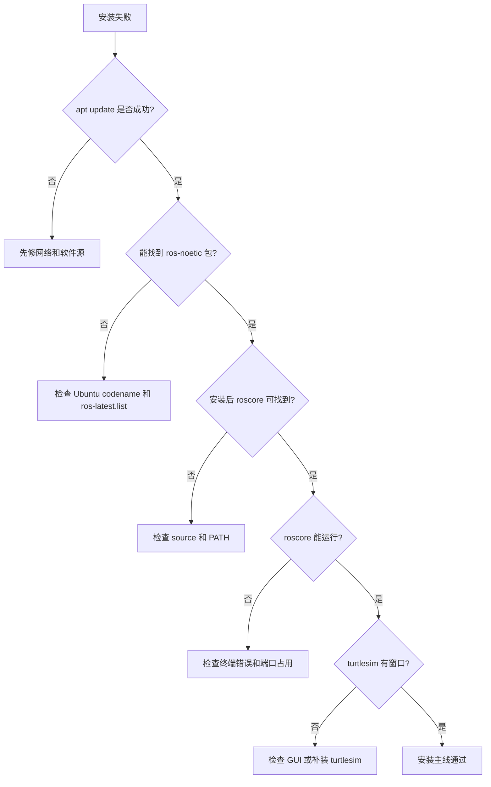

## 3.14 本章自测

1. 为什么本书主线不使用 Ubuntu 22.04 安装 Noetic？
2. `desktop-full`、`desktop`、`ros-base` 分别适合什么场景？
3. `sudo apt update` 在 ROS 安装中起什么作用？
4. 为什么添加 ROS 源后要检查 `ros-latest.list`？
5. `source /opt/ros/noetic/setup.bash` 为什么每个终端都要执行？
6. 为什么鱼香 ROS 一键安装不能替代官方安装原理？
7. Docker 容器为什么默认不适合保存学生工作空间？
8. WSL2 中 Gazebo 出问题时，为什么不能直接说 ROS 安装失败？
9. `rosdep` 解决什么问题？
10. 你会用哪些命令判断 ROS Noetic 安装是否成功？
11. 如果 `rosversion -d` 正常但 turtlesim 无窗口，问题可能在哪一层？
12. 为什么源码构建不适合零基础第一次安装？

### 参考答案

1. 因为 ROS Noetic 的官方目标平台是 Ubuntu 20.04 Focal，而不是 Ubuntu 22.04。新手使用 Ubuntu 22.04 安装 Noetic，往往会遇到 apt 包不可用、依赖版本不匹配、需要源码构建等问题。教材主线必须降低无关变量，让读者先掌握 ROS1 本身。

2. `desktop-full` 包含 ROS 基础、GUI 工具、RViz、rqt、仿真和常用感知/机器人包，适合本书全流程学习；`desktop` 包含常用桌面工具但内容少一些，适合空间有限但仍需要 RViz/rqt 的环境；`ros-base` 只有核心通信、构建和命令行基础，适合服务器、容器或机器人本体，不适合零基础完整学习图形和仿真。

3. `sudo apt update` 会从 Ubuntu 和 ROS 软件源拉取最新软件包索引。添加 ROS 源或修改镜像后，如果不执行它，apt 仍不知道新源中有哪些 `ros-noetic-*` 包。安装失败时，`apt update` 的输出也是判断软件源、网络和 key 是否正常的重要证据。

4. `ros-latest.list` 决定 apt 是否知道 ROS 软件源，以及源的发行版代号是否匹配当前 Ubuntu。比如 Ubuntu 20.04 应对应 `focal`，如果文件内容错误或没有写入，`apt install ros-noetic-desktop-full` 就可能找不到包。检查这个文件比盲目重复安装命令更有效。

5. `source /opt/ros/noetic/setup.bash` 会把 ROS Noetic 的环境变量加载到当前 shell，例如 PATH、ROS_PACKAGE_PATH 等。每个新终端都是新的 shell，不会自动继承另一个终端里手动 source 的结果。若要新终端自动加载，需要把 source 行写入 `~/.bashrc`。

6. 鱼香 ROS 一键安装能帮助处理国内网络、换源、rosdep 和自动化安装问题，但它背后仍然是在操作软件源、apt、rosdep 和环境变量。学生必须理解官方安装原理，否则一键脚本失败或换机器时就无法排查。教材可以推荐它作为辅助工具，但不能把它当成黑盒替代基础知识。

7. Docker 容器默认是临时运行环境，容器删除后，容器内部未挂载到宿主机的数据会消失。学生的 `catkin_ws` 如果没有通过 volume 挂载保存，就可能丢失。Docker 还需要额外处理 GUI、网络、设备映射和权限，因此更适合助教兜底、批量复现或 CI，不是第一次学习的最简单路径。

8. WSL2 中 Gazebo 出问题可能来自图形显示、显卡加速、WSLg、网络、权限或资源限制，不一定是 ROS 安装失败。应先用 `roscore`、`rosnode list`、`rostopic list` 等命令判断 ROS 通信是否正常，再判断是否是 Gazebo 图形或仿真性能层的问题。

9. `rosdep` 用来根据 ROS 包声明的依赖，在当前系统上解析并安装对应系统包。它解决的是“源码或工作空间依赖哪些 Ubuntu 包、Python 包或系统库”的问题。创建或编译较大工作空间时，`rosdep install --from-paths src --ignore-src -r -y` 常用于补齐依赖。

10. 可以用 `rosversion -d` 确认发行版输出 `noetic`，用 `which roscore` 确认命令可找到，用 `roscore` 确认 Master 能启动，用另一个终端 `rosnode list` 确认能连接 Master，用 `rosrun turtlesim turtlesim_node` 确认图形工具和示例包可用。这些命令分别验证版本、环境、通信和 GUI 示例。

11. 问题可能在图形层或示例包层，而不是 ROS 核心安装层。应检查是否安装了 `ros-noetic-turtlesim`、当前是否有桌面显示环境、`DISPLAY` 是否正确、虚拟机/WSL2 图形支持是否正常。`rosversion -d` 只能说明 ROS 环境能识别 Noetic，不代表 GUI 程序一定能显示。

12. 源码构建会引入仓库分支、依赖解析、编译顺序、系统库版本、构建工具和大量错误日志。零基础学生还没有掌握 apt、source、catkin、依赖声明和排障命令，直接源码构建会把主要精力耗在环境问题上。源码构建适合作为高级理解和后续适配准备，不适合作为第一次安装主线。

## 延伸阅读

- ROS Noetic EOL：https://www.ros.org/blog/noetic-eol/
- REP-3 Target Platforms：https://www.ros.org/reps/rep-0003.html
- ROS Noetic Ubuntu 安装：https://mirror.umd.edu/roswiki/noetic%282f%29Installation%282f%29Ubuntu.html
- ROS Noetic 源码安装：https://mirror.umd.edu/roswiki/noetic%282f%29Installation%282f%29Source.html
- Docker 官方 ROS 镜像：https://hub.docker.com/_/ros
- 鱼香 ROS 一键安装：https://github.com/fishros/install
- Ubuntu VirtualBox 教程：https://ubuntu.com/tutorials/how-to-run-ubuntu-desktop-on-a-virtual-machine-using-virtualbox
- WSL GUI 官方说明：https://learn.microsoft.com/en-us/windows/wsl/tutorials/gui-apps

---

# 第 4 章 第一个 ROS 系统

## 本章解决什么问题

前两章你已经知道 ROS 的概念，也完成了安装。本章要让 ROS 从“术语”变成“可观察系统”。我们使用 `turtlesim`，不是因为小乌龟本身重要，而是因为它足够小，能清楚展示节点、话题、消息和计算图。

成熟 ROS 入门教程通常都会从 turtlesim 开始。原因很简单：它能在几分钟内让你看到一个完整的 ROS 闭环：一个节点提供仿真窗口，一个节点发布速度命令，两个节点通过 topic 解耦，CLI 和 rqt 工具可以观察整个系统。

本章的重点不是“用键盘控制乌龟”，而是学会问：有哪些节点？哪些 topic？消息类型是什么？数据从哪里流向哪里？如果系统不动，我先检查什么？

## 学完以后你应该能做到

- 启动 `roscore`、`turtlesim_node`、`turtle_teleop_key`。
- 使用 `rosnode list` 和 `rosnode info` 查看节点。
- 使用 `rostopic list`、`rostopic type`、`rostopic info`、`rostopic echo`、`rostopic pub` 查看和发布消息。
- 使用 `rqt_graph` 观察计算图。
- 解释 `/turtle1/cmd_vel` 和 `/turtle1/pose` 的数据方向。
- 把 turtlesim 的结构迁移理解到移动机器人 `/cmd_vel`、`/odom`、`/scan`。
- 通过命令定位“节点没启动、topic 名写错、消息类型写错、终端焦点不对”等常见问题。

## 4.1 本章在全书中的位置

第 2 章讲概念，第 3 章讲安装，本章用最小系统把概念和安装结果连接起来。

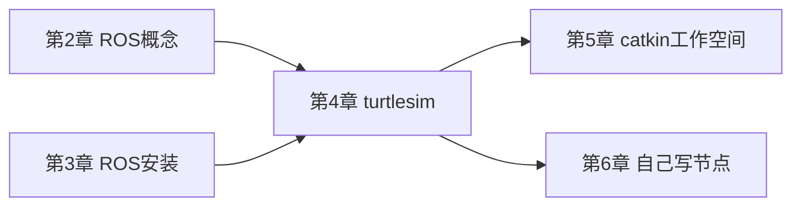

如果本章只做到“能让小乌龟动起来”，学习是不完整的。真正目标是能解释这只小乌龟背后的 ROS 结构。你要把窗口中看到的运动，映射到节点、topic、消息类型和数据流。

## 4.2 为什么用 turtlesim

真实机器人系统包含驱动、控制器、传感器、坐标变换、地图和导航，初学者一开始很难判断错误来自哪里。turtlesim 则把问题简化到最低：

- 一个二维窗口。
- 一个可控制的小乌龟。
- 一个速度命令 topic。
- 一个位姿反馈 topic。
- 一个键盘控制节点。

这个系统足够小，但 ROS 通信机制是真实的。你在 turtlesim 中学会的观察方法，后续可以直接迁移到移动机器人：

| turtlesim | 移动机器人类比 | 共同点 |
|---|---|---|
| `/turtle1/cmd_vel` | `/cmd_vel` 速度命令 | 外部节点发布速度控制 |
| `/turtle1/pose` | `/odom` 或位姿反馈 | 系统发布当前状态 |
| `turtle_teleop_key` | 键盘/手柄遥控节点 | 人类输入转成速度命令 |
| `turtlesim_node` | 底盘或仿真节点 | 接收速度并更新状态 |
| `rqt_graph` | 复杂系统计算图 | 可视化节点和 topic 关系 |

### 一个重要提醒

不要因为 turtlesim 简单就轻视它。很多真实系统的问题，缩小后和 turtlesim 一样：

- 控制节点有没有发布 `/cmd_vel`？
- 底盘节点有没有订阅 `/cmd_vel`？
- 消息类型是不是 `geometry_msgs/Twist`？
- 反馈 topic 有没有数据？
- 图里看到的连接和你以为的一样吗？

## 4.3 本章必须理解的概念

| 概念 | 简明定义 | 容易误解的点 | 最小观察方法 |
|---|---|---|---|
| `turtlesim_node` | 小乌龟仿真节点 | 它不是 ROS Master | `rosnode info /turtlesim` |
| `turtle_teleop_key` | 键盘控制节点 | 只有终端获得焦点时才响应按键 | `rosnode info /teleop_turtle` |
| `/turtle1/cmd_vel` | 控制乌龟速度的 topic | 不是键盘节点直接调用仿真函数 | `rostopic echo /turtle1/cmd_vel` |
| `/turtle1/pose` | 乌龟当前位姿 topic | 不是命令，而是状态反馈 | `rostopic echo /turtle1/pose` |
| `geometry_msgs/Twist` | 速度消息类型 | 字段结构必须写对 | `rosmsg show geometry_msgs/Twist` |
| `rqt_graph` | 计算图可视化工具 | 图不刷新时不等于系统坏了 | 点击刷新 |

## 4.4 turtlesim 的数据流

先看整体结构：

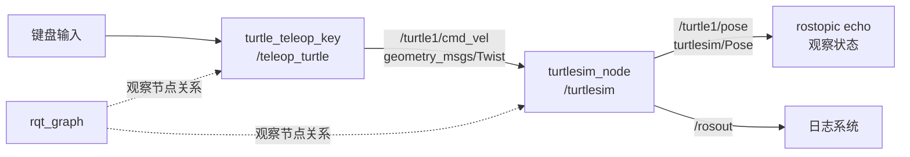

这张图里，键盘控制节点没有直接调用 turtlesim 的内部函数。它只是把按键转换成速度消息，发布到 `/turtle1/cmd_vel`。turtlesim 订阅这个 topic，收到速度后更新小乌龟状态，再发布 `/turtle1/pose`。

你后续看到移动机器人时，也可以画类似图：

```text
teleop -> /cmd_vel -> base_driver -> /odom
```

这就是 turtlesim 的教学价值。

## 4.5 最小可运行实验

### 实验目标

启动一个包含多个节点和 topic 的 ROS 系统，并用命令观察数据流。

### 前置条件

- ROS Noetic 安装完成。
- 能打开图形窗口。
- 当前终端已加载 ROS 环境。

如果 turtlesim 未安装：

```bash
sudo apt update
sudo apt install -y ros-noetic-turtlesim
```

### 操作步骤

终端 1：启动 Master。

```bash
source /opt/ros/noetic/setup.bash
roscore
```

终端 2：启动 turtlesim。

```bash
source /opt/ros/noetic/setup.bash
rosrun turtlesim turtlesim_node
```

终端 3：启动键盘控制。

```bash
source /opt/ros/noetic/setup.bash
rosrun turtlesim turtle_teleop_key
```

让终端 3 保持焦点，按方向键控制乌龟。

终端 4：观察系统。

```bash
source /opt/ros/noetic/setup.bash
rosnode list
rostopic list
rostopic type /turtle1/cmd_vel
rosmsg show geometry_msgs/Twist
rostopic echo /turtle1/pose
```

打开计算图：

```bash
rqt_graph
```

### 正确现象

- `roscore` 终端持续运行。
- turtlesim 窗口显示一只小乌龟。
- 按方向键时，小乌龟移动或旋转。
- `rosnode list` 能看到类似 `/turtlesim`、`/teleop_turtle`、`/rosout` 的节点。
- `rostopic list` 能看到 `/turtle1/cmd_vel`、`/turtle1/pose` 等 topic。
- `rostopic echo /turtle1/pose` 持续输出 x、y、theta、linear_velocity、angular_velocity。
- `rqt_graph` 能看到 teleop 节点向 turtlesim 节点发送速度命令。

### 实验复盘

把实验分成四层：

| 层次 | 你做了什么 | 对应命令 | 你应该理解什么 |
|---|---|---|---|
| Master | 启动注册发现服务 | `roscore` | 节点需要注册和发现 |
| 节点 | 启动仿真和键盘节点 | `rosrun turtlesim ...` | 节点是运行中的进程 |
| topic | 观察命令和反馈通道 | `rostopic list/echo` | 数据通过 topic 流动 |
| 图 | 看系统连接关系 | `rqt_graph` | 节点通过 topic 解耦 |

如果你能把这四层讲给别人听，就不是在“跑 demo”，而是在理解 ROS 系统。

## 4.6 观察 topic 数据

### 查看 `/turtle1/pose`

```bash
rostopic echo /turtle1/pose
```

典型输出：

```text
x: 5.544444561
y: 5.544444561
theta: 0.0
linear_velocity: 0.0
angular_velocity: 0.0
```

解释：

- `x`、`y`：乌龟在窗口中的位置。
- `theta`：朝向角。
- `linear_velocity`：线速度。
- `angular_velocity`：角速度。

当你按方向键时，这些数值会变化。这里你看到的是状态反馈，不是控制命令。

### 查看 `/turtle1/cmd_vel`

在 teleop 终端按方向键，同时另一个终端运行：

```bash
rostopic echo /turtle1/cmd_vel
```

典型输出：

```text
linear:
  x: 2.0
  y: 0.0
  z: 0.0
angular:
  x: 0.0
  y: 0.0
  z: 0.0
```

解释：

- `/turtle1/cmd_vel` 是命令。
- `/turtle1/pose` 是反馈。
- 命令和反馈分开，是机器人系统设计中的常见模式。

### `rostopic info` 比 `rostopic echo` 更适合第一步排查

如果你不知道某个 topic 是否有发布者或订阅者，先执行：

```bash
rostopic info /turtle1/cmd_vel
```

你应关注：

- Type：消息类型。
- Publishers：谁在发布。
- Subscribers：谁在订阅。

`echo` 只能看到数据；`info` 能告诉你连接关系。

## 4.7 手动发布速度命令

你不一定需要键盘控制节点。只要知道 topic 名和消息类型，也可以用 CLI 直接发布。

先确认消息类型：

```bash
rostopic type /turtle1/cmd_vel
```

输出：

```text
geometry_msgs/Twist
```

查看结构：

```bash
rosmsg show geometry_msgs/Twist
```

然后发布一次速度命令：

```bash
rostopic pub -1 /turtle1/cmd_vel geometry_msgs/Twist \
"linear:
  x: 1.0
  y: 0.0
  z: 0.0
angular:
  x: 0.0
  y: 0.0
  z: 0.5"
```

解释：

- `rostopic pub` 发布一条 topic 消息。
- `-1` 表示发布一次后退出。
- `/turtle1/cmd_vel` 是 topic 名。
- `geometry_msgs/Twist` 是消息类型。
- 后面的 YAML 文本是消息内容。

如果要持续发布：

```bash
rostopic pub -r 10 /turtle1/cmd_vel geometry_msgs/Twist \
"linear:
  x: 1.0
  y: 0.0
  z: 0.0
angular:
  x: 0.0
  y: 0.0
  z: 0.3"
```

`-r 10` 表示 10 Hz 发布。按 `Ctrl+C` 停止。

### 为什么手动 pub 很重要

手动发布是最小控制实验。真实移动机器人调试中，如果导航节点没写好，你也可以先手动向 `/cmd_vel` 发一条速度命令，检查底盘链路是否正常。

这能把问题拆开：

- 手动发 `/cmd_vel` 机器人能动：底盘链路基本正常，问题可能在上游控制节点。
- 手动发 `/cmd_vel` 也不动：问题可能在底盘驱动、仿真插件、topic 连接或安全限制。

## 4.8 用 `rqt_graph` 看计算图

运行：

```bash
rqt_graph
```

如果图为空，先点击刷新按钮。

你应看到：

- `/teleop_turtle` 节点。
- `/turtlesim` 节点。
- `/turtle1/cmd_vel` 从 teleop 指向 turtlesim。

注意：计算图显示的是节点关系，不显示消息内部数值。要看数值，用 `rostopic echo`。

### 图和命令如何对应

| 图中元素 | 对应命令 |
|---|---|
| 节点框 | `rosnode list` |
| topic 箭头 | `rostopic list` |
| 箭头方向 | `rostopic info 话题名` |
| topic 中数据 | `rostopic echo 话题名` |
| 消息字段 | `rosmsg show 消息类型` |

不要只看图。图只能告诉你连接关系，不能告诉你数据是否合理。

## 4.9 用 `rosnode info` 深入观察节点

查看 turtlesim：

```bash
rosnode info /turtlesim
```

重点观察：

- Publications：它发布什么。
- Subscriptions：它订阅什么。
- Services：它提供什么。

查看 teleop：

```bash
rosnode info /teleop_turtle
```

你会发现 teleop 主要发布速度命令，而 turtlesim 订阅速度命令并发布状态。这比只看窗口更能说明 ROS 系统结构。

### 仿真节点还提供服务

turtlesim 不只使用 topic，也提供 service。你可以查看：

```bash
rosservice list | grep turtle
```

常见服务包括清空背景、重置、生成新乌龟等。这里先不深入使用 service，但要注意：一个节点可以同时发布 topic、订阅 topic、提供 service。

这正是 ROS 节点的真实形态。

## 4.10 高频错误与排查

| 现象 | 高概率原因 | 第一检查命令 | 修复思路 |
|---|---|---|---|
| `rosrun turtlesim turtlesim_node` 找不到包 | 未安装 turtlesim 或未 source | `rospack find turtlesim`; `echo $ROS_DISTRO` | 安装 `ros-noetic-turtlesim`，source Noetic |
| 键盘控制无效 | teleop 终端没有焦点 | 看当前终端是否接收按键 | 点击 teleop 终端再按方向键 |
| `rqt_graph` 图为空 | 没刷新或节点没启动 | `rosnode list` | 启动节点后刷新 |
| `rostopic echo /turtle1/cmd_vel` 没输出 | 没有按键或没有发布者 | `rostopic info /turtle1/cmd_vel` | 按住方向键或手动 pub |
| `rostopic pub` 报 YAML 错误 | 消息字段缩进或类型错误 | `rosmsg show geometry_msgs/Twist` | 按消息结构重新写 |
| 小乌龟不动但 topic 有数据 | turtlesim 节点未运行或 topic 名不匹配 | `rosnode list`; `rostopic info /turtle1/cmd_vel` | 确认订阅者存在 |

### 排障顺序

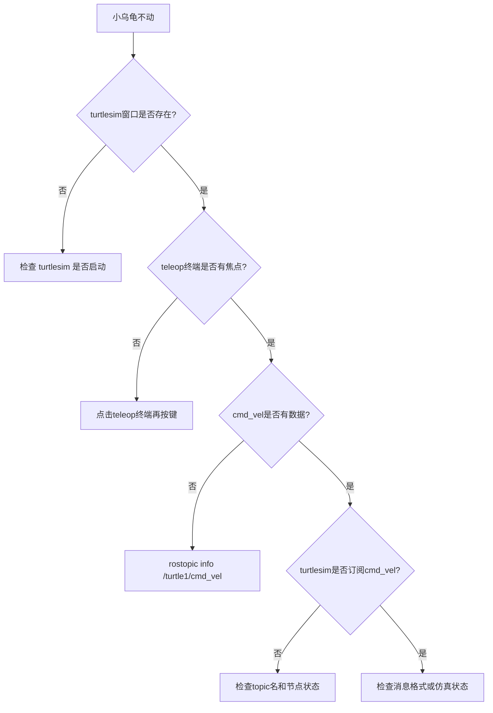

## 4.11 本章自测

1. 为什么 turtlesim 适合作为第一个 ROS 系统？
2. `/turtle1/cmd_vel` 和 `/turtle1/pose` 分别代表命令还是反馈？
3. `rostopic type` 和 `rosmsg show` 的区别是什么？
4. `rostopic pub -1` 和 `rostopic pub -r 10` 的区别是什么？
5. 如果 `rqt_graph` 看不到 teleop 和 turtlesim 的连接，你会先查哪些命令？
6. 为什么 teleop 节点不需要知道 turtlesim 内部代码？
7. `rosnode info` 中 Publications 和 Subscriptions 分别代表什么？
8. 如果 `rostopic echo /turtle1/cmd_vel` 有数据但小乌龟不动，可能是什么原因？
9. 为什么 `rostopic info` 有时比 `rostopic echo` 更适合作为第一步排查？
10. turtlesim 中学到的观察方法如何迁移到移动机器人？

### 参考答案

1. turtlesim 足够小，启动快、依赖少、现象直观，同时包含节点、topic、message、service、参数和 rqt_graph 等 ROS 核心观察对象。它把真实机器人中的“控制输入”和“状态反馈”简化成小乌龟运动，适合初学者先理解 ROS 计算图，而不是一开始面对复杂硬件和仿真。

2. `/turtle1/cmd_vel` 是命令输入，通常由 teleop 或手动 `rostopic pub` 发布，告诉小乌龟期望速度；`/turtle1/pose` 是状态反馈，由 turtlesim 节点发布，描述当前位姿和速度信息。真实移动机器人中，类似关系是 `/cmd_vel` 作为控制输入，`/odom` 作为运动反馈。

3. `rostopic type /turtle1/cmd_vel` 只告诉你 topic 使用的消息类型，例如 `geometry_msgs/Twist`；`rosmsg show geometry_msgs/Twist` 会展开这个类型的字段结构，例如 `linear.x`、`angular.z`。前者解决“这条 topic 是什么类型”，后者解决“这个类型里有哪些字段”。

4. `rostopic pub -1` 只发布一次消息，适合测试单次命令是否能被接收；`rostopic pub -r 10` 以 10 Hz 持续发布，适合模拟持续控制输入。速度控制通常需要持续发布，因为很多机器人或仿真系统会在命令停止后逐渐停止或触发安全机制。

5. 先查 `rosnode list` 确认 teleop 和 turtlesim 节点是否存在，再查 `rostopic list` 确认 `/turtle1/cmd_vel` 是否存在，接着用 `rostopic info /turtle1/cmd_vel` 看 publisher 和 subscriber 是否连接。必要时用 `rostopic echo /turtle1/cmd_vel` 判断是否真的有速度数据。

6. teleop 节点只需要知道自己向哪个 topic 发布什么消息类型，不需要知道 turtlesim 内部如何更新画面。ROS 的发布订阅模型通过 topic 和 message 解耦节点实现。真实机器人中，键盘控制节点也不需要知道底盘驱动内部如何控制电机，只需要按约定发布 `/cmd_vel`。

7. Publications 表示该节点发布了哪些 topic，即它向外输出哪些数据；Subscriptions 表示该节点订阅了哪些 topic，即它依赖哪些输入数据。对 turtlesim 来说，它订阅 `/turtle1/cmd_vel` 并发布 `/turtle1/pose`，这能直接说明它的输入和输出边界。

8. 可能原因包括：发布的是零速度、消息字段不符合预期、turtlesim 节点没有订阅同一个 topic、节点卡住或窗口未响应、topic 命名空间不一致。排查顺序应先看 `rostopic info /turtle1/cmd_vel` 是否有 turtlesim 作为 subscriber，再看 echo 出来的速度值是否非零。

9. `rostopic info` 能快速告诉你 topic 类型、发布者和订阅者，比 `echo` 更适合判断连接关系。`echo` 只能看数据流，如果没有输出，你还不知道是没有 publisher、没有 subscriber、topic 名错，还是发布频率太低。第一步看 info，可以先确定系统结构。

10. 把 `/turtle1/cmd_vel` 对应到移动机器人的 `/cmd_vel`，把 `/turtle1/pose` 对应到 `/odom` 或机器人状态，把 turtlesim 节点对应到底盘或仿真节点。迁移后的观察顺序仍然是：`rosnode list` 看节点，`rostopic list` 看接口，`rostopic info` 看连接，`rostopic echo/hz` 看数据，`rqt_graph` 看整体关系。

## 4.12 本章小结

本章完成了第一个可观察 ROS 系统。你不只是运行了一个 demo，而是学会了观察 ROS 系统的基本顺序：

1. `rosnode list` 看节点。
2. `rostopic list` 看话题。
3. `rostopic info` 看发布者和订阅者。
4. `rostopic type` 看消息类型。
5. `rosmsg show` 看消息结构。
6. `rostopic echo` 看数据。
7. `rostopic pub` 手动构造数据。
8. `rqt_graph` 看节点关系。

后续进入 catkin、Python、C++ 和移动机器人系统时，这套方法仍然适用。真正的 ROS 入门，不是会启动 turtlesim，而是能从 turtlesim 中读出系统结构。

## 延伸阅读

- ROS Tutorials：https://mirror.umd.edu/roswiki/ROS%282f%29Tutorials.html
- ros_tutorials 仓库：https://github.com/ros/ros_tutorials
- ROS Topics：https://mirror.umd.edu/roswiki/Topics.html
- A Gentle Introduction to ROS：https://jokane.net/agitr/

---

# 第 5 章 catkin 工作空间与功能包

## 本章解决什么问题

前面你已经能启动 `roscore`、运行 `turtlesim`、观察节点和 topic。到这里为止，你更多是在“使用别人写好的 ROS 包”。本章开始解决一个更工程化的问题：自己的 ROS 代码应该放在哪里，怎样让 ROS 找到它，怎样声明它依赖了哪些库，怎样让 Python 脚本和 C++ 程序都能被 `rosrun`、`roslaunch` 正确启动。

ROS 项目不是随便放几个脚本就结束。一个可维护的 ROS1 项目通常由工作空间、功能包、依赖声明、构建规则、运行配置和数据文件共同组成。catkin 就是 ROS1 Noetic 中最常用的包构建系统，它把 CMake、Python 包、消息生成、依赖查找和 ROS 环境叠加组织到一套约定中。

初学者大量错误都发生在这里：包不在 `src/`、在错误目录执行 `catkin_make`、忘记 source 工作空间、依赖没有写进 `package.xml`、C++ 文件写好了但没有加入 `CMakeLists.txt`、用 `sudo` 把工作空间权限弄坏。本章的目标不是让你机械记命令，而是让你知道每条命令改变了什么目录、文件或环境变量。

## 学完以后你应该能做到

- 创建标准 catkin 工作空间。
- 创建 `beginner_tutorials` 功能包。
- 解释 `src/`、`build/`、`devel/` 的作用。
- 解释 `package.xml` 和 `CMakeLists.txt` 分别负责什么。
- 使用 `catkin_make` 编译工作空间。
- 使用 `source ~/catkin_ws/devel/setup.bash` 让当前终端识别自己的包。
- 使用 `rospack find`、`roscd`、`rospack depends1` 检查包和依赖。
- 判断常见 catkin 错误属于路径问题、环境问题、依赖问题还是 CMake 规则问题。

## 5.1 本章在全书中的位置

第 2-4 章解决的是“看懂 ROS 系统”。本章开始解决“创建 ROS 项目”。从这一章开始，你写下的每一段代码都应该放进功能包，而不是散落在桌面、下载目录或任意文件夹。

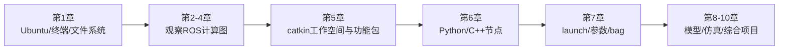

这条主线有一个非常实际的原因：如果工作空间和功能包没有组织好，第 6 章的代码即使写对，也可能因为 ROS 找不到包、CMake 没有编译目标、环境变量没有叠加而无法运行。

## 5.2 必须理解的概念

| 概念 | 简明定义 | 容易误解的点 |
|---|---|---|
| 工作空间 | 一组 ROS 包的源码、构建结果和开发环境集合 | 不是所有文件夹都自动是工作空间 |
| 源码空间 `src/` | 放功能包源码的目录 | 功能包通常要放在这里，而不是工作空间根目录 |
| 构建空间 `build/` | CMake 和编译器生成中间文件的目录 | 通常不手动编辑，不应提交进教材示例项目 |
| 开发空间 `devel/` | 编译后生成的可运行开发环境 | `source devel/setup.bash` 后当前终端才能识别本工作空间 |
| 功能包 package | ROS 代码复用、依赖声明和运行入口的基本单位 | 一个文件夹里不能随便嵌套多个 ROS 包 |
| `package.xml` | 包的元信息和依赖清单 | 不是说明文档，它会影响依赖解析和发布 |
| `CMakeLists.txt` | 构建规则文件 | C++ 源码不会被自动编译，必须写构建规则 |
| 环境覆盖 overlay | 后 source 的工作空间叠加在前面的 ROS 环境上 | source 只影响当前 shell，除非写入 `.bashrc` |

这些概念必须连起来理解，而不是分开背。一个功能包从“磁盘上的文件夹”变成“ROS 能找到并运行的组件”，至少经历四个状态变化：

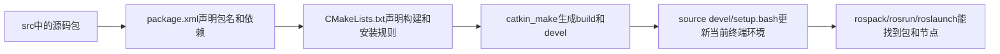

这条链路能解释大量新手错误。包已经在 `src/` 里，不代表当前终端能找到它；`catkin_make` 成功，不代表新开的终端已经加载了 `devel/setup.bash`；Python 脚本放在包里，不代表它自动有执行权限；C++ 源码写好了，不代表 CMake 会自动编译它。每当出现“找不到包、找不到节点、编译没生成可执行文件”时，都要沿着这条链路检查，而不是把所有问题都归为 catkin 出错。

## 5.3 工作空间是什么

工作空间可以理解为“一个 ROS 项目的工程根目录”。官方 catkin 教程给出的典型结构是：

```text
catkin_ws/
  src/
    CMakeLists.txt
    package_1/
      CMakeLists.txt
      package.xml
    package_2/
      CMakeLists.txt
      package.xml
```

在实际使用 `catkin_make` 之后，工作空间会变成：

```text
catkin_ws/
  src/
    beginner_tutorials/
      CMakeLists.txt
      package.xml
  build/
  devel/
```

这三个目录的职责完全不同：

| 目录 | 谁创建 | 放什么 | 初学者应不应该手动改 |
|---|---|---|---|
| `src/` | 你创建 | 功能包源码 | 应该，主要编辑这里 |
| `build/` | `catkin_make` 创建 | CMake 缓存、编译中间文件 | 通常不应该 |
| `devel/` | `catkin_make` 创建 | 开发环境、setup 文件、生成的可执行入口 | 通常不应该 |

`src/` 是你的源码空间。`build/` 和 `devel/` 是构建工具根据源码生成的结果。很多新手把 `build/` 或 `devel/` 当成源码目录编辑，这是错误的。真正应该纳入写作、版本管理和讲解的是功能包源码目录。

## 5.4 catkin 的工作流程

catkin 不是单独替代 CMake，而是建立在 CMake 之上的 ROS 包构建体系。它把多个功能包的依赖关系、消息生成、库链接和环境叠加组织起来。

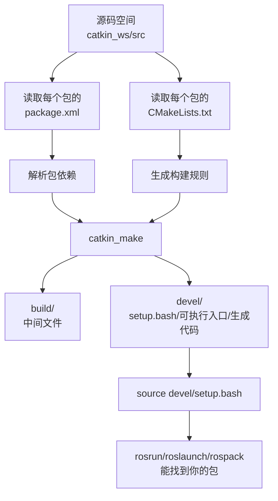

这张图解释了为什么 “写了代码” 不等于 “ROS 能运行代码”：

- ROS 要找到包，需要包在环境变量指向的路径下。
- C++ 节点要能运行，需要 CMake 真的编译出可执行文件。
- 自定义消息或服务要能导入，需要先生成代码。
- 修改包结构或构建规则后，通常要重新 `catkin_make` 并重新 source。

## 5.5 功能包是什么

ROS package 是 ROS 代码组织和复用的基本单位。一个包可以包含：

- Python 脚本。
- C++ 源码。
- launch 文件。
- msg/srv/action 定义。
- URDF 模型。
- YAML 参数。
- RViz 配置。
- 测试文件和文档。

一个 catkin 包至少需要两个文件：

```text
my_package/
  package.xml
  CMakeLists.txt
```

`package.xml` 说明“这个包是谁、做什么、依赖谁”。`CMakeLists.txt` 说明“这个包怎样构建、生成什么、链接哪些库”。前者更像包清单，后者更像构建配方。

官方教程特别强调：每个包必须有自己的文件夹，不能把多个 ROS 包塞进同一个目录，也不能把包随意嵌套在另一个包里面。因为 ROS 工具会从文件系统结构推断包边界，边界混乱会直接导致 `rospack`、`catkin_make` 和依赖解析异常。

## 5.6 创建工作空间

### 前置条件

已经安装 ROS Noetic，并且当前终端加载了 ROS 环境：

```bash
source /opt/ros/noetic/setup.bash
echo $ROS_DISTRO
```

正确输出：

```text
noetic
```

如果这里不是 `noetic`，先回到第 3 章检查安装和 `.bashrc`。

### 操作步骤

创建工作空间源码目录：

```bash
mkdir -p ~/catkin_ws/src
```

解释：

- `~` 表示当前用户的家目录。
- `catkin_ws` 是工作空间根目录，名字可以改，但初学阶段建议保持这个名字。
- `src` 是源码空间，后续功能包放在这里。
- `-p` 表示上级目录不存在时一并创建，目录已存在也不报错。

进入工作空间根目录并编译一次空工作空间：

```bash
cd ~/catkin_ws
catkin_make
```

这一步会生成 `build/` 和 `devel/`。即使 `src/` 里还没有功能包，先编译一次也有意义，因为它会生成 `devel/setup.bash`。

观察目录结构：

```bash
ls
```

正确现象：

```text
build  devel  src
```

如果安装了 `tree`，可以看得更清楚：

```bash
tree -L 2 ~/catkin_ws
```

没有 `tree` 时可安装：

```bash
sudo apt update
sudo apt install -y tree
```

## 5.7 source 工作空间到底做了什么

运行：

```bash
source ~/catkin_ws/devel/setup.bash
```

这不是“启动 ROS”。它是在当前终端中加载这个工作空间生成的环境设置。加载以后，ROS 工具才知道你的工作空间也属于 ROS 包搜索路径的一部分。

可以用下面命令观察变化：

```bash
echo $ROS_PACKAGE_PATH
echo $CMAKE_PREFIX_PATH
```

典型现象是：`ROS_PACKAGE_PATH` 中会出现类似路径：

```text
/home/你的用户名/catkin_ws/src:/opt/ros/noetic/share
```

这说明当前终端查找 ROS 包时，会先看你的工作空间源码空间，再看系统安装的 `/opt/ros/noetic/share`。这就是环境覆盖。

```mermaid
flowchart LR
  A[/opt/ros/noetic/setup.bash<br/>系统ROS环境] --> B[ROS能找到官方包]
  B --> C[~/catkin_ws/devel/setup.bash<br/>叠加你的工作空间]
  C --> D[ROS能找到官方包 + 你的包]
```

要让新终端自动加载，可以把 source 写入 `.bashrc`：

```bash
echo "source /opt/ros/noetic/setup.bash" >> ~/.bashrc
echo "source ~/catkin_ws/devel/setup.bash" >> ~/.bashrc
source ~/.bashrc
```

这里的顺序很重要。通常先加载系统 ROS，再加载自己的工作空间。后者叠加在前者之上。

注意：`source` 只影响当前 shell。你在终端 A 中 source，不会让已经打开的终端 B 自动获得同样环境。很多“为什么这个终端能运行，另一个终端不能运行”的问题，本质就是 shell 环境不同。

## 5.8 创建第一个功能包

进入源码空间：

```bash
cd ~/catkin_ws/src
```

创建包：

```bash
catkin_create_pkg beginner_tutorials std_msgs rospy roscpp
```

解释：

- `beginner_tutorials` 是包名。
- `std_msgs` 是标准消息包，本书先用 `std_msgs/String` 做最小通信例子。
- `rospy` 是 Python 客户端库。
- `roscpp` 是 C++ 客户端库。

官方 Beginner Tutorials 也使用 `beginner_tutorials` 这个包名。教材沿用它，是为了让学生能直接对照 ROS Wiki、书籍和社区问题。

观察包结构：

```bash
tree beginner_tutorials
```

你应看到：

```text
beginner_tutorials
├── CMakeLists.txt
└── package.xml
```

这说明包已经被创建，但还没有经过工作空间编译。下一步必须回到工作空间根目录。

## 5.9 编译工作空间

回到工作空间根目录：

```bash
cd ~/catkin_ws
catkin_make
source ~/catkin_ws/devel/setup.bash
```

这里有两个动作：

1. `catkin_make` 读取 `src/` 下所有包的 `package.xml` 和 `CMakeLists.txt`，生成构建结果。
2. `source devel/setup.bash` 把新的构建结果叠加进当前终端环境。

验证包是否可见：

```bash
rospack find beginner_tutorials
```

正确输出类似：

```text
/home/你的用户名/catkin_ws/src/beginner_tutorials
```

进入包目录：

```bash
roscd beginner_tutorials
pwd
```

如果 `roscd` 找不到包，不要直接怀疑 ROS 坏了，先按下面顺序检查：

```bash
pwd
ls ~/catkin_ws/src
echo $ROS_PACKAGE_PATH
source ~/catkin_ws/devel/setup.bash
rospack find beginner_tutorials
```

## 5.10 理解 `package.xml`

打开：

```bash
roscd beginner_tutorials
cat package.xml
```

核心字段如下：

| 字段 | 作用 | 初学阶段怎么写 |
|---|---|---|
| `<name>` | 包名 | 必须和包目录语义一致 |
| `<version>` | 版本号 | 教学包可用 `0.0.0` 或 `0.1.0` |
| `<description>` | 包说明 | 不要空泛，应说明包做什么 |
| `<maintainer>` | 维护者 | 至少一个，带邮箱 |
| `<license>` | 许可证 | 教学可使用 BSD/MIT 等常见许可证 |
| `<buildtool_depend>` | 构建工具依赖 | catkin 包通常依赖 `catkin` |
| `<build_depend>` | 编译时依赖 | C++ 编译、消息生成需要 |
| `<exec_depend>` | 运行时依赖 | 运行节点时需要 |

初学阶段最容易忽略的是依赖声明。代码里用了某个包，但 `package.xml` 里没有声明，可能在你自己的电脑上“侥幸能跑”，换到干净环境、课堂机器或 CI 就失败。

查看直接依赖：

```bash
rospack depends1 beginner_tutorials
```

查看递归依赖：

```bash
rospack depends beginner_tutorials
```

直接依赖是你这个包明确依赖的包；递归依赖包含依赖的依赖。理解这个区别很重要：教材示例代码通常只要求你声明直接依赖，不要求把所有递归依赖都手动写进 `package.xml`。

## 5.11 理解 `CMakeLists.txt`

`CMakeLists.txt` 决定如何构建包。Python 脚本通常不需要编译，但 C++ 节点、自定义消息、自定义服务、库文件和安装规则都要通过它组织。

初学时先理解几个关键片段：

```cmake
find_package(catkin REQUIRED COMPONENTS
  roscpp
  rospy
  std_msgs
)
```

这表示构建本包时需要找到 catkin，以及 `roscpp`、`rospy`、`std_msgs` 这些 ROS 组件。

```cmake
catkin_package()
```

这会声明本包对外暴露的 catkin 包信息。后续涉及消息、服务或库时，这里可能要补 `CATKIN_DEPENDS`、`INCLUDE_DIRS`、`LIBRARIES` 等信息。

```cmake
include_directories(
  ${catkin_INCLUDE_DIRS}
)
```

这告诉 C++ 编译器到哪里找 ROS 头文件。

第 6 章写 C++ 节点时，会添加：

```cmake
add_executable(cpp_talker src/talker.cpp)
target_link_libraries(cpp_talker ${catkin_LIBRARIES})
```

如果你写了 `src/talker.cpp` 却没有 `add_executable`，`catkin_make` 不会自动知道要编译它。CMake 不会“猜测你的意图”。

Python 脚本在开发空间中可以直接通过执行权限运行；更规范的安装写法是：

```cmake
catkin_install_python(PROGRAMS
  scripts/talker.py
  scripts/listener.py
  DESTINATION ${CATKIN_PACKAGE_BIN_DESTINATION}
)
```

本书前期为了降低门槛，先使用 `chmod +x scripts/*.py` 和 `rosrun`。到综合项目阶段，再逐步强调安装规则和可发布性。

## 5.12 `catkin_make`、`catkin build` 和 `catkin_make_isolated`

ROS1 教材和官方 Beginner Tutorials 最常见的是 `catkin_make`。本书也以它为主线，因为它对零基础学生最直接：

```bash
cd ~/catkin_ws
catkin_make
```

你还可能在网上看到：

| 命令 | 来源 | 适用场景 | 本书态度 |
|---|---|---|---|
| `catkin_make` | ROS 官方基础教程常用 | 初学、单一工作空间、小型项目 | 主线 |
| `catkin build` | `catkin_tools` 提供 | 包较多、需要更强构建控制 | 进阶了解 |
| `catkin_make_isolated` | catkin/源码构建常见 | 隔离构建复杂包或源码构建 | 后续高级内容 |

初学阶段不要在同一个工作空间里频繁混用这些工具。不同工具会生成不同的构建目录和配置文件，混用后错误更难定位。除非教师明确要求，本书前半部分统一使用 `catkin_make`。

## 5.13 推荐包目录结构

本书后续建议把 `beginner_tutorials` 扩展成：

```text
beginner_tutorials/
  CMakeLists.txt
  package.xml
  scripts/
    talker.py
    listener.py
  src/
    talker.cpp
    listener.cpp
  launch/
    chatter.launch
  config/
    chatter.yaml
  msg/
  srv/
```

解释：

| 目录 | 放什么 | 后续章节 |
|---|---|---|
| `scripts/` | Python 可执行脚本 | 第 6 章 |
| `src/` | C++ 源文件 | 第 6 章 |
| `launch/` | `.launch` 启动文件 | 第 7 章 |
| `config/` | YAML 参数文件 | 第 7 章 |
| `msg/` | 自定义消息 | 后续扩展 |
| `srv/` | 自定义服务 | 第 6 章 |

创建目录：

```bash
roscd beginner_tutorials
mkdir -p scripts src launch config msg srv
tree -L 2
```

不要把所有文件都堆在包根目录。目录分层不是形式主义，它能让后续 `roslaunch`、RViz 配置、参数文件、模型文件和源码分工明确。

## 5.14 最小可运行实验

### 实验目标

从零创建工作空间和功能包，并验证 ROS 能找到该包。完成后你应该能解释每一步命令改变了什么。

### 前置条件

- Ubuntu 20.04。
- ROS Noetic 已安装。
- 当前终端使用 Bash。

### 操作步骤

```bash
source /opt/ros/noetic/setup.bash
echo $ROS_DISTRO

mkdir -p ~/catkin_ws/src
cd ~/catkin_ws
catkin_make
source ~/catkin_ws/devel/setup.bash

cd ~/catkin_ws/src
catkin_create_pkg beginner_tutorials std_msgs rospy roscpp

cd ~/catkin_ws
catkin_make
source ~/catkin_ws/devel/setup.bash

rospack find beginner_tutorials
rospack depends1 beginner_tutorials
roscd beginner_tutorials
mkdir -p scripts src launch config msg srv
tree -L 2
```

### 正确现象

- `echo $ROS_DISTRO` 输出 `noetic`。
- `catkin_ws` 下存在 `src/`、`build/`、`devel/`。
- `beginner_tutorials` 下存在 `package.xml` 和 `CMakeLists.txt`。
- `rospack find beginner_tutorials` 输出包路径。
- `rospack depends1 beginner_tutorials` 输出 `roscpp`、`rospy`、`std_msgs`。
- `tree -L 2` 能看到 `scripts/`、`src/`、`launch/`、`config/`、`msg/`、`srv/`。

### 实验复盘

| 你做了什么 | 系统发生了什么 | 用什么验证 |
|---|---|---|
| `mkdir -p ~/catkin_ws/src` | 创建工作空间源码空间 | `ls ~/catkin_ws` |
| `catkin_make` | 生成 `build/` 和 `devel/` | `ls ~/catkin_ws` |
| `source devel/setup.bash` | 当前终端叠加工作空间环境 | `echo $ROS_PACKAGE_PATH` |
| `catkin_create_pkg` | 创建包清单和构建规则 | `tree beginner_tutorials` |
| 第二次 `catkin_make` | 工作空间重新识别新包 | `rospack find beginner_tutorials` |
| `mkdir -p scripts src ...` | 建立后续章节所需目录 | `tree -L 2` |

## 5.15 高频错误与排查

| 现象 | 高概率原因 | 第一检查命令 | 修复思路 |
|---|---|---|---|
| `rospack find beginner_tutorials` 找不到 | 未 source 工作空间 | `echo $ROS_PACKAGE_PATH` | `source ~/catkin_ws/devel/setup.bash` |
| `catkin_make` 报不是工作空间 | 在包目录或 `src/` 下执行 | `pwd` | 回到 `~/catkin_ws` |
| 包创建在错误位置 | 不在 `~/catkin_ws/src` 下 | `pwd`; `tree ~/catkin_ws -L 3` | 移到 `src/` 下后重新编译 |
| C++ 节点编译后找不到 | 未在 CMake 中添加可执行文件 | `grep add_executable CMakeLists.txt` | 添加 `add_executable` 和 `target_link_libraries` |
| 修改 `.bashrc` 后没效果 | 当前终端未重新加载 | `tail ~/.bashrc` | `source ~/.bashrc` 或开新终端 |
| 工作空间文件属于 root | 曾用 `sudo` 编译或创建文件 | `ls -l ~/catkin_ws` | 修复所有者，避免在工作空间用 `sudo` |
| 改了 `package.xml` 但错误还在 | 没重新编译或没重新 source | `catkin_make`; `echo $ROS_PACKAGE_PATH` | 编译后重新 source |

### 排障树

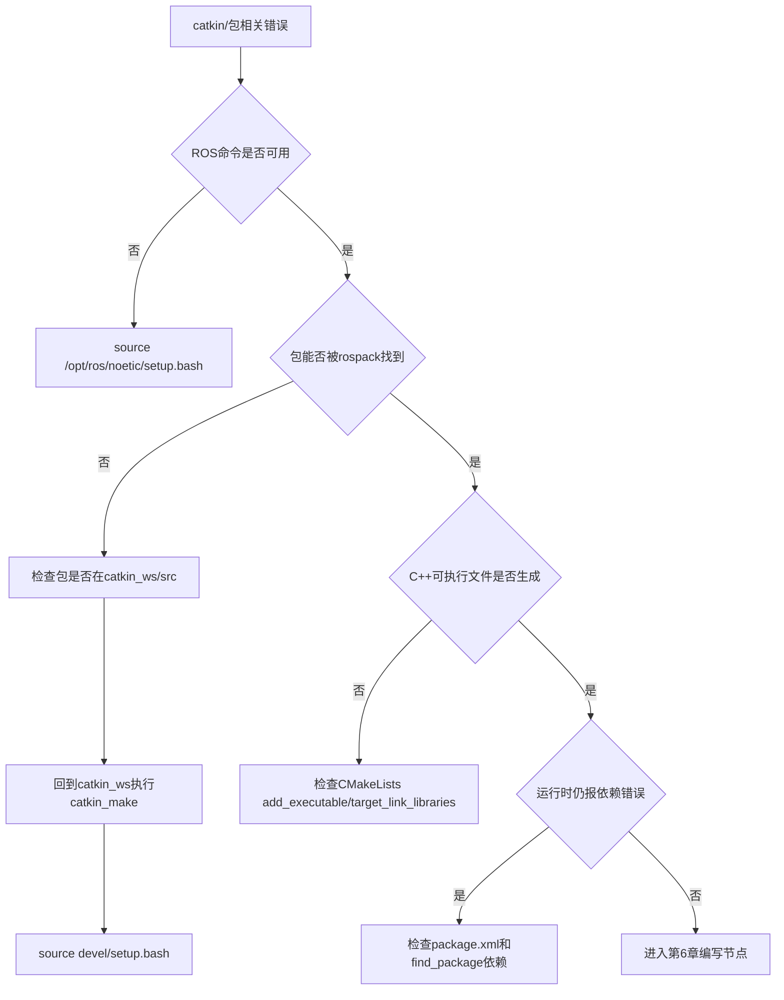

## 5.16 本章自测

1. 工作空间和功能包是什么关系？
2. 为什么功能包应放在 `~/catkin_ws/src` 下？
3. `catkin_make` 应该在哪个目录执行？为什么？
4. `package.xml` 和 `CMakeLists.txt` 分别解决什么问题？
5. `build/` 和 `devel/` 是谁生成的？为什么不应该把主要源码放进去？
6. 为什么 Python 节点通常不需要像 C++ 那样编译？
7. `source /opt/ros/noetic/setup.bash` 和 `source ~/catkin_ws/devel/setup.bash` 有什么关系？
8. 如果 `rospack find` 找不到包，你会按什么顺序排查？
9. 直接依赖和递归依赖有什么区别？
10. 为什么初学阶段不建议在同一个工作空间混用 `catkin_make` 和 `catkin build`？

### 参考答案

1. 工作空间是一组 ROS 包的工程环境，包含源码空间 `src/`、构建结果 `build/` 和开发环境 `devel/`。功能包是工作空间中的基本代码单元，每个包有自己的 `package.xml` 和 `CMakeLists.txt`。可以把工作空间理解为“项目容器”，把功能包理解为“可复用模块”。

2. catkin 约定工作空间的源码空间是 `catkin_ws/src`，`catkin_make` 会扫描这里的包并按依赖构建。包放在其他任意目录中，ROS 工具不一定能找到，`rospack find`、`roscd`、`catkin_make` 都可能失效。遵守目录约定能让教程、工具和排障方法保持一致。

3. `catkin_make` 应该在工作空间根目录执行，也就是包含 `src/` 的 `~/catkin_ws`。它需要从根目录读取源码空间，生成 `build/` 和 `devel/`。如果在包目录或 `src/` 目录执行，catkin 可能无法识别工作空间结构，出现“不是 catkin 工作空间”或生成结果位置错误。

4. `package.xml` 负责包的元信息和依赖声明，例如包名、维护者、许可证、构建依赖和运行依赖；`CMakeLists.txt` 负责构建规则，例如查找依赖、生成消息、编译 C++ 可执行文件、链接库。前者回答“这个包依赖谁”，后者回答“这个包怎么构建”。

5. `build/` 和 `devel/` 都由 `catkin_make` 生成。`build/` 存放 CMake 缓存和编译中间文件，`devel/` 存放开发环境和生成后的可运行入口。它们是构建产物，不是源码；把主要源码放进去会导致清理构建目录时丢失代码，也不符合 ROS 项目结构。

6. Python 是解释型语言，ROS 中的 Python 节点通常只需要脚本有正确 shebang 和执行权限，运行时由 Python 解释器执行。C++ 需要先编译成机器码并链接 ROS 库，所以必须在 `CMakeLists.txt` 中添加 `add_executable` 和 `target_link_libraries`。这也是 C++ 节点比 Python 多一步构建规则的原因。

7. `/opt/ros/noetic/setup.bash` 加载系统安装的 ROS Noetic 环境，`~/catkin_ws/devel/setup.bash` 在此基础上叠加自己的工作空间。通常先 source 系统 ROS，再 source 工作空间。后者让当前终端能找到你自己写的包，同时仍能使用 `/opt/ros/noetic` 中的官方包。

8. 先查包是否真的在 `~/catkin_ws/src` 下；再回到 `~/catkin_ws` 执行 `catkin_make`；然后 `source ~/catkin_ws/devel/setup.bash`；最后检查 `echo $ROS_PACKAGE_PATH` 和 `rospack find 包名`。如果仍找不到，再检查包名是否拼错、`package.xml` 是否存在、是否把包嵌套在另一个包中。

9. 直接依赖是当前包在 `package.xml` 中明确声明、代码直接使用的包，例如 `rospy`、`roscpp`、`std_msgs`。递归依赖包含“依赖的依赖”，数量通常更多。编写包清单时重点声明直接依赖，不应把所有递归依赖都无脑写进去。

10. `catkin_make` 和 `catkin build` 使用不同的构建工具链和构建目录习惯，混用会产生缓存、构建空间和配置不一致的问题。零基础阶段排障能力还弱，统一使用 `catkin_make` 可以让错误路径更少。等理解 catkin 工作空间后，再学习 `catkin_tools` 更合适。

## 5.17 本章小结

本章建立了 ROS1 工程组织的基本骨架。后续所有代码都应放进工作空间和功能包中，而不是散落在任意目录。

记住四个原则：

- 包放在 `src/`。
- 编译在工作空间根目录。
- 运行前 source `devel/setup.bash`。
- 依赖写进 `package.xml` 和 `CMakeLists.txt`。

真正理解 catkin，不是记住 `catkin_make`，而是知道一个包从“源码文件夹”变成“ROS 能找到、能构建、能运行的系统组件”经历了哪些状态变化。掌握这一点，第 6 章写 Python/C++ 节点时就不会被工程结构卡住。

进入下一章前，建议用下面的自我验收清单检查一次：

- 在任意新终端中，能说明为什么要先 `source /opt/ros/noetic/setup.bash` 或 `source ~/catkin_ws/devel/setup.bash`。
- 在 `~/catkin_ws` 根目录下，能解释 `src/`、`build/`、`devel/` 分别由谁创建、是否应该手动编辑、是否应该提交。
- 能用 `rospack find beginner_tutorials` 判断包是否对当前终端可见。
- 能解释为什么 C++ 节点必须写 `add_executable` 和 `target_link_libraries`，而 Python 节点更常见的问题是执行权限和 shebang。
- 能说出依赖为什么要同时考虑 `package.xml` 和 `CMakeLists.txt`，而不是只在一个文件里随便写。

## 延伸阅读

- ROS Tutorials 总目录：https://mirror.umd.edu/roswiki/ROS%282f%29Tutorials.html
- ROS catkin 创建包教程：https://mirror.umd.edu/roswiki/ROS%282f%29Tutorials%282f%29catkin%282f%29CreatingPackage.html
- catkin 官方仓库：https://github.com/ros/catkin
- catkin_tools 文档：https://catkin-tools.readthedocs.io/en/latest/
- A Gentle Introduction to ROS：https://jokane.net/agitr/

---

# 第 6 章 Python 与 C++ 编写 ROS 节点

## 本章解决什么问题

前面你已经能创建工作空间和功能包。本章开始自己写 ROS 节点。节点是 ROS 系统里真正执行计算的进程：发布者产生数据，订阅者消费数据，服务端处理请求，客户端发出请求。

本章采用“同一个通信思想，Python 和 C++ 各实现一遍”的方式。先用 Python 建立通信直觉，再用 C++ 理解编译、链接和类型约束。这样安排不是说 Python 比 C++ 更重要，而是为了避免初学者同时被 ROS 通信、CMake、头文件、链接错误和类型系统淹没。

本章的核心目标不是背 API，而是理解一个 ROS 节点最基本的生命周期：初始化节点、创建通信接口、循环发布或等待回调、输出日志、在 ROS 关闭时退出。你还要学会用 CLI 验证自己的程序是否真的进入 ROS 计算图。

## 学完以后你应该能做到

- 用 `rospy` 写发布者和订阅者。
- 用 `roscpp` 写发布者和订阅者。
- 用 Python 和 C++ 各写一个最小 service server/client。
- 理解 `init_node`、Publisher、Subscriber、callback、Rate、spin。
- 用 `rosnode`、`rostopic`、`rosservice`、`rosmsg`、`rossrv` 观察自己写的节点和接口。
- 修改 `package.xml` 和 `CMakeLists.txt` 支持 C++ 节点与自定义服务。
- 根据错误信息判断是 Python 权限问题、C++ 编译问题、消息生成问题、topic 名问题还是环境问题。

## 6.1 本章在全书中的位置

第 5 章解决“代码放在哪里、怎样构建”。本章解决“代码怎样成为 ROS 计算图中的节点”。第 7 章会继续把这些节点组织成可复现实验。

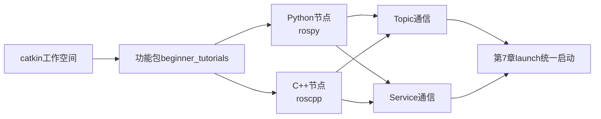

你应该把本章看成 ROS 编程的最低闭环：写代码、编译或授权、运行节点、观察图、定位错误。

## 6.2 必须理解的概念

| 概念 | 简明定义 | 容易误解的点 |
|---|---|---|
| 节点 | 参与 ROS 计算图的进程 | 不是每个 Python/C++ 文件自动就是 ROS 节点 |
| 发布者 Publisher | 向 topic 写消息的对象 | 发布者不直接调用订阅者函数 |
| 订阅者 Subscriber | 从 topic 接收消息并触发回调的对象 | 回调什么时候执行由 ROS 通信和事件循环决定 |
| 回调 callback | 数据到达后被调用的函数 | 回调内不应做长时间阻塞工作 |
| `Rate` | 控制循环频率的工具 | 它不是实时控制保证，只是循环节奏控制 |
| `spin` | 让节点进入回调处理循环 | 没有 `spin`，订阅节点可能启动后立刻退出 |
| Service | 一次请求、一次响应的通信接口 | 不适合高频连续数据流 |
| 消息/服务生成 | 根据 `.msg`、`.srv` 文件生成语言绑定代码 | 修改 `.srv` 后必须重新编译并 source |

## 6.3 Python 和 C++ 怎么选

本书两个都讲。原因不是为了增加负担，而是因为 ROS1 生态中两者都常见。

| 维度 | Python `rospy` | C++ `roscpp` |
|---|---|---|
| 上手速度 | 快，适合初学和原型 | 慢，需要编译和 CMake |
| 性能 | 通常低于 C++ | 更适合高频、低延迟、计算密集任务 |
| 错误类型 | 运行时报错、权限、解释器、缩进 | 编译、链接、头文件、类型不匹配 |
| 常见用途 | 实验脚本、配置节点、数据处理原型 | 控制、驱动、实时性更高的模块 |
| 本章目标 | 建立通信直觉 | 理解工程构建与类型约束 |

初学时不要把“Python 能跑”误解为“ROS 工程只需要 Python”，也不要把“C++ 更快”误解为“所有节点都必须用 C++”。真正的工程选择取决于频率、延迟、硬件接口、团队维护能力和项目规模。

## 6.4 发布订阅模型回顾

发布订阅模型里，发布者不直接调用订阅者函数。发布者只把消息发到某个 topic；订阅者声明自己对某个 topic 感兴趣。ROS Master 负责注册和发现，节点之间建立连接后传输消息。

本章先使用：

- topic：`/chatter`
- message：`std_msgs/String`
- Python 发布者：`talker.py`
- Python 订阅者：`listener.py`
- C++ 发布者：`cpp_talker`
- C++ 订阅者：`cpp_listener`

```mermaid
sequenceDiagram
  participant T as talker节点
  participant M as ROS Master
  participant L as listener节点
  T->>M: 注册发布 /chatter, 类型 std_msgs/String
  L->>M: 查询/订阅 /chatter
  M-->>L: 返回发布者连接信息
  L->>T: 建立数据连接
  T-->>L: 持续发送 String 消息
```

真实机器人里的 `/scan`、`/odom`、`/cmd_vel` 也是同样思想。区别只是消息类型和频率更复杂。

## 6.5 准备包结构

进入包：

```bash
source ~/catkin_ws/devel/setup.bash
roscd beginner_tutorials
mkdir -p scripts src srv
```

如果 `roscd beginner_tutorials` 失败，回到第 5 章检查工作空间和 source：

```bash
rospack find beginner_tutorials
echo $ROS_PACKAGE_PATH
```

## 6.6 Python 发布者

创建文件：

```bash
nano scripts/talker.py
```

写入：

```python
#!/usr/bin/env python3
from typing import NoReturn

import rospy
from std_msgs.msg import String


def main() -> NoReturn:
    rospy.init_node("talker", anonymous=False)
    pub = rospy.Publisher("chatter", String, queue_size=10)
    rate = rospy.Rate(1.0)
    count = 0

    while not rospy.is_shutdown():
        text = f"hello ros {count}"
        msg = String(data=text)
        pub.publish(msg)
        rospy.loginfo("published: %s", msg.data)
        count += 1
        rate.sleep()

    raise SystemExit


if __name__ == "__main__":
    main()
```

添加执行权限：

```bash
chmod +x scripts/talker.py
```

逐行理解：

| 代码 | 作用 |
|---|---|
| `#!/usr/bin/env python3` | 让系统用 Python 3 运行脚本 |
| `rospy.init_node("talker")` | 把当前进程初始化为 ROS 节点 |
| `rospy.Publisher("chatter", String, queue_size=10)` | 创建向 `chatter` 发布 `String` 消息的发布者 |
| `rospy.Rate(1.0)` | 设置循环目标频率为 1 Hz |
| `while not rospy.is_shutdown()` | ROS 未要求关闭时持续运行 |
| `String(data=text)` | 构造标准字符串消息 |
| `pub.publish(msg)` | 发布消息 |
| `rospy.loginfo(...)` | 写 ROS 日志，进入终端和 `/rosout` |

`queue_size=10` 表示发送队列长度。初学阶段可以先理解为“订阅者或网络短时间跟不上时，发布端最多缓存多少条待发送消息”。队列太小可能丢旧消息，队列太大可能让延迟积累。真实控制系统通常宁可丢旧数据，也不希望处理很久以前的数据。

## 6.7 Python 订阅者

创建文件：

```bash
nano scripts/listener.py
```

写入：

```python
#!/usr/bin/env python3
import rospy
from std_msgs.msg import String


def callback(msg: String) -> None:
    rospy.loginfo("I heard: %s", msg.data)


def main() -> None:
    rospy.init_node("listener", anonymous=False)
    rospy.Subscriber("chatter", String, callback)
    rospy.spin()


if __name__ == "__main__":
    main()
```

添加执行权限：

```bash
chmod +x scripts/listener.py
```

解释：

- `callback` 是收到消息后自动调用的函数。
- `rospy.Subscriber("chatter", String, callback)` 表示订阅 `chatter`，消息类型必须是 `std_msgs/String`。
- `rospy.spin()` 让节点保持运行，等待回调。如果没有它，脚本可能创建订阅者后直接结束。

订阅者本身没有显式循环。它依赖 ROS 的回调机制：数据到达时，`callback` 被调用。

## 6.8 运行 Python 节点

终端 1：

```bash
roscore
```

终端 2：

```bash
source ~/catkin_ws/devel/setup.bash
rosrun beginner_tutorials talker.py
```

终端 3：

```bash
source ~/catkin_ws/devel/setup.bash
rosrun beginner_tutorials listener.py
```

终端 4：

```bash
source ~/catkin_ws/devel/setup.bash
rosnode list
rostopic list
rostopic info /chatter
rostopic echo /chatter
rqt_graph
```

正确现象：

- `talker.py` 每秒打印一条 `published: hello ros N`。
- `listener.py` 打印 `I heard: hello ros N`。
- `rostopic echo /chatter` 能看到 `data: "hello ros N"`。
- `rostopic info /chatter` 显示一个 publisher 和至少一个 subscriber。
- `rqt_graph` 显示 `/talker` 通过 `/chatter` 连接 `/listener`。

如果 `listener.py` 没有输出，先不要改代码，先看图和 topic：

```bash
rostopic info /chatter
rqt_graph
```

这能区分“发布者根本没发布”“订阅者没连上”“topic 名不一致”“消息类型不一致”等不同问题。

## 6.9 C++ 发布者

创建文件：

```bash
nano src/talker.cpp
```

写入：

```cpp
#include "ros/ros.h"
#include "std_msgs/String.h"

#include <sstream>

int main(int argc, char** argv) {
  ros::init(argc, argv, "cpp_talker");
  ros::NodeHandle nh;

  ros::Publisher pub = nh.advertise<std_msgs::String>("chatter_cpp", 10);
  ros::Rate rate(1.0);

  int count = 0;
  while (ros::ok()) {
    std_msgs::String msg;
    std::stringstream ss;
    ss << "hello roscpp " << count;
    msg.data = ss.str();

    pub.publish(msg);
    ROS_INFO("%s", msg.data.c_str());

    ros::spinOnce();
    rate.sleep();
    ++count;
  }

  return 0;
}
```

关键解释：

- `ros::init` 初始化 ROS 节点。
- `ros::NodeHandle nh` 是访问 ROS 通信接口的句柄。
- `nh.advertise<std_msgs::String>("chatter_cpp", 10)` 创建发布者。
- `ros::ok()` 类似 Python 中的 `not rospy.is_shutdown()`。
- `ros::spinOnce()` 处理一次回调。这个发布者暂时没有订阅回调，写上它是为了让你熟悉常见循环结构。
- `ROS_INFO` 是 C++ 里的 ROS 日志宏。

## 6.10 C++ 订阅者

创建文件：

```bash
nano src/listener.cpp
```

写入：

```cpp
#include "ros/ros.h"
#include "std_msgs/String.h"

void chatterCallback(const std_msgs::String::ConstPtr& msg) {
  ROS_INFO("I heard: %s", msg->data.c_str());
}

int main(int argc, char** argv) {
  ros::init(argc, argv, "cpp_listener");
  ros::NodeHandle nh;

  ros::Subscriber sub = nh.subscribe("chatter_cpp", 10, chatterCallback);
  ros::spin();

  return 0;
}
```

解释：

- `ConstPtr&` 表示回调收到的是消息智能指针的常量引用，避免复制较大的消息。
- `nh.subscribe("chatter_cpp", 10, chatterCallback)` 表示订阅 `chatter_cpp`。
- `ros::spin()` 进入回调处理循环。

Python 版本和 C++ 版本通信结构相同，但 C++ 多了编译、链接和头文件约束。写 C++ 节点时，代码正确只是第一步，CMake 规则也必须正确。

## 6.11 修改 `CMakeLists.txt`

打开：

```bash
roscd beginner_tutorials
nano CMakeLists.txt
```

确认 `find_package` 至少包含：

```cmake
find_package(catkin REQUIRED COMPONENTS
  roscpp
  rospy
  std_msgs
)
```

在 `include_directories(...)` 后面或文件中合适位置添加：

```cmake
add_executable(cpp_talker src/talker.cpp)
target_link_libraries(cpp_talker ${catkin_LIBRARIES})

add_executable(cpp_listener src/listener.cpp)
target_link_libraries(cpp_listener ${catkin_LIBRARIES})
```

回到工作空间根目录编译：

```bash
cd ~/catkin_ws
catkin_make
source ~/catkin_ws/devel/setup.bash
```

运行：

```bash
rosrun beginner_tutorials cpp_talker
rosrun beginner_tutorials cpp_listener
```

注意：C++ 节点的可执行名是 `add_executable` 中写的名字，不一定和源文件名完全相同。`rosrun beginner_tutorials cpp_talker` 找的是编译出的可执行文件，不是 `talker.cpp` 文件。

## 6.12 发布订阅实验复盘

| 观察命令 | 你应该看到什么 | 说明什么 |
|---|---|---|
| `rosnode list` | `/talker`、`/listener` 或 `/cpp_talker`、`/cpp_listener` | 节点已加入计算图 |
| `rostopic list` | `/chatter` 或 `/chatter_cpp` | topic 已注册 |
| `rostopic info /chatter` | publishers/subscribers 列表 | 连接关系是否建立 |
| `rostopic echo /chatter` | `data: ...` | 消息正在流动 |
| `rostopic type /chatter` | `std_msgs/String` | topic 消息类型 |
| `rosmsg show std_msgs/String` | `string data` | 消息字段结构 |
| `rqt_graph` | 节点通过 topic 相连 | 计算图结构正确 |

如果你只看终端打印，很容易误判。例如发布者在打印日志，不代表订阅者已经收到；订阅者没输出，也不一定是代码错，可能是 topic 名或类型不一致。CLI 观察是 ROS 编程的一部分。

## 6.13 Service 最小概念

topic 适合持续流动的数据，例如速度、雷达、图像、里程计。Service 适合一次请求、一次响应，例如“两个数相加”“重置仿真”“保存地图”“查询当前状态”。

本章使用最小加法服务：

- service 名：`add_two_ints`
- 请求：`a`、`b`
- 响应：`sum`

```mermaid
sequenceDiagram
  participant C as client节点
  participant M as ROS Master
  participant S as server节点
  S->>M: 注册服务 add_two_ints
  C->>M: 查询服务 add_two_ints
  M-->>C: 返回服务端连接信息
  C->>S: 请求 a=3, b=5
  S-->>C: 响应 sum=8
```

Service 的关键特点是客户端会等待服务端响应。它不适合高频传感器数据，也不适合需要持续反馈和取消的长任务。长任务后续应学习 action。

## 6.14 创建自定义 service

创建 srv 文件：

```bash
roscd beginner_tutorials
mkdir -p srv
nano srv/AddTwoInts.srv
```

写入：

```text
int64 a
int64 b
---
int64 sum
```

`---` 上面是请求，下面是响应。

现在需要修改 `package.xml`。确保有：

```xml
<build_depend>message_generation</build_depend>
<exec_depend>message_runtime</exec_depend>
```

如果 `package.xml` 中已经有 `roscpp`、`rospy`、`std_msgs`，保留它们。

再修改 `CMakeLists.txt`。把 `find_package` 改成包含 `message_generation`：

```cmake
find_package(catkin REQUIRED COMPONENTS
  roscpp
  rospy
  std_msgs
  message_generation
)
```

在 `catkin_package()` 之前添加：

```cmake
add_service_files(
  FILES
  AddTwoInts.srv
)

generate_messages(
  DEPENDENCIES
  std_msgs
)
```

把 `catkin_package()` 改成：

```cmake
catkin_package(
  CATKIN_DEPENDS roscpp rospy std_msgs message_runtime
)
```

重新编译：

```bash
cd ~/catkin_ws
catkin_make
source ~/catkin_ws/devel/setup.bash
```

验证服务类型已经生成：

```bash
rossrv show beginner_tutorials/AddTwoInts
```

正确输出：

```text
int64 a
int64 b
---
int64 sum
```

如果 `rossrv show` 找不到类型，优先检查：

```bash
ls ~/catkin_ws/src/beginner_tutorials/srv
grep -n "message_generation" ~/catkin_ws/src/beginner_tutorials/package.xml
grep -n "add_service_files" ~/catkin_ws/src/beginner_tutorials/CMakeLists.txt
```

## 6.15 Python service server

创建文件：

```bash
nano scripts/add_two_ints_server.py
```

写入：

```python
#!/usr/bin/env python3
import rospy
from beginner_tutorials.srv import (
    AddTwoInts,
    AddTwoIntsRequest,
    AddTwoIntsResponse,
)


def handle_add_two_ints(req: AddTwoIntsRequest) -> AddTwoIntsResponse:
    result = req.a + req.b
    rospy.loginfo("request: %d + %d = %d", req.a, req.b, result)
    return AddTwoIntsResponse(sum=result)


def main() -> None:
    rospy.init_node("add_two_ints_server")
    service = rospy.Service("add_two_ints", AddTwoInts, handle_add_two_ints)
    rospy.loginfo("ready to add two ints: %s", service.resolved_name)
    rospy.spin()


if __name__ == "__main__":
    main()
```

添加执行权限：

```bash
chmod +x scripts/add_two_ints_server.py
```

运行：

```bash
rosrun beginner_tutorials add_two_ints_server.py
```

另开终端观察：

```bash
source ~/catkin_ws/devel/setup.bash
rosservice list
rosservice type /add_two_ints
rossrv show beginner_tutorials/AddTwoInts
rosservice call /add_two_ints 3 5
```

正确响应：

```text
sum: 8
```

## 6.16 Python service client

创建文件：

```bash
nano scripts/add_two_ints_client.py
```

写入：

```python
#!/usr/bin/env python3
import sys
from typing import Sequence

import rospy
from beginner_tutorials.srv import AddTwoInts


def add_two_ints(a: int, b: int) -> int:
    rospy.wait_for_service("add_two_ints")
    proxy = rospy.ServiceProxy("add_two_ints", AddTwoInts)
    response = proxy(a, b)
    return int(response.sum)


def main(argv: Sequence[str]) -> None:
    if len(argv) != 3:
        raise SystemExit("用法: rosrun beginner_tutorials add_two_ints_client.py A B")

    a = int(argv[1])
    b = int(argv[2])
    rospy.init_node("add_two_ints_client")
    result = add_two_ints(a, b)
    rospy.loginfo("%d + %d = %d", a, b, result)


if __name__ == "__main__":
    main(sys.argv)
```

添加执行权限：

```bash
chmod +x scripts/add_two_ints_client.py
```

运行前确保服务端已经启动，然后执行：

```bash
rosrun beginner_tutorials add_two_ints_client.py 10 32
```

正确现象：

```text
[INFO] ... 10 + 32 = 42
```

`rospy.wait_for_service("add_two_ints")` 很重要。没有它时，客户端可能在服务端还没注册完成之前就发起调用，导致偶发失败。真实系统中，等待 topic/service/action 就绪比依赖启动顺序更可靠。

## 6.17 C++ service server

创建文件：

```bash
nano src/add_two_ints_server.cpp
```

写入：

```cpp
#include "ros/ros.h"
#include "beginner_tutorials/AddTwoInts.h"

bool handleAddTwoInts(beginner_tutorials::AddTwoInts::Request& req,
                      beginner_tutorials::AddTwoInts::Response& res) {
  res.sum = req.a + req.b;
  ROS_INFO("request: %ld + %ld = %ld",
           static_cast<long>(req.a),
           static_cast<long>(req.b),
           static_cast<long>(res.sum));
  return true;
}

int main(int argc, char** argv) {
  ros::init(argc, argv, "cpp_add_two_ints_server");
  ros::NodeHandle nh;

  ros::ServiceServer service = nh.advertiseService("cpp_add_two_ints",
                                                   handleAddTwoInts);
  ROS_INFO("ready to add two ints: %s", service.getService().c_str());
  ros::spin();

  return 0;
}
```

创建客户端：

```bash
nano src/add_two_ints_client.cpp
```

写入：

```cpp
#include "ros/ros.h"
#include "beginner_tutorials/AddTwoInts.h"

#include <cstdlib>

int main(int argc, char** argv) {
  ros::init(argc, argv, "cpp_add_two_ints_client");

  if (argc != 3) {
    ROS_ERROR("usage: rosrun beginner_tutorials cpp_add_two_ints_client A B");
    return 1;
  }

  ros::NodeHandle nh;
  ros::ServiceClient client =
      nh.serviceClient<beginner_tutorials::AddTwoInts>("cpp_add_two_ints");

  beginner_tutorials::AddTwoInts srv;
  srv.request.a = std::atoll(argv[1]);
  srv.request.b = std::atoll(argv[2]);

  if (client.call(srv)) {
    ROS_INFO("sum: %ld", static_cast<long>(srv.response.sum));
    return 0;
  }

  ROS_ERROR("failed to call service cpp_add_two_ints");
  return 1;
}
```

修改 `CMakeLists.txt`，在前面的 C++ 可执行文件规则后继续添加：

```cmake
add_executable(cpp_add_two_ints_server src/add_two_ints_server.cpp)
add_dependencies(cpp_add_two_ints_server
  ${${PROJECT_NAME}_EXPORTED_TARGETS}
  ${catkin_EXPORTED_TARGETS}
)
target_link_libraries(cpp_add_two_ints_server ${catkin_LIBRARIES})

add_executable(cpp_add_two_ints_client src/add_two_ints_client.cpp)
add_dependencies(cpp_add_two_ints_client
  ${${PROJECT_NAME}_EXPORTED_TARGETS}
  ${catkin_EXPORTED_TARGETS}
)
target_link_libraries(cpp_add_two_ints_client ${catkin_LIBRARIES})
```

这里的 `add_dependencies` 很关键。因为 `beginner_tutorials/AddTwoInts.h` 是根据 `.srv` 生成的头文件，C++ 节点必须等服务头文件生成后再编译。

编译：

```bash
cd ~/catkin_ws
catkin_make
source ~/catkin_ws/devel/setup.bash
```

运行服务端：

```bash
rosrun beginner_tutorials cpp_add_two_ints_server
```

另开终端运行客户端：

```bash
source ~/catkin_ws/devel/setup.bash
rosrun beginner_tutorials cpp_add_two_ints_client 7 8
```

正确现象：

```text
[ INFO] ... sum: 15
```

## 6.18 Service 实验复盘

| 你做了什么 | 系统发生了什么 | 验证方式 |
|---|---|---|
| 创建 `srv/AddTwoInts.srv` | 定义请求和响应结构 | `cat srv/AddTwoInts.srv` |
| 修改 `package.xml` | 声明消息生成和运行依赖 | `grep message package.xml` |
| 修改 `CMakeLists.txt` | 注册 srv 生成规则 | `grep add_service_files CMakeLists.txt` |
| `catkin_make` | 生成 Python/C++ service 代码 | `rossrv show beginner_tutorials/AddTwoInts` |
| 启动 server | 注册 `/add_two_ints` 服务 | `rosservice list` |
| 调用 client | 发送请求并接收响应 | 客户端日志或 `rosservice call` |

Service 的错误通常分成三类，必须分清楚：

1. **类型没有生成**：`.srv` 文件存在，但 `rossrv show beginner_tutorials/AddTwoInts` 失败。这说明问题在构建规则、依赖声明或没有重新 `catkin_make`，还没有进入运行阶段。
2. **服务没有注册**：`rossrv show` 成功，但 `rosservice list` 看不到 `/add_two_ints`。这说明类型已经生成，问题在 server 节点没有启动、启动后崩溃、服务名写错或没有连接到同一个 Master。
3. **调用参数或逻辑错误**：`rosservice list` 能看到服务，但 `rosservice call /add_two_ints "a: 1 b: 2"` 报类型或字段错误，或者返回值不符合预期。这时才检查请求字段、client 传参、server 回调逻辑。

这三类错误的检查命令不同。不要在类型未生成时反复启动 server，也不要在服务未注册时修改 `.srv` 文件。正确顺序是：

```text
rossrv show 包/服务类型 -> rosservice list -> rosservice type 服务名 -> rosservice call 服务名 参数
```

发布订阅也有类似层次：先用 `rostopic type` 确认类型，再用 `rostopic info` 确认发布者和订阅者，最后用 `rostopic echo/hz` 判断数据是否真的流动。这样写节点时，错误会被限定在“构建、注册、类型、数据、逻辑”中的某一层。

## 6.19 最小可运行实验

### 实验目标

完成 Python 和 C++ 两组发布订阅节点，再完成 Python 和 C++ 两组加法服务。所有节点都能用 CLI 观察。

### 前置条件

- 已完成第 5 章工作空间和 `beginner_tutorials` 包。
- 当前终端能 `rospack find beginner_tutorials`。
- 已安装 `std_msgs`、`rospy`、`roscpp`，Noetic apt 安装主线默认具备。

### 操作步骤

准备目录：

```bash
source ~/catkin_ws/devel/setup.bash
roscd beginner_tutorials
mkdir -p scripts src srv
```

写入：

- `scripts/talker.py`
- `scripts/listener.py`
- `src/talker.cpp`
- `src/listener.cpp`
- `srv/AddTwoInts.srv`
- `scripts/add_two_ints_server.py`
- `scripts/add_two_ints_client.py`
- `src/add_two_ints_server.cpp`
- `src/add_two_ints_client.cpp`

按上文修改 `package.xml` 和 `CMakeLists.txt`。

授权 Python 脚本：

```bash
chmod +x scripts/*.py
```

编译：

```bash
cd ~/catkin_ws
catkin_make
source ~/catkin_ws/devel/setup.bash
```

运行发布订阅：

```bash
roscore
rosrun beginner_tutorials talker.py
rosrun beginner_tutorials listener.py
rosrun beginner_tutorials cpp_talker
rosrun beginner_tutorials cpp_listener
```

运行服务：

```bash
rosrun beginner_tutorials add_two_ints_server.py
rosrun beginner_tutorials add_two_ints_client.py 10 32
rosrun beginner_tutorials cpp_add_two_ints_server
rosrun beginner_tutorials cpp_add_two_ints_client 7 8
```

观察：

```bash
rosnode list
rostopic list
rostopic info /chatter
rostopic info /chatter_cpp
rosservice list
rosservice type /add_two_ints
rossrv show beginner_tutorials/AddTwoInts
rqt_graph
```

### 正确现象

- Python talker/listener 通过 `/chatter` 通信。
- C++ talker/listener 通过 `/chatter_cpp` 通信。
- `rqt_graph` 能显示两组独立通信链路。
- `rosservice call /add_two_ints 3 5` 返回 `sum: 8`。
- C++ 客户端调用 `cpp_add_two_ints` 返回正确求和结果。

## 6.20 高频错误与排查

| 现象 | 高概率原因 | 第一检查命令 | 修复思路 |
|---|---|---|---|
| `Permission denied` 运行 Python | 脚本没有执行权限 | `ls -l scripts/talker.py` | `chmod +x scripts/*.py` |
| `bad interpreter` | shebang 写错或 Windows 换行 | `head -1 scripts/talker.py` | 使用 `#!/usr/bin/env python3`，必要时转换换行 |
| `rosrun` 找不到 Python 脚本 | 未 source 工作空间或脚本不在包内 | `rospack find beginner_tutorials` | source `devel/setup.bash`，确认脚本路径 |
| C++ 编译没生成节点 | 未加 `add_executable` | `grep add_executable CMakeLists.txt` | 添加 CMake 规则 |
| C++ 链接失败 | 未链接 `${catkin_LIBRARIES}` | 看 `catkin_make` 错误 | 添加 `target_link_libraries` |
| 找不到 `AddTwoInts.h` | srv 生成顺序或 CMake 依赖错误 | `grep add_dependencies CMakeLists.txt` | 添加 `add_dependencies` 后重编译 |
| Python 无法导入 `beginner_tutorials.srv` | 没编译或没 source | `rossrv show beginner_tutorials/AddTwoInts` | `catkin_make` 后重新 source |
| listener 没收到消息 | topic 名不一致 | `rostopic list`; `rqt_graph` | 确认发布和订阅 topic 相同 |
| `rostopic echo` 没输出 | 发布者没运行或消息频率太低 | `rostopic info /chatter` | 启动发布者，检查 publishers |
| service call 卡住 | server 未启动或服务名不一致 | `rosservice list` | 启动 server，确认服务名 |

### 排障顺序

```mermaid
flowchart TD
  A[自写节点运行失败] --> B{roscore是否运行}
  B -- 否 --> B1[启动roscore]
  B -- 是 --> C{包是否可见}
  C -- 否 --> C1[source devel/setup.bash<br/>rospack find]
  C -- 是 --> D{Python还是C++}
  D -- Python --> E[检查shebang/执行权限/导入错误]
  D -- C++ --> F[检查catkin_make/CMake/链接/生成头文件]
  E --> G{节点是否进入计算图}
  F --> G
  G -- 否 --> G1[rosnode list/终端日志]
  G -- 是 --> H{接口是否存在}
  H -- Topic --> H1[rostopic info/type/echo]
  H -- Service --> H2[rosservice list/type/call]
```

## 6.21 本章自测

1. Python 版本和 C++ 版本的发布订阅通信结构是否相同？不同点在哪里？
2. 为什么 Python 脚本需要执行权限？
3. 为什么 C++ 节点需要修改 `CMakeLists.txt`？
4. `rospy.spin()` 和循环发布中的 `rate.sleep()` 分别解决什么问题？
5. `ros::spin()` 和 `ros::spinOnce()` 有什么区别？
6. `queue_size` 太小或太大可能有什么影响？
7. Topic 名相同但消息类型不同会发生什么？
8. Service 和 topic 的本质差异是什么？
9. 修改 `.srv` 文件后为什么必须重新 `catkin_make` 并重新 source？
10. 如果客户端调用 service 卡住，你会先查哪些命令？
11. 为什么 C++ service 节点需要 `add_dependencies`？
12. 你如何判断一个节点没有收到数据是发布者问题还是订阅者问题？

### 参考答案

1. 通信结构相同，都是节点通过 topic 发布和订阅消息：发布者向 topic 写数据，订阅者从 topic 收数据并触发回调。不同点在于 Python 节点由解释器运行，主要关注脚本权限、导入和运行时错误；C++ 节点需要先编译链接，主要关注 `CMakeLists.txt`、头文件、类型和链接错误。

2. `rosrun` 运行 Python 脚本时，本质上要把脚本当作可执行文件启动。没有执行权限时，Linux 会拒绝执行，即使脚本内容正确也会报 `Permission denied`。通常用 `chmod +x scripts/*.py` 解决，同时确保第一行 shebang 是 `#!/usr/bin/env python3`。

3. C++ 源文件不会被 catkin 自动猜测并编译。你必须在 `CMakeLists.txt` 中写 `add_executable` 告诉 CMake 要生成哪个可执行文件，再用 `target_link_libraries` 链接 ROS 库。否则 `catkin_make` 可能成功结束，但不会生成你期望的 C++ 节点。

4. `rospy.spin()` 让订阅节点保持运行并处理回调，否则程序可能创建订阅者后直接退出。`rate.sleep()` 用在循环发布中，用于按指定频率休眠，控制发布节奏。一个解决“等待回调”，一个解决“循环频率”。

5. `ros::spin()` 会进入持续回调处理循环，通常用于纯订阅者或 service server；`ros::spinOnce()` 只处理一次回调，常用于自己写 `while (ros::ok())` 循环的节点。发布者如果还需要处理订阅回调，通常在循环中调用 `spinOnce()` 再 `rate.sleep()`。

6. `queue_size` 太小，在订阅者或网络短时间跟不上时容易丢弃消息；太大则可能积累旧消息，导致延迟变高。对控制类数据，处理很久以前的速度命令通常没有意义，因此队列不宜过大。选择队列长度要结合消息频率、实时性和是否允许丢旧数据。

7. ROS 要求同一个 topic 上发布者和订阅者的消息类型一致。如果 topic 名相同但类型不同，连接通常无法正常建立，工具会显示类型不匹配或订阅者收不到数据。排查时要同时用 `rostopic type 话题名` 和代码中的消息类型核对。

8. Topic 是持续、异步的数据流，适合传感器、状态、速度命令等；Service 是一次请求、一次响应，适合查询、重置、计算等离散操作。Topic 不要求接收方立即回应，service 客户端通常会等待服务端响应。选错通信方式会让系统语义混乱，例如用 service 传激光数据就不合适。

9. `.srv` 文件只是接口定义，必须经过 catkin 的消息生成流程，才能生成 Python 可导入模块和 C++ 头文件。修改后如果不重新 `catkin_make`，代码仍看不到新生成类型；不重新 source，当前终端也可能找不到生成结果。因此改 `.srv` 后要编译并重新加载工作空间环境。

10. 先查 `rosservice list` 看服务是否注册；再查 `rosservice type /服务名` 和 `rossrv show 类型` 看类型是否正确；用 `rosnode list` 看 server 节点是否运行；必要时看 server 终端日志。如果服务不存在，客户端卡住通常是在等待服务；如果服务存在但调用失败，要查请求参数和服务端异常。

11. `AddTwoInts.h` 这类 C++ 头文件是由 `.srv` 生成的，不是源码目录中一开始就存在的文件。`add_dependencies` 告诉 CMake：编译 service 节点前，必须先完成消息/服务代码生成。否则可能出现偶发的“找不到生成头文件”或并行构建顺序错误。

12. 先用 `rostopic info 话题名` 看 publisher 和 subscriber 是否都存在。如果没有 publisher，是发布者没启动或 topic 名错；如果没有 subscriber，是订阅者没启动或订阅名错；如果两者都有，再用 `rostopic echo`、`rostopic type`、`rqt_graph` 和节点日志检查数据是否发布、类型是否一致、回调是否处理。

## 6.22 本章小结

本章完成了第一个自写 ROS 节点闭环。你现在应该理解：ROS 节点不是孤立程序，而是计算图中的参与者。写节点时要同时考虑代码、包结构、构建规则、运行环境和观察工具。

后续写更复杂的机器人程序时，调试顺序仍然不变：

1. 当前终端环境是否正确？
2. 节点是否启动？
3. topic 或 service 是否存在？
4. 消息或服务类型是否正确？
5. 是否有 publisher/subscriber 或 server/client？
6. 数据是否真的在流动？
7. 代码逻辑是否处理了数据？

本章代码很小，但工程结构已经完整：Python、C++、topic、service、CMake、package.xml、CLI 观察都出现了。第 7 章会把这些节点用 launch、参数、日志和 bag 管理起来。

## 延伸阅读

- ROS Tutorials 总目录：https://mirror.umd.edu/roswiki/ROS%282f%29Tutorials.html
- rospy 文档：https://mirror.umd.edu/roswiki/rospy.html
- rospy API：https://docs.ros.org/en/noetic/api/rospy/html/
- roscpp 文档：https://mirror.umd.edu/roswiki/roscpp.html
- roscpp API：https://docs.ros.org/en/noetic/api/roscpp/html/
- std_msgs/String 消息定义：https://docs.ros.org/en/noetic/api/std_msgs/html/msg/String.html
- A Gentle Introduction to ROS：https://jokane.net/agitr/

---

# 第 7 章 ROS 运行管理

## 本章解决什么问题

到目前为止，你已经会手动打开多个终端运行节点。但真实 ROS 系统不会靠“记住打开十几个终端”来运行。一个稍微完整的机器人系统可能包含底盘驱动、传感器驱动、状态估计、地图、导航、可视化、日志和数据记录。如果每次都手动敲命令，实验无法稳定复现，错误也很难定位。

本章讲 ROS1 的运行管理工具：`roslaunch`、参数服务器、YAML 配置、remap、命名空间、日志和 rosbag。核心目标是把多个节点组织成一个可复现实验：同一份配置、同一条启动命令、同一套观察方法、同一份记录数据。

必须先纠正一个误区：launch 文件不是普通顺序脚本。它描述要启动哪些节点、加载哪些参数、如何命名和重映射，但不能保证写在前面的节点业务逻辑一定先完成初始化。节点之间的依赖要通过 topic、service、action 和显式等待机制处理。

## 学完以后你应该能做到

- 用 `roslaunch` 启动多个节点。
- 编写最小 launch 文件。
- 用 YAML 管理参数。
- 使用 `rosparam list/get/set/dump/load` 操作参数服务器。
- 理解私有参数、全局参数和命名空间。
- 使用 remap 改变 topic 名。
- 使用 rosbag 录制、查看、回放数据。
- 使用日志和 CLI 判断系统启动失败原因。
- 解释“能一键启动”和“能复现实验”之间的区别。

## 7.1 本章在全书中的位置

第 6 章已经能写节点，但节点还像散落的零件。本章把节点、参数、topic 名和数据记录组织成一个可重复运行的小系统。

```mermaid
flowchart LR
  A[自写节点<br/>talker/listener/service] --> B[launch统一启动]
  B --> C[参数服务器/YAML]
  B --> D[命名空间/remap]
  B --> E[日志输出]
  C --> F[可配置实验]
  D --> F
  E --> F
  F --> G[rosbag记录与回放]
  G --> H[第8-10章<br/>模型/仿真/综合项目]
```

机器人系统的工程化能力从这里开始。后面启动 RViz、Gazebo、移动机器人仿真、TF 和导航时，几乎都会依赖 launch 和参数文件。

## 7.2 必须理解的概念

| 概念 | 简明定义 | 容易误解的点 |
|---|---|---|
| `roslaunch` | 按 XML 配置启动一组 ROS 节点并设置参数 | 不是保证业务顺序执行的 shell 脚本 |
| launch 文件 | `.launch` XML 文件，描述节点、参数、命名空间等 | 写在文件里不等于节点一定能启动成功 |
| 参数服务器 | ROS Master 提供的参数存储服务 | 参数加载后，节点不会自动使用，代码必须读取 |
| YAML | 常用于保存结构化参数的文本格式 | 缩进错误会导致参数结构完全变掉 |
| 私有参数 | 节点私有命名空间下的参数，如 `~rate` | 它不是 Python/C++ 的私有变量 |
| remap | 运行时重映射 topic/service 名称 | 不改变代码，只改变名称解析结果 |
| 命名空间 | 给节点、topic、参数加前缀的组织方式 | 滥用会让初学者找不到真实名称 |
| rosbag | 记录和回放 ROS topic 数据的工具 | 记录的是消息数据，不是节点代码和算法状态 |
| 日志 | ROS 节点输出诊断信息的机制 | `print` 不是 ROS 工程中的主要日志方式 |

## 7.3 为什么需要 launch

如果每次运行系统都要手动执行：

```bash
roscore
rosrun beginner_tutorials talker.py
rosrun beginner_tutorials listener.py
rosparam set /talker/rate 2.0
rosbag record /chatter
```

问题很快出现：

- 顺序容易记错。
- 参数容易漏设。
- 节点名字不统一。
- topic 重命名要改代码。
- 数据记录路径和 topic 容易不一致。
- 不能方便交给别人复现。
- 课堂上 30 台电脑很难保持一致。

`roslaunch` 的作用是把运行配置写进文件，让系统启动可重复。它还会在当前没有 ROS Master 时自动启动一个 core 系统，因此很多时候你可以直接运行 `roslaunch beginner_tutorials chatter.launch`，不必单独先开 `roscore`。

但这不意味着 launch 文件是“万能启动脚本”。它能启动进程、设置参数、组织名字，却不能替你保证某个服务一定已经准备好。客户端代码仍应使用 `wait_for_service` 等机制等待依赖就绪。

## 7.4 launch 文件最小结构

进入包：

```bash
source ~/catkin_ws/devel/setup.bash
roscd beginner_tutorials
mkdir -p launch
nano launch/chatter.launch
```

写入：

```xml
<launch>
  <node pkg="beginner_tutorials" type="talker.py" name="talker" output="screen" />
  <node pkg="beginner_tutorials" type="listener.py" name="listener" output="screen" />
</launch>
```

运行：

```bash
roslaunch beginner_tutorials chatter.launch
```

解释：

| XML 元素或属性 | 作用 |
|---|---|
| `<launch>` | launch 文件根元素 |
| `<node>` | 声明要启动一个节点 |
| `pkg` | 节点所在 ROS 包名 |
| `type` | 包内可执行文件名 |
| `name` | 节点运行时名称 |
| `output="screen"` | 把节点日志输出到 roslaunch 终端 |

另开终端观察：

```bash
source ~/catkin_ws/devel/setup.bash
rosnode list
rostopic list
rostopic info /chatter
rqt_graph
```

正确现象：

- `/talker` 和 `/listener` 都在节点列表中。
- `/chatter` 存在。
- `rqt_graph` 显示 `/talker -> /chatter -> /listener`。

## 7.5 launch 文件不是顺序脚本

很多学生会以为：

```xml
<node name="server" ... />
<node name="client" ... />
```

就表示 server 一定完全启动后 client 才开始运行。这个理解不可靠。launch 文件描述的是“要启动哪些进程”，不是“业务逻辑按行执行”。即使进程启动顺序接近 XML 顺序，服务注册、topic 建连、参数读取和设备初始化也都需要时间。

正确做法：

- 客户端调用 service 前使用 `rospy.wait_for_service` 或 C++ 等待逻辑。
- 订阅者不要假定启动瞬间就能收到第一条消息。
- 需要参数的节点在启动时显式读取参数，并对缺失参数给默认值或报错。
- 复杂系统用日志和状态 topic 表示“准备好”，不要依赖 XML 行号。

这个原则在真实机器人里非常重要。比如激光雷达驱动进程启动了，不代表硬件已经出数据；导航节点启动了，不代表 TF 树已经完整。

## 7.6 让节点真正使用参数

第 6 章的 `talker.py` 固定以 1 Hz 发布固定前缀。为了验证参数服务器真的有意义，我们先把它改成读取私有参数。

打开：

```bash
roscd beginner_tutorials
nano scripts/talker.py
```

把核心代码改成：

```python
#!/usr/bin/env python3
from typing import NoReturn

import rospy
from std_msgs.msg import String


def main() -> NoReturn:
    rospy.init_node("talker", anonymous=False)
    rate_hz = float(rospy.get_param("~rate", 1.0))
    text_prefix = str(rospy.get_param("~text_prefix", "hello ros"))

    pub = rospy.Publisher("chatter", String, queue_size=10)
    rate = rospy.Rate(rate_hz)
    count = 0

    while not rospy.is_shutdown():
        msg = String(data=f"{text_prefix} {count}")
        pub.publish(msg)
        rospy.loginfo("published: %s", msg.data)
        count += 1
        rate.sleep()

    raise SystemExit


if __name__ == "__main__":
    main()
```

关键点：

- `~rate` 是节点私有参数，若节点名是 `/talker`，对应参数通常是 `/talker/rate`。
- 第二个参数是默认值。没有设置参数时，节点仍能以默认值运行。
- YAML 或 launch 只是把参数放进参数服务器，节点代码不读取，就不会产生行为变化。

授权仍需保持：

```bash
chmod +x scripts/talker.py
```

## 7.7 参数服务器与 YAML

参数适合放低频配置。例如发布频率、最大速度、文件路径、开关选项。不要把高频传感器数据放进参数服务器。

创建配置目录：

```bash
roscd beginner_tutorials
mkdir -p config
nano config/talker.yaml
```

写入：

```yaml
rate: 2.0
text_prefix: "hello launch"
```

修改 launch：

```xml
<launch>
  <node pkg="beginner_tutorials" type="talker.py" name="talker" output="screen">
    <rosparam command="load" file="$(find beginner_tutorials)/config/talker.yaml" />
  </node>

  <node pkg="beginner_tutorials" type="listener.py" name="listener" output="screen" />
</launch>
```

运行：

```bash
roslaunch beginner_tutorials chatter.launch
```

另开终端查看参数：

```bash
source ~/catkin_ws/devel/setup.bash
rosparam list
rosparam get /talker/rate
rosparam get /talker/text_prefix
```

正确现象：

```text
2.0
hello launch
```

再观察 topic：

```bash
rostopic echo /chatter
```

你应该看到消息前缀变成 `hello launch`，频率接近 2 Hz。可以粗略检查频率：

```bash
rostopic hz /chatter
```

## 7.8 `rosparam` 常用命令

`rosparam` 可以在命令行操作参数服务器：

```bash
rosparam list
rosparam get /talker/rate
rosparam set /talker/rate 5.0
rosparam dump /tmp/talker_params.yaml /talker
rosparam load /tmp/talker_params.yaml /talker
rosparam delete /talker/rate
```

但要注意：运行中的节点是否会立刻响应参数变化，取决于节点代码。第 7.6 节的 `talker.py` 在启动时读取一次参数，之后不会自动重新读取。因此你执行：

```bash
rosparam set /talker/rate 5.0
```

不一定会让正在运行的 `talker.py` 立刻变成 5 Hz。要么重启节点，要么把代码写成循环中定期读取参数，或者使用更高级的动态参数机制。初学阶段先掌握“启动参数”即可。

## 7.9 全局参数、私有参数和命名

ROS 名称有全局名、相对名和私有名。初学阶段先掌握下面表格：

| 写法 | 例子 | 解析思路 |
|---|---|---|
| 全局名 | `/chatter`、`/talker/rate` | 从根命名空间开始 |
| 相对名 | `chatter` | 根据当前节点或命名空间解析 |
| 私有名 | `~rate` | 解析到当前节点私有命名空间下 |

在 Python 中：

```python
rate_hz = rospy.get_param("~rate", 1.0)
```

如果节点名是 `/talker`，它通常读取 `/talker/rate`。

launch 中写在 `<node>` 内部的 `<param>` 或 `<rosparam>` 通常会进入节点私有命名空间：

```xml
<node pkg="beginner_tutorials" type="talker.py" name="talker" output="screen">
  <param name="rate" value="2.0" />
</node>
```

这等价于给 `/talker/rate` 设置值。学生最常见错误是把参数加载到了 `/rate`，但代码读取的是 `~rate`，于是节点仍使用默认值。

## 7.10 `arg`：让 launch 文件可配置

如果不想每次改 XML 文件，可以使用 `arg`：

```xml
<launch>
  <arg name="rate" default="2.0" />
  <arg name="text_prefix" default="hello arg" />

  <node pkg="beginner_tutorials" type="talker.py" name="talker" output="screen">
    <param name="rate" value="$(arg rate)" />
    <param name="text_prefix" value="$(arg text_prefix)" />
  </node>

  <node pkg="beginner_tutorials" type="listener.py" name="listener" output="screen" />
</launch>
```

默认运行：

```bash
roslaunch beginner_tutorials chatter.launch
```

覆盖参数运行：

```bash
roslaunch beginner_tutorials chatter.launch rate:=5.0 text_prefix:="fast hello"
```

`arg` 的价值是让 launch 文件变成可复用模板。比如同一个机器人模型，可以用不同参数启动不同传感器配置。

## 7.11 remap：改变名字而不改代码

假设 talker 代码发布相对 topic `chatter`，listener 代码订阅相对 topic `chatter`。如果想让它们在运行时使用另一个 topic 名，可以用 remap：

```xml
<launch>
  <node pkg="beginner_tutorials" type="talker.py" name="talker" output="screen">
    <remap from="chatter" to="renamed_chatter" />
  </node>

  <node pkg="beginner_tutorials" type="listener.py" name="listener" output="screen">
    <remap from="chatter" to="renamed_chatter" />
  </node>
</launch>
```

运行后查看：

```bash
rostopic list
rostopic info /renamed_chatter
rostopic echo /renamed_chatter
```

remap 的价值是：代码保持通用，运行时按系统需要改接口名。真实项目中，经常会把通用算法节点的输入从默认名 remap 到机器人实际发布的 topic 名。

常见错误是只 remap 一端。例如发布者被 remap 到 `/renamed_chatter`，订阅者仍订阅 `/chatter`，两者就不会连接。此时 `rqt_graph` 会非常直观地显示断开的两条线。

## 7.12 命名空间

命名空间用于组织大型系统。例如两个机器人都发布 `chatter` 会冲突，可以放入不同命名空间：

```xml
<launch>
  <group ns="robot1">
    <node pkg="beginner_tutorials" type="talker.py" name="talker" output="screen" />
    <node pkg="beginner_tutorials" type="listener.py" name="listener" output="screen" />
  </group>

  <group ns="robot2">
    <node pkg="beginner_tutorials" type="talker.py" name="talker" output="screen" />
    <node pkg="beginner_tutorials" type="listener.py" name="listener" output="screen" />
  </group>
</launch>
```

此时 topic 可能变为：

```text
/robot1/chatter
/robot2/chatter
```

节点名可能变为：

```text
/robot1/talker
/robot1/listener
/robot2/talker
/robot2/listener
```

初学阶段不要滥用命名空间，但要知道它解决的是名字冲突和系统组织问题。后续多机器人、仿真机器人和真实机器人同时运行时，命名空间会非常重要。

## 7.13 include：拆分 launch 文件

随着系统变复杂，一个 launch 文件会越来越长。`include` 可以把子系统拆成多个文件：

```xml
<launch>
  <include file="$(find beginner_tutorials)/launch/chatter.launch" />
</launch>
```

常见结构：

```text
launch/
  bringup.launch
  sensors.launch
  visualization.launch
  bag_record.launch
```

本章只要求你会读和写最小 `include`。第 10 章综合项目会把 bringup、RViz、参数和数据记录组织得更完整。

## 7.14 日志

ROS 节点通常使用日志而不是普通 `print`。Python 中：

```python
rospy.logdebug("debug message")
rospy.loginfo("info message")
rospy.logwarn("warning message")
rospy.logerr("error message")
```

C++ 中：

```cpp
ROS_DEBUG("debug message");
ROS_INFO("info message");
ROS_WARN("warning message");
ROS_ERROR("error message");
```

日志会出现在：

- 当前终端，尤其当 launch 中设置 `output="screen"`。
- `/rosout` topic。
- `~/.ros/log` 目录下的日志文件。

查看日志目录：

```bash
ls ~/.ros/log
ls -l ~/.ros/log/latest
```

使用图形工具观察日志：

```bash
rqt_console
```

当节点启动失败时，`output="screen"` 很适合教学和调试，因为 Python traceback、C++ 报错和 ROS 日志会直接出现在 roslaunch 终端。真实项目里也可以通过日志文件追踪失败原因。

## 7.15 rosbag：记录和回放实验

rosbag 是 ROS1 的数据记录与回放工具。它记录的是 topic 中流动的消息数据，不是节点代码，也不是 Python/C++ 程序的内部变量。

它的价值很大：

- 调试时保存现场。
- 不连接真实传感器也能回放数据。
- 实验可以复现。
- 教师可以提供标准数据集。
- 算法节点可以用同一份数据反复测试。

rosbag 的基本数据流如下：

```mermaid
flowchart LR
  A[talker/传感器/仿真节点] --> B[/chatter或其他topic]
  B --> C[rosbag record]
  C --> D[.bag文件]
  D --> E[rosbag play]
  E --> F[重新发布topic消息]
  F --> G[listener/算法/RViz]
```

录制 `/chatter`：

```bash
mkdir -p ~/bagfiles
cd ~/bagfiles
rosbag record -O chatter_demo /chatter /rosout
```

停止录制：按 `Ctrl+C`。

查看 bag 信息：

```bash
rosbag info chatter_demo.bag
```

你应关注：

- 记录时长。
- 文件大小。
- 包含哪些 topic。
- 每个 topic 的消息类型和数量。

回放：

```bash
rosbag play chatter_demo.bag
```

循环回放：

```bash
rosbag play --loop chatter_demo.bag
```

不要一开始就使用：

```bash
rosbag record -a
```

`-a` 会记录所有 topic，初学阶段容易产生巨大文件，也会混入你还不理解的数据。更好的习惯是先用 `rostopic list` 看清系统，再只记录关键 topic。

## 7.16 rosbag 回放时要理解什么

rosbag 回放并不会“复活原来的节点”。它只是按照记录的时间戳重新发布 topic 消息。因此：

- 如果你回放 `/chatter`，需要有订阅 `/chatter` 的节点才能看到效果。
- 如果原系统还有 service 调用、参数变化、文件读写，bag 不会自动复现这些行为。
- 如果算法依赖 `/clock` 或仿真时间，需要理解 `use_sim_time` 和 `rosbag play --clock`，本书后续仿真章节再展开。
- bag 文件越大，记录和回放对磁盘、CPU、网络的压力越大。

一个简单验证流程：

1. 启动 `roslaunch beginner_tutorials chatter.launch`。
2. 录制 `/chatter`。
3. 停止 launch。
4. 单独启动 `rosrun beginner_tutorials listener.py`。
5. 执行 `rosbag play chatter_demo.bag`。
6. 观察 listener 是否输出记录过的数据。

这个流程能让你理解：回放时数据来自 bag，而不是来自原来的 talker。

## 7.17 最小可运行实验

### 实验目标

用一个 launch 文件启动 talker/listener，加载私有参数，录制并回放 `/chatter`。实验结束后，你应该能解释每个节点、参数、topic 和 bag 文件的作用。

### 前置条件

- 已完成第 6 章 Python talker/listener。
- `talker.py` 已修改为读取 `~rate` 和 `~text_prefix`。
- 当前终端能 `rospack find beginner_tutorials`。

### 操作步骤

准备目录：

```bash
source ~/catkin_ws/devel/setup.bash
roscd beginner_tutorials
mkdir -p launch config
```

创建 `config/talker.yaml`：

```yaml
rate: 2.0
text_prefix: "hello launch"
```

创建 `launch/chatter.launch`：

```xml
<launch>
  <node pkg="beginner_tutorials" type="talker.py" name="talker" output="screen">
    <rosparam command="load" file="$(find beginner_tutorials)/config/talker.yaml" />
  </node>

  <node pkg="beginner_tutorials" type="listener.py" name="listener" output="screen" />
</launch>
```

运行：

```bash
roslaunch beginner_tutorials chatter.launch
```

另开终端观察：

```bash
source ~/catkin_ws/devel/setup.bash
rosnode list
rostopic list
rosparam list
rosparam get /talker/rate
rosparam get /talker/text_prefix
rostopic echo /chatter
rostopic hz /chatter
```

录制：

```bash
mkdir -p ~/bagfiles
cd ~/bagfiles
rosbag record -O chatter_demo /chatter /rosout
```

按 `Ctrl+C` 停止录制，然后查看：

```bash
rosbag info chatter_demo.bag
```

回放验证：

```bash
rosrun beginner_tutorials listener.py
rosbag play chatter_demo.bag
```

实际操作时，`listener.py` 和 `rosbag play` 应在不同终端运行。

### 正确现象

- `roslaunch` 一个命令启动两个节点。
- `/chatter` 有持续字符串数据。
- `/talker/rate` 和 `/talker/text_prefix` 存在。
- `rostopic hz /chatter` 频率接近 2 Hz。
- bag 文件包含 `/chatter` 和 `/rosout`。
- 停掉 talker 后，`rosbag play` 仍能重新发布记录过的 `/chatter` 数据，listener 能收到。

### 实验复盘

| 步骤 | 作用 | 验证命令 |
|---|---|---|
| 创建 launch 文件 | 固化节点启动方式 | `roslaunch beginner_tutorials chatter.launch` |
| 加载 YAML | 把参数写入参数服务器 | `rosparam get /talker/rate` |
| 修改 talker 读取参数 | 让参数真正影响节点行为 | `rostopic hz /chatter` |
| 录制 bag | 保存 topic 数据 | `rosbag info chatter_demo.bag` |
| 回放 bag | 重新发布记录过的消息 | listener 日志、`rostopic echo` |

## 7.18 高频错误与排查

| 现象 | 高概率原因 | 第一检查命令 | 修复思路 |
|---|---|---|---|
| `roslaunch` 找不到文件 | launch 文件不在包内或未 source | `roscd beginner_tutorials`; `ls launch` | 确认路径和 source |
| 节点启动后立即退出 | Python 脚本异常或权限错误 | 看 roslaunch 终端日志 | 加 `chmod +x`，检查 traceback |
| 参数不存在 | YAML 未加载或命名空间写错 | `rosparam list` | 检查 `<rosparam>` 位置、路径和缩进 |
| 改 YAML 后行为没变 | 节点没读取参数或未重启 | `rosparam get /talker/rate` | 修改代码读取参数，重启节点 |
| remap 后 listener 收不到 | 两端 remap 不一致 | `rqt_graph`; `rostopic list` | 保持发布和订阅目标一致 |
| 命名空间下找不到 topic | 观察时使用了错误名称 | `rostopic list` | 使用完整 topic 名 |
| bag 太大 | 录制了所有 topic | `rosbag info` | 初学阶段只录关键 topic |
| 回放没效果 | 没有订阅者或 topic 名不同 | `rostopic list`; `rqt_graph` | 启动订阅节点，确认 topic 名 |
| 日志看不到 | 未设置 `output="screen"` 或看错日志目录 | `ls ~/.ros/log/latest` | 打开 screen 输出或查看日志文件 |

### 排障树

```mermaid
flowchart TD
  A[运行管理问题] --> B{roslaunch能否启动}
  B -- 否 --> B1[检查包路径/source/launch文件名/XML语法]
  B -- 是 --> C{节点是否存在}
  C -- 否 --> C1[rosnode list + roslaunch终端日志]
  C -- 是 --> D{参数是否存在}
  D -- 否 --> D1[rosparam list/get + 检查YAML缩进和命名空间]
  D -- 是 --> E{topic是否连通}
  E -- 否 --> E1[rostopic info + rqt_graph + remap检查]
  E -- 是 --> F{bag是否记录到数据}
  F -- 否 --> F1[rosbag info + 检查录制topic名]
  F -- 是 --> G[进入第8章坐标/模型/可视化]
```

## 7.19 本章自测

1. 为什么真实 ROS 系统不应该靠手动打开多个终端运行？
2. `roslaunch` 自动启动 roscore 是否意味着它就是 ROS Master？
3. launch 文件为什么不是顺序脚本？
4. YAML 参数加载到参数服务器后，节点一定会自动使用吗？为什么？
5. 私有参数和全局参数有什么区别？
6. `arg` 和 YAML 分别适合解决什么问题？
7. remap 解决什么问题？什么时候只 remap 一端会出错？
8. 命名空间适合什么场景？为什么初学阶段不应滥用？
9. rosbag 记录的是代码、参数，还是 topic 数据？
10. 为什么初学阶段不建议直接 `rosbag record -a`？
11. 如果 bag 回放后 listener 没输出，你会先查哪些命令？
12. `output="screen"` 对调试有什么帮助？

### 参考答案

1. 手动打开多个终端容易漏启动节点、漏设参数、顺序不一致、topic 名不统一，也不方便别人复现。真实 ROS 系统需要用 launch、参数文件和记录流程把运行方式固化下来。统一入口能降低人为误差，让排障从“你敲了什么命令”转向“系统配置是否正确”。

2. 不是。`roslaunch` 在没有 Master 时可以帮你启动 `roscore`，但它本身不是 ROS Master。ROS Master 仍然是负责注册和发现的服务；`roslaunch` 是启动和组织节点、参数、命名空间、remap 的工具。

3. launch 文件描述要启动哪些进程、加载哪些参数、如何命名和重映射，但不保证业务逻辑按 XML 行顺序完成初始化。某个节点进程启动了，不代表它的 topic、service、TF 或硬件已经就绪。依赖另一个服务时，应在代码中显式等待，例如 `wait_for_service`，而不是依赖 launch 文件中的先后顺序。

4. 不一定。YAML 加载到参数服务器，只说明参数已经存储在 ROS 参数系统中；节点是否使用它，取决于节点代码是否读取对应参数名。有些节点只在启动时读取一次，运行中参数改变也不会自动生效。排查时要同时看 `rosparam get` 和节点代码或文档。

5. 全局参数使用以 `/` 开头的完整名字，例如 `/use_sim_time`；私有参数使用 `~` 语义，通常解析到当前节点命名空间下，例如节点 `/talker` 的 `~rate` 对应 `/talker/rate`。私有参数适合节点自己的配置，全局参数适合系统级约定，但滥用全局参数容易造成名字冲突。

6. `arg` 适合让 launch 文件在启动时可配置，例如 `model:=burger`、`rate:=5.0`；YAML 适合保存一组结构化参数，便于版本管理和复用。简单启动选项用 arg 更方便，大量参数或嵌套配置用 YAML 更清晰。二者可以配合使用。

7. remap 用来在不改代码的情况下改变 topic 或 service 名称解析结果。例如通用节点订阅 `scan`，运行时可 remap 到 `/front_laser/scan`。只 remap 一端会出错：发布者发到 `/renamed_chatter`，订阅者仍听 `/chatter`，两者就不会连接。此时 `rqt_graph` 和 `rostopic info` 能直接看出断开。

8. 命名空间适合多机器人、多传感器或大型系统分组，例如 `/robot1/cmd_vel` 和 `/robot2/cmd_vel` 避免冲突。初学阶段不应滥用，是因为命名空间会改变节点、topic、参数的实际名字，排查时更容易找错路径。先掌握相对名、全局名和私有名，再使用复杂命名空间。

9. rosbag 记录的是 topic 中传输的消息数据及时间信息，不记录节点源代码，也不完整记录参数服务器状态和仿真世界内部状态。它能回放 `/chatter`、`/scan`、`/odom` 等消息，让订阅者像收到实时数据一样工作，但不能自动复原原来的所有节点逻辑。

10. `rosbag record -a` 会录制所有 topic，初学阶段容易生成巨大文件，也会混入很多还不理解的数据，影响分析和存储。更好的做法是先用 `rostopic list` 和 `rqt_graph` 看清系统，再只录关键 topic，例如 `/cmd_vel`、`/odom`、`/scan`、`/tf`。

11. 先用 `rosbag info 文件.bag` 确认 bag 中是否包含 listener 订阅的 topic；再用 `rostopic list` 和 `rostopic echo 话题名` 确认回放时 topic 是否出现；再查 listener 是否启动、订阅的 topic 名和消息类型是否一致。如果 topic 名不一致，可能需要 remap 或改 listener 配置。

12. `output="screen"` 会把节点日志直接显示在 roslaunch 终端，初学阶段能立即看到 Python traceback、C++ 错误和 ROS 日志。没有它时，错误可能只写入 `~/.ros/log`，学生容易误以为节点“没反应”。调试阶段建议打开 screen 输出，稳定后再按项目需要调整日志方式。

## 7.20 本章小结

本章把 ROS 程序从“能单独运行”推进到“能组织成系统”。launch、参数、remap、命名空间、日志和 bag 是 ROS 工程化的基础。

一个合格的 ROS 项目，不只是代码能跑，还要能：

- 一键启动。
- 参数可配置。
- topic 可观察。
- 名称可组织。
- 日志可定位。
- 数据可记录。
- 实验可复现。

后续仿真和移动机器人章节会大量使用这些能力。你应该从现在开始养成习惯：每写一个节点，都思考它怎样被 launch 启动，参数从哪里来，topic 名是否可 remap，关键数据是否能用 rosbag 记录。

## 延伸阅读

- ROS Tutorials 总目录：https://mirror.umd.edu/roswiki/ROS%282f%29Tutorials.html
- roslaunch 文档：https://mirror.umd.edu/roswiki/roslaunch.html
- roslaunch XML 参考：https://mirror.umd.edu/roswiki/roslaunch%282f%29XML.html
- rosparam 文档：https://mirror.umd.edu/roswiki/rosparam.html
- rosbag 文档：https://mirror.umd.edu/roswiki/rosbag.html
- ros_comm 官方仓库：https://github.com/ros/ros_comm
- A Gentle Introduction to ROS：https://jokane.net/agitr/

---

# 第 8 章 机器人坐标、模型与可视化

## 本章解决什么问题

前面几章讲的是节点之间如何通信。但机器人不只传递字符串和速度命令，它还生活在空间里。激光雷达装在底盘前方，摄像头有自己的朝向，轮子相对车体有位置，地图坐标和机器人坐标不是同一回事。如果这些坐标关系不清楚，机器人系统会出现“数据有了但显示错了”“模型在 RViz 里飞走了”“导航不知道机器人在哪里”等问题。

本章建立三个核心概念：TF 坐标树、URDF 机器人模型、RViz 可视化。你要理解：TF 描述坐标系之间的空间关系，URDF 描述机器人结构，RViz 只是显示已有 ROS 数据，不负责真实物理仿真。

本章不追求复杂机械建模，而是用一个最小两轮差速机器人例子说明 `link`、`joint`、`robot_description`、`joint_states`、`robot_state_publisher` 和 RViz 的关系。写完本章后，你应该能从 RViz 的报错反推出是 TF 缺失、URDF 错误、参数未加载，还是 Fixed Frame 选错。

## 学完以后你应该能做到

- 解释 `map`、`odom`、`base_link`、`laser_link`、`camera_link` 等常见坐标系。
- 理解 TF 是一棵坐标变换树，不是普通变量。
- 编写一个最小 URDF 文件。
- 用 `robot_state_publisher` 发布机器人模型对应的 TF。
- 用 RViz 显示 RobotModel、TF 和坐标轴。
- 区分 RViz 可视化和 Gazebo 物理仿真。
- 根据 RViz 报错排查 fixed frame、TF 缺失、URDF 参数未加载等问题。

## 8.1 本章在全书中的位置

第 2-7 章让你会组织节点和数据流。本章开始引入“空间流”：同一条传感器数据必须知道自己来自哪个坐标系，才能被其他节点正确解释。

```mermaid
flowchart LR
  A[Topic数据<br/>scan/odom/image] --> B[Frame ID<br/>数据属于哪个坐标系]
  C[URDF<br/>机器人结构] --> D[robot_description参数]
  E[joint_states<br/>关节状态] --> F[robot_state_publisher]
  D --> F
  F --> G[/tf 和 /tf_static]
  B --> H[RViz/算法节点]
  G --> H
```

这张图说明：机器人系统不是只有 topic。每条传感器数据背后都有 `frame_id`，而 TF 负责告诉系统这些 frame 之间如何转换。

## 8.2 必须理解的概念

| 概念 | 简明定义 | 容易误解的点 |
|---|---|---|
| Frame | 坐标系，例如 `base_link`、`laser_link` | 不是普通字符串，名字背后代表空间参考系 |
| TF | ROS 中维护坐标变换树的机制 | 不是一个固定表格，动态 TF 会随时间变化 |
| `/tf` | 动态坐标变换 topic | 常用于 `odom -> base_link` 等随时间变化的变换 |
| `/tf_static` | 静态坐标变换 topic | 常用于传感器安装位姿等固定关系 |
| URDF | 用 XML 描述机器人 link 和 joint 的格式 | 只写 visual 只能显示，不足以做可信物理仿真 |
| `link` | 机器人刚体部件 | 不是 mesh 文件本身，而是一个刚体坐标系 |
| `joint` | 两个 link 之间的连接关系 | joint 的 `origin` 决定 child link 相对 parent 的位姿 |
| `robot_description` | 存放 URDF 文本的 ROS 参数 | RViz/robot_state_publisher 需要它来理解模型 |
| RViz | ROS 数据可视化工具 | 不模拟碰撞、重力和轮地接触 |

## 8.3 为什么机器人需要坐标系

机器人系统中的每个数据都隐含一个坐标系。

例子：

- 激光雷达测得的障碍物距离，是相对于激光雷达坐标系。
- 摄像头图像中的像素，是相对于相机坐标系。
- 底盘速度命令，通常相对于机器人本体坐标系。
- 里程计位姿，通常相对于 `odom` 坐标系。
- 地图上的目标点，相对于 `map` 坐标系。

如果系统不知道这些坐标系之间的关系，数据无法正确融合。

例如激光雷达发现前方 1 米有障碍物。这个“前方”是 `laser_link` 的前方。如果激光雷达安装在车体前方 20 cm，且相对车体有旋转，那么必须把激光坐标转换到 `base_link`，才能知道障碍物相对机器人本体在哪里。

再举一个常见错误：RViz 中 LaserScan 有数据，但看不到激光点。很多时候不是 `/scan` 没有发布，而是 RViz 的 Fixed Frame 和 LaserScan 的 `header.frame_id` 之间没有 TF 路径。

## 8.4 常见坐标系

| 坐标系 | 常见含义 | 注意点 |
|---|---|---|
| `base_link` | 机器人本体基准坐标系 | 通常固定在底盘中心或机器人主体 |
| `base_footprint` | 机器人在地面投影坐标系 | 常用于二维导航，去掉 roll/pitch |
| `odom` | 局部连续里程计坐标系 | 连续但会漂移 |
| `map` | 全局地图坐标系 | 可被定位系统修正，可能发生跳变 |
| `laser_link` | 激光雷达坐标系 | 与传感器安装位置有关 |
| `camera_link` | 相机物理坐标系 | 还可能有 `camera_optical_frame` |
| `left_wheel_link` | 左轮坐标系 | 由 URDF joint 定义相对位置 |

移动机器人常见 TF 链：

```mermaid
flowchart TD
  map --> odom
  odom --> base_footprint
  base_footprint --> base_link
  base_link --> laser_link
  base_link --> camera_link
  base_link --> left_wheel_link
  base_link --> right_wheel_link
```

不要把 `map`、`odom`、`base_link` 混成一个坐标系。它们表达不同层次的空间关系：

- `map` 更像全局地图参考。
- `odom` 更像短时间连续运动参考。
- `base_link` 是机器人本体参考。

## 8.5 TF 是什么

TF 是 ROS 中管理坐标变换的系统。它回答的问题是：

> 在某个时间点，坐标系 A 相对于坐标系 B 的位置和姿态是多少？

TF 不是普通 topic 列表，也不是全局变量。它是一棵随时间变化的坐标变换树。每条边表示父坐标系到子坐标系的变换。对于一棵合法 TF 树，一个 child frame 通常只能有一个 parent frame。否则系统无法判断从根到该坐标系的唯一路径。

观察 TF 常用工具：

```bash
rostopic echo /tf
rostopic echo /tf_static
rosrun tf view_frames
rosrun tf tf_echo base_link laser_link
```

解释：

- `/tf` 通常用于动态变换，例如机器人运动时 `odom -> base_link`。
- `/tf_static` 通常用于静态变换，例如 `base_link -> laser_link`。
- `view_frames` 会生成 TF 树报告，适合看整体结构。
- `tf_echo` 适合验证两个具体 frame 之间是否能转换。

如果 `tf_echo base_link laser_link` 一直报错，说明 `base_link` 和 `laser_link` 之间没有可用 TF 路径，或者 frame 名写错。

## 8.6 URDF 是什么

URDF 是 Unified Robot Description Format，即统一机器人描述格式。它用 XML 描述机器人结构：

- `link`：刚体部件。
- `joint`：部件之间的连接关系。
- `visual`：可视化几何。
- `collision`：碰撞几何。
- `inertial`：质量和惯量。

本章先只使用最小 visual 模型。真实 Gazebo 仿真中还要认真处理 `collision` 和 `inertial`，否则物理行为会不可信。例如一个机器人在 RViz 中显示正常，不代表它在 Gazebo 中能稳定落地、不会抖动、轮子能正确接触地面。

URDF 的核心是 link 和 joint 形成一棵树：

```mermaid
flowchart TD
  base_link[link: base_link]
  left[link: left_wheel_link]
  right[link: right_wheel_link]
  laser[link: laser_link]
  base_link -- joint: base_to_left_wheel --> left
  base_link -- joint: base_to_right_wheel --> right
  base_link -- joint: base_to_laser --> laser
```

`joint` 的 `origin` 表示 child link 坐标系相对 parent link 坐标系的位置和姿态。很多模型“轮子在车体中间”“激光雷达方向不对”的问题，都来自 `origin xyz/rpy` 理解不清。

## 8.7 robot_state_publisher 和 joint_state_publisher

`robot_state_publisher` 的作用是：读取 URDF 形成的运动学树，再根据 `/joint_states` 中的关节状态，发布各个 link 的 TF。官方仓库说明它在启动时接收 URDF 运动学树模型，订阅 `joint_states`，根据关节状态更新运动学树，并把 3D 位姿发布到 TF。

`joint_state_publisher` 的作用是：在没有真实编码器或控制器时，发布模拟的关节状态，帮助 RViz 显示模型。对于全 fixed joint 的最小模型，即使没有复杂关节运动，也常用它配合教学。

两者关系：

```mermaid
flowchart LR
  A[URDF文件] --> B[robot_description参数]
  C[joint_state_publisher] --> D[/joint_states]
  B --> E[robot_state_publisher]
  D --> E
  E --> F[/tf 和 /tf_static]
  F --> G[RViz: TF显示]
  B --> H[RViz: RobotModel显示]
```

这条链路也是本章排障的主线。RViz 不显示模型时，不要只盯着 RViz。要向前检查：`robot_description` 有没有加载？`robot_state_publisher` 有没有启动？`/tf` 有没有发布？Fixed Frame 是否选对？

## 8.8 最小可运行实验：创建机器人描述包

### 实验目标

创建一个最小机器人描述包，写入 URDF，启动 `robot_state_publisher` 和 RViz，观察 RobotModel 与 TF。

### 前置条件

- 已完成 ROS Noetic 安装。
- 已完成 `~/catkin_ws` 工作空间配置。
- 当前终端能正常执行 `roscore`、`roslaunch`、`rviz`。

### 创建机器人描述包

创建包：

```bash
source ~/catkin_ws/devel/setup.bash
cd ~/catkin_ws/src
catkin_create_pkg my_robot_description urdf xacro robot_state_publisher joint_state_publisher
cd my_robot_description
mkdir -p urdf launch rviz
```

编译一次：

```bash
cd ~/catkin_ws
catkin_make
source ~/catkin_ws/devel/setup.bash
```

验证包可见：

```bash
rospack find my_robot_description
```

正确输出应是：

```text
/home/你的用户名/catkin_ws/src/my_robot_description
```

## 8.9 最小 URDF

创建：

```bash
roscd my_robot_description
nano urdf/simple_diff_drive.urdf
```

写入：

```xml
<?xml version="1.0"?>
<robot name="simple_diff_drive">
  <link name="base_link">
    <visual>
      <origin xyz="0 0 0.1" rpy="0 0 0" />
      <geometry>
        <box size="0.5 0.35 0.2" />
      </geometry>
      <material name="blue">
        <color rgba="0.1 0.2 0.8 1.0" />
      </material>
    </visual>
  </link>

  <link name="left_wheel_link">
    <visual>
      <origin xyz="0 0 0" rpy="1.5708 0 0" />
      <geometry>
        <cylinder radius="0.08" length="0.04" />
      </geometry>
      <material name="black">
        <color rgba="0.02 0.02 0.02 1.0" />
      </material>
    </visual>
  </link>

  <link name="right_wheel_link">
    <visual>
      <origin xyz="0 0 0" rpy="1.5708 0 0" />
      <geometry>
        <cylinder radius="0.08" length="0.04" />
      </geometry>
      <material name="black">
        <color rgba="0.02 0.02 0.02 1.0" />
      </material>
    </visual>
  </link>

  <link name="laser_link">
    <visual>
      <origin xyz="0 0 0" rpy="0 0 0" />
      <geometry>
        <cylinder radius="0.05" length="0.04" />
      </geometry>
      <material name="red">
        <color rgba="0.9 0.1 0.1 1.0" />
      </material>
    </visual>
  </link>

  <joint name="base_to_left_wheel" type="fixed">
    <parent link="base_link" />
    <child link="left_wheel_link" />
    <origin xyz="0 0.2 0.08" rpy="0 0 0" />
  </joint>

  <joint name="base_to_right_wheel" type="fixed">
    <parent link="base_link" />
    <child link="right_wheel_link" />
    <origin xyz="0 -0.2 0.08" rpy="0 0 0" />
  </joint>

  <joint name="base_to_laser" type="fixed">
    <parent link="base_link" />
    <child link="laser_link" />
    <origin xyz="0.2 0 0.23" rpy="0 0 0" />
  </joint>
</robot>
```

检查 URDF：

```bash
check_urdf urdf/simple_diff_drive.urdf
```

如果 `check_urdf` 不存在：

```bash
sudo apt update
sudo apt install -y liburdfdom-tools
```

正确现象通常包括机器人名和 link/joint 解析信息。若 XML 标签没闭合、link 名拼错、joint 的 parent/child 指向不存在，`check_urdf` 会直接报错。

### URDF 代码读图

| 元素 | 本例含义 | RViz 中的直观结果 |
|---|---|---|
| `base_link` | 蓝色车体 | 一个长方体底盘 |
| `left_wheel_link` | 左轮 | y 正方向的黑色圆柱 |
| `right_wheel_link` | 右轮 | y 负方向的黑色圆柱 |
| `laser_link` | 激光雷达外壳 | 车体前上方红色圆柱 |
| `base_to_laser origin xyz="0.2 0 0.23"` | 激光相对车体前方 0.2 m、高 0.23 m | 红色圆柱出现在车体前上方 |

这就是“代码到可视化”的对应关系。不要把 URDF 当成一堆 XML，而要把每个 `origin` 都想象成一个坐标变换。

## 8.10 启动 RViz 显示模型

创建 launch 文件：

```bash
roscd my_robot_description
nano launch/display.launch
```

写入：

```xml
<launch>
  <param name="robot_description" textfile="$(find my_robot_description)/urdf/simple_diff_drive.urdf" />

  <node name="joint_state_publisher" pkg="joint_state_publisher" type="joint_state_publisher" />
  <node name="robot_state_publisher" pkg="robot_state_publisher" type="robot_state_publisher" />

  <node name="rviz" pkg="rviz" type="rviz" output="screen" />
</launch>
```

运行：

```bash
roslaunch my_robot_description display.launch
```

在 RViz 中：

1. 将 Fixed Frame 改为 `base_link`。
2. Add -> RobotModel。
3. Add -> TF。
4. 观察 Displays 面板中 RobotModel 和 TF 是否为绿色状态。

### 预期成果图

RViz 中应看到类似下面的结构：

```text
             red laser_link
                  o
                  |
        +-------------------+
        |     blue base     |
        |      base_link    |
        +-------------------+
          O               O
 left_wheel_link   right_wheel_link
```

这不是精确比例图，而是帮助你核对空间关系：

- 激光雷达应在车体前上方。
- 左右轮应分别在车体两侧。
- TF 显示中应能看到 `base_link` 到三个子 link 的连线。
- Fixed Frame 设为 `base_link` 时，模型应稳定显示在网格中心附近。

## 8.11 用命令验证 RViz 背后的数据

RViz 是显示结果，不是事实来源。运行后应另开终端检查：

```bash
source ~/catkin_ws/devel/setup.bash
rosnode list
rosparam get /robot_description | head
rostopic list
rostopic echo /tf_static
rosrun tf tf_echo base_link laser_link
```

这些命令分别回答：

| 命令 | 回答的问题 |
|---|---|
| `rosnode list` | `robot_state_publisher`、`joint_state_publisher`、`rviz` 是否启动 |
| `rosparam get /robot_description` | URDF 是否加载到参数服务器 |
| `rostopic echo /tf_static` | fixed joint 是否形成静态 TF |
| `tf_echo base_link laser_link` | `base_link` 到 `laser_link` 是否存在可用变换 |

如果 RViz 正常但命令异常，要以命令和日志继续追查。GUI 看到图只是结果，真正支撑它的是参数和 TF 数据。

## 8.12 RViz 不是 Gazebo

RViz 是可视化工具。它显示 ROS 中已经存在的数据，例如 TF、RobotModel、LaserScan、PointCloud、Image、Map。它不负责物理碰撞、重力、摩擦、传感器仿真。

Gazebo 是仿真器。它负责模拟物理世界、机器人运动、传感器数据和环境交互。

一句话区分：

- RViz：看 ROS 数据。
- Gazebo：模拟机器人和世界。

```mermaid
flowchart LR
  A[URDF/TF/Topic/Map/LaserScan] --> B[RViz<br/>显示数据]
  C[URDF/SDF/World/Physics/Plugins] --> D[Gazebo<br/>产生仿真数据]
  D --> E[/scan /odom /tf /cmd_vel接口]
  E --> B
```

你可以在 RViz 中看到机器人模型，但这不代表机器人在物理世界里能运动。要让机器人在 Gazebo 中真实运动，还需要 collision、inertial、控制插件、关节控制器等。第 9 章会使用 TurtleBot3 这类成熟仿真包，而不是从零手写完整物理插件。

## 8.13 最小可运行实验

### 实验目标

从零创建一个描述包，在 RViz 中看到两轮机器人模型和 TF，并能用命令解释它为什么显示出来。

### 操作步骤

```bash
source ~/catkin_ws/devel/setup.bash
cd ~/catkin_ws/src
catkin_create_pkg my_robot_description urdf xacro robot_state_publisher joint_state_publisher
cd my_robot_description
mkdir -p urdf launch rviz
```

写入 `urdf/simple_diff_drive.urdf` 和 `launch/display.launch`。

编译并启动：

```bash
cd ~/catkin_ws
catkin_make
source ~/catkin_ws/devel/setup.bash
check_urdf src/my_robot_description/urdf/simple_diff_drive.urdf
roslaunch my_robot_description display.launch
```

另开终端验证：

```bash
source ~/catkin_ws/devel/setup.bash
rosnode list
rosparam get /robot_description | head
rostopic list
rosrun tf tf_echo base_link laser_link
```

### 正确现象

- `check_urdf` 能解析 URDF。
- RViz 中 RobotModel 能显示车体、轮子和激光雷达。
- TF 显示中能看到 `base_link`、`left_wheel_link`、`right_wheel_link`、`laser_link`。
- `tf_echo base_link laser_link` 能输出平移和旋转信息。

### 实验复盘

| 步骤 | 系统发生了什么 | 验证方式 |
|---|---|---|
| 写 URDF | 定义 link/joint 结构 | `check_urdf` |
| 加载 `robot_description` | URDF 文本进入参数服务器 | `rosparam get /robot_description` |
| 启动 `joint_state_publisher` | 发布关节状态 | `rostopic list` 查看 `/joint_states` |
| 启动 `robot_state_publisher` | 根据 URDF 和关节状态发布 TF | `rostopic echo /tf_static` |
| 打开 RViz | 显示 RobotModel 和 TF | RViz Displays 面板 |

## 8.14 高频错误与排查

| 现象 | 高概率原因 | 第一检查命令 | 修复思路 |
|---|---|---|---|
| RViz 不显示 RobotModel | `robot_description` 参数未加载 | `rosparam get /robot_description` | 检查 launch 中 `<param>` 路径 |
| RViz Fixed Frame 报错 | fixed frame 不存在或 TF 未发布 | `rostopic echo /tf_static`; `rosrun tf view_frames` | 改为 `base_link` 或发布对应 TF |
| 模型缺少某个 link | URDF joint 没连上 | `check_urdf`; `rosrun tf view_frames` | 检查 parent/child 名称 |
| 轮子方向怪 | cylinder 默认轴向和期望不同 | 看 URDF 中 `rpy` | 调整 visual origin 的 rpy |
| `robot_state_publisher` 不工作 | 包未安装或节点名错误 | `rosnode list`; `rosrun robot_state_publisher robot_state_publisher` | 安装 `ros-noetic-robot-state-publisher` |
| `tf_echo` 报两个 frame 不连通 | frame 名写错或 TF 缺失 | `rostopic echo /tf_static` | 检查 link/joint 名称 |
| Gazebo 不显示但 RViz 显示 | URDF 只有 visual，缺少仿真配置 | 不要只看 RViz | 后续添加 collision/inertial/plugin |

### 排障树

```mermaid
flowchart TD
  A[RViz模型/TF异常] --> B{URDF能否解析}
  B -- 否 --> B1[check_urdf定位XML/link/joint错误]
  B -- 是 --> C{robot_description是否存在}
  C -- 否 --> C1[检查launch param路径]
  C -- 是 --> D{robot_state_publisher是否运行}
  D -- 否 --> D1[rosnode list/安装包/launch节点名]
  D -- 是 --> E{TF是否存在}
  E -- 否 --> E1[rostopic echo /tf_static /tf]
  E -- 是 --> F{RViz Fixed Frame是否正确}
  F -- 否 --> F1[改为base_link或已有frame]
  F -- 是 --> G[检查visual几何和origin/rpy]
```

## 8.15 本章自测

1. 为什么机器人系统不能只用一个全局坐标系？
2. `map`、`odom`、`base_link` 的含义有什么区别？
3. TF 解决什么问题？为什么说它是一棵树？
4. URDF 中 link 和 joint 分别表示什么？
5. `joint` 的 `origin xyz/rpy` 决定了什么？
6. `robot_state_publisher` 为什么需要 URDF 和 `/joint_states`？
7. `joint_state_publisher` 在没有真实机器人时有什么作用？
8. RViz 和 Gazebo 的根本区别是什么？
9. 如果 RViz 报 `No transform from laser_link to base_link`，你会先检查什么？
10. 为什么 RViz 中显示正常不代表 Gazebo 仿真一定正常？

### 参考答案

1. 因为机器人数据来自不同部件和参考系：激光雷达有自己的坐标系，摄像头有自己的坐标系，底盘有 `base_link`，地图有 `map`，里程计有 `odom`。如果只用一个全局坐标系，传感器安装偏移、机器人运动、地图定位和局部里程计关系都会混在一起，无法正确融合数据。

2. `map` 是全局地图参考系，通常由建图或定位系统维护，可能因为全局修正发生跳变；`odom` 是局部连续里程计参考系，短时间连续但会漂移；`base_link` 是机器人本体坐标系，跟随机器人运动。移动机器人常见链路是 `map -> odom -> base_link`。

3. TF 解决不同坐标系之间在某个时间点如何转换的问题，例如从 `laser_link` 转到 `base_link`，再转到 `odom`。说它是一棵树，是因为每个 child frame 通常只有一个 parent frame，从根到任意 frame 应有唯一变换路径。若出现多个父节点或断开的 frame，算法和 RViz 都无法可靠转换。

4. `link` 表示机器人中的刚体部件及其坐标系，例如车体、轮子、激光雷达；`joint` 表示两个 link 之间的连接关系，包括父子关系、关节类型和相对位姿。URDF 通过 link 和 joint 形成机器人结构树。

5. `joint` 的 `origin xyz/rpy` 决定 child link 坐标系相对 parent link 坐标系的位置和姿态。`xyz` 是平移，`rpy` 是 roll、pitch、yaw 旋转。轮子位置错误、激光雷达方向不对、模型部件漂移，常常是这里设置不正确。

6. `robot_state_publisher` 需要 URDF 来知道机器人 link/joint 的结构树，需要 `/joint_states` 来知道可动关节当前角度或位置。它把结构和关节状态结合起来，发布各 link 之间的 TF。没有 URDF，它不知道机器人有哪些 link；没有关节状态，可动关节位姿无法更新。

7. 在没有真实编码器、控制器或硬件驱动时，`joint_state_publisher` 可以发布模拟的 `/joint_states`，让 `robot_state_publisher` 有输入，从而在 RViz 中显示完整模型。它适合模型调试和教学，不代表真实机器人关节状态。真实机器人中 `/joint_states` 应来自驱动或控制器。

8. RViz 是可视化工具，用来显示 ROS 中已有的数据，例如 TF、RobotModel、LaserScan、Map；Gazebo 是仿真器，用来模拟物理世界、机器人运动、碰撞、重力和传感器。RViz 能“看见”机器人不代表机器人有物理行为，Gazebo 才负责产生仿真运动和传感器数据。

9. 先检查 frame 名是否写对，例如实际可能叫 `laser`、`base_scan` 而不是 `laser_link`；再用 `rostopic echo /tf_static` 和 `rosrun tf view_frames` 看是否存在 `base_link` 到 `laser_link` 的路径；还要检查 URDF 中 parent/child 是否连上，以及 `robot_state_publisher` 是否运行。

10. RViz 只显示模型和 ROS 数据，不验证 collision、inertial、关节控制器、Gazebo 插件、轮地摩擦和物理稳定性。一个只有 visual 的 URDF 可以在 RViz 中很好看，但在 Gazebo 中可能没有质量、碰撞体或控制插件，无法真实运动。因此 RViz 正常只是模型和 TF 可视化正常，不等于仿真物理正确。

## 8.16 本章小结

本章把 ROS 系统从“消息通信”推进到“空间关系”。机器人系统中的数据必须带坐标含义，TF 负责组织坐标变换，URDF 负责描述机器人结构，RViz 负责显示这些信息。

本章最重要的链路是：

```text
URDF -> robot_description -> robot_state_publisher -> /tf -> RViz
```

后续进入 Gazebo 和移动机器人仿真时，你会看到同一套概念继续出现：底盘、轮子、激光雷达、里程计、地图和导航都依赖正确的坐标关系。

## 延伸阅读

- ROS Tutorials 总目录：https://mirror.umd.edu/roswiki/ROS%282f%29Tutorials.html
- urdf_tutorial 官方仓库：https://github.com/ros/urdf_tutorial
- robot_state_publisher 官方仓库：https://github.com/ros/robot_state_publisher
- ROS visualization/RViz 入口：https://mirror.umd.edu/roswiki/visualization.html
- Gazebo URDF 教程：https://get.gazebosim.org/tutorials/?tut=ros_urdf
- Autolabor ROS 文档：https://autolaborcenter.github.io/pm1-docs-sphinx/user-guide/using-ros/doc.html

---

# 第 9 章 仿真与移动机器人入门

## 本章解决什么问题

前面你已经能写节点、组织 launch、显示机器人模型。本章进入移动机器人系统。移动机器人不再只是 talker/listener，而是由底盘、传感器、里程计、坐标变换、仿真环境和可视化工具组成。

本章不讲复杂 SLAM 或导航算法推导。目标是让你理解 ROS 如何组织一个移动机器人系统：速度命令从哪里来，里程计在哪里发布，激光雷达数据是什么，Gazebo 和 RViz 各自做什么，TurtleBot3 这样的开源案例为什么适合作为学习平台。

本章仍然坚持一个原则：先观察系统，再解释系统。不要一上来改导航参数，也不要直接复制大型 launch。先用 CLI 看清楚 `/cmd_vel`、`/odom`、`/scan`、`/tf`，再用 RViz 和 Gazebo 做可视化确认。

## 学完以后你应该能做到

- 区分 Gazebo 仿真和 RViz 可视化。
- 解释移动机器人系统中 `/cmd_vel`、`/odom`、`/scan`、`/tf` 的作用。
- 启动 TurtleBot3 或同类移动机器人仿真案例。
- 使用键盘控制机器人运动。
- 用 `rostopic echo`、`rostopic hz`、`rostopic info`、`rqt_graph`、RViz 观察系统。
- 初步理解 SLAM、定位、导航在 ROS 系统中的位置。
- 根据常见现象排查模型变量、topic、TF、Fixed Frame、仿真性能问题。

## 9.1 本章在全书中的位置

第 8 章让机器人“有结构、能显示”。第 9 章让机器人“在仿真世界中运动并产生传感器数据”。第 10 章会把这些能力整理成综合项目。

```mermaid
flowchart LR
  A[URDF/TF/RViz<br/>看见机器人] --> B[Gazebo<br/>模拟世界与物理]
  B --> C[/cmd_vel<br/>速度输入]
  B --> D[/odom<br/>里程计输出]
  B --> E[/scan<br/>激光输出]
  B --> F[/tf<br/>坐标关系]
  D --> G[RViz观察]
  E --> G
  F --> G
  C --> H[键盘控制/导航节点]
```

你要关注的不是“Gazebo 窗口能打开”，而是仿真节点是否真的和 ROS topic、TF、RViz 形成闭环。

## 9.2 必须理解的概念

| 概念 | 简明定义 | 容易误解的点 |
|---|---|---|
| Gazebo | 机器人仿真器，模拟世界、物理和传感器 | 不是 RViz，也不是单纯模型查看器 |
| RViz | ROS 数据可视化工具 | 不负责物理仿真 |
| `/cmd_vel` | 移动机器人速度命令 topic | 有数据不一定机器人会动，还要有订阅者和控制插件 |
| `/odom` | 里程计 topic | 通常连续但会漂移，不等于全局真值 |
| `/scan` | 2D 激光雷达扫描 topic | 数据属于激光 frame，需要 TF 才能正确显示 |
| `/tf` | 动态坐标变换 | 移动机器人定位、显示、导航都依赖它 |
| SLAM | 同时定位与建图 | 本章只讲系统位置，不推导算法 |
| 定位 | 在已有地图中估计机器人位姿 | 不等于建图 |
| 导航 | 根据目标点规划并输出速度命令 | 最终通常仍通过 `/cmd_vel` 控制底盘 |

## 9.3 RViz 和 Gazebo 的区别

这一点必须反复强调：

- RViz 是可视化工具，显示 ROS 数据。
- Gazebo 是仿真器，模拟机器人、世界、物理和传感器。

| 问题 | RViz | Gazebo |
|---|---|---|
| 显示机器人模型 | 可以 | 可以 |
| 显示激光雷达数据 | 可以 | 可生成并发布 |
| 模拟重力和碰撞 | 不可以 | 可以 |
| 模拟轮子摩擦和运动 | 不可以 | 可以 |
| 观察 TF 和 map | 可以 | 通常不是主要用途 |
| 产生 `/odom`、`/scan` | 不可以 | 可由插件和仿真模型产生 |

初学者常见误解是：“RViz 中看到机器人，就说明仿真成功了。”不对。RViz 只显示数据。机器人能否在物理世界中动起来，要看 Gazebo、控制器、插件和话题连接。

```mermaid
flowchart TB
  subgraph Gazebo[Gazebo仿真]
    W[world环境]
    R[机器人模型]
    P[物理引擎/传感器插件]
  end
  subgraph ROS[ROS通信层]
    C[/cmd_vel]
    O[/odom]
    S[/scan]
    T[/tf]
  end
  subgraph RViz[RViz可视化]
    V1[RobotModel]
    V2[LaserScan]
    V3[TF/Odometry]
  end
  C --> P
  P --> O
  P --> S
  P --> T
  O --> V3
  S --> V2
  T --> V1
  T --> V3
```

## 9.4 移动机器人最小数据流

一个差速移动机器人最常见的数据流：

```text
键盘/导航节点 -> /cmd_vel -> 底盘/仿真节点 -> /odom
                                      -> /scan
                                      -> /tf
RViz 订阅 /odom /scan /tf /map 等数据显示
```

核心 topic：

| topic | 常见类型 | 方向 | 含义 |
|---|---|---|---|
| `/cmd_vel` | `geometry_msgs/Twist` | 控制输入 | 期望线速度和角速度 |
| `/odom` | `nav_msgs/Odometry` | 状态输出 | 里程计位姿和速度 |
| `/scan` | `sensor_msgs/LaserScan` | 传感器输出 | 2D 激光扫描 |
| `/tf` | `tf2_msgs/TFMessage` | 坐标关系 | 动态坐标变换 |
| `/tf_static` | `tf2_msgs/TFMessage` | 坐标关系 | 静态坐标变换 |
| `/map` | `nav_msgs/OccupancyGrid` | 地图输出 | 栅格地图 |

先看 topic，再看 RViz，是本章的基本方法。因为 RViz 显示异常时，真正原因通常在 topic、消息类型、TF 或 Fixed Frame。

## 9.5 为什么推荐 TurtleBot3 作为学习案例

TurtleBot3 是广泛使用的开源移动机器人平台，资料、仿真、模型、SLAM 和导航示例都比较完整。对教材来说，它的价值在于：

- 有真实机器人和仿真两条路径。
- ROS 生态支持较多。
- topic 和 TF 结构适合教学。
- 可以从键盘控制过渡到 SLAM、导航和综合项目。
- 官方 e-Manual 和 GitHub 仓库提供了相对完整的仿真启动路径。

本书不要求绑定真实硬件，但推荐使用 TurtleBot3 或同类结构作为仿真参考。注意：TurtleBot3 当前主仓库活跃分支已经偏向较新的 ROS 版本，ROS1 Noetic 属于 legacy/noetic 路线；本书使用它是为了 ROS1 教学和历史项目维护，不代表新项目默认优先选择 ROS1。

使用 TurtleBot3 时要明确“学什么”和“不学什么”：

| 用 TurtleBot3 学什么 | 本章不把它扩展成什么 |
|---|---|
| 学习移动机器人系统由哪些节点、topic、TF 和参数组成 | 不把 TurtleBot3 变成完整硬件装配教程 |
| 学习 `/cmd_vel`、`/odom`、`/scan`、`/tf` 的关系 | 不深入推导 SLAM、AMCL、DWA、全局规划算法 |
| 学习 RViz 观察数据、Gazebo 产生仿真世界 | 不把 Gazebo 物理引擎参数调优作为主线 |
| 学习 launch 如何组织机器人 bringup | 不要求学生掌握真实机器人网络、雷达标定和电机驱动 |
| 学习从 demo 走向综合项目的系统拆解方法 | 不把 ROS2 的 `ros2 launch` 命令混入 ROS1 Noetic 主线 |

特别注意官方资料版本。TurtleBot3 e-Manual 当前页面会出现 ROS2 Humble 等新版本命令，例如 `ros2 launch ...`。这些资料仍然适合学习“仿真系统如何组织、RViz 和 Gazebo 如何分工、fake node 和 Gazebo 有什么区别”，但本书命令必须使用 ROS1 Noetic 对应的包、分支和 `roslaunch` 形式。看到 `ros2`、`colcon`、`ament`、`rviz2` 时，要知道那是 ROS2 体系，不应直接复制到本书实验中。

## 9.6 安装 TurtleBot3 仿真包

TurtleBot3 仿真包有两条常见获取路径：官方源码路径和 apt 快捷路径。为了和 TurtleBot3 e-Manual 的 ROS1 Noetic 说明保持一致，本书建议课堂主线优先采用 noetic 分支源码安装；如果你的软件源中已经提供对应二进制包，也可以用 apt 快速安装。

### 官方源码路径

确认已有工作空间：

```bash
source /opt/ros/noetic/setup.bash
mkdir -p ~/catkin_ws/src
cd ~/catkin_ws/src
```

安装 TurtleBot3 基础包和消息包。如果 apt 可用，可先安装基础依赖：

```bash
sudo apt update
sudo apt install -y ros-noetic-turtlebot3 ros-noetic-turtlebot3-msgs
```

再按官方 e-Manual 的 Noetic 路线获取仿真包：

```bash
cd ~/catkin_ws/src
git clone -b noetic https://github.com/ROBOTIS-GIT/turtlebot3_simulations.git
cd ~/catkin_ws
catkin_make
source ~/catkin_ws/devel/setup.bash
```

验证：

```bash
rospack find turtlebot3_gazebo
rospack find turtlebot3_teleop
```

如果 `turtlebot3_teleop` 不存在，说明基础 TurtleBot3 包没有安装完整。回到 apt 安装基础包，或按 TurtleBot3 官方仓库说明补齐 noetic 分支源码。

### apt 快捷路径

如果你的 ROS 软件源中提供完整二进制包，可以直接尝试：

```bash
sudo apt update
sudo apt install -y ros-noetic-turtlebot3 ros-noetic-turtlebot3-simulations
```

设置模型变量：

```bash
echo "export TURTLEBOT3_MODEL=burger" >> ~/.bashrc
source ~/.bashrc
echo $TURTLEBOT3_MODEL
```

常见模型：

- `burger`
- `waffle`
- `waffle_pi`

模型变量不是装饰。很多 TurtleBot3 launch 文件会根据 `TURTLEBOT3_MODEL` 决定加载哪个模型。如果变量缺失或拼错，可能直接启动失败。

如果 `apt` 找不到包，先检查：

```bash
lsb_release -a
echo $ROS_DISTRO
apt search ros-noetic-turtlebot3
```

如果 apt 没有完整包，不要反复换命令猜测。优先回到上面的官方源码路径，确认分支是 `noetic`，确认工作空间已经 `catkin_make` 并 source。

## 9.7 启动 Gazebo 仿真

运行：

```bash
source /opt/ros/noetic/setup.bash
source ~/catkin_ws/devel/setup.bash
export TURTLEBOT3_MODEL=burger
roslaunch turtlebot3_gazebo turtlebot3_world.launch
```

官方 TurtleBot3 e-Manual 中 ROS1 Noetic 路线也使用 `roslaunch turtlebot3_gazebo turtlebot3_world.launch` 这一类启动方式。还有 empty world 和 house world 等环境，本章使用 `turtlebot3_world.launch` 作为主线。

正确现象：

- Gazebo 打开。
- 世界中出现 TurtleBot3。
- 终端没有持续报 fatal error。
- `rostopic list` 中能看到 `/cmd_vel`、`/odom`、`/scan`、`/tf` 等关键 topic。

如果 Gazebo 很慢：

- 虚拟机显卡性能可能不足。
- 降低 Gazebo 窗口大小。
- 关闭其他程序。
- 优先在原生 Ubuntu 或较高配置虚拟机中运行。
- 先用 `rostopic list` 判断 ROS 通信是否正常，再判断是否只是图形性能问题。

慢不等于 ROS 通信错误。先区分性能问题和 topic/TF 问题。

## 9.8 键盘控制

另开终端：

```bash
source /opt/ros/noetic/setup.bash
source ~/catkin_ws/devel/setup.bash
export TURTLEBOT3_MODEL=burger
roslaunch turtlebot3_teleop turtlebot3_teleop_key.launch
```

保持该终端焦点，按提示按键控制机器人。

观察速度命令：

```bash
rostopic echo /cmd_vel
```

查看连接关系：

```bash
rostopic info /cmd_vel
```

你应关注：

- Publishers 中是否有键盘控制节点。
- Subscribers 中是否有 Gazebo 或底盘控制相关节点。

如果按键后 `/cmd_vel` 有数据，但 Gazebo 中机器人不动，说明问题可能在仿真节点、控制插件或 topic 连接，而不是键盘节点。

## 9.9 观察移动机器人 topic

运行：

```bash
rostopic list
rostopic info /cmd_vel
rostopic echo /odom
rostopic echo /scan
```

查看消息类型：

```bash
rostopic type /cmd_vel
rostopic type /odom
rostopic type /scan
```

查看结构：

```bash
rosmsg show geometry_msgs/Twist
rosmsg show nav_msgs/Odometry
rosmsg show sensor_msgs/LaserScan
```

观察频率：

```bash
rostopic hz /odom
rostopic hz /scan
```

解释：

- `/cmd_vel` 是控制输入。
- `/odom` 是机器人根据轮速/仿真状态估计的局部运动。
- `/scan` 是激光雷达扫描。
- `/tf` 把各坐标系连接起来。

### 三个消息类型要看什么

| 类型 | 关键字段 | 初学观察重点 |
|---|---|---|
| `geometry_msgs/Twist` | `linear.x`、`angular.z` | 前进速度和转向速度 |
| `nav_msgs/Odometry` | `pose.pose`、`twist.twist`、`header.frame_id`、`child_frame_id` | 位姿、速度、所属 frame |
| `sensor_msgs/LaserScan` | `angle_min/max`、`ranges`、`header.frame_id` | 扫描角度范围、距离数组、激光 frame |

如果只会看数值，不看 `frame_id`，后面进入建图和导航时会很容易迷失。

## 9.10 用 RViz 观察

启动 RViz 配置：

```bash
export TURTLEBOT3_MODEL=burger
roslaunch turtlebot3_gazebo turtlebot3_gazebo_rviz.launch
```

如果该 launch 文件在你的安装中不存在，可手动运行：

```bash
rviz
```

常用显示项：

- RobotModel
- TF
- LaserScan
- Odometry
- Map

RViz 中最常见问题是 Fixed Frame。移动机器人中常用：

- `odom`：看局部运动。
- `map`：看建图/导航结果。
- `base_link`：看机器人本体。

如果 RViz 报 `Fixed Frame does not exist`，先用：

```bash
rosrun tf view_frames
rostopic echo /tf
```

确认 TF 是否存在。

### 预期成果图

在 RViz 中，你应能得到下面这种逻辑视图：

```text
RViz 视图

  LaserScan: 一圈或扇形激光点云/线段
  RobotModel: TurtleBot3 机器人模型
  TF: odom -> base_footprint/base_link -> base_scan 等坐标轴
  Odometry: 机器人局部运动轨迹或箭头
```

在 Gazebo 中，你应能看到：

```text
Gazebo 视图

  世界: turtlebot3_world 中的墙体/障碍物
  机器人: TurtleBot3 burger/waffle/waffle_pi
  行为: 键盘按键后机器人前进、后退或转向
```

RViz 和 Gazebo 的画面应该互相解释：Gazebo 中机器人靠近墙，RViz 中 LaserScan 对应方向的距离应变短。如果两者完全对不上，优先检查 TF、Fixed Frame 和仿真是否暂停。

## 9.11 录制关键数据

移动机器人实验必须养成记录数据的习惯。录制：

```bash
mkdir -p ~/bagfiles/turtlebot3_intro
cd ~/bagfiles/turtlebot3_intro
rosbag record -O tb3_intro /cmd_vel /odom /scan /tf /tf_static /rosout
```

停止后查看：

```bash
rosbag info tb3_intro.bag
```

这份 bag 文件可以用于：

- 回放 `/scan` 观察激光数据。
- 回放 `/odom` 观察里程计变化。
- 给后续算法节点提供固定输入。
- 课堂上复现同一段运动数据。

但它不能完整复现 Gazebo 世界状态、键盘操作过程和所有参数。bag 记录的是 topic 消息，不是整个仿真进程。

## 9.12 SLAM、定位和导航的最小概念

本章不展开算法，只建立系统位置。

### SLAM

SLAM 是 Simultaneous Localization and Mapping，同时定位与建图。输入通常包括激光、里程计和 TF，输出地图和机器人位姿估计。

ROS 系统中，SLAM 节点可能订阅：

- `/scan`
- `/odom`
- `/tf`

并发布：

- `/map`
- `map -> odom` 相关 TF

### 定位

定位是在已有地图中估计机器人位置。常见工具如 AMCL。它不主要负责建图，而是结合地图、激光和运动模型估计当前位姿。

### 导航

导航通常包含：

- 全局路径规划。
- 局部避障。
- 速度命令输出。
- 代价地图。
- 目标点管理。

导航最终通常向 `/cmd_vel` 发布速度命令。

```mermaid
flowchart LR
  scan[/scan] --> slam[SLAM]
  odom[/odom] --> slam
  tf[/tf] --> slam
  slam --> map[/map]
  map --> loc[定位AMCL等]
  scan --> loc
  tf --> loc
  loc --> nav[导航]
  map --> nav
  nav --> cmd[/cmd_vel]
```

本书后续不把导航算法写成重点，只把它作为 ROS 系统集成案例。现在最重要的是知道这些模块在 ROS 图里怎样连接。

## 9.13 最小可运行实验

### 实验目标

启动移动机器人仿真，观察控制输入、里程计、激光和 TF，并录制一段关键数据。

### 前置条件

- Ubuntu 20.04 + ROS Noetic。
- 已完成第 3 章安装。
- 图形环境能运行 Gazebo 和 RViz。

### 操作步骤

安装仿真依赖。优先使用官方源码路径：

```bash
sudo apt update
sudo apt install -y ros-noetic-turtlebot3 ros-noetic-turtlebot3-msgs
cd ~/catkin_ws/src
git clone -b noetic https://github.com/ROBOTIS-GIT/turtlebot3_simulations.git
cd ~/catkin_ws
catkin_make
source ~/catkin_ws/devel/setup.bash
```

如果你的软件源中已经有完整二进制包，也可以使用 apt 快捷路径：

```bash
sudo apt update
sudo apt install -y ros-noetic-turtlebot3 ros-noetic-turtlebot3-simulations
```

设置模型：

```bash
export TURTLEBOT3_MODEL=burger
```

启动仿真：

```bash
roslaunch turtlebot3_gazebo turtlebot3_world.launch
```

启动键盘控制：

```bash
export TURTLEBOT3_MODEL=burger
roslaunch turtlebot3_teleop turtlebot3_teleop_key.launch
```

观察：

```bash
rostopic list
rostopic info /cmd_vel
rostopic echo /cmd_vel
rostopic echo /odom
rostopic echo /scan
rostopic hz /scan
rosrun tf view_frames
rqt_graph
```

启动 RViz：

```bash
rviz
```

在 RViz 中添加 TF、RobotModel、LaserScan、Odometry。

录制关键数据：

```bash
mkdir -p ~/bagfiles/turtlebot3_intro
cd ~/bagfiles/turtlebot3_intro
rosbag record -O tb3_intro /cmd_vel /odom /scan /tf /tf_static /rosout
```

停止后检查：

```bash
rosbag info tb3_intro.bag
```

### 正确现象

- Gazebo 中机器人可被键盘控制。
- `/cmd_vel` 在按键时有速度命令。
- `/odom` 持续输出位姿和速度。
- `/scan` 持续输出激光距离数组。
- `rqt_graph` 能看到 teleop、Gazebo、robot_state_publisher 等节点之间的关系。
- RViz 能显示机器人、TF 和 LaserScan。
- bag 文件包含关键 topic，可用 `rosbag info` 查看。

### 实验复盘

| 观察对象 | 正确现象 | 如果异常先查 |
|---|---|---|
| Gazebo | 机器人出现在 world 中 | `TURTLEBOT3_MODEL`、包是否安装 |
| `/cmd_vel` | 按键时有 Twist 数据 | teleop 终端焦点、`rostopic info /cmd_vel` |
| `/odom` | 持续发布 Odometry | Gazebo 是否运行、控制插件日志 |
| `/scan` | 持续发布 LaserScan | 传感器插件、`rostopic hz /scan` |
| TF | 有 odom/base/scan 等 frame | `rosrun tf view_frames` |
| RViz | RobotModel/LaserScan 正常显示 | Fixed Frame、topic 名、TF 路径 |
| bag | 包含关键 topic | `rosbag info` |

## 9.14 高频错误与排查

| 现象 | 高概率原因 | 第一检查命令 | 修复思路 |
|---|---|---|---|
| `TURTLEBOT3_MODEL` 未设置 | 环境变量缺失 | `echo $TURTLEBOT3_MODEL` | `export TURTLEBOT3_MODEL=burger` |
| Gazebo 中没有机器人 | 模型变量或包缺失 | `rospack find turtlebot3_gazebo` | 安装仿真包，检查模型名 |
| 键盘控制无效 | teleop 终端没有焦点 | `rostopic echo /cmd_vel` | 点击 teleop 终端，确认有速度数据 |
| `/cmd_vel` 有数据但机器人不动 | 仿真控制插件或 topic 连接问题 | `rostopic info /cmd_vel` | 确认 Gazebo 侧订阅者存在 |
| RViz Fixed Frame 报错 | TF 不完整或 frame 名错 | `rosrun tf view_frames` | 改 Fixed Frame 或补 TF |
| `/scan` 没数据 | 仿真未启动或传感器插件未运行 | `rostopic info /scan` | 检查 Gazebo 日志和模型 |
| 仿真很卡 | 图形性能不足 | `top`; 观察 Gazebo 实时率 | 降低负载，换原生 Ubuntu |
| bag 文件巨大 | 录制过多 topic | `rosbag info` | 只录关键 topic |

### 排障树

```mermaid
flowchart TD
  A[移动机器人仿真异常] --> B{Gazebo是否启动并显示机器人}
  B -- 否 --> B1[检查TURTLEBOT3_MODEL和turtlebot3_gazebo]
  B -- 是 --> C{cmd_vel是否有数据}
  C -- 否 --> C1[检查teleop终端焦点和发布者]
  C -- 是 --> D{cmd_vel是否有订阅者}
  D -- 否 --> D1[检查Gazebo控制插件/launch]
  D -- 是 --> E{odom/scan是否发布}
  E -- 否 --> E1[检查Gazebo日志和传感器插件]
  E -- 是 --> F{RViz是否正常显示}
  F -- 否 --> F1[检查Fixed Frame/TF/topic]
  F -- 是 --> G[录制bag并进入综合项目]
```

## 9.15 本章自测

1. RViz 和 Gazebo 的根本区别是什么？
2. `/cmd_vel`、`/odom`、`/scan` 分别属于控制输入还是状态/传感器输出？
3. 为什么移动机器人必须维护 TF？
4. 如果 `/cmd_vel` 有数据但机器人不动，你会按什么顺序排查？
5. `rostopic hz /scan` 能帮助你判断什么？
6. SLAM、定位、导航三者的关系是什么？
7. 为什么本书不在本章展开复杂导航算法？
8. 为什么 TurtleBot3 适合作为教学案例？
9. bag 能记录移动机器人实验的哪些内容？不能记录哪些内容？
10. Gazebo 很卡时，为什么不能立刻判断 ROS 通信出错？

### 参考答案

1. RViz 显示 ROS 数据，例如模型、TF、LaserScan、Odometry 和 Map；Gazebo 模拟物理世界、机器人运动、碰撞、传感器和环境交互。简单说，RViz 是“看数据”，Gazebo 是“产生仿真数据并模拟物理”。两者经常一起用，但职责不同。

2. `/cmd_vel` 是控制输入，通常由键盘、导航或工具节点发布，消息类型常为 `geometry_msgs/Twist`。`/odom` 是状态输出，通常由底盘或仿真发布，表示局部里程计位姿和速度。`/scan` 是传感器输出，通常由激光雷达或仿真插件发布，表示二维激光距离数组。

3. 移动机器人中的激光、车体、轮子、里程计和地图都处在不同坐标系中。TF 让系统知道 `/scan` 属于哪个激光 frame、机器人本体在 `odom` 中的位置、地图和里程计之间如何关联。没有 TF，RViz 可能无法显示数据，SLAM 和导航也无法正确融合传感器与位姿。

4. 先用 `rostopic info /cmd_vel` 看是否有 Gazebo 或底盘控制节点订阅；再看 `rostopic echo /cmd_vel` 中速度值是否非零；然后检查 Gazebo 是否暂停、模型控制插件是否加载、终端是否报错；最后检查 topic 名是否被命名空间或 remap 改变。不能只因为 `/cmd_vel` 有数据就认定控制链路完整。

5. `rostopic hz /scan` 能判断激光雷达数据是否持续发布，以及发布频率是否大致稳定。如果频率为 0 或长时间无输出，说明传感器插件、仿真状态或 topic 连接可能有问题；如果频率很低，可能是仿真性能不足或系统负载过高。

6. SLAM 同时估计机器人位姿并建立地图，通常输出 `/map` 和 `map -> odom` 相关 TF；定位是在已有地图中估计当前位姿，例如 AMCL；导航根据地图、定位、目标点和障碍物规划路径，并最终输出 `/cmd_vel`。它们关系是：建图得到地图，定位使用地图估计位置，导航使用位置和地图生成运动命令。

7. 本书目标是 ROS1 入门，不是算法教材。SLAM、定位和导航内部涉及概率、优化、栅格地图、代价地图和路径规划等复杂内容，如果本章展开会偏离主线。这里重点是理解这些模块在 ROS 系统中的输入、输出和连接方式，为后续深入算法打基础。

8. TurtleBot3 有成熟的开源模型、仿真世界、键盘控制、SLAM 和导航示例，topic 和 TF 结构也适合教学。学生可以先在仿真中观察 `/cmd_vel`、`/odom`、`/scan`、`/tf`，再逐步理解真实移动机器人系统。它的资料和社区问题较多，也便于排障。

9. bag 能记录 topic 消息，例如 `/cmd_vel`、`/odom`、`/scan`、`/tf`、`/tf_static` 和 `/rosout`，用于回放传感器与状态数据。它不能完整记录 Gazebo 世界内部状态、节点源代码、所有参数变化、键盘操作意图或外部文件。要复现实验，还需要 README、launch、参数和依赖说明。

10. Gazebo 卡顿可能是图形性能、CPU/GPU 资源、虚拟机加速、仿真实时率或显示环境问题，不等于 ROS 通信出错。应先用 `rostopic list`、`rostopic hz /scan`、`rostopic echo /odom` 判断数据是否仍在发布。如果 topic 正常但画面慢，问题更可能在仿真性能层。

## 9.16 本章小结

本章把前面的 ROS 基础能力应用到移动机器人系统。你已经看到，真实机器人系统仍然可以分解为节点、topic、参数、TF 和 launch。区别只是数据类型更复杂，节点更多，坐标关系更重要。

进入综合项目之前，你应熟悉以下观察路径：

```text
rosnode list -> rostopic list -> rostopic info -> rostopic echo/hz -> rosrun tf view_frames -> rqt_graph -> RViz/Gazebo
```

不要直接改参数碰运气。先看系统真实状态。

本章最重要的能力不是“启动某个世界文件”，而是能把移动机器人仿真拆成可观察链路：

```text
键盘或控制节点 -> /cmd_vel -> 差速底盘插件/控制器 -> /odom 与 /tf -> RViz 观察位姿
Gazebo 世界 -> 传感器插件 -> /scan 或 /camera/... -> RViz/算法节点观察数据
```

如果机器人不动，先查 `/cmd_vel` 是否有数据，再查仿真底盘节点是否订阅它；如果 RViz 中激光不显示，先查 `/scan` 是否有发布者和频率，再查 Fixed Frame 与 TF；如果 Gazebo 有模型但 RViz 没有模型，通常说明可视化链路或 TF/URDF 链路有问题，不等于物理仿真一定失败。把这些链路分开看，是进入第 10 章综合项目的前提。

## 延伸阅读

- TurtleBot3 e-Manual 仿真页面：https://emanual.robotis.com/docs/en/platform/turtlebot3/simulation/
- TurtleBot3 GitHub：https://github.com/ROBOTIS-GIT/turtlebot3
- TurtleBot3 simulations GitHub：https://github.com/ROBOTIS-GIT/turtlebot3_simulations
- ROS Tutorials 总目录：https://mirror.umd.edu/roswiki/ROS%282f%29Tutorials.html
- Gazebo ROS Wiki：https://mirror.umd.edu/roswiki/gazebo.html
- Gazebo URDF 教程：https://get.gazebosim.org/tutorials/?tut=ros_urdf
- Autolabor ROS 使用文档：https://autolaborcenter.github.io/pm1-docs-sphinx/user-guide/using-ros/doc.html

---

# 第 10 章 综合项目

## 本章解决什么问题

前九章分别学习了 Ubuntu、ROS 概念、安装、turtlesim、catkin、节点编程、launch/参数/bag、TF/URDF/RViz、Gazebo 与移动机器人。本章把这些内容合成一个小型综合项目。

项目目标不是堆功能，也不是一步到位实现完整自动导航。目标是建立一个能启动、能观察、能控制、能记录、能复现的 ROS1 系统。一个项目如果只能在作者电脑上靠手动开多个终端运行，不能算合格的 ROS 工程。

本章给出综合项目的结构、交付物、验收流程和排障路径。你可以基于 TurtleBot3 仿真，也可以基于前面自定义的 `my_robot_description` 继续扩展。关键是系统必须清楚、可解释、可复现。

## 学完以后你应该能做到

- 设计一个小型 ROS1 移动机器人仿真项目目录。
- 把模型、启动、参数、脚本和记录流程分开。
- 用一个 bringup launch 启动核心系统。
- 用 CLI 和 RViz/Gazebo 观察系统。
- 录制并回放关键 topic。
- 编写项目说明，解释节点、topic、参数和 TF。
- 按验收标准判断项目是否真的可复现。

## 10.1 本章在全书中的位置

本章不是新的孤立知识点，而是对前九章的整合验收。

```mermaid
flowchart TB
  A[Ubuntu/Linux] --> B[ROS概念与安装]
  B --> C[turtlesim观察计算图]
  C --> D[catkin功能包]
  D --> E[Python/C++节点]
  E --> F[launch/参数/rosbag]
  F --> G[TF/URDF/RViz]
  G --> H[Gazebo/移动机器人]
  H --> I[综合项目<br/>启动/观察/控制/记录/复现]
```

如果你无法解释综合项目中的每个包、每个节点、每条关键 topic 和每个参数，那么项目即使能启动，也只是“跑起来了”，还不算真正学会。

## 10.2 项目目标与边界

最低目标：

- 一条命令启动主体系统。
- 系统中至少有一个机器人模型或仿真案例。
- 能通过 `/cmd_vel` 控制运动或模拟运动。
- 能观察关键 topic。
- 能显示 TF 或机器人模型。
- 能录制 rosbag 并回放。
- 有清晰文档说明。

建议目标：

- 使用 `my_robot_description` 管理 URDF。
- 使用 `my_robot_bringup` 管理 launch 和参数。
- 使用 `my_robot_tools` 放置辅助脚本。
- 提供 RViz 配置。
- 提供 bag 录制脚本说明。
- 提供一份“启动后检查清单”。

不要求：

- 完整自动导航。
- 真实硬件驱动。
- 复杂 SLAM 参数调优。
- 多机器人系统。
- 跨平台部署。

本章仍只围绕 ROS1 Noetic 基础项目整合，不扩展平台部署主题。

## 10.3 项目总体架构

推荐采用“三包结构”：description、bringup、tools。

```mermaid
flowchart LR
  A[my_robot_description<br/>URDF/RViz模型] --> B[my_robot_bringup<br/>launch/config]
  C[my_robot_tools<br/>辅助脚本] --> B
  B --> D[Gazebo/TurtleBot3仿真]
  B --> E[RViz可视化]
  C --> F[/cmd_vel]
  D --> G[/odom /scan /tf]
  F --> D
  G --> E
  G --> H[rosbag record]
```

包分层的目的：

| 包 | 职责 | 不应该放什么 |
|---|---|---|
| `my_robot_description` | URDF、mesh、RViz 模型配置 | 不放系统总启动逻辑 |
| `my_robot_bringup` | 总 launch、参数、组合启动 | 不放大量业务算法代码 |
| `my_robot_tools` | 小工具节点、测试脚本 | 不放机器人结构描述 |

这个结构参考了很多成熟 ROS 项目的组织方式：描述包负责“机器人长什么样”，bringup 包负责“系统怎样启动”，tools 或 demos 包负责“辅助测试和演示”。这比把所有文件塞进一个包更容易维护。

## 10.4 推荐项目结构

工作空间：

```text
catkin_ws/
  src/
    my_robot_description/
      package.xml
      CMakeLists.txt
      urdf/
        simple_diff_drive.urdf
      launch/
        display.launch
      rviz/
        model.rviz
    my_robot_bringup/
      package.xml
      CMakeLists.txt
      launch/
        simulation.launch
        observe.launch
        record.launch
      config/
        robot.yaml
    my_robot_tools/
      package.xml
      CMakeLists.txt
      scripts/
        cmd_vel_publisher.py
```

分工：

- `description`：只放机器人描述和显示相关内容。
- `bringup`：只放系统启动入口、参数和组合 launch。
- `tools`：放简单工具节点。

不要把 URDF、控制脚本、bag 命令、RViz 配置全部塞进一个包。一个目录能跑，不代表它适合教学、协作和复现。

## 10.5 创建 bringup 包

```bash
source ~/catkin_ws/devel/setup.bash
cd ~/catkin_ws/src
catkin_create_pkg my_robot_bringup rospy roscpp std_msgs geometry_msgs
cd my_robot_bringup
mkdir -p launch config
```

编译：

```bash
cd ~/catkin_ws
catkin_make
source ~/catkin_ws/devel/setup.bash
```

验证：

```bash
rospack find my_robot_bringup
```

正确输出应指向：

```text
/home/你的用户名/catkin_ws/src/my_robot_bringup
```

如果找不到，回到第 5 章检查：包是否在 `src/`，是否编译，是否 source 了 `devel/setup.bash`。

## 10.6 参数文件

创建：

```bash
roscd my_robot_bringup
nano config/robot.yaml
```

写入：

```yaml
robot:
  name: "textbook_bot"
  model: "burger"
  max_linear_speed: 0.3
  max_angular_speed: 0.8
simulation:
  use_sim_time: true
topics:
  cmd_vel: "/cmd_vel"
  odom: "/odom"
  scan: "/scan"
frames:
  fixed_frame: "odom"
  base_frame: "base_link"
  laser_frame: "base_scan"
```

解释：

| 参数 | 含义 |
|---|---|
| `robot.name` | 项目中的机器人名称 |
| `robot.model` | TurtleBot3 模型或自定义模型名 |
| `max_linear_speed` | 工具节点或说明文档中的线速度上限 |
| `max_angular_speed` | 工具节点或说明文档中的角速度上限 |
| `simulation.use_sim_time` | 仿真项目通常使用仿真时间 |
| `topics.*` | 统一记录关键 topic 名 |
| `frames.*` | 统一记录 RViz/TF 使用的关键 frame |

参数文件不是装饰品。后续项目文档要解释每个参数的含义。若某个参数没有任何节点读取，也要在说明中写清楚它只是文档化配置，还是未来扩展预留。

## 10.7 一个最小速度发布工具

创建工具包：

```bash
cd ~/catkin_ws/src
catkin_create_pkg my_robot_tools rospy geometry_msgs
cd my_robot_tools
mkdir -p scripts
```

创建脚本：

```bash
nano scripts/cmd_vel_publisher.py
```

写入：

```python
#!/usr/bin/env python3
import rospy
from geometry_msgs.msg import Twist


def clamp(value: float, limit: float) -> float:
    return max(-limit, min(limit, value))


def main() -> None:
    rospy.init_node("cmd_vel_publisher")
    pub = rospy.Publisher("/cmd_vel", Twist, queue_size=10)

    max_linear = float(rospy.get_param("~max_linear_speed", 0.3))
    max_angular = float(rospy.get_param("~max_angular_speed", 0.8))
    linear = clamp(float(rospy.get_param("~linear_x", 0.1)), max_linear)
    angular = clamp(float(rospy.get_param("~angular_z", 0.0)), max_angular)
    duration = float(rospy.get_param("~duration", 3.0))
    rate = rospy.Rate(10.0)

    msg = Twist()
    msg.linear.x = linear
    msg.angular.z = angular

    start = rospy.Time.now()
    while not rospy.is_shutdown() and (rospy.Time.now() - start).to_sec() < duration:
        pub.publish(msg)
        rate.sleep()

    pub.publish(Twist())
    rospy.loginfo("cmd_vel_publisher finished")


if __name__ == "__main__":
    main()
```

加权限：

```bash
chmod +x scripts/cmd_vel_publisher.py
```

编译：

```bash
cd ~/catkin_ws
catkin_make
source ~/catkin_ws/devel/setup.bash
```

这个节点不是复杂控制器，只是一个可测试的小工具：发布几秒速度，然后停止。它帮助你验证 `/cmd_vel` 链路是否有效。加入限幅是为了养成安全习惯，即使是在仿真中也不应该无约束地发布速度。

## 10.8 simulation.launch

如果使用 TurtleBot3 仿真，先确认仿真包可用：

```bash
source /opt/ros/noetic/setup.bash
source ~/catkin_ws/devel/setup.bash
rospack find turtlebot3_gazebo
rospack find turtlebot3_teleop
```

如果找不到 `turtlebot3_gazebo`，按第 9 章的官方 Noetic 源码路径准备依赖：

```bash
sudo apt update
sudo apt install -y ros-noetic-turtlebot3 ros-noetic-turtlebot3-msgs
cd ~/catkin_ws/src
git clone -b noetic https://github.com/ROBOTIS-GIT/turtlebot3_simulations.git
cd ~/catkin_ws
catkin_make
source ~/catkin_ws/devel/setup.bash
```

如果你的 ROS 软件源已经提供完整二进制包，也可以用：

```bash
sudo apt install -y ros-noetic-turtlebot3 ros-noetic-turtlebot3-simulations
```

确认依赖后，创建：

```bash
roscd my_robot_bringup
nano launch/simulation.launch
```

写入：

```xml
<launch>
  <arg name="model" default="burger" />
  <arg name="world" default="turtlebot3_world.launch" />

  <env name="TURTLEBOT3_MODEL" value="$(arg model)" />

  <rosparam command="load" file="$(find my_robot_bringup)/config/robot.yaml" />
  <param name="/use_sim_time" value="true" />

  <include file="$(find turtlebot3_gazebo)/launch/$(arg world)" />
</launch>
```

启动：

```bash
roslaunch my_robot_bringup simulation.launch
```

切换模型：

```bash
roslaunch my_robot_bringup simulation.launch model:=waffle
```

切换世界：

```bash
roslaunch my_robot_bringup simulation.launch world:=turtlebot3_empty_world.launch
```

另开终端观察：

```bash
source ~/catkin_ws/devel/setup.bash
rosnode list
rostopic list
rostopic echo /odom
rostopic echo /scan
```

如果不使用 TurtleBot3，可以把 include 替换为自己模型的 Gazebo 或 RViz launch。但本书主线推荐先使用成熟的 TurtleBot3 仿真包，因为它已经处理了大量 URDF、Gazebo 插件、传感器和 TF 细节，适合学生把注意力放在 ROS 系统观察上。

## 10.9 observe.launch

综合项目应有一个观察入口。可以把 RViz 和常用观察工具说明分开处理。创建：

```bash
roscd my_robot_bringup
nano launch/observe.launch
```

写入：

```xml
<launch>
  <arg name="rviz_config" default="" />

  <node if="$(eval rviz_config == '')"
        name="rviz"
        pkg="rviz"
        type="rviz"
        output="screen" />

  <node unless="$(eval rviz_config == '')"
        name="rviz"
        pkg="rviz"
        type="rviz"
        args="-d $(arg rviz_config)"
        output="screen" />
</launch>
```

初学阶段可以直接：

```bash
roslaunch my_robot_bringup observe.launch
```

在 RViz 中手动添加：

- TF
- RobotModel
- LaserScan：topic 选择 `/scan`
- Odometry：topic 选择 `/odom`

配置好后，在 RViz 中 File -> Save Config As，保存到：

```text
my_robot_description/rviz/model.rviz
```

以后可以用：

```bash
roslaunch my_robot_bringup observe.launch rviz_config:=$(rospack find my_robot_description)/rviz/model.rviz
```

这一步让“可视化配置”也变成项目的一部分，而不是每次靠手动设置。

## 10.10 record.launch 与数据记录

rosbag 通常直接命令行使用最清楚：

```bash
mkdir -p ~/bagfiles/textbook_bot
cd ~/bagfiles/textbook_bot
rosbag record -O textbook_bot_run /cmd_vel /odom /scan /tf /tf_static /rosout
```

查看：

```bash
rosbag info textbook_bot_run.bag
```

回放：

```bash
rosbag play textbook_bot_run.bag
```

如果希望把记录动作也写成 launch，可以创建：

```bash
roscd my_robot_bringup
nano launch/record.launch
```

写入：

```xml
<launch>
  <arg name="bag_name" default="textbook_bot_run" />
  <node name="rosbag_record"
        pkg="rosbag"
        type="record"
        args="-O $(arg bag_name) /cmd_vel /odom /scan /tf /tf_static /rosout"
        output="screen" />
</launch>
```

运行前进入保存目录：

```bash
mkdir -p ~/bagfiles/textbook_bot
cd ~/bagfiles/textbook_bot
roslaunch my_robot_bringup record.launch bag_name:=textbook_bot_run
```

项目文档中必须说明：

- 录了哪些 topic。
- 为什么录这些 topic。
- 回放时需要启动哪些订阅者。
- 哪些 topic 是仿真产生，哪些是控制输入。
- bag 文件是否纳入提交。如果文件很大，应只提交说明，不提交大文件。

## 10.11 项目数据流

综合项目至少要能画出自己的数据流。对于 TurtleBot3 仿真版本，可以写成：

```mermaid
flowchart LR
  A[teleop或cmd_vel_publisher] -->|geometry_msgs/Twist| B[/cmd_vel]
  B --> C[Gazebo/TurtleBot3控制插件]
  C -->|nav_msgs/Odometry| D[/odom]
  C -->|sensor_msgs/LaserScan| E[/scan]
  C -->|tf2_msgs/TFMessage| F[/tf /tf_static]
  D --> G[RViz Odometry]
  E --> H[RViz LaserScan]
  F --> I[RViz TF/RobotModel]
  B --> J[rosbag]
  D --> J
  E --> J
  F --> J
```

这张图比“运行了哪些命令”更重要。它能说明系统为什么可观察、可记录、可复现。

## 10.12 项目观察清单

每次启动项目后，按这个顺序观察：

```bash
rosnode list
rostopic list
rostopic info /cmd_vel
rostopic echo /odom
rostopic echo /scan
rostopic hz /scan
rosparam list
rosrun tf view_frames
rqt_graph
```

RViz 中观察：

- Fixed Frame 是否正确。
- RobotModel 是否显示。
- TF 是否完整。
- LaserScan 是否出现。
- Odometry 是否更新。

Gazebo 中观察：

- 机器人是否出现。
- 机器人是否能运动。
- 仿真是否卡顿。
- 终端是否报错。

### 预期成果图

项目完成后，学生应能展示三类成果：

```text
1. Gazebo成果
   TurtleBot3 出现在 world 中，能通过键盘或工具节点运动。

2. RViz成果
   能看到 RobotModel、TF、LaserScan、Odometry，Fixed Frame 正确。

3. 数据成果
   rosbag info 显示 /cmd_vel、/odom、/scan、/tf、/tf_static 等关键 topic。
```

这三类成果分别对应“仿真存在”“ROS 数据可视化”“实验可复现”。

## 10.13 项目说明文档模板

每个项目至少写一份 `README.md`，包含：

````markdown
# 项目名称

## 项目目标

说明本项目要完成什么，不要只写“学习 ROS”。

## 环境

- Ubuntu 20.04
- ROS Noetic
- 依赖包

## 包结构

说明 description、bringup、tools 等包的职责。

## 启动方法

```bash
roslaunch my_robot_bringup simulation.launch
```

## 观察方法

```bash
rosnode list
rostopic list
rostopic info /cmd_vel
rostopic echo /odom
rostopic echo /scan
rqt_graph
```

## 节点说明

| 节点 | 作用 | 发布 | 订阅 |
|---|---|---|---|

## Topic 说明

| Topic | 类型 | 含义 |
|---|---|---|

## 参数说明

| 参数 | 默认值 | 含义 |
|---|---|---|

## TF 说明

画出或列出关键 frame，例如 `odom -> base_link -> base_scan`。

## rosbag 录制与回放

说明录制命令、topic、文件保存位置和回放方法。

## 常见错误

列出本项目中最容易发生的 3-5 个错误和检查命令。
````

文档不是形式主义。它迫使你解释系统结构，也让别人能复现你的项目。

## 10.14 最小可运行实验与验收流程

### 启动

```bash
source ~/catkin_ws/devel/setup.bash
roslaunch my_robot_bringup simulation.launch
```

### 观察节点

```bash
rosnode list
```

最低要求：能看到 Gazebo、robot_state_publisher 或移动机器人相关节点。

### 观察 topic

```bash
rostopic list
rostopic info /cmd_vel
rostopic echo /odom
rostopic echo /scan
```

最低要求：

- `/cmd_vel` 有订阅者。
- `/odom` 有发布者。
- `/scan` 有发布者。

### 控制

可以使用 TurtleBot3 teleop：

```bash
roslaunch turtlebot3_teleop turtlebot3_teleop_key.launch
```

或使用自己写的工具：

```bash
rosrun my_robot_tools cmd_vel_publisher.py _linear_x:=0.1 _angular_z:=0.2 _duration:=3.0
```

### 记录

```bash
mkdir -p ~/bagfiles/textbook_bot
cd ~/bagfiles/textbook_bot
rosbag record -O textbook_bot_run /cmd_vel /odom /scan /tf /tf_static
```

### 回放

```bash
rosbag info textbook_bot_run.bag
rosbag play textbook_bot_run.bag
```

### 验收判定

| 验收项 | 最低通过标准 | 证据 |
|---|---|---|
| 启动 | 一条 launch 命令启动主体系统 | 终端命令和节点列表 |
| 控制 | `/cmd_vel` 有发布者和订阅者 | `rostopic info /cmd_vel` |
| 状态 | `/odom` 有持续数据 | `rostopic echo /odom` |
| 传感器 | `/scan` 有持续数据 | `rostopic hz /scan` |
| 坐标 | TF 树存在关键 frame | `rosrun tf view_frames` |
| 可视化 | RViz 显示 RobotModel/TF/LaserScan | 截图或现场展示 |
| 记录 | bag 包含关键 topic | `rosbag info` |
| 文档 | README 能说明节点/topic/参数/排障 | 文档检查 |

## 10.15 评分建议

| 项目 | 分值 | 判定标准 |
|---|---:|---|
| 环境与依赖 | 10 | README 写清 Ubuntu、ROS、依赖包 |
| 包结构 | 15 | description、bringup、tools 边界清楚 |
| launch | 15 | 一个入口能启动主体系统 |
| 参数 | 10 | YAML 参数有意义且能被解释 |
| 可观察性 | 20 | CLI、rqt_graph、RViz/Gazebo 能说明系统状态 |
| 控制链路 | 10 | `/cmd_vel` 能驱动仿真或被正确订阅 |
| 数据记录 | 10 | bag 能录制并说明 topic |
| 文档 | 10 | 能解释节点、topic、参数、错误处理 |

评分不是为了惩罚格式，而是为了强迫项目具备工程可复现性。

## 10.16 高频错误与排查

| 现象 | 高概率原因 | 第一检查命令 | 修复思路 |
|---|---|---|---|
| `roslaunch my_robot_bringup simulation.launch` 找不到包 | 未 source 工作空间或未编译 | `rospack find my_robot_bringup` | `catkin_make` 后 source |
| TurtleBot3 启动失败 | 未安装仿真包或模型变量缺失 | `echo $TURTLEBOT3_MODEL`; `rospack find turtlebot3_gazebo` | 安装包，设置模型 |
| `/cmd_vel` 无订阅者 | 仿真/底盘节点未运行 | `rostopic info /cmd_vel` | 启动对应仿真或驱动 |
| `/odom` 无数据 | 仿真未运行或控制器异常 | `rostopic info /odom` | 查看 Gazebo 终端日志 |
| RViz 不显示激光 | Fixed Frame 或 topic 选择错误 | `rostopic list`; RViz Displays | 设置正确 frame 和 LaserScan topic |
| bag 回放无效果 | 没有启动订阅者，或 topic 名不匹配 | `rostopic list`; `rosbag info` | 启动需要的显示/处理节点 |
| 换机器运行失败 | 依赖未写入 README 或包结构混乱 | `rosdep check --from-paths src --ignore-src` | 补依赖说明和 package.xml |

### 总排障流程

```mermaid
flowchart TD
  A[综合项目失败] --> B{包是否可见}
  B -- 否 --> B1[catkin_make + source devel/setup.bash]
  B -- 是 --> C{launch是否启动}
  C -- 否 --> C1[检查launch路径/XML/依赖包]
  C -- 是 --> D{关键节点是否存在}
  D -- 否 --> D1[rosnode list + 终端日志]
  D -- 是 --> E{关键topic是否存在}
  E -- 否 --> E1[rostopic list/info]
  E -- 是 --> F{TF是否完整}
  F -- 否 --> F1[view_frames + RViz Fixed Frame]
  F -- 是 --> G{能否控制/观察/记录}
  G -- 否 --> G1[检查cmd_vel/odom/scan/bag]
  G -- 是 --> H[项目达到入门验收]
```

## 10.17 本章自测

1. 为什么综合项目必须有一个统一启动入口？
2. 为什么建议把 description、bringup、tools 分成不同包？
3. `/cmd_vel` 有数据是否一定说明机器人会动？为什么？
4. 一个 bag 文件能复现实验的哪些部分？不能复现哪些部分？
5. 如果 RViz 报 Fixed Frame 错误，你会如何排查？
6. 为什么项目 README 要写节点、topic、参数表？
7. 什么样的项目算“只能在作者电脑上运行”？
8. 如果你要把本项目交给同学运行，最少要提供哪些信息？
9. 为什么综合项目不要求完整自动导航？
10. 如何判断一个项目是“功能堆砌”还是“系统结构清楚”？

### 参考答案

1. 统一启动入口能把节点、参数、命名空间、仿真和可视化配置固化下来，避免靠作者记忆手动打开多个终端。它让别人可以用同一条命令复现主体系统，也让排障有明确起点。没有统一入口的项目，很难判断失败是配置问题、命令遗漏还是代码问题。

2. `description` 放模型和可视化配置，`bringup` 放系统启动和参数，`tools` 放测试脚本和辅助节点。这样分包后，每个包职责清楚，修改 URDF 不会影响启动逻辑，修改工具脚本也不会污染模型描述。成熟 ROS 项目常用类似分层，便于协作和复用。

3. 不一定。`/cmd_vel` 有数据只说明有人发布了速度命令，还要确认底盘或 Gazebo 控制插件是否订阅、速度值是否非零、机器人是否急停、仿真是否暂停、topic 名是否一致、控制器是否正常。必须用 `rostopic info /cmd_vel` 看订阅者，用 Gazebo/RViz 和 `/odom` 看运动反馈。

4. bag 能复现 topic 数据流，例如速度命令、里程计、激光、TF 和日志，使订阅者能在没有原始传感器时接收相同消息。它不能复现源代码、完整依赖环境、Gazebo 内部状态、所有参数文件和启动顺序。因此 bag 必须配合 launch、README、参数和依赖说明，才算可复现实验材料。

5. 先看 RViz 中 Fixed Frame 写的 frame 名是否真实存在；再用 `rosrun tf view_frames` 或 `rostopic echo /tf`、`/tf_static` 检查 TF 树；然后检查 RobotModel、LaserScan 或 Odometry 的 `frame_id` 是否能连接到 Fixed Frame。若是 TurtleBot3，常见选择是 `odom` 或 `base_link`，建图导航时才常用 `map`。

6. README 中的节点、topic、参数表让项目结构可检查、可交流、可复现。别人不应该通过猜 launch 文件来理解系统，而应能从 README 知道每个节点做什么、发布和订阅什么、参数在哪里、如何录 bag、常见错误怎么排查。写文档也是检验自己是否真正理解系统的方式。

7. 只能在作者电脑上运行的项目通常依赖隐含环境：没有写依赖包、没有统一 launch、参数散落在终端历史里、路径写死到个人目录、bag 和 RViz 配置缺失、README 只写一句“运行即可”。换一台机器后，如果别人无法按文档安装、启动、观察和排障，就说明可复现性不合格。

8. 至少提供：Ubuntu 和 ROS 版本、依赖包安装方式、工作空间结构、编译命令、启动命令、关键节点/topic/参数说明、RViz/Gazebo 观察方法、bag 录制与回放命令、常见错误和检查命令。如果使用 TurtleBot3，还要说明模型变量、仿真包来源和 noetic 分支要求。

9. 完整自动导航涉及地图、定位、代价地图、全局规划、局部规划、恢复行为和大量参数调优，已经超出 ROS1 入门上册目标。综合项目的重点是证明学生能组织系统、观察数据、控制机器人、记录实验和解释结构。先把工程闭环做稳，再深入导航算法更合理。

10. 功能堆砌的项目通常 launch 很多东西但解释不清节点关系、topic 方向、参数来源和错误定位；系统结构清楚的项目能画出数据流，能说明每个包职责，能用 CLI 验证关键接口，能录制和回放数据，能让别人按 README 复现。判断标准不是功能数量，而是结构是否可解释、可观察、可维护。

## 10.18 本章小结

本章把全书上册内容合成为一个工程闭环。你现在应理解：ROS 学习的目标不是记住一堆命令，而是能组织一个可解释、可观察、可复现的机器人软件系统。

一个合格的 ROS1 入门项目至少要能回答：

- 节点有哪些？
- topic 有哪些？
- 参数在哪里？
- 坐标系是否完整？
- 机器人如何启动？
- 数据如何记录？
- 出错后先查什么？

掌握这些能力后，再进入更复杂的 SLAM、导航、真实底盘或后续平台部署，才有稳定基础。

## 后续学习路线

本册到此只完成 ROS1 Noetic 基础上册。后续如果研究非 x86 架构上的 ROS1 部署，应在掌握本册内容后，再进入源码构建、依赖适配、包移植和运行验证。那些内容不属于本册正文。

## 延伸阅读

- ROS Tutorials 总目录：https://mirror.umd.edu/roswiki/ROS%282f%29Tutorials.html
- TurtleBot3 e-Manual 仿真页面：https://emanual.robotis.com/docs/en/platform/turtlebot3/simulation/
- TurtleBot3 GitHub：https://github.com/ROBOTIS-GIT/turtlebot3
- TurtleBot3 simulations GitHub：https://github.com/ROBOTIS-GIT/turtlebot3_simulations
- robot_state_publisher 官方仓库：https://github.com/ros/robot_state_publisher
- rosbag 文档：https://mirror.umd.edu/roswiki/rosbag.html
- Autolabor ROS 文档：https://autolaborcenter.github.io/pm1-docs-sphinx/user-guide/using-ros/doc.html
- 鱼香 ROS 官网与论坛：https://fishros.org.cn/
