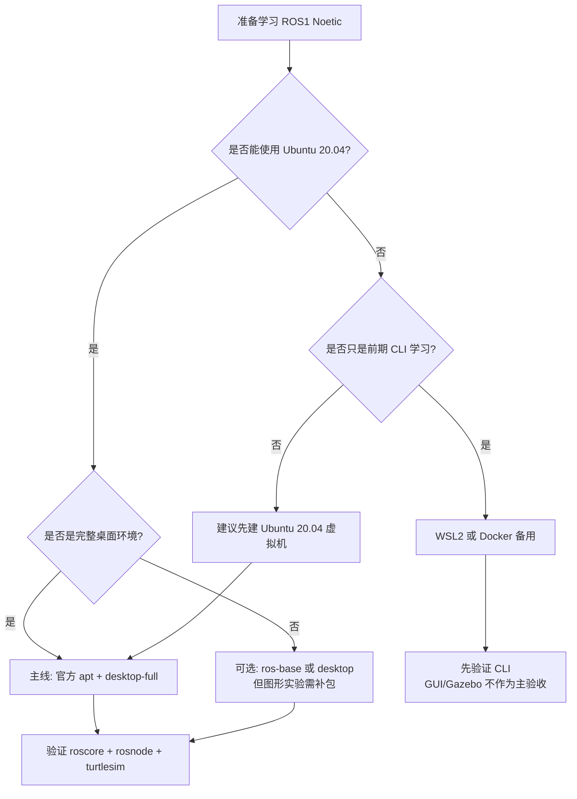
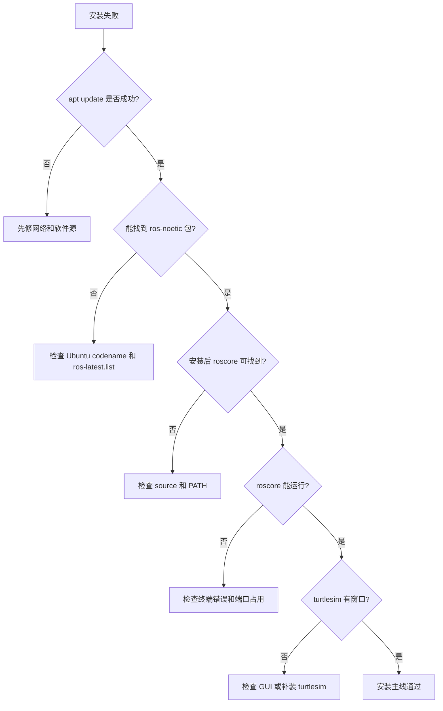

# 第 3 章 ROS1 安装方法完整说明

## 本章解决什么问题

安装 ROS 是很多初学者第一次遇到的大障碍。网络、Ubuntu 版本、软件源、密钥、rosdep、桌面组件、虚拟机图形性能、WSL2 GUI、Docker 容器持久化，都可能导致“照着教程敲但失败”。

本章的目标不是只给一条命令，而是讲清楚多种安装方法各自解决什么问题、适合谁、不适合谁。主线仍然是 **Ubuntu 20.04 + ROS Noetic 官方 apt 安装**。鱼香 ROS 一键安装、Docker、WSL2、源码构建都可以提及和使用，但不能替代对官方安装机制的理解。

必须先明确事实边界：ROS Noetic 已经到达官方 EOL；REP-3 将 Noetic 的 Required Support 列为 Ubuntu Focal Fossa 20.04。选择 Noetic 是为了学习 ROS1 体系和维护历史项目，不是建议新项目默认继续优先选择 ROS1。

## 学完以后你应该能做到

- 解释为什么本书主线使用 Ubuntu 20.04 + ROS Noetic。
- 区分 `ros-base`、`desktop`、`desktop-full` 和单包安装。
- 完成官方 apt 安装并验证。
- 知道虚拟机、原生 Ubuntu、WSL2、Docker、鱼香 ROS、一键安装、源码构建的适用边界。
- 理解软件源、密钥、APT 索引、环境变量、rosdep 分别解决什么问题。
- 理解 `source /opt/ros/noetic/setup.bash` 和 `~/.bashrc` 的作用。
- 能根据错误现象检查 Ubuntu 版本、软件源、apt 索引、ROS 环境和 rosdep。

## 3.1 本章在全书中的位置

第 2 章已经解释了 ROS Master、Node、Topic、Service、Parameter。现在要把这些概念真正运行起来。安装不是独立任务，它决定后面所有实验是否可复现。

成熟 ROS 教程通常把安装和环境配置放在最前面，然后马上进入 ROS 文件系统、节点、话题等基础实验。这个顺序合理，因为安装后的第一目标不是“装完了”，而是能够运行最小系统并观察它。

本章的安装判断流程如下：



这张图表达一个原则：方法可以多，但主线不能乱。零基础教学首先追求可复现和可排障，而不是展示所有可能玩法。

## 3.2 安装前必须确认的事实

### ROS Noetic 的定位

ROS Noetic Ninjemys 是 ROS1 的最后一个 LTS 发行版。官方 EOL 说明指出 Noetic 已到达维护结束。EOL 之后，不应期待官方继续提供安全更新、bug 修复或新功能。

这并不意味着 Noetic 不能学习或不能运行。它仍然有大量历史项目、教材、驱动和机器人系统使用经验。本书选择它，是因为当前教材目标是 ROS1 基础教学。

### Ubuntu 版本不能随便换

Noetic 的官方目标平台是 Ubuntu 20.04 Focal。不要把“我的系统也是 Ubuntu”理解成“版本无所谓”。Ubuntu 22.04、24.04 上通过源码或容器做 Noetic 是高级路线，不是零基础主线。

查看系统版本：

```bash
lsb_release -a
```

主线环境应看到类似：

```text
Description:    Ubuntu 20.04.x LTS
Codename:       focal
```

如果 Codename 不是 `focal`，不要继续照抄本章官方 apt 安装命令。先换到 Ubuntu 20.04、使用虚拟机、使用 Docker，或等待后续高级说明。

### 二进制安装和源码安装不是一回事

ROS Wiki Noetic Ubuntu 安装文档说明，构建农场会为若干 Ubuntu 平台构建 Debian 包，用户可以直接安装这些包，而不需要从源代码编译。对新手来说，官方 apt 安装的优势是：

- 下载的是预编译包。
- 依赖由 APT 处理。
- 安装路径统一。
- 遇到问题时教程和社区答案最多。

源码安装则需要下载源码、解析依赖、编译和处理构建错误。它对理解系统有价值，但不适合作为第一次学习的主线。

## 3.3 安装方法总览

| 方法 | 本书定位 | 推荐对象 | 优点 | 限制 |
|---|---|---|---|---|
| 官方 apt 安装 | 主线 | 所有初学者 | 官方路径清晰，资料最多 | 要求 Ubuntu 20.04 |
| Ubuntu 20.04 虚拟机 | 推荐载体 | Windows/macOS 学生 | 易恢复，失败成本低 | 图形/仿真性能取决于电脑 |
| 原生 Ubuntu 20.04 | 推荐载体 | 实验室机器、双系统用户 | 性能好，硬件访问直接 | 系统安装风险高 |
| WSL2 | 备用 | Windows 用户前期学习 | 启动快，命令行方便 | GUI、USB、Gazebo 不总是稳 |
| Docker | 备用/助教 | 课堂批量复现、CI | 环境一致，容易清理 | GUI、网络、硬件映射复杂 |
| 鱼香 ROS 一键安装 | 辅助 | 国内网络装机、rosdep 问题 | 自动化程度高，适合兜底 | 不能替代官方原理 |
| 源码构建 | 高级 | 教师、挑战实验、跨架构预备 | 理解依赖和构建链 | 慢、难、错误多 |

### 如何选择

| 你的情况 | 建议 |
|---|---|
| 第一次学习 ROS，电脑是 Windows | 优先 Ubuntu 20.04 虚拟机 |
| 实验室电脑可以重装系统 | 原生 Ubuntu 20.04 |
| 只想先学命令行和 ROS CLI | WSL2 可作为备用 |
| 教师要给几十台机器统一环境 | Docker 可作为兜底 |
| 官方源/rosdep 经常失败 | 可参考鱼香 ROS 辅助 |
| 想研究移植或编译链 | 源码构建作为高级实验 |

## 3.4 推荐主线：Ubuntu 20.04 + 官方 apt

### 安装前准备

确认系统：

```bash
lsb_release -a
```

确认 shell：

```bash
echo $SHELL
```

更新软件包索引：

```bash
sudo apt update
```

如果这里已经失败，先不要安装 ROS。APT 基础不可用时，ROS 安装一定不可靠。

### 配置 Ubuntu 仓库

官方安装文档要求 Ubuntu 仓库启用 `restricted`、`universe`、`multiverse`。桌面版通常可以通过“Software & Updates”图形界面确认。也可以使用：

```bash
sudo apt install -y software-properties-common
sudo add-apt-repository universe
sudo add-apt-repository restricted
sudo add-apt-repository multiverse
sudo apt update
```

解释：

- `restricted` 包含受限制许可的软件。
- `universe` 包含社区维护的软件。
- `multiverse` 包含某些许可更受限的软件。
- ROS 的部分依赖可能来自这些仓库。

### 添加 ROS 软件源

```bash
sudo sh -c 'echo "deb http://packages.ros.org/ros/ubuntu $(lsb_release -sc) main" > /etc/apt/sources.list.d/ros-latest.list'
```

解释：

- 这行命令创建 `/etc/apt/sources.list.d/ros-latest.list`。
- `$(lsb_release -sc)` 在 Ubuntu 20.04 上应展开为 `focal`。
- 它告诉 APT：除了 Ubuntu 官方源，也去 packages.ros.org 查找 ROS 包。

检查文件内容：

```bash
cat /etc/apt/sources.list.d/ros-latest.list
```

正确内容应类似：

```text
deb http://packages.ros.org/ros/ubuntu focal main
```

如果这里不是 `focal`，说明系统版本不符合主线。

### 添加密钥

```bash
sudo apt install -y curl
curl -s https://raw.githubusercontent.com/ros/rosdistro/master/ros.asc | sudo apt-key add -
```

解释：

- APT 需要确认软件包来源可信。
- 这一步添加 ROS 软件源签名密钥。

注意：`apt-key` 在较新 Ubuntu 中已不推荐作为长期方式，但 ROS Noetic 官方安装文档仍使用这套历史流程。本书为 Noetic 主线保留官方文档方式。

### 更新索引并选择安装规模

```bash
sudo apt update
```

然后选择安装规模。

| 包名 | 内容 | 适用场景 |
|---|---|---|
| `ros-noetic-desktop-full` | Desktop + 2D/3D 仿真 + 感知包 | 本书推荐，覆盖 RViz/Gazebo 等 |
| `ros-noetic-desktop` | ROS-Base + rqt + RViz 等 | 图形工具够用，但仿真/感知少 |
| `ros-noetic-ros-base` | 打包、构建、通信库，无 GUI | 服务器、机器人本体、容器基础 |
| `ros-noetic-PACKAGE` | 单独安装某个包 | 后续补装功能包 |

官方文档把 `desktop-full` 描述为包含 Desktop、2D/3D 仿真和感知包的推荐安装。对本书来说，`desktop-full` 能减少后续 RViz、Gazebo、turtlesim 和常见工具缺失导致的干扰。

本书推荐：

```bash
sudo apt install -y ros-noetic-desktop-full
```

如果电脑磁盘或网络条件有限，可先安装：

```bash
sudo apt install -y ros-noetic-desktop
```

但后续 Gazebo 或某些功能包可能需要补装。

### 环境配置

临时生效：

```bash
source /opt/ros/noetic/setup.bash
```

检查：

```bash
echo $ROS_DISTRO
which roscore
```

正确现象：

```text
noetic
/opt/ros/noetic/bin/roscore
```

为了让每个新 Bash 终端自动加载 ROS Noetic：

```bash
echo "source /opt/ros/noetic/setup.bash" >> ~/.bashrc
source ~/.bashrc
```

严肃提醒：如果你的电脑装了多个 ROS 发行版，`~/.bashrc` 不应同时 source 多个发行版。一次只让一个 ROS 发行版成为默认环境。

### 安装构建依赖和 rosdep

官方文档说明，运行核心 ROS 包和创建/管理工作空间需要额外构建工具。

```bash
sudo apt install -y python3-rosdep python3-rosinstall python3-rosinstall-generator python3-wstool build-essential
```

初始化 rosdep：

```bash
sudo rosdep init
rosdep update
```

解释：

- `rosdep` 用来把 ROS 包依赖转换成系统依赖安装指令。
- 后续编译源码包时经常用它。

如果 `sudo rosdep init` 提示文件已存在，说明可能已经初始化过。不要重复乱删，先查看：

```bash
ls /etc/ros/rosdep/sources.list.d/
```

## 3.5 安装过程的系统状态变化

新手常见问题是只知道“照着敲”，不知道系统被改了哪里。可以按下面理解：


对应文件或状态：

| 步骤 | 影响对象 | 检查方法 |
|---|---|---|
| 添加 ROS 源 | `/etc/apt/sources.list.d/ros-latest.list` | `cat /etc/apt/sources.list.d/ros-latest.list` |
| 更新索引 | APT 本地包索引 | `sudo apt update` |
| 安装包 | `/opt/ros/noetic` 等系统目录 | `ls /opt/ros/noetic` |
| source 环境 | 当前 shell 环境变量 | `echo $ROS_DISTRO`; `which roscore` |
| 写入 `.bashrc` | Bash 启动配置 | `tail ~/.bashrc` |
| 初始化 rosdep | `/etc/ros/rosdep/sources.list.d/` | `ls /etc/ros/rosdep/sources.list.d/` |

这张表能帮助你判断失败发生在哪一层，而不是盲目重装。

## 3.6 安装验证

### 验证 ROS 发行版

```bash
rosversion -d
```

正确输出：

```text
noetic
```

### 验证 roscore

终端 1：

```bash
roscore
```

终端 2：

```bash
source /opt/ros/noetic/setup.bash
rosnode list
```

正确输出至少包含：

```text
/rosout
```

### 验证图形工具和 turtlesim

```bash
rosrun turtlesim turtlesim_node
```

正确现象：

- 出现 turtlesim 窗口。
- 窗口中有一只小乌龟。

如果你在 WSL2、Docker 或远程环境中执行，图形窗口失败不一定说明 ROS 安装失败，可能是显示服务没有配置。先在原生 Ubuntu 或虚拟机中验证。

### 安装完成的最低验收标准

不要只说“没有报错”。至少要满足：

```bash
echo $ROS_DISTRO
which roscore
rosversion -d
rosnode list
rosrun turtlesim turtlesim_node
```

如果前四个成功、turtlesim 图形失败，说明 ROS 基础安装可能可用，但图形环境需要单独排查。

## 3.7 虚拟机方法

虚拟机是在现有系统上运行一个完整 Ubuntu。对零基础学生，虚拟机的最大优势是可恢复：安装失败、配置错、环境乱了，可以回滚快照。

建议配置：

- Ubuntu 20.04 Desktop ISO。
- CPU：2 核或以上。
- 内存：4 GB 起步，8 GB 更好。
- 磁盘：40 GB 起步。
- 显示：开启 3D 加速，如果虚拟机软件支持。

建议流程：

1. 新建 Ubuntu 20.04 虚拟机。
2. 完成系统安装和更新。
3. 安装增强工具或 Guest Additions。
4. 拍摄“干净系统快照”。
5. 按官方 apt 安装 ROS。
6. 验证 `roscore` 和 turtlesim。
7. 拍摄“ROS 安装完成快照”。

不要把虚拟机里 Gazebo 运行慢误判为 ROS 安装错误。图形性能慢和 ROS 通信机制是两件事。

### 虚拟机适合教学的原因

虚拟机不是性能最强的方案，但教学稳定性高：

- 学生操作失败可以回滚。
- 教师可以统一截图和路径。
- 不会影响学生主系统。
- 适合先完成第 1 到第 7 章的大部分实验。

到 Gazebo 和移动机器人仿真时，教师可以再说明性能限制。

## 3.8 WSL2 方法

WSL2 适合 Windows 学生做前期 CLI 实验。它启动快，文件共享方便，也能支持一定的 Linux GUI 应用。但对 ROS 学习来说，它不是最简单路径。

WSL2 推荐用途：

- 学习 Bash、APT、Git。
- 运行 `roscore`、`rosnode`、`rostopic`。
- 轻量运行 RViz 或 rqt。

WSL2 谨慎用途：

- Gazebo 仿真。
- USB 传感器。
- 串口底盘。
- 多机网络通信。

本书不会把 WSL2 作为主验收环境。若 WSL2 中 GUI 出问题，先用虚拟机或原生 Ubuntu 确认同一命令是否正常。

### WSL2 中常见误判

| 现象 | 可能真实原因 | 不应立刻得出的结论 |
|---|---|---|
| RViz 不显示 | GUI/显卡/显示服务问题 | ROS 安装一定失败 |
| USB 设备不可见 | 设备映射问题 | 驱动包一定有 bug |
| Gazebo 很卡 | 图形性能问题 | ROS topic 通信有问题 |
| 多机通信异常 | WSL 网络模式问题 | ROS Master 概念错了 |

## 3.9 Docker 方法

Docker 容器适合课堂批量复现和助教兜底。官方 Docker Hub 提供 ROS 镜像。

最小验证：

```bash
docker pull ros:noetic
docker run -it --rm ros:noetic roscore
```

解释：

- `docker pull ros:noetic` 下载 ROS Noetic 镜像。
- `docker run -it --rm` 启动临时交互容器，退出后自动删除。
- 容器内运行 `roscore`，说明基础 ROS 环境可用。

Docker 的关键限制：

- 容器默认不保存你在里面创建的工作空间，除非挂载 volume。
- GUI 程序需要额外配置显示。
- 访问摄像头、雷达、串口、USB 设备需要设备映射和权限。
- 容器网络与宿主机网络不同，多节点通信要谨慎。

因此 Docker 适合作为“可复现环境”，不是零基础学生第一次理解 Ubuntu 的最佳入口。

### Docker 更适合什么

Docker 适合作为：

- 教师给出统一实验环境。
- 助教快速复现学生问题。
- CI 中检查脚本和文档命令。
- 保留一个干净 ROS Noetic 基础镜像。

Docker 不适合掩盖 Linux 基础。学生仍然要理解 source、工作空间、包、topic 和网络。

## 3.10 鱼香 ROS 一键安装与辅助工具

鱼香 ROS 一键安装工具在国内 ROS 学习者中很常见，特别适合处理网络、系统源、rosdep 和环境配置等安装痛点。对零基础学生来说，它的价值不是“跳过学习”，而是降低第一轮装机失败率，让学生更快进入 `roscore`、turtlesim、catkin 和节点编程实验。

FishROS 的 `fishros/install` 仓库在工具列表中直接列出了多种能力，包括一键安装 ROS、配置 rosdep、配置 ROS 环境、配置系统源、安装 Docker、安装 VSCode 等。教材正文可以直接告诉学生有这类工具，并鼓励他们在理解官方安装主线后接触这些更方便的工程工具。

### 它能帮学生做什么

| FishROS 工具能力 | 对学生的实际帮助 | 仍然必须理解的底层概念 |
|---|---|---|
| 一键安装 ROS | 减少手工添加源、安装包、选择版本时的错误 | Ubuntu 版本、ROS 发行版、`apt install`、`/opt/ros/noetic` |
| 一键配置 rosdep | 解决 `rosdep update`、依赖源访问失败等常见问题 | rosdep 是依赖解析工具，不是 ROS 节点运行工具 |
| 一键配置 ROS 环境 | 帮助生成或修复环境加载配置 | `source /opt/ros/noetic/setup.bash`、`~/.bashrc`、当前 shell |
| 一键配置系统源 | 在网络不稳定时切换 Ubuntu/ROS 相关源 | 软件源文件、APT 索引、`sudo apt update` |
| 一键安装 Docker | 为课堂兜底、容器实验或环境隔离提供便利 | 容器、镜像、volume、GUI 映射和硬件访问限制 |
| 一键安装 VSCode 等工具 | 降低开发工具配置成本 | 编辑器只是工具，不能替代 catkin/launch/ROS CLI 理解 |

这张表要传达一个原则：**工具可以更方便，但不能让系统状态变成黑盒**。学生可以使用 FishROS，但必须知道它大致在帮自己修改哪些系统状态。

### 推荐使用方式

课堂或自学中，可以采用下面的顺序：

1. 先阅读本章官方 apt 安装流程，知道添加软件源、更新索引、安装 ROS 包、source 环境、初始化 rosdep 分别在做什么。
2. 如果国内网络、rosdep 或软件源导致安装失败，再使用鱼香 ROS 一键安装或配置工具辅助处理。
3. 工具执行完成后，不以“一键脚本显示成功”为最终结论，而是回到官方验证命令。
4. 验证成功后，把 FishROS 做过的事情和本章手工步骤对应起来，形成可解释的安装记录。

常见入口命令可参考 FishROS 仓库 README，例如：

```bash
source <(wget -qO- http://fishros.com/install)
```

有些教程也会写成：

```bash
wget http://fishros.com/install -O fishros
bash fishros
```

两种写法的核心都是从网络获取安装脚本并执行。零基础学生在执行前至少要知道三件事：

- 脚本来源应来自鱼香 ROS 官方站点或 `fishros/install` 仓库，不要执行来历不明的复制版本。
- 这类脚本可能修改软件源、安装软件包、写入环境配置，因此执行前最好在虚拟机快照或干净环境中操作。
- 脚本失败时不要反复盲目重跑，应回到 `apt`、`rosdep`、`~/.bashrc`、`/etc/apt/sources.list.d/` 等位置查状态。

### 使用后的验证

无论通过官方 apt 手动安装，还是通过 FishROS 辅助安装，都必须用同一组命令验收：

```bash
rosversion -d
which roscore
echo $ROS_DISTRO
echo $ROS_PACKAGE_PATH
roscore
```

另开一个终端：

```bash
source /opt/ros/noetic/setup.bash
rosnode list
rosrun turtlesim turtlesim_node
```

正确现象仍然是：

- `rosversion -d` 输出 `noetic`。
- `which roscore` 能定位到 ROS Noetic 的命令路径。
- `echo $ROS_DISTRO` 输出 `noetic`。
- `roscore` 能启动。
- 另一个终端可以通过 `rosnode list` 看到 `/rosout`。
- turtlesim 能弹出小乌龟窗口。

如果这些验证不能通过，就说明“一键安装完成”这个说法还没有被证据支持。

### 使用 FishROS 时常见的误区

| 误区 | 为什么不对 | 正确做法 |
|---|---|---|
| 一键安装成功就等于学会 ROS | 安装只是进入 ROS 的前置条件，还没有理解节点、话题、服务和工作空间 | 继续完成第 4-6 章实验 |
| 一键工具能替代官方文档 | 工具封装了步骤，但错误发生时仍要回到官方机制排查 | 保留官方 apt 流程作为主线理解 |
| 换源后不需要 `apt update` | APT 必须重新读取软件包索引 | 换源后执行 `sudo apt update` |
| rosdep 配置好了就不会缺依赖 | rosdep 只负责按规则解析和安装依赖，仍可能受网络、包名、系统版本影响 | 用 `rosdep install --from-paths src --ignore-src -r -y` 时阅读输出 |
| 修改了 ROS 环境后所有终端自动生效 | 手动 `source` 只影响当前 shell，写入 `.bashrc` 才影响新终端 | 用 `echo $ROS_DISTRO` 和 `tail ~/.bashrc` 检查 |

本书对 FishROS 的态度是明确的：**可以直接介绍、可以建议学生使用、可以作为国内学习环境的重要辅助工具，但不能让学生只会点选菜单而不会解释安装结果**。真正的目标是学生既能借助方便工具完成环境搭建，也能在工具失败时回到官方安装逻辑独立定位问题。

## 3.11 源码构建方法

源码构建适合高级理解，不适合零基础第一次安装。

源码构建能帮助理解：

- ROS 包之间的依赖关系。
- `rosinstall_generator` 如何生成源码清单。
- `rosdep` 如何解析系统依赖。
- `catkin_make_isolated` 如何按顺序编译。

但它也有明显问题：

- 下载慢。
- 依赖多。
- 编译时间长。
- 错误信息复杂。
- 对初学者收益不如先学会 ROS 运行模型。

本书后续最多把源码构建放入“挑战实验”或“教师版说明”。当前主线不要求学生执行。

## 3.12 最小可运行实验

### 实验目标

完成官方 apt 主线安装并验证 ROS Noetic 可用。

### 前置条件

- Ubuntu 20.04 Focal。
- Bash。
- 网络可访问 ROS 软件源或镜像源。
- 当前用户有 sudo 权限。

### 操作步骤

确认系统：

```bash
lsb_release -a
```

添加 ROS 源：

```bash
sudo sh -c 'echo "deb http://packages.ros.org/ros/ubuntu $(lsb_release -sc) main" > /etc/apt/sources.list.d/ros-latest.list'
cat /etc/apt/sources.list.d/ros-latest.list
```

添加密钥：

```bash
sudo apt install -y curl
curl -s https://raw.githubusercontent.com/ros/rosdistro/master/ros.asc | sudo apt-key add -
```

安装：

```bash
sudo apt update
sudo apt install -y ros-noetic-desktop-full
```

配置环境：

```bash
source /opt/ros/noetic/setup.bash
echo $ROS_DISTRO
which roscore
echo "source /opt/ros/noetic/setup.bash" >> ~/.bashrc
```

安装 rosdep：

```bash
sudo apt install -y python3-rosdep python3-rosinstall python3-rosinstall-generator python3-wstool build-essential
sudo rosdep init
rosdep update
```

验证：

```bash
rosversion -d
roscore
```

另开终端：

```bash
rosnode list
rosrun turtlesim turtlesim_node
```

### 正确现象

- ROS 源文件中出现 `focal main`。
- `echo $ROS_DISTRO` 输出 `noetic`。
- `which roscore` 指向 `/opt/ros/noetic/bin/roscore`。
- `rosversion -d` 输出 `noetic`。
- `rosnode list` 看到 `/rosout`。
- turtlesim 窗口正常打开。

### 实验复盘

安装实验不是为了“敲完命令”，而是为了得到三层能力：

| 层次 | 验证命令 | 说明 |
|---|---|---|
| 系统包安装成功 | `ls /opt/ros/noetic` | ROS 文件已安装到系统 |
| 当前终端环境可用 | `echo $ROS_DISTRO`; `which roscore` | shell 能找到 ROS 命令 |
| ROS 运行时可用 | `roscore`; `rosnode list` | Master 和基础节点可运行 |
| 图形示例可用 | `rosrun turtlesim turtlesim_node` | 后续第 4 章可继续 |

如果某一层失败，只修对应层，不要直接重装系统。

## 3.13 高频错误与排查

| 现象 | 高概率原因 | 第一检查命令 | 修复思路 |
|---|---|---|---|
| `Unable to locate package ros-noetic-desktop-full` | Ubuntu 不是 focal，或 ROS 源未添加/未 update | `lsb_release -a`; `cat /etc/apt/sources.list.d/ros-latest.list` | 确认系统为 20.04，重新 `sudo apt update` |
| `roscore: command not found` | ROS 未安装或当前终端未 source | `which roscore`; `echo $ROS_DISTRO` | `source /opt/ros/noetic/setup.bash` |
| `sudo rosdep init` 报已存在 | 之前初始化过 | `ls /etc/ros/rosdep/sources.list.d/` | 不要重复乱删，先运行 `rosdep update` |
| turtlesim 无窗口 | 未安装 desktop/full，或 GUI 不可用 | `dpkg -l | grep turtlesim`; 检查图形环境 | 补装 `ros-noetic-turtlesim`，或换 VM/原生验证 |
| WSL2 中 RViz/Gazebo 异常 | GUI/显卡/显示服务问题 | `echo $DISPLAY`; 运行简单 GUI 程序 | 不把该错误归因于 ROS 本体 |
| `.bashrc` 写了多行 source | 多发行版环境冲突 | `tail ~/.bashrc` | 保留当前使用的一个发行版 |

### 安装排障树



## 3.14 本章自测

1. 为什么本书主线不使用 Ubuntu 22.04 安装 Noetic？
2. `desktop-full`、`desktop`、`ros-base` 分别适合什么场景？
3. `sudo apt update` 在 ROS 安装中起什么作用？
4. 为什么添加 ROS 源后要检查 `ros-latest.list`？
5. `source /opt/ros/noetic/setup.bash` 为什么每个终端都要执行？
6. 为什么鱼香 ROS 一键安装不能替代官方安装原理？
7. Docker 容器为什么默认不适合保存学生工作空间？
8. WSL2 中 Gazebo 出问题时，为什么不能直接说 ROS 安装失败？
9. `rosdep` 解决什么问题？
10. 你会用哪些命令判断 ROS Noetic 安装是否成功？
11. 如果 `rosversion -d` 正常但 turtlesim 无窗口，问题可能在哪一层？
12. 为什么源码构建不适合零基础第一次安装？

### 参考答案

1. 因为 ROS Noetic 的官方目标平台是 Ubuntu 20.04 Focal，而不是 Ubuntu 22.04。新手使用 Ubuntu 22.04 安装 Noetic，往往会遇到 apt 包不可用、依赖版本不匹配、需要源码构建等问题。教材主线必须降低无关变量，让读者先掌握 ROS1 本身。

2. `desktop-full` 包含 ROS 基础、GUI 工具、RViz、rqt、仿真和常用感知/机器人包，适合本书全流程学习；`desktop` 包含常用桌面工具但内容少一些，适合空间有限但仍需要 RViz/rqt 的环境；`ros-base` 只有核心通信、构建和命令行基础，适合服务器、容器或机器人本体，不适合零基础完整学习图形和仿真。

3. `sudo apt update` 会从 Ubuntu 和 ROS 软件源拉取最新软件包索引。添加 ROS 源或修改镜像后，如果不执行它，apt 仍不知道新源中有哪些 `ros-noetic-*` 包。安装失败时，`apt update` 的输出也是判断软件源、网络和 key 是否正常的重要证据。

4. `ros-latest.list` 决定 apt 是否知道 ROS 软件源，以及源的发行版代号是否匹配当前 Ubuntu。比如 Ubuntu 20.04 应对应 `focal`，如果文件内容错误或没有写入，`apt install ros-noetic-desktop-full` 就可能找不到包。检查这个文件比盲目重复安装命令更有效。

5. `source /opt/ros/noetic/setup.bash` 会把 ROS Noetic 的环境变量加载到当前 shell，例如 PATH、ROS_PACKAGE_PATH 等。每个新终端都是新的 shell，不会自动继承另一个终端里手动 source 的结果。若要新终端自动加载，需要把 source 行写入 `~/.bashrc`。

6. 鱼香 ROS 一键安装能帮助处理国内网络、换源、rosdep 和自动化安装问题，但它背后仍然是在操作软件源、apt、rosdep 和环境变量。学生必须理解官方安装原理，否则一键脚本失败或换机器时就无法排查。教材可以推荐它作为辅助工具，但不能把它当成黑盒替代基础知识。

7. Docker 容器默认是临时运行环境，容器删除后，容器内部未挂载到宿主机的数据会消失。学生的 `catkin_ws` 如果没有通过 volume 挂载保存，就可能丢失。Docker 还需要额外处理 GUI、网络、设备映射和权限，因此更适合助教兜底、批量复现或 CI，不是第一次学习的最简单路径。

8. WSL2 中 Gazebo 出问题可能来自图形显示、显卡加速、WSLg、网络、权限或资源限制，不一定是 ROS 安装失败。应先用 `roscore`、`rosnode list`、`rostopic list` 等命令判断 ROS 通信是否正常，再判断是否是 Gazebo 图形或仿真性能层的问题。

9. `rosdep` 用来根据 ROS 包声明的依赖，在当前系统上解析并安装对应系统包。它解决的是“源码或工作空间依赖哪些 Ubuntu 包、Python 包或系统库”的问题。创建或编译较大工作空间时，`rosdep install --from-paths src --ignore-src -r -y` 常用于补齐依赖。

10. 可以用 `rosversion -d` 确认发行版输出 `noetic`，用 `which roscore` 确认命令可找到，用 `roscore` 确认 Master 能启动，用另一个终端 `rosnode list` 确认能连接 Master，用 `rosrun turtlesim turtlesim_node` 确认图形工具和示例包可用。这些命令分别验证版本、环境、通信和 GUI 示例。

11. 问题可能在图形层或示例包层，而不是 ROS 核心安装层。应检查是否安装了 `ros-noetic-turtlesim`、当前是否有桌面显示环境、`DISPLAY` 是否正确、虚拟机/WSL2 图形支持是否正常。`rosversion -d` 只能说明 ROS 环境能识别 Noetic，不代表 GUI 程序一定能显示。

12. 源码构建会引入仓库分支、依赖解析、编译顺序、系统库版本、构建工具和大量错误日志。零基础学生还没有掌握 apt、source、catkin、依赖声明和排障命令，直接源码构建会把主要精力耗在环境问题上。源码构建适合作为高级理解和后续适配准备，不适合作为第一次安装主线。

## 延伸阅读

- ROS Noetic EOL：https://www.ros.org/blog/noetic-eol/
- REP-3 Target Platforms：https://www.ros.org/reps/rep-0003.html
- ROS Noetic Ubuntu 安装：https://mirror.umd.edu/roswiki/noetic%282f%29Installation%282f%29Ubuntu.html
- ROS Noetic 源码安装：https://mirror.umd.edu/roswiki/noetic%282f%29Installation%282f%29Source.html
- Docker 官方 ROS 镜像：https://hub.docker.com/_/ros
- 鱼香 ROS 一键安装：https://github.com/fishros/install
- Ubuntu VirtualBox 教程：https://ubuntu.com/tutorials/how-to-run-ubuntu-desktop-on-a-virtual-machine-using-virtualbox
- WSL GUI 官方说明：https://learn.microsoft.com/en-us/windows/wsl/tutorials/gui-apps
