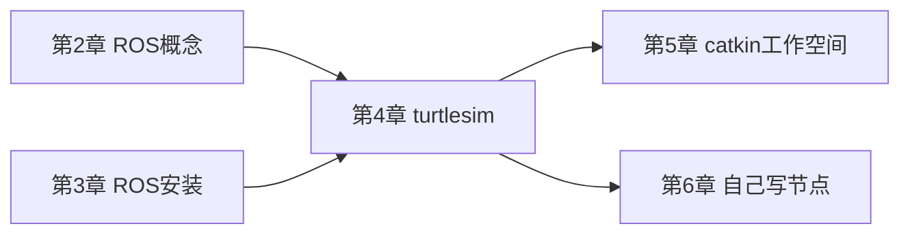
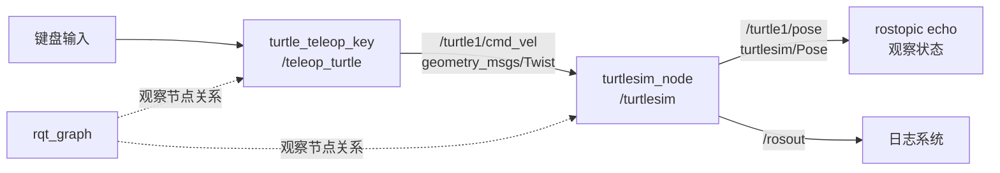
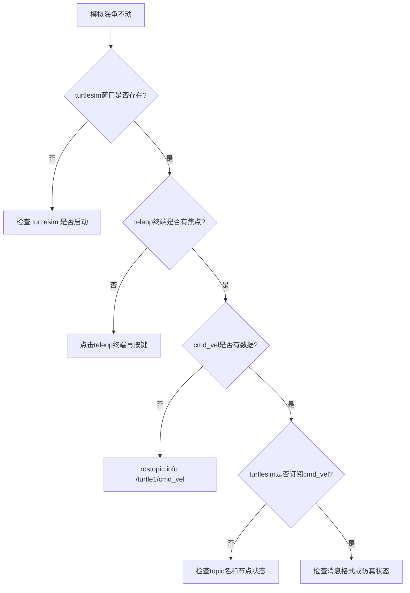

# 第 4 章 第一个 ROS 系统

## 本章解决什么问题

前两章已经介绍了 ROS 的概念，并完成了安装。本章要让 ROS 从“术语”变成“可观察系统”。本章使用 `turtlesim`，不是因为模拟海龟本身重要，而是因为它足够小，能清楚展示节点、话题、消息和计算图。

成熟 ROS 入门教程通常都会从 turtlesim 开始。原因在于：它能在几分钟内呈现一个完整的 ROS 闭环：一个节点提供仿真窗口，一个节点发布速度命令，两个节点通过 topic 解耦，CLI 和 rqt 工具可以观察整个系统。

本章的重点不是“用键盘控制 turtlesim 模拟海龟”，而是学会提出系统观察问题：有哪些节点？哪些 topic？消息类型是什么？数据从哪里流向哪里？如果系统不动，应先检查什么？

## 学习完成后应达到的能力

- 启动 `roscore`、`turtlesim_node`、`turtle_teleop_key`。
- 使用 `rosnode list` 和 `rosnode info` 查看节点。
- 使用 `rostopic list`、`rostopic type`、`rostopic info`、`rostopic echo`、`rostopic pub` 查看和发布消息。
- 使用 `rqt_graph` 观察计算图。
- 解释 `/turtle1/cmd_vel` 和 `/turtle1/pose` 的数据方向。
- 把 turtlesim 的结构迁移理解到移动机器人 `/cmd_vel`、`/odom`、`/scan`。
- 通过命令定位“节点没启动、topic 名写错、消息类型写错、终端焦点不对”等常见问题。

## 4.1 本章在全书中的位置

第 2 章讲概念，第 3 章讲安装，本章用最小系统把概念和安装结果连接起来。



如果本章只做到“能让 turtlesim 模拟海龟运动”，学习是不完整的。核心目标是能解释该现象背后的 ROS 结构。读者需要把窗口中看到的运动，映射到节点、topic、消息类型和数据流。

## 4.2 为什么用 turtlesim

实际机器人系统包含驱动、控制器、传感器、坐标变换、地图和导航，初学者一开始较难判断错误来自哪里。turtlesim 则把问题简化到最低：

- 一个二维窗口。
- 一个可控制的 turtlesim 模拟海龟。
- 一个速度命令 topic。
- 一个位姿反馈 topic。
- 一个键盘控制节点。

这个系统足够小，但 ROS 通信机制是真实的。读者在 turtlesim 中学会的观察方法，后续可以直接迁移到移动机器人：

| turtlesim | 移动机器人类比 | 共同点 |
|---|---|---|
| `/turtle1/cmd_vel` | `/cmd_vel` 速度命令 | 外部节点发布速度控制 |
| `/turtle1/pose` | `/odom` 或位姿反馈 | 系统发布当前状态 |
| `turtle_teleop_key` | 键盘/手柄遥控节点 | 人类输入转成速度命令 |
| `turtlesim_node` | 底盘或仿真节点 | 接收速度并更新状态 |
| `rqt_graph` | 复杂系统计算图 | 可视化节点和 topic 关系 |

### 一个重要提醒

不应因为 turtlesim 简单就轻视它。很多真实系统的问题，缩小后和 turtlesim 一样：

- 控制节点有没有发布 `/cmd_vel`？
- 底盘节点有没有订阅 `/cmd_vel`？
- 消息类型是不是 `geometry_msgs/Twist`？
- 反馈 topic 有没有数据？
- 图里看到的连接是否符合预期？

## 4.3 本章必须理解的概念

| 概念 | 简明定义 | 容易误解的点 | 最小观察方法 |
|---|---|---|---|
| `turtlesim_node` | turtlesim 仿真节点 | 它不是 ROS Master | `rosnode info /turtlesim` |
| `turtle_teleop_key` | 键盘控制节点 | 只有终端获得焦点时才响应按键 | `rosnode info /teleop_turtle` |
| `/turtle1/cmd_vel` | 控制 turtlesim 模拟海龟速度的 topic | 不是键盘节点直接调用仿真函数 | `rostopic echo /turtle1/cmd_vel` |
| `/turtle1/pose` | turtlesim 模拟海龟当前位姿 topic | 不是命令，而是状态反馈 | `rostopic echo /turtle1/pose` |
| `geometry_msgs/Twist` | 速度消息类型 | 字段结构必须写对 | `rosmsg show geometry_msgs/Twist` |
| `rqt_graph` | 计算图可视化工具 | 图不刷新时不等于系统坏了 | 点击刷新 |

## 4.4 turtlesim 的数据流

先看整体结构：



这张图里，键盘控制节点没有直接调用 turtlesim 的内部函数。它只是把按键转换成速度消息，发布到 `/turtle1/cmd_vel`。turtlesim 订阅这个 topic，收到速度后更新模拟海龟状态，再发布 `/turtle1/pose`。

后续分析移动机器人时，也可以画类似图：

```text
teleop -> /cmd_vel -> base_driver -> /odom
```

这就是 turtlesim 的教学价值。

## 4.5 最小可运行实验

### 实验目标

启动一个包含多个节点和 topic 的 ROS 系统，并用命令观察数据流。

### 前置条件

- ROS Noetic 安装完成。
- 能打开图形窗口。
- 当前终端已加载 ROS 环境。

如果 turtlesim 未安装：

```bash
sudo apt update
sudo apt install -y ros-noetic-turtlesim
```

### 操作步骤

终端 1：启动 Master。

```bash
source /opt/ros/noetic/setup.bash
roscore
```

终端 2：启动 turtlesim。

```bash
source /opt/ros/noetic/setup.bash
rosrun turtlesim turtlesim_node
```

终端 3：启动键盘控制。

```bash
source /opt/ros/noetic/setup.bash
rosrun turtlesim turtle_teleop_key
```

让终端 3 保持焦点，按方向键控制 turtlesim 模拟海龟。

终端 4：观察系统。

```bash
source /opt/ros/noetic/setup.bash
rosnode list
rostopic list
rostopic type /turtle1/cmd_vel
rosmsg show geometry_msgs/Twist
rostopic echo /turtle1/pose
```

打开计算图：

```bash
rqt_graph
```

### 正确现象

- `roscore` 终端持续运行。
- turtlesim 窗口显示一个模拟海龟。
- 按方向键时，模拟海龟移动或旋转。
- `rosnode list` 能看到类似 `/turtlesim`、`/teleop_turtle`、`/rosout` 的节点。
- `rostopic list` 能看到 `/turtle1/cmd_vel`、`/turtle1/pose` 等 topic。
- `rostopic echo /turtle1/pose` 持续输出 x、y、theta、linear_velocity、angular_velocity。
- `rqt_graph` 能看到 teleop 节点向 turtlesim 节点发送速度命令。

### 实验复盘

把实验分成四层：

| 层次 | 操作内容 | 对应命令 | 应理解的内容 |
|---|---|---|---|
| Master | 启动注册发现服务 | `roscore` | 节点需要注册和发现 |
| 节点 | 启动仿真和键盘节点 | `rosrun turtlesim ...` | 节点是运行中的进程 |
| topic | 观察命令和反馈通道 | `rostopic list/echo` | 数据通过 topic 流动 |
| 图 | 看系统连接关系 | `rqt_graph` | 节点通过 topic 解耦 |

如果能够把这四层讲给别人听，就不是在“跑 demo”，而是在理解 ROS 系统。

## 4.6 观察 topic 数据

### 查看 `/turtle1/pose`

```bash
rostopic echo /turtle1/pose
```

典型输出：

```text
x: 5.544444561
y: 5.544444561
theta: 0.0
linear_velocity: 0.0
angular_velocity: 0.0
```

解释：

- `x`、`y`：模拟海龟在窗口中的位置。
- `theta`：朝向角。
- `linear_velocity`：线速度。
- `angular_velocity`：角速度。

按方向键时，这些数值会变化。这里观察到的是状态反馈，不是控制命令。

### 查看 `/turtle1/cmd_vel`

在 teleop 终端按方向键，同时另一个终端运行：

```bash
rostopic echo /turtle1/cmd_vel
```

典型输出：

```text
linear:
  x: 2.0
  y: 0.0
  z: 0.0
angular:
  x: 0.0
  y: 0.0
  z: 0.0
```

解释：

- `/turtle1/cmd_vel` 是命令。
- `/turtle1/pose` 是反馈。
- 命令和反馈分开，是机器人系统设计中的常见模式。

### `rostopic info` 比 `rostopic echo` 更适合第一步排查

如果不确定某个 topic 是否有发布者或订阅者，先执行：

```bash
rostopic info /turtle1/cmd_vel
```

应关注：

- Type：消息类型。
- Publishers：谁在发布。
- Subscribers：谁在订阅。

`echo` 只能看到数据；`info` 能显示连接关系。

## 4.7 手动发布速度命令

不一定需要键盘控制节点。只要知道 topic 名和消息类型，也可以用 CLI 直接发布。

先确认消息类型：

```bash
rostopic type /turtle1/cmd_vel
```

输出：

```text
geometry_msgs/Twist
```

查看结构：

```bash
rosmsg show geometry_msgs/Twist
```

然后发布一次速度命令：

```bash
rostopic pub -1 /turtle1/cmd_vel geometry_msgs/Twist \
"linear:
  x: 1.0
  y: 0.0
  z: 0.0
angular:
  x: 0.0
  y: 0.0
  z: 0.5"
```

解释：

- `rostopic pub` 发布一条 topic 消息。
- `-1` 表示发布一次后退出。
- `/turtle1/cmd_vel` 是 topic 名。
- `geometry_msgs/Twist` 是消息类型。
- 后面的 YAML 文本是消息内容。

如果要持续发布：

```bash
rostopic pub -r 10 /turtle1/cmd_vel geometry_msgs/Twist \
"linear:
  x: 1.0
  y: 0.0
  z: 0.0
angular:
  x: 0.0
  y: 0.0
  z: 0.3"
```

`-r 10` 表示 10 Hz 发布。按 `Ctrl+C` 停止。

### 为什么手动 pub 重要

手动发布是最小控制实验。实际移动机器人调试中，如果导航节点尚未完成，也可以先手动向 `/cmd_vel` 发一条速度命令，检查底盘链路是否正常。

这能把问题拆开：

- 手动发 `/cmd_vel` 机器人能动：底盘链路基本正常，问题可能在上游控制节点。
- 手动发 `/cmd_vel` 也不动：问题可能在底盘驱动、仿真插件、topic 连接或安全限制。

## 4.8 用 `rqt_graph` 看计算图

运行：

```bash
rqt_graph
```

如果图为空，先点击刷新按钮。

应看到：

- `/teleop_turtle` 节点。
- `/turtlesim` 节点。
- `/turtle1/cmd_vel` 从 teleop 指向 turtlesim。

注意：计算图显示的是节点关系，不显示消息内部数值。要看数值，用 `rostopic echo`。

### 图和命令如何对应

| 图中元素 | 对应命令 |
|---|---|
| 节点框 | `rosnode list` |
| topic 箭头 | `rostopic list` |
| 箭头方向 | `rostopic info 话题名` |
| topic 中数据 | `rostopic echo 话题名` |
| 消息字段 | `rosmsg show 消息类型` |

不应只看图。图只能显示连接关系，不能判断数据是否合理。

## 4.9 用 `rosnode info` 深入观察节点

查看 turtlesim：

```bash
rosnode info /turtlesim
```

重点观察：

- Publications：它发布什么。
- Subscriptions：它订阅什么。
- Services：它提供什么。

查看 teleop：

```bash
rosnode info /teleop_turtle
```

可以观察到 teleop 主要发布速度命令，而 turtlesim 订阅速度命令并发布状态。这比只看窗口更能说明 ROS 系统结构。

### 仿真节点还提供服务

turtlesim 不只使用 topic，也提供 service。可以查看：

```bash
rosservice list | grep turtle
```

常见服务包括清空背景、重置、生成新的模拟海龟等。这里先不深入使用 service，但要注意：一个节点可以同时发布 topic、订阅 topic、提供 service。

这正是 ROS 节点的真实形态。

## 4.10 高频错误与排查

| 现象 | 高概率原因 | 第一检查命令 | 修复思路 |
|---|---|---|---|
| `rosrun turtlesim turtlesim_node` 找不到包 | 未安装 turtlesim 或未 source | `rospack find turtlesim`; `echo $ROS_DISTRO` | 安装 `ros-noetic-turtlesim`，source Noetic |
| 键盘控制无效 | teleop 终端没有焦点 | 看当前终端是否接收按键 | 点击 teleop 终端再按方向键 |
| `rqt_graph` 图为空 | 没刷新或节点没启动 | `rosnode list` | 启动节点后刷新 |
| `rostopic echo /turtle1/cmd_vel` 没输出 | 没有按键或没有发布者 | `rostopic info /turtle1/cmd_vel` | 按住方向键或手动 pub |
| `rostopic pub` 报 YAML 错误 | 消息字段缩进或类型错误 | `rosmsg show geometry_msgs/Twist` | 按消息结构重新写 |
| 模拟海龟不动但 topic 有数据 | turtlesim 节点未运行或 topic 名不匹配 | `rosnode list`; `rostopic info /turtle1/cmd_vel` | 确认订阅者存在 |

### 排障顺序



## 4.11 本章自测

1. 为什么 turtlesim 适合作为第一个 ROS 系统？
2. `/turtle1/cmd_vel` 和 `/turtle1/pose` 分别代表命令还是反馈？
3. `rostopic type` 和 `rosmsg show` 的区别是什么？
4. `rostopic pub -1` 和 `rostopic pub -r 10` 的区别是什么？
5. 如果 `rqt_graph` 看不到 teleop 和 turtlesim 的连接，应先检查哪些命令？
6. 为什么 teleop 节点不需要知道 turtlesim 内部代码？
7. `rosnode info` 中 Publications 和 Subscriptions 分别代表什么？
8. 如果 `rostopic echo /turtle1/cmd_vel` 有数据但模拟海龟不动，可能是什么原因？
9. 为什么 `rostopic info` 有时比 `rostopic echo` 更适合作为第一步排查？
10. turtlesim 中学到的观察方法如何迁移到移动机器人？

### 参考答案

1. turtlesim 足够小，启动快、依赖少、现象直观，同时包含节点、topic、message、service、参数和 rqt_graph 等 ROS 核心观察对象。它把真实机器人中的“控制输入”和“状态反馈”简化成模拟海龟运动，适合初学者先理解 ROS 计算图，而不是一开始面对复杂硬件和仿真。

2. `/turtle1/cmd_vel` 是命令输入，通常由 teleop 或手动 `rostopic pub` 发布，表示模拟海龟的期望速度；`/turtle1/pose` 是状态反馈，由 turtlesim 节点发布，描述当前位姿和速度信息。真实移动机器人中，类似关系是 `/cmd_vel` 作为控制输入，`/odom` 作为运动反馈。

3. `rostopic type /turtle1/cmd_vel` 只显示 topic 使用的消息类型，例如 `geometry_msgs/Twist`；`rosmsg show geometry_msgs/Twist` 会展开这个类型的字段结构，例如 `linear.x`、`angular.z`。前者解决“这条 topic 是什么类型”，后者解决“这个类型里有哪些字段”。

4. `rostopic pub -1` 只发布一次消息，适合测试单次命令是否能被接收；`rostopic pub -r 10` 以 10 Hz 持续发布，适合模拟持续控制输入。速度控制通常需要持续发布，因为很多机器人或仿真系统会在命令停止后逐渐停止或触发安全机制。

5. 先查 `rosnode list` 确认 teleop 和 turtlesim 节点是否存在，再查 `rostopic list` 确认 `/turtle1/cmd_vel` 是否存在，接着用 `rostopic info /turtle1/cmd_vel` 看 publisher 和 subscriber 是否连接。必要时用 `rostopic echo /turtle1/cmd_vel` 判断是否真的有速度数据。

6. teleop 节点只需要知道自己向哪个 topic 发布什么消息类型，不需要知道 turtlesim 内部如何更新画面。ROS 的发布订阅模型通过 topic 和 message 解耦节点实现。真实机器人中，键盘控制节点也不需要知道底盘驱动内部如何控制电机，只需要按约定发布 `/cmd_vel`。

7. Publications 表示该节点发布了哪些 topic，即它向外输出哪些数据；Subscriptions 表示该节点订阅了哪些 topic，即它依赖哪些输入数据。对 turtlesim 来说，它订阅 `/turtle1/cmd_vel` 并发布 `/turtle1/pose`，这能直接说明它的输入和输出边界。

8. 可能原因包括：发布的是零速度、消息字段不符合预期、turtlesim 节点没有订阅同一个 topic、节点长时间无响应或窗口未响应、topic 命名空间不一致。排查顺序应先看 `rostopic info /turtle1/cmd_vel` 是否有 turtlesim 作为 subscriber，再看 echo 出来的速度值是否非零。

9. `rostopic info` 能快速显示 topic 类型、发布者和订阅者，比 `echo` 更适合判断连接关系。`echo` 只能看数据流，如果没有输出，仍无法区分是没有 publisher、没有 subscriber、topic 名错，还是发布频率太低。第一步看 info，可以先确定系统结构。

10. 可以把 `/turtle1/cmd_vel` 对应到移动机器人的 `/cmd_vel`，把 `/turtle1/pose` 对应到 `/odom` 或机器人状态，把 turtlesim 节点对应为底盘或仿真节点。迁移后的观察顺序仍然是：`rosnode list` 看节点，`rostopic list` 看接口，`rostopic info` 看连接，`rostopic echo/hz` 看数据，`rqt_graph` 看整体关系。

## 4.12 本章小结

本章完成了第一个可观察 ROS 系统。学习重点不只是运行一个 demo，而是掌握观察 ROS 系统的基本顺序：

1. `rosnode list` 看节点。
2. `rostopic list` 看话题。
3. `rostopic info` 看发布者和订阅者。
4. `rostopic type` 看消息类型。
5. `rosmsg show` 看消息结构。
6. `rostopic echo` 看数据。
7. `rostopic pub` 手动构造数据。
8. `rqt_graph` 看节点关系。

后续进入 catkin、Python、C++ 和移动机器人系统时，这套方法仍然适用。规范的 ROS 入门，不是只会启动 turtlesim，而是能从 turtlesim 中读出系统结构。

## 延伸阅读

- ROS Tutorials：https://mirror.umd.edu/roswiki/ROS%282f%29Tutorials.html
- ros_tutorials 仓库：https://github.com/ros/ros_tutorials
- ROS Topics：https://mirror.umd.edu/roswiki/Topics.html
- A Gentle Introduction to ROS：https://jokane.net/agitr/
