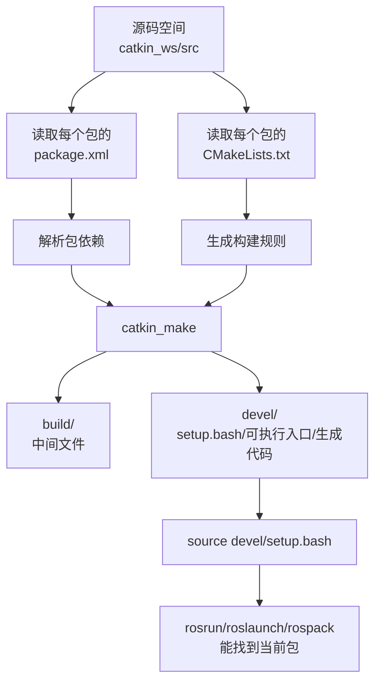
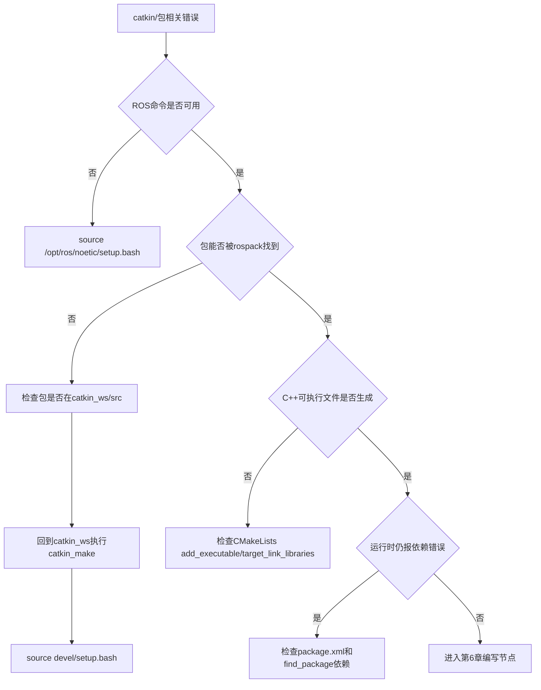

# 第 5 章 catkin 工作空间与功能包

## 本章解决什么问题

前面已经完成 `roscore` 启动、`turtlesim` 运行、节点和 topic 观察。到这里为止，更多是在“使用别人写好的 ROS 包”。本章开始解决一个更工程化的问题：自己的 ROS 代码应该放在哪里，怎样让 ROS 找到它，怎样声明它依赖了哪些库，怎样让 Python 脚本和 C++ 程序都能被 `rosrun`、`roslaunch` 正确启动。

ROS 项目不是任意放置几个脚本就可以完成。一个可维护的 ROS1 项目通常由工作空间、功能包、依赖声明、构建规则、运行配置和数据文件共同组成。catkin 是 ROS1 Noetic 中最常用的包构建系统，它把 CMake、Python 包、消息生成、依赖查找和 ROS 环境叠加组织到一套约定中。

初学者大量错误都发生在这里：包不在 `src/`、在错误目录执行 `catkin_make`、忘记 source 工作空间、依赖没有写进 `package.xml`、C++ 文件写好了但没有加入 `CMakeLists.txt`、用 `sudo` 把工作空间权限弄坏。本章的目标不是机械记命令，而是理解每条命令改变了什么目录、文件或环境变量。

## 学习完成后应达到的能力

- 创建标准 catkin 工作空间。
- 创建 `beginner_tutorials` 功能包。
- 解释 `src/`、`build/`、`devel/` 的作用。
- 解释 `package.xml` 和 `CMakeLists.txt` 分别负责什么。
- 使用 `catkin_make` 编译工作空间。
- 使用 `source ~/catkin_ws/devel/setup.bash` 让当前终端识别自己的包。
- 使用 `rospack find`、`roscd`、`rospack depends1` 检查包和依赖。
- 判断常见 catkin 错误属于路径问题、环境问题、依赖问题还是 CMake 规则问题。

## 5.1 本章在全书中的位置

第 2-4 章解决的是“看懂 ROS 系统”。本章开始解决“创建 ROS 项目”。从这一章开始，每一段 ROS 代码都应该放进功能包，而不是散落在桌面、下载目录或任意文件夹。


这条主线有一个非常实际的原因：如果工作空间和功能包没有组织好，第 6 章的代码即使写对，也可能因为 ROS 找不到包、CMake 没有编译目标、环境变量没有叠加而无法运行。

## 5.2 必须理解的概念

| 概念 | 简明定义 | 容易误解的点 |
|---|---|---|
| 工作空间 | 一组 ROS 包的源码、构建结果和开发环境集合 | 不是所有文件夹都自动是工作空间 |
| 源码空间 `src/` | 放功能包源码的目录 | 功能包通常要放在这里，而不是工作空间根目录 |
| 构建空间 `build/` | CMake 和编译器生成中间文件的目录 | 通常不手动编辑，不应提交进教材示例项目 |
| 开发空间 `devel/` | 编译后生成的可运行开发环境 | `source devel/setup.bash` 后当前终端才能识别本工作空间 |
| 功能包 package | ROS 代码复用、依赖声明和运行入口的基本单位 | 一个文件夹里不能不加区分地嵌套多个 ROS 包 |
| `package.xml` | 包的元信息和依赖清单 | 不是说明文档，它会影响依赖解析和发布 |
| `CMakeLists.txt` | 构建规则文件 | C++ 源码不会被自动编译，必须写构建规则 |
| 环境覆盖 overlay | 后 source 的工作空间叠加在前面的 ROS 环境上 | source 只影响当前 shell，除非写入 `.bashrc` |

这些概念必须连起来理解，而不是分开背。一个功能包从“磁盘上的文件夹”变成“ROS 能找到并运行的组件”，至少经历四个状态变化：


这条链路能解释大量新手错误。包已经在 `src/` 里，不代表当前终端能找到它；`catkin_make` 成功，不代表新开的终端已经加载了 `devel/setup.bash`；Python 脚本放在包里，不代表它自动有执行权限；C++ 源码写好了，不代表 CMake 会自动编译它。每当出现“找不到包、找不到节点、编译没生成可执行文件”时，都要沿着这条链路检查，而不是把所有问题都归为 catkin 出错。

## 5.3 工作空间是什么

工作空间可以理解为“一个 ROS 项目的工程根目录”。官方 catkin 教程给出的典型结构是：

```text
catkin_ws/
  src/
    CMakeLists.txt
    package_1/
      CMakeLists.txt
      package.xml
    package_2/
      CMakeLists.txt
      package.xml
```

在实际使用 `catkin_make` 之后，工作空间会变成：

```text
catkin_ws/
  src/
    beginner_tutorials/
      CMakeLists.txt
      package.xml
  build/
  devel/
```

这三个目录的职责完全不同：

| 目录 | 谁创建 | 放什么 | 初学者应不应该手动改 |
|---|---|---|---|
| `src/` | 用户创建 | 功能包源码 | 应该，主要编辑这里 |
| `build/` | `catkin_make` 创建 | CMake 缓存、编译中间文件 | 通常不应该 |
| `devel/` | `catkin_make` 创建 | 开发环境、setup 文件、生成的可执行入口 | 通常不应该 |

`src/` 是源码空间。`build/` 和 `devel/` 是构建工具根据源码生成的结果。很多新手把 `build/` 或 `devel/` 当成源码目录编辑，这是错误的。应该纳入写作、版本管理和讲解的是功能包源码目录。

## 5.4 catkin 的工作流程

catkin 不是单独替代 CMake，而是建立在 CMake 之上的 ROS 包构建体系。它把多个功能包的依赖关系、消息生成、库链接和环境叠加组织起来。



这张图解释了为什么 “写了代码” 不等于 “ROS 能运行代码”：

- ROS 要找到包，需要包在环境变量指向的路径下。
- C++ 节点要能运行，需要 CMake 真的编译出可执行文件。
- 自定义消息或服务要能导入，需要先生成代码。
- 修改包结构或构建规则后，通常要重新 `catkin_make` 并重新 source。

## 5.5 功能包是什么

ROS package 是 ROS 代码组织和复用的基本单位。一个包可以包含：

- Python 脚本。
- C++ 源码。
- launch 文件。
- msg/srv/action 定义。
- URDF 模型。
- YAML 参数。
- RViz 配置。
- 测试文件和文档。

一个 catkin 包至少需要两个文件：

```text
my_package/
  package.xml
  CMakeLists.txt
```

`package.xml` 说明“这个包是谁、做什么、依赖谁”。`CMakeLists.txt` 说明“这个包怎样构建、生成什么、链接哪些库”。前者更像包清单，后者更像构建配方。

官方教程特别强调：每个包必须有自己的文件夹，不能把多个 ROS 包放入同一个目录，也不能把包随意嵌套在另一个包中。因为 ROS 工具会从文件系统结构推断包边界，边界不清会直接导致 `rospack`、`catkin_make` 和依赖解析异常。

## 5.6 创建工作空间

### 前置条件

已经安装 ROS Noetic，并且当前终端加载了 ROS 环境：

```bash
source /opt/ros/noetic/setup.bash
echo $ROS_DISTRO
```

正确输出：

```text
noetic
```

如果这里不是 `noetic`，先回到第 3 章检查安装和 `.bashrc`。

### 操作步骤

创建工作空间源码目录：

```bash
mkdir -p ~/catkin_ws/src
```

解释：

- `~` 表示当前用户的家目录。
- `catkin_ws` 是工作空间根目录，名字可以改，但初学阶段建议保持这个名字。
- `src` 是源码空间，后续功能包放在这里。
- `-p` 表示上级目录不存在时一并创建，目录已存在也不报错。

进入工作空间根目录并编译一次空工作空间：

```bash
cd ~/catkin_ws
catkin_make
```

这一步会生成 `build/` 和 `devel/`。即使 `src/` 里还没有功能包，先编译一次也有意义，因为它会生成 `devel/setup.bash`。

观察目录结构：

```bash
ls
```

正确现象：

```text
build  devel  src
```

如果安装了 `tree`，可以看得更清楚：

```bash
tree -L 2 ~/catkin_ws
```

没有 `tree` 时可安装：

```bash
sudo apt update
sudo apt install -y tree
```

## 5.7 source 工作空间的作用

运行：

```bash
source ~/catkin_ws/devel/setup.bash
```

这不是“启动 ROS”。它是在当前终端中加载这个工作空间生成的环境设置。加载以后，ROS 工具才知道当前工作空间也属于 ROS 包搜索路径的一部分。

可以用下面命令观察变化：

```bash
echo $ROS_PACKAGE_PATH
echo $CMAKE_PREFIX_PATH
```

典型现象是：`ROS_PACKAGE_PATH` 中会出现类似路径：

```text
/home/用户名/catkin_ws/src:/opt/ros/noetic/share
```

这说明当前终端查找 ROS 包时，会先看当前工作空间源码空间，再看系统安装的 `/opt/ros/noetic/share`。这就是环境覆盖。

```mermaid
flowchart LR
  A[/opt/ros/noetic/setup.bash<br/>系统ROS环境] --> B[ROS能找到官方包]
  B --> C[~/catkin_ws/devel/setup.bash<br/>叠加当前工作空间]
  C --> D[ROS能找到官方包 + 当前包]
```

要让新终端自动加载，可以把 source 写入 `.bashrc`：

```bash
echo "source /opt/ros/noetic/setup.bash" >> ~/.bashrc
echo "source ~/catkin_ws/devel/setup.bash" >> ~/.bashrc
source ~/.bashrc
```

这里的顺序重要。通常先加载系统 ROS，再加载自己的工作空间。后者叠加在前者之上。

注意：`source` 只影响当前 shell。在终端 A 中 source，不会让已经打开的终端 B 自动获得同样环境。很多“为什么这个终端能运行，另一个终端不能运行”的问题，本质就是 shell 环境不同。

## 5.8 创建第一个功能包

进入源码空间：

```bash
cd ~/catkin_ws/src
```

创建包：

```bash
catkin_create_pkg beginner_tutorials std_msgs rospy roscpp
```

解释：

- `beginner_tutorials` 是包名。
- `std_msgs` 是标准消息包，本书先用 `std_msgs/String` 做最小通信例子。
- `rospy` 是 Python 客户端库。
- `roscpp` 是 C++ 客户端库。

官方 Beginner Tutorials 也使用 `beginner_tutorials` 这个包名。教材沿用它，是为了让学生能直接对照 ROS Wiki、书籍和社区问题。

观察包结构：

```bash
tree beginner_tutorials
```

应看到：

```text
beginner_tutorials
├── CMakeLists.txt
└── package.xml
```

这说明包已经被创建，但还没有经过工作空间编译。下一步必须回到工作空间根目录。

## 5.9 编译工作空间

回到工作空间根目录：

```bash
cd ~/catkin_ws
catkin_make
source ~/catkin_ws/devel/setup.bash
```

这里有两个动作：

1. `catkin_make` 读取 `src/` 下所有包的 `package.xml` 和 `CMakeLists.txt`，生成构建结果。
2. `source devel/setup.bash` 把新的构建结果叠加进当前终端环境。

验证包是否可见：

```bash
rospack find beginner_tutorials
```

正确输出类似：

```text
/home/用户名/catkin_ws/src/beginner_tutorials
```

进入包目录：

```bash
roscd beginner_tutorials
pwd
```

如果 `roscd` 找不到包，不应直接怀疑 ROS 坏了，先按下面顺序检查：

```bash
pwd
ls ~/catkin_ws/src
echo $ROS_PACKAGE_PATH
source ~/catkin_ws/devel/setup.bash
rospack find beginner_tutorials
```

## 5.10 理解 `package.xml`

打开：

```bash
roscd beginner_tutorials
cat package.xml
```

核心字段如下：

| 字段 | 作用 | 初学阶段怎么写 |
|---|---|---|
| `<name>` | 包名 | 必须和包目录语义一致 |
| `<version>` | 版本号 | 教学包可用 `0.0.0` 或 `0.1.0` |
| `<description>` | 包说明 | 不应空泛，应说明包做什么 |
| `<maintainer>` | 维护者 | 至少一个，带邮箱 |
| `<license>` | 许可证 | 教学可使用 BSD/MIT 等常见许可证 |
| `<buildtool_depend>` | 构建工具依赖 | catkin 包通常依赖 `catkin` |
| `<build_depend>` | 编译时依赖 | C++ 编译、消息生成需要 |
| `<exec_depend>` | 运行时依赖 | 运行节点时需要 |

初学阶段最容易忽略的是依赖声明。代码里用了某个包，但 `package.xml` 里没有声明，可能在当前电脑上“侥幸能跑”，换到干净环境、课堂机器或 CI 就失败。

查看直接依赖：

```bash
rospack depends1 beginner_tutorials
```

查看递归依赖：

```bash
rospack depends beginner_tutorials
```

直接依赖是当前包明确依赖的包；递归依赖包含依赖的依赖。理解这个区别十分重要：教材示例代码通常只要求声明直接依赖，不要求把所有递归依赖都手动写进 `package.xml`。

## 5.11 理解 `CMakeLists.txt`

`CMakeLists.txt` 决定如何构建包。Python 脚本通常不需要编译，但 C++ 节点、自定义消息、自定义服务、库文件和安装规则都要通过它组织。

初学时先理解几个关键片段：

```cmake
find_package(catkin REQUIRED COMPONENTS
  roscpp
  rospy
  std_msgs
)
```

这表示构建本包时需要找到 catkin，以及 `roscpp`、`rospy`、`std_msgs` 这些 ROS 组件。

```cmake
catkin_package()
```

这会声明本包对外暴露的 catkin 包信息。后续涉及消息、服务或库时，这里可能要补 `CATKIN_DEPENDS`、`INCLUDE_DIRS`、`LIBRARIES` 等信息。

```cmake
include_directories(
  ${catkin_INCLUDE_DIRS}
)
```

这告诉 C++ 编译器到哪里找 ROS 头文件。

第 6 章写 C++ 节点时，会添加：

```cmake
add_executable(cpp_talker src/talker.cpp)
target_link_libraries(cpp_talker ${catkin_LIBRARIES})
```

如果写了 `src/talker.cpp` 却没有 `add_executable`，`catkin_make` 不会自动知道要编译它。CMake 不会推断开发者意图。

Python 脚本在开发空间中可以直接通过执行权限运行；更规范的安装写法是：

```cmake
catkin_install_python(PROGRAMS
  scripts/talker.py
  scripts/listener.py
  DESTINATION ${CATKIN_PACKAGE_BIN_DESTINATION}
)
```

本书前期为了降低门槛，先使用 `chmod +x scripts/*.py` 和 `rosrun`。到综合项目阶段，再逐步强调安装规则和可发布性。

## 5.12 `catkin_make`、`catkin build` 和 `catkin_make_isolated`

ROS1 教材和官方 Beginner Tutorials 最常见的是 `catkin_make`。本书也以它为主线，因为它对零基础学生最直接：

```bash
cd ~/catkin_ws
catkin_make
```

在其他资料中还可能看到：

| 命令 | 来源 | 适用场景 | 本书态度 |
|---|---|---|---|
| `catkin_make` | ROS 官方基础教程常用 | 初学、单一工作空间、小型项目 | 主线 |
| `catkin build` | `catkin_tools` 提供 | 包较多、需要更强构建控制 | 进阶了解 |
| `catkin_make_isolated` | catkin/源码构建常见 | 隔离构建复杂包或源码构建 | 后续高级内容 |

初学阶段不应在同一个工作空间里频繁混用这些工具。不同工具会生成不同的构建目录和配置文件，混用后错误更难定位。除非教师明确要求，本书前半部分统一使用 `catkin_make`。

## 5.13 推荐包目录结构

本书后续建议把 `beginner_tutorials` 扩展成：

```text
beginner_tutorials/
  CMakeLists.txt
  package.xml
  scripts/
    talker.py
    listener.py
  src/
    talker.cpp
    listener.cpp
  launch/
    chatter.launch
  config/
    chatter.yaml
  msg/
  srv/
```

解释：

| 目录 | 放什么 | 后续章节 |
|---|---|---|
| `scripts/` | Python 可执行脚本 | 第 6 章 |
| `src/` | C++ 源文件 | 第 6 章 |
| `launch/` | `.launch` 启动文件 | 第 7 章 |
| `config/` | YAML 参数文件 | 第 7 章 |
| `msg/` | 自定义消息 | 后续扩展 |
| `srv/` | 自定义服务 | 第 6 章 |

创建目录：

```bash
roscd beginner_tutorials
mkdir -p scripts src launch config msg srv
tree -L 2
```

不应把所有文件都集中放在包根目录。目录分层不是形式主义，它能让后续 `roslaunch`、RViz 配置、参数文件、模型文件和源码分工明确。

## 5.14 最小可运行实验

### 实验目标

从零创建工作空间和功能包，并验证 ROS 能找到该包。完成后应能解释每一步命令改变了什么。

### 前置条件

- Ubuntu 20.04。
- ROS Noetic 已安装。
- 当前终端使用 Bash。

### 操作步骤

```bash
source /opt/ros/noetic/setup.bash
echo $ROS_DISTRO

mkdir -p ~/catkin_ws/src
cd ~/catkin_ws
catkin_make
source ~/catkin_ws/devel/setup.bash

cd ~/catkin_ws/src
catkin_create_pkg beginner_tutorials std_msgs rospy roscpp

cd ~/catkin_ws
catkin_make
source ~/catkin_ws/devel/setup.bash

rospack find beginner_tutorials
rospack depends1 beginner_tutorials
roscd beginner_tutorials
mkdir -p scripts src launch config msg srv
tree -L 2
```

### 正确现象

- `echo $ROS_DISTRO` 输出 `noetic`。
- `catkin_ws` 下存在 `src/`、`build/`、`devel/`。
- `beginner_tutorials` 下存在 `package.xml` 和 `CMakeLists.txt`。
- `rospack find beginner_tutorials` 输出包路径。
- `rospack depends1 beginner_tutorials` 输出 `roscpp`、`rospy`、`std_msgs`。
- `tree -L 2` 能看到 `scripts/`、`src/`、`launch/`、`config/`、`msg/`、`srv/`。

### 实验复盘

| 操作内容 | 系统发生了什么 | 验证方式 |
|---|---|---|
| `mkdir -p ~/catkin_ws/src` | 创建工作空间源码空间 | `ls ~/catkin_ws` |
| `catkin_make` | 生成 `build/` 和 `devel/` | `ls ~/catkin_ws` |
| `source devel/setup.bash` | 当前终端叠加工作空间环境 | `echo $ROS_PACKAGE_PATH` |
| `catkin_create_pkg` | 创建包清单和构建规则 | `tree beginner_tutorials` |
| 第二次 `catkin_make` | 工作空间重新识别新包 | `rospack find beginner_tutorials` |
| `mkdir -p scripts src ...` | 建立后续章节所需目录 | `tree -L 2` |

## 5.15 高频错误与排查

| 现象 | 高概率原因 | 第一检查命令 | 修复思路 |
|---|---|---|---|
| `rospack find beginner_tutorials` 找不到 | 未 source 工作空间 | `echo $ROS_PACKAGE_PATH` | `source ~/catkin_ws/devel/setup.bash` |
| `catkin_make` 报不是工作空间 | 在包目录或 `src/` 下执行 | `pwd` | 回到 `~/catkin_ws` |
| 包创建在错误位置 | 不在 `~/catkin_ws/src` 下 | `pwd`; `tree ~/catkin_ws -L 3` | 移到 `src/` 下后重新编译 |
| C++ 节点编译后找不到 | 未在 CMake 中添加可执行文件 | `grep add_executable CMakeLists.txt` | 添加 `add_executable` 和 `target_link_libraries` |
| 修改 `.bashrc` 后没效果 | 当前终端未重新加载 | `tail ~/.bashrc` | `source ~/.bashrc` 或开新终端 |
| 工作空间文件属于 root | 曾用 `sudo` 编译或创建文件 | `ls -l ~/catkin_ws` | 修复所有者，避免在工作空间用 `sudo` |
| 改了 `package.xml` 但错误还在 | 没重新编译或没重新 source | `catkin_make`; `echo $ROS_PACKAGE_PATH` | 编译后重新 source |

### 排障树



## 5.16 本章自测

1. 工作空间和功能包是什么关系？
2. 为什么功能包应放在 `~/catkin_ws/src` 下？
3. `catkin_make` 应该在哪个目录执行？为什么？
4. `package.xml` 和 `CMakeLists.txt` 分别解决什么问题？
5. `build/` 和 `devel/` 是谁生成的？为什么不应该把主要源码放进去？
6. 为什么 Python 节点通常不需要像 C++ 那样编译？
7. `source /opt/ros/noetic/setup.bash` 和 `source ~/catkin_ws/devel/setup.bash` 有什么关系？
8. 如果 `rospack find` 找不到包，应按什么顺序排查？
9. 直接依赖和递归依赖有什么区别？
10. 为什么初学阶段不建议在同一个工作空间混用 `catkin_make` 和 `catkin build`？

### 参考答案

1. 工作空间是一组 ROS 包的工程环境，包含源码空间 `src/`、构建结果 `build/` 和开发环境 `devel/`。功能包是工作空间中的基本代码单元，每个包有自己的 `package.xml` 和 `CMakeLists.txt`。可以把工作空间理解为“项目容器”，把功能包理解为“可复用模块”。

2. catkin 约定工作空间的源码空间是 `catkin_ws/src`，`catkin_make` 会扫描这里的包并按依赖构建。包放在其他任意目录中，ROS 工具不一定能找到，`rospack find`、`roscd`、`catkin_make` 都可能失效。遵守目录约定能让教程、工具和排障方法保持一致。

3. `catkin_make` 应该在工作空间根目录执行，也就是包含 `src/` 的 `~/catkin_ws`。它需要从根目录读取源码空间，生成 `build/` 和 `devel/`。如果在包目录或 `src/` 目录执行，catkin 可能无法识别工作空间结构，出现“不是 catkin 工作空间”或生成结果位置错误。

4. `package.xml` 负责包的元信息和依赖声明，例如包名、维护者、许可证、构建依赖和运行依赖；`CMakeLists.txt` 负责构建规则，例如查找依赖、生成消息、编译 C++ 可执行文件、链接库。前者回答“这个包依赖谁”，后者回答“这个包怎么构建”。

5. `build/` 和 `devel/` 都由 `catkin_make` 生成。`build/` 存放 CMake 缓存和编译中间文件，`devel/` 存放开发环境和生成后的可运行入口。它们是构建产物，不是源码；把主要源码放进去会导致清理构建目录时丢失代码，也不符合 ROS 项目结构。

6. Python 是解释型语言，ROS 中的 Python 节点通常只需要脚本有正确 shebang 和执行权限，运行时由 Python 解释器执行。C++ 需要先编译成机器码并链接 ROS 库，所以必须在 `CMakeLists.txt` 中添加 `add_executable` 和 `target_link_libraries`。这也是 C++ 节点比 Python 多一步构建规则的原因。

7. `/opt/ros/noetic/setup.bash` 加载系统安装的 ROS Noetic 环境，`~/catkin_ws/devel/setup.bash` 在此基础上叠加自建工作空间。通常先 source 系统 ROS，再 source 工作空间。后者让当前终端能找到自写包，同时仍能使用 `/opt/ros/noetic` 中的官方包。

8. 先查包是否真的在 `~/catkin_ws/src` 下；再回到 `~/catkin_ws` 执行 `catkin_make`；然后 `source ~/catkin_ws/devel/setup.bash`；最后检查 `echo $ROS_PACKAGE_PATH` 和 `rospack find 包名`。如果仍找不到，再检查包名是否拼错、`package.xml` 是否存在、是否把包嵌套在另一个包中。

9. 直接依赖是当前包在 `package.xml` 中明确声明、代码直接使用的包，例如 `rospy`、`roscpp`、`std_msgs`。递归依赖包含“依赖的依赖”，数量通常更多。编写包清单时重点声明直接依赖，不应把所有递归依赖都不加区分地写入清单。

10. `catkin_make` 和 `catkin build` 使用不同的构建工具链和构建目录习惯，混用会产生缓存、构建空间和配置不一致的问题。零基础阶段排障能力还弱，统一使用 `catkin_make` 可以让错误路径更少。等理解 catkin 工作空间后，再学习 `catkin_tools` 更合适。

## 5.17 本章小结

本章建立了 ROS1 工程组织的基本骨架。后续所有代码都应放进工作空间和功能包中，而不是散落在任意目录。

记住四个原则：

- 包放在 `src/`。
- 编译在工作空间根目录。
- 运行前 source `devel/setup.bash`。
- 依赖写进 `package.xml` 和 `CMakeLists.txt`。

理解 catkin 的关键，不是记住 `catkin_make`，而是知道一个包从“源码文件夹”变成“ROS 能找到、能构建、能运行的系统组件”经历了哪些状态变化。掌握这一点，第 6 章写 Python/C++ 节点时就能减少工程结构错误。

进入下一章前，建议用下面的自我验收清单检查一次：

- 在任意新终端中，能说明为什么要先 `source /opt/ros/noetic/setup.bash` 或 `source ~/catkin_ws/devel/setup.bash`。
- 在 `~/catkin_ws` 根目录下，能解释 `src/`、`build/`、`devel/` 分别由谁创建、是否应该手动编辑、是否应该提交。
- 能用 `rospack find beginner_tutorials` 判断包是否对当前终端可见。
- 能解释为什么 C++ 节点必须写 `add_executable` 和 `target_link_libraries`，而 Python 节点更常见的问题是执行权限和 shebang。
- 能说明依赖为什么要同时考虑 `package.xml` 和 `CMakeLists.txt`，而不是只在一个文件中任意填写。

## 延伸阅读

- ROS Tutorials 总目录：https://mirror.umd.edu/roswiki/ROS%282f%29Tutorials.html
- ROS catkin 创建包教程：https://mirror.umd.edu/roswiki/ROS%282f%29Tutorials%282f%29catkin%282f%29CreatingPackage.html
- catkin 官方仓库：https://github.com/ros/catkin
- catkin_tools 文档：https://catkin-tools.readthedocs.io/en/latest/
- A Gentle Introduction to ROS：https://jokane.net/agitr/
