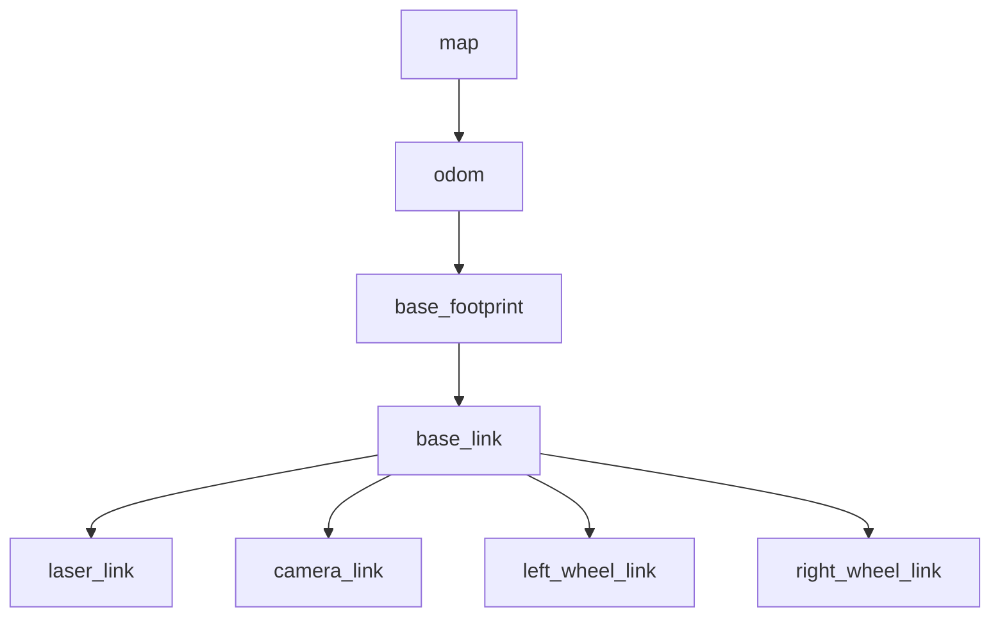
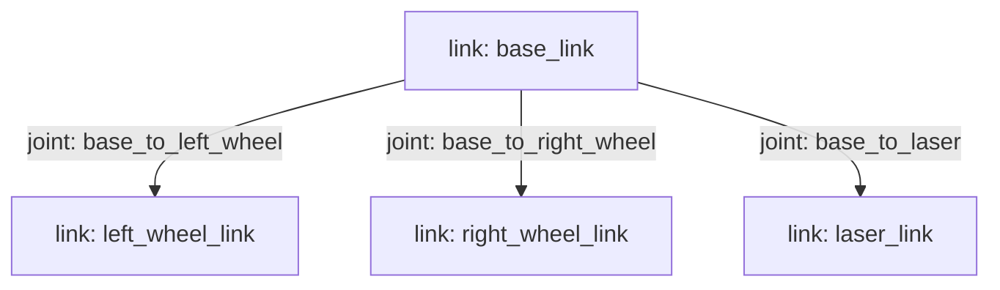
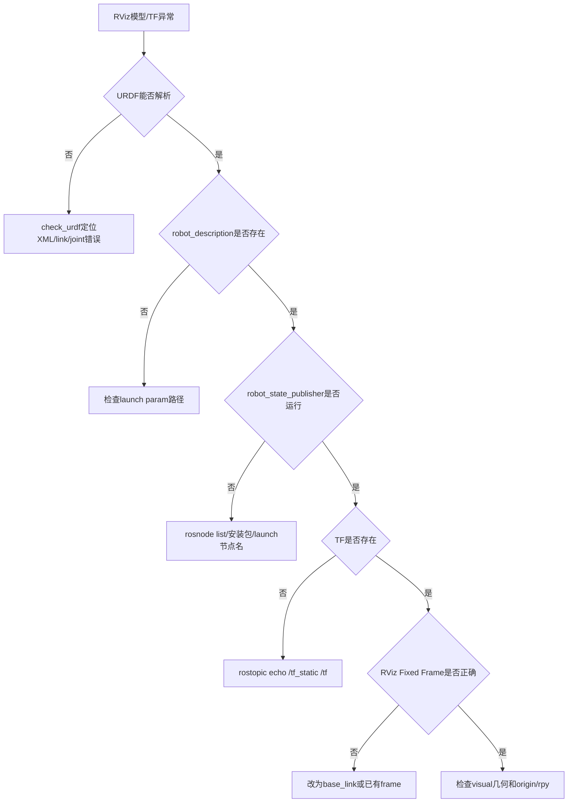

# 第 8 章 机器人坐标、模型与可视化

## 本章解决什么问题

前面几章讲的是节点之间如何通信。但机器人不只传递字符串和速度命令，它还生活在空间里。激光雷达装在底盘前方，摄像头有自己的朝向，轮子相对车体有位置，地图坐标和机器人坐标不是同一回事。如果这些坐标关系不清楚，机器人系统会出现“数据有了但显示错了”“模型在 RViz 里飞走了”“导航不知道机器人在哪里”等问题。

本章建立三个核心概念：TF 坐标树、URDF 机器人模型、RViz 可视化。你要理解：TF 描述坐标系之间的空间关系，URDF 描述机器人结构，RViz 只是显示已有 ROS 数据，不负责真实物理仿真。

本章不追求复杂机械建模，而是用一个最小两轮差速机器人例子说明 `link`、`joint`、`robot_description`、`joint_states`、`robot_state_publisher` 和 RViz 的关系。写完本章后，你应该能从 RViz 的报错反推出是 TF 缺失、URDF 错误、参数未加载，还是 Fixed Frame 选错。

## 学完以后你应该能做到

- 解释 `map`、`odom`、`base_link`、`laser_link`、`camera_link` 等常见坐标系。
- 理解 TF 是一棵坐标变换树，不是普通变量。
- 编写一个最小 URDF 文件。
- 用 `robot_state_publisher` 发布机器人模型对应的 TF。
- 用 RViz 显示 RobotModel、TF 和坐标轴。
- 区分 RViz 可视化和 Gazebo 物理仿真。
- 根据 RViz 报错排查 fixed frame、TF 缺失、URDF 参数未加载等问题。

## 8.1 本章在全书中的位置

第 2-7 章让你会组织节点和数据流。本章开始引入“空间流”：同一条传感器数据必须知道自己来自哪个坐标系，才能被其他节点正确解释。

```mermaid
flowchart LR
  A[Topic数据<br/>scan/odom/image] --> B[Frame ID<br/>数据属于哪个坐标系]
  C[URDF<br/>机器人结构] --> D[robot_description参数]
  E[joint_states<br/>关节状态] --> F[robot_state_publisher]
  D --> F
  F --> G[/tf 和 /tf_static]
  B --> H[RViz/算法节点]
  G --> H
```

这张图说明：机器人系统不是只有 topic。每条传感器数据背后都有 `frame_id`，而 TF 负责告诉系统这些 frame 之间如何转换。

## 8.2 必须理解的概念

| 概念 | 简明定义 | 容易误解的点 |
|---|---|---|
| Frame | 坐标系，例如 `base_link`、`laser_link` | 不是普通字符串，名字背后代表空间参考系 |
| TF | ROS 中维护坐标变换树的机制 | 不是一个固定表格，动态 TF 会随时间变化 |
| `/tf` | 动态坐标变换 topic | 常用于 `odom -> base_link` 等随时间变化的变换 |
| `/tf_static` | 静态坐标变换 topic | 常用于传感器安装位姿等固定关系 |
| URDF | 用 XML 描述机器人 link 和 joint 的格式 | 只写 visual 只能显示，不足以做可信物理仿真 |
| `link` | 机器人刚体部件 | 不是 mesh 文件本身，而是一个刚体坐标系 |
| `joint` | 两个 link 之间的连接关系 | joint 的 `origin` 决定 child link 相对 parent 的位姿 |
| `robot_description` | 存放 URDF 文本的 ROS 参数 | RViz/robot_state_publisher 需要它来理解模型 |
| RViz | ROS 数据可视化工具 | 不模拟碰撞、重力和轮地接触 |

## 8.3 为什么机器人需要坐标系

机器人系统中的每个数据都隐含一个坐标系。

例子：

- 激光雷达测得的障碍物距离，是相对于激光雷达坐标系。
- 摄像头图像中的像素，是相对于相机坐标系。
- 底盘速度命令，通常相对于机器人本体坐标系。
- 里程计位姿，通常相对于 `odom` 坐标系。
- 地图上的目标点，相对于 `map` 坐标系。

如果系统不知道这些坐标系之间的关系，数据无法正确融合。

例如激光雷达发现前方 1 米有障碍物。这个“前方”是 `laser_link` 的前方。如果激光雷达安装在车体前方 20 cm，且相对车体有旋转，那么必须把激光坐标转换到 `base_link`，才能知道障碍物相对机器人本体在哪里。

再举一个常见错误：RViz 中 LaserScan 有数据，但看不到激光点。很多时候不是 `/scan` 没有发布，而是 RViz 的 Fixed Frame 和 LaserScan 的 `header.frame_id` 之间没有 TF 路径。

## 8.4 常见坐标系

| 坐标系 | 常见含义 | 注意点 |
|---|---|---|
| `base_link` | 机器人本体基准坐标系 | 通常固定在底盘中心或机器人主体 |
| `base_footprint` | 机器人在地面投影坐标系 | 常用于二维导航，去掉 roll/pitch |
| `odom` | 局部连续里程计坐标系 | 连续但会漂移 |
| `map` | 全局地图坐标系 | 可被定位系统修正，可能发生跳变 |
| `laser_link` | 激光雷达坐标系 | 与传感器安装位置有关 |
| `camera_link` | 相机物理坐标系 | 还可能有 `camera_optical_frame` |
| `left_wheel_link` | 左轮坐标系 | 由 URDF joint 定义相对位置 |

移动机器人常见 TF 链：



不要把 `map`、`odom`、`base_link` 混成一个坐标系。它们表达不同层次的空间关系：

- `map` 更像全局地图参考。
- `odom` 更像短时间连续运动参考。
- `base_link` 是机器人本体参考。

## 8.5 TF 是什么

TF 是 ROS 中管理坐标变换的系统。它回答的问题是：

> 在某个时间点，坐标系 A 相对于坐标系 B 的位置和姿态是多少？

TF 不是普通 topic 列表，也不是全局变量。它是一棵随时间变化的坐标变换树。每条边表示父坐标系到子坐标系的变换。对于一棵合法 TF 树，一个 child frame 通常只能有一个 parent frame。否则系统无法判断从根到该坐标系的唯一路径。

观察 TF 常用工具：

```bash
rostopic echo /tf
rostopic echo /tf_static
rosrun tf view_frames
rosrun tf tf_echo base_link laser_link
```

解释：

- `/tf` 通常用于动态变换，例如机器人运动时 `odom -> base_link`。
- `/tf_static` 通常用于静态变换，例如 `base_link -> laser_link`。
- `view_frames` 会生成 TF 树报告，适合看整体结构。
- `tf_echo` 适合验证两个具体 frame 之间是否能转换。

如果 `tf_echo base_link laser_link` 一直报错，说明 `base_link` 和 `laser_link` 之间没有可用 TF 路径，或者 frame 名写错。

## 8.6 URDF 是什么

URDF 是 Unified Robot Description Format，即统一机器人描述格式。它用 XML 描述机器人结构：

- `link`：刚体部件。
- `joint`：部件之间的连接关系。
- `visual`：可视化几何。
- `collision`：碰撞几何。
- `inertial`：质量和惯量。

本章先只使用最小 visual 模型。真实 Gazebo 仿真中还要认真处理 `collision` 和 `inertial`，否则物理行为会不可信。例如一个机器人在 RViz 中显示正常，不代表它在 Gazebo 中能稳定落地、不会抖动、轮子能正确接触地面。

URDF 的核心是 link 和 joint 形成一棵树：



`joint` 的 `origin` 表示 child link 坐标系相对 parent link 坐标系的位置和姿态。很多模型“轮子在车体中间”“激光雷达方向不对”的问题，都来自 `origin xyz/rpy` 理解不清。

## 8.7 robot_state_publisher 和 joint_state_publisher

`robot_state_publisher` 的作用是：读取 URDF 形成的运动学树，再根据 `/joint_states` 中的关节状态，发布各个 link 的 TF。官方仓库说明它在启动时接收 URDF 运动学树模型，订阅 `joint_states`，根据关节状态更新运动学树，并把 3D 位姿发布到 TF。

`joint_state_publisher` 的作用是：在没有真实编码器或控制器时，发布模拟的关节状态，帮助 RViz 显示模型。对于全 fixed joint 的最小模型，即使没有复杂关节运动，也常用它配合教学。

两者关系：

```mermaid
flowchart LR
  A[URDF文件] --> B[robot_description参数]
  C[joint_state_publisher] --> D[/joint_states]
  B --> E[robot_state_publisher]
  D --> E
  E --> F[/tf 和 /tf_static]
  F --> G[RViz: TF显示]
  B --> H[RViz: RobotModel显示]
```

这条链路也是本章排障的主线。RViz 不显示模型时，不要只盯着 RViz。要向前检查：`robot_description` 有没有加载？`robot_state_publisher` 有没有启动？`/tf` 有没有发布？Fixed Frame 是否选对？

## 8.8 最小可运行实验：创建机器人描述包

### 实验目标

创建一个最小机器人描述包，写入 URDF，启动 `robot_state_publisher` 和 RViz，观察 RobotModel 与 TF。

### 前置条件

- 已完成 ROS Noetic 安装。
- 已完成 `~/catkin_ws` 工作空间配置。
- 当前终端能正常执行 `roscore`、`roslaunch`、`rviz`。

### 创建机器人描述包

创建包：

```bash
source ~/catkin_ws/devel/setup.bash
cd ~/catkin_ws/src
catkin_create_pkg my_robot_description urdf xacro robot_state_publisher joint_state_publisher
cd my_robot_description
mkdir -p urdf launch rviz
```

编译一次：

```bash
cd ~/catkin_ws
catkin_make
source ~/catkin_ws/devel/setup.bash
```

验证包可见：

```bash
rospack find my_robot_description
```

正确输出应是：

```text
/home/你的用户名/catkin_ws/src/my_robot_description
```

## 8.9 最小 URDF

创建：

```bash
roscd my_robot_description
nano urdf/simple_diff_drive.urdf
```

写入：

```xml
<?xml version="1.0"?>
<robot name="simple_diff_drive">
  <link name="base_link">
    <visual>
      <origin xyz="0 0 0.1" rpy="0 0 0" />
      <geometry>
        <box size="0.5 0.35 0.2" />
      </geometry>
      <material name="blue">
        <color rgba="0.1 0.2 0.8 1.0" />
      </material>
    </visual>
  </link>

  <link name="left_wheel_link">
    <visual>
      <origin xyz="0 0 0" rpy="1.5708 0 0" />
      <geometry>
        <cylinder radius="0.08" length="0.04" />
      </geometry>
      <material name="black">
        <color rgba="0.02 0.02 0.02 1.0" />
      </material>
    </visual>
  </link>

  <link name="right_wheel_link">
    <visual>
      <origin xyz="0 0 0" rpy="1.5708 0 0" />
      <geometry>
        <cylinder radius="0.08" length="0.04" />
      </geometry>
      <material name="black">
        <color rgba="0.02 0.02 0.02 1.0" />
      </material>
    </visual>
  </link>

  <link name="laser_link">
    <visual>
      <origin xyz="0 0 0" rpy="0 0 0" />
      <geometry>
        <cylinder radius="0.05" length="0.04" />
      </geometry>
      <material name="red">
        <color rgba="0.9 0.1 0.1 1.0" />
      </material>
    </visual>
  </link>

  <joint name="base_to_left_wheel" type="fixed">
    <parent link="base_link" />
    <child link="left_wheel_link" />
    <origin xyz="0 0.2 0.08" rpy="0 0 0" />
  </joint>

  <joint name="base_to_right_wheel" type="fixed">
    <parent link="base_link" />
    <child link="right_wheel_link" />
    <origin xyz="0 -0.2 0.08" rpy="0 0 0" />
  </joint>

  <joint name="base_to_laser" type="fixed">
    <parent link="base_link" />
    <child link="laser_link" />
    <origin xyz="0.2 0 0.23" rpy="0 0 0" />
  </joint>
</robot>
```

检查 URDF：

```bash
check_urdf urdf/simple_diff_drive.urdf
```

如果 `check_urdf` 不存在：

```bash
sudo apt update
sudo apt install -y liburdfdom-tools
```

正确现象通常包括机器人名和 link/joint 解析信息。若 XML 标签没闭合、link 名拼错、joint 的 parent/child 指向不存在，`check_urdf` 会直接报错。

### URDF 代码读图

| 元素 | 本例含义 | RViz 中的直观结果 |
|---|---|---|
| `base_link` | 蓝色车体 | 一个长方体底盘 |
| `left_wheel_link` | 左轮 | y 正方向的黑色圆柱 |
| `right_wheel_link` | 右轮 | y 负方向的黑色圆柱 |
| `laser_link` | 激光雷达外壳 | 车体前上方红色圆柱 |
| `base_to_laser origin xyz="0.2 0 0.23"` | 激光相对车体前方 0.2 m、高 0.23 m | 红色圆柱出现在车体前上方 |

这就是“代码到可视化”的对应关系。不要把 URDF 当成一堆 XML，而要把每个 `origin` 都想象成一个坐标变换。

## 8.10 启动 RViz 显示模型

创建 launch 文件：

```bash
roscd my_robot_description
nano launch/display.launch
```

写入：

```xml
<launch>
  <param name="robot_description" textfile="$(find my_robot_description)/urdf/simple_diff_drive.urdf" />

  <node name="joint_state_publisher" pkg="joint_state_publisher" type="joint_state_publisher" />
  <node name="robot_state_publisher" pkg="robot_state_publisher" type="robot_state_publisher" />

  <node name="rviz" pkg="rviz" type="rviz" output="screen" />
</launch>
```

运行：

```bash
roslaunch my_robot_description display.launch
```

在 RViz 中：

1. 将 Fixed Frame 改为 `base_link`。
2. Add -> RobotModel。
3. Add -> TF。
4. 观察 Displays 面板中 RobotModel 和 TF 是否为绿色状态。

### 预期成果图

RViz 中应看到类似下面的结构：

```text
             red laser_link
                  o
                  |
        +-------------------+
        |     blue base     |
        |      base_link    |
        +-------------------+
          O               O
 left_wheel_link   right_wheel_link
```

这不是精确比例图，而是帮助你核对空间关系：

- 激光雷达应在车体前上方。
- 左右轮应分别在车体两侧。
- TF 显示中应能看到 `base_link` 到三个子 link 的连线。
- Fixed Frame 设为 `base_link` 时，模型应稳定显示在网格中心附近。

## 8.11 用命令验证 RViz 背后的数据

RViz 是显示结果，不是事实来源。运行后应另开终端检查：

```bash
source ~/catkin_ws/devel/setup.bash
rosnode list
rosparam get /robot_description | head
rostopic list
rostopic echo /tf_static
rosrun tf tf_echo base_link laser_link
```

这些命令分别回答：

| 命令 | 回答的问题 |
|---|---|
| `rosnode list` | `robot_state_publisher`、`joint_state_publisher`、`rviz` 是否启动 |
| `rosparam get /robot_description` | URDF 是否加载到参数服务器 |
| `rostopic echo /tf_static` | fixed joint 是否形成静态 TF |
| `tf_echo base_link laser_link` | `base_link` 到 `laser_link` 是否存在可用变换 |

如果 RViz 正常但命令异常，要以命令和日志继续追查。GUI 看到图只是结果，真正支撑它的是参数和 TF 数据。

## 8.12 RViz 不是 Gazebo

RViz 是可视化工具。它显示 ROS 中已经存在的数据，例如 TF、RobotModel、LaserScan、PointCloud、Image、Map。它不负责物理碰撞、重力、摩擦、传感器仿真。

Gazebo 是仿真器。它负责模拟物理世界、机器人运动、传感器数据和环境交互。

一句话区分：

- RViz：看 ROS 数据。
- Gazebo：模拟机器人和世界。

```mermaid
flowchart LR
  A[URDF/TF/Topic/Map/LaserScan] --> B[RViz<br/>显示数据]
  C[URDF/SDF/World/Physics/Plugins] --> D[Gazebo<br/>产生仿真数据]
  D --> E[/scan /odom /tf /cmd_vel接口]
  E --> B
```

你可以在 RViz 中看到机器人模型，但这不代表机器人在物理世界里能运动。要让机器人在 Gazebo 中真实运动，还需要 collision、inertial、控制插件、关节控制器等。第 9 章会使用 TurtleBot3 这类成熟仿真包，而不是从零手写完整物理插件。

## 8.13 最小可运行实验

### 实验目标

从零创建一个描述包，在 RViz 中看到两轮机器人模型和 TF，并能用命令解释它为什么显示出来。

### 操作步骤

```bash
source ~/catkin_ws/devel/setup.bash
cd ~/catkin_ws/src
catkin_create_pkg my_robot_description urdf xacro robot_state_publisher joint_state_publisher
cd my_robot_description
mkdir -p urdf launch rviz
```

写入 `urdf/simple_diff_drive.urdf` 和 `launch/display.launch`。

编译并启动：

```bash
cd ~/catkin_ws
catkin_make
source ~/catkin_ws/devel/setup.bash
check_urdf src/my_robot_description/urdf/simple_diff_drive.urdf
roslaunch my_robot_description display.launch
```

另开终端验证：

```bash
source ~/catkin_ws/devel/setup.bash
rosnode list
rosparam get /robot_description | head
rostopic list
rosrun tf tf_echo base_link laser_link
```

### 正确现象

- `check_urdf` 能解析 URDF。
- RViz 中 RobotModel 能显示车体、轮子和激光雷达。
- TF 显示中能看到 `base_link`、`left_wheel_link`、`right_wheel_link`、`laser_link`。
- `tf_echo base_link laser_link` 能输出平移和旋转信息。

### 实验复盘

| 步骤 | 系统发生了什么 | 验证方式 |
|---|---|---|
| 写 URDF | 定义 link/joint 结构 | `check_urdf` |
| 加载 `robot_description` | URDF 文本进入参数服务器 | `rosparam get /robot_description` |
| 启动 `joint_state_publisher` | 发布关节状态 | `rostopic list` 查看 `/joint_states` |
| 启动 `robot_state_publisher` | 根据 URDF 和关节状态发布 TF | `rostopic echo /tf_static` |
| 打开 RViz | 显示 RobotModel 和 TF | RViz Displays 面板 |

## 8.14 高频错误与排查

| 现象 | 高概率原因 | 第一检查命令 | 修复思路 |
|---|---|---|---|
| RViz 不显示 RobotModel | `robot_description` 参数未加载 | `rosparam get /robot_description` | 检查 launch 中 `<param>` 路径 |
| RViz Fixed Frame 报错 | fixed frame 不存在或 TF 未发布 | `rostopic echo /tf_static`; `rosrun tf view_frames` | 改为 `base_link` 或发布对应 TF |
| 模型缺少某个 link | URDF joint 没连上 | `check_urdf`; `rosrun tf view_frames` | 检查 parent/child 名称 |
| 轮子方向怪 | cylinder 默认轴向和期望不同 | 看 URDF 中 `rpy` | 调整 visual origin 的 rpy |
| `robot_state_publisher` 不工作 | 包未安装或节点名错误 | `rosnode list`; `rosrun robot_state_publisher robot_state_publisher` | 安装 `ros-noetic-robot-state-publisher` |
| `tf_echo` 报两个 frame 不连通 | frame 名写错或 TF 缺失 | `rostopic echo /tf_static` | 检查 link/joint 名称 |
| Gazebo 不显示但 RViz 显示 | URDF 只有 visual，缺少仿真配置 | 不要只看 RViz | 后续添加 collision/inertial/plugin |

### 排障树



## 8.15 本章自测

1. 为什么机器人系统不能只用一个全局坐标系？
2. `map`、`odom`、`base_link` 的含义有什么区别？
3. TF 解决什么问题？为什么说它是一棵树？
4. URDF 中 link 和 joint 分别表示什么？
5. `joint` 的 `origin xyz/rpy` 决定了什么？
6. `robot_state_publisher` 为什么需要 URDF 和 `/joint_states`？
7. `joint_state_publisher` 在没有真实机器人时有什么作用？
8. RViz 和 Gazebo 的根本区别是什么？
9. 如果 RViz 报 `No transform from laser_link to base_link`，你会先检查什么？
10. 为什么 RViz 中显示正常不代表 Gazebo 仿真一定正常？

## 8.16 本章小结

本章把 ROS 系统从“消息通信”推进到“空间关系”。机器人系统中的数据必须带坐标含义，TF 负责组织坐标变换，URDF 负责描述机器人结构，RViz 负责显示这些信息。

本章最重要的链路是：

```text
URDF -> robot_description -> robot_state_publisher -> /tf -> RViz
```

后续进入 Gazebo 和移动机器人仿真时，你会看到同一套概念继续出现：底盘、轮子、激光雷达、里程计、地图和导航都依赖正确的坐标关系。

## 延伸阅读

- ROS Tutorials 总目录：https://mirror.umd.edu/roswiki/ROS%282f%29Tutorials.html
- urdf_tutorial 官方仓库：https://github.com/ros/urdf_tutorial
- robot_state_publisher 官方仓库：https://github.com/ros/robot_state_publisher
- ROS visualization/RViz 入口：https://mirror.umd.edu/roswiki/visualization.html
- Gazebo URDF 教程：https://get.gazebosim.org/tutorials/?tut=ros_urdf
- Autolabor ROS 文档：https://autolaborcenter.github.io/pm1-docs-sphinx/user-guide/using-ros/doc.html
