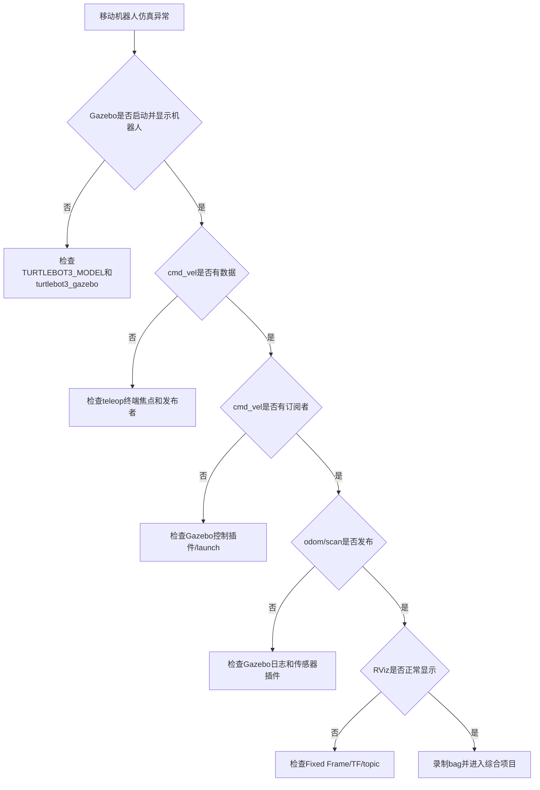

# 第 9 章 仿真与移动机器人入门

## 本章解决什么问题

前面已经完成节点编写、launch 组织和机器人模型显示。本章进入移动机器人系统。移动机器人不再只是 talker/listener，而是由底盘、传感器、里程计、坐标变换、仿真环境和可视化工具组成。

本章不讲复杂 SLAM 或导航算法推导。目标是理解 ROS 如何组织一个移动机器人系统：速度命令从哪里来，里程计在哪里发布，激光雷达数据是什么，Gazebo 和 RViz 各自做什么，TurtleBot3 这样的开源案例为什么适合作为学习平台。

本章仍然坚持一个原则：先观察系统，再解释系统。不应在开始阶段修改导航参数，也不应直接复制大型 launch。先用 CLI 看清楚 `/cmd_vel`、`/odom`、`/scan`、`/tf`，再用 RViz 和 Gazebo 做可视化确认。

## 学习完成后应达到的能力

- 区分 Gazebo 仿真和 RViz 可视化。
- 解释移动机器人系统中 `/cmd_vel`、`/odom`、`/scan`、`/tf` 的作用。
- 启动 TurtleBot3 或同类移动机器人仿真案例。
- 使用键盘控制机器人运动。
- 用 `rostopic echo`、`rostopic hz`、`rostopic info`、`rqt_graph`、RViz 观察系统。
- 初步理解 SLAM、定位、导航在 ROS 系统中的位置。
- 根据常见现象排查模型变量、topic、TF、Fixed Frame（固定参考坐标系）、仿真性能问题。

## 9.1 本章在全书中的位置

第 8 章让机器人“有结构、能显示”。第 9 章让机器人“在仿真世界中运动并产生传感器数据”。第 10 章会把这些能力整理成综合项目。

```mermaid
flowchart LR
  A[URDF/TF/RViz<br/>看见机器人] --> B[Gazebo<br/>模拟世界与物理]
  B --> C[/cmd_vel<br/>速度输入]
  B --> D[/odom<br/>里程计输出]
  B --> E[/scan<br/>激光输出]
  B --> F[/tf<br/>坐标关系]
  D --> G[RViz观察]
  E --> G
  F --> G
  C --> H[键盘控制/导航节点]
```

应关注的不是“Gazebo 窗口能打开”，而是仿真节点是否确实和 ROS topic、TF、RViz 形成闭环。

## 9.2 必须理解的概念

| 概念 | 简明定义 | 容易误解的点 |
|---|---|---|
| Gazebo | 机器人仿真器，模拟世界、物理和传感器 | 不是 RViz，也不是单纯模型查看器 |
| RViz | ROS 数据可视化工具 | 不负责物理仿真 |
| `/cmd_vel` | 移动机器人速度命令 topic | 有数据不一定机器人会动，还要有订阅者和控制插件 |
| `/odom` | 里程计 topic | 通常连续但会漂移，不等于全局真值 |
| `/scan` | 2D 激光雷达扫描 topic | 数据属于激光 frame，需要 TF 才能正确显示 |
| `/tf` | 动态坐标变换 | 移动机器人定位、显示、导航都依赖它 |
| SLAM | 同时定位与建图 | 本章只讲系统位置，不推导算法 |
| 定位 | 在已有地图中估计机器人位姿 | 不等于建图 |
| 导航 | 根据目标点规划并输出速度命令 | 最终通常仍通过 `/cmd_vel` 控制底盘 |

## 9.3 RViz 和 Gazebo 的区别

这一点必须反复强调：

- RViz 是可视化工具，显示 ROS 数据。
- Gazebo 是仿真器，模拟机器人、世界、物理和传感器。

| 问题 | RViz | Gazebo |
|---|---|---|
| 显示机器人模型 | 可以 | 可以 |
| 显示激光雷达数据 | 可以 | 可生成并发布 |
| 模拟重力和碰撞 | 不可以 | 可以 |
| 模拟轮子摩擦和运动 | 不可以 | 可以 |
| 观察 TF 和 map | 可以 | 通常不是主要用途 |
| 产生 `/odom`、`/scan` | 不可以 | 可由插件和仿真模型产生 |

初学者常见误解是：“RViz 中看到机器人，就说明仿真成功了。”不对。RViz 只显示数据。机器人能否在物理世界中动起来，要看 Gazebo、控制器、插件和话题连接。

```mermaid
flowchart TB
  subgraph Gazebo[Gazebo仿真]
    W[world环境]
    R[机器人模型]
    P[物理引擎/传感器插件]
  end
  subgraph ROS[ROS通信层]
    C[/cmd_vel]
    O[/odom]
    S[/scan]
    T[/tf]
  end
  subgraph RViz[RViz可视化]
    V1[RobotModel]
    V2[LaserScan]
    V3[TF/Odometry]
  end
  C --> P
  P --> O
  P --> S
  P --> T
  O --> V3
  S --> V2
  T --> V1
  T --> V3
```

## 9.4 移动机器人最小数据流

一个差速移动机器人最常见的数据流：

```text
键盘/导航节点 -> /cmd_vel -> 底盘/仿真节点 -> /odom
                                      -> /scan
                                      -> /tf
RViz 订阅 /odom /scan /tf /map 等数据显示
```

核心 topic：

| topic | 常见类型 | 方向 | 含义 |
|---|---|---|---|
| `/cmd_vel` | `geometry_msgs/Twist` | 控制输入 | 期望线速度和角速度 |
| `/odom` | `nav_msgs/Odometry` | 状态输出 | 里程计位姿和速度 |
| `/scan` | `sensor_msgs/LaserScan` | 传感器输出 | 2D 激光扫描 |
| `/tf` | `tf2_msgs/TFMessage` | 坐标关系 | 动态坐标变换 |
| `/tf_static` | `tf2_msgs/TFMessage` | 坐标关系 | 静态坐标变换 |
| `/map` | `nav_msgs/OccupancyGrid` | 地图输出 | 栅格地图 |

先看 topic，再看 RViz，是本章的基本方法。因为 RViz 显示异常时，实际原因通常在 topic、消息类型、TF 或 Fixed Frame。

## 9.5 为什么推荐 TurtleBot3 作为学习案例

TurtleBot3 是广泛使用的开源移动机器人平台，资料、仿真、模型、SLAM 和导航示例都比较完整。对教材来说，它的价值在于：

- 有真实机器人和仿真两条路径。
- ROS 生态支持较多。
- topic 和 TF 结构适合教学。
- 可以从键盘控制过渡到 SLAM、导航和综合项目。
- 官方 e-Manual 和 GitHub 仓库提供了相对完整的仿真启动路径。

本书不要求绑定真实硬件，但推荐使用 TurtleBot3 或同类结构作为仿真参考。注意：TurtleBot3 当前主仓库活跃分支已经偏向较新的 ROS 版本，ROS1 Noetic 属于 legacy/noetic 路线；本书使用它是为了 ROS1 教学和历史项目维护，不代表新项目默认优先选择 ROS1。

使用 TurtleBot3 时要明确“学什么”和“不学什么”：

| 用 TurtleBot3 学什么 | 本章不把它扩展成什么 |
|---|---|
| 学习移动机器人系统由哪些节点、topic、TF 和参数组成 | 不把 TurtleBot3 变成完整硬件装配教程 |
| 学习 `/cmd_vel`、`/odom`、`/scan`、`/tf` 的关系 | 不深入推导 SLAM、AMCL、DWA、全局规划算法 |
| 学习 RViz 观察数据、Gazebo 产生仿真世界 | 不把 Gazebo 物理引擎参数调优作为主线 |
| 学习 launch 如何组织机器人 bringup | 不要求学生掌握真实机器人网络、雷达标定和电机驱动 |
| 学习从 demo 走向综合项目的系统拆解方法 | 不把 ROS2 的 `ros2 launch` 命令混入 ROS1 Noetic 主线 |

特别注意官方资料版本。TurtleBot3 e-Manual 当前页面会出现 ROS2 Humble 等新版本命令，例如 `ros2 launch ...`。这些资料仍然适合学习“仿真系统如何组织、RViz 和 Gazebo 如何分工、fake node 和 Gazebo 有什么区别”，但本书命令必须使用 ROS1 Noetic 对应的包、分支和 `roslaunch` 形式。看到 `ros2`、`colcon`、`ament`、`rviz2` 时，要知道那是 ROS2 体系，不应直接复制到本书实验中。

> 边界说明：本章固定采用 TurtleBot3 Noetic + Gazebo Classic 作为 ROS1 教学路线。若查到的是 ROS2、`colcon`、`rviz2` 或现代 Gazebo 的命令，不应直接复制到本章实验中。它们属于不同技术栈，不在本书当前实验边界内。

## 9.6 安装 TurtleBot3 仿真包

TurtleBot3 仿真包有两条常见获取路径：官方源码路径和 apt 快捷路径。为了和 TurtleBot3 e-Manual 的 ROS1 Noetic 说明保持一致，本书建议课堂主线优先采用 noetic 分支源码安装；如果当前软件源中已经提供对应二进制包，也可以用 apt 快速安装。

### 官方源码路径

确认已有工作空间：

```bash
source /opt/ros/noetic/setup.bash
mkdir -p ~/catkin_ws/src
cd ~/catkin_ws/src
```

安装 TurtleBot3 基础包和消息包。如果 apt 可用，可先安装基础依赖：

```bash
sudo apt update
sudo apt install -y ros-noetic-turtlebot3 ros-noetic-turtlebot3-msgs
```

再按官方 e-Manual 的 Noetic 路线获取仿真包：

```bash
cd ~/catkin_ws/src
git clone -b noetic https://github.com/ROBOTIS-GIT/turtlebot3_simulations.git
cd ~/catkin_ws
catkin_make
source ~/catkin_ws/devel/setup.bash
```

验证：

```bash
rospack find turtlebot3_gazebo
rospack find turtlebot3_teleop
```

如果 `turtlebot3_teleop` 不存在，说明基础 TurtleBot3 包没有安装完整。回到 apt 安装基础包，或按 TurtleBot3 官方仓库说明补齐 noetic 分支源码。

### apt 快捷路径

如果当前 ROS 软件源中提供完整二进制包，可以直接尝试：

```bash
sudo apt update
sudo apt install -y ros-noetic-turtlebot3 ros-noetic-turtlebot3-simulations
```

设置模型变量：

```bash
echo "export TURTLEBOT3_MODEL=burger" >> ~/.bashrc
source ~/.bashrc
echo $TURTLEBOT3_MODEL
```

常见模型：

- `burger`
- `waffle`
- `waffle_pi`

模型变量不是装饰。很多 TurtleBot3 launch 文件会根据 `TURTLEBOT3_MODEL` 决定加载哪个模型。如果变量缺失或拼错，可能直接启动失败。

如果 `apt` 找不到包，先检查：

```bash
lsb_release -a
echo $ROS_DISTRO
apt search ros-noetic-turtlebot3
```

如果 apt 没有完整包，不应反复更换命令进行试探。优先回到上面的官方源码路径，确认分支是 `noetic`，确认工作空间已经 `catkin_make` 并 source。

## 9.7 启动 Gazebo 仿真

运行：

```bash
source /opt/ros/noetic/setup.bash
source ~/catkin_ws/devel/setup.bash
export TURTLEBOT3_MODEL=burger
roslaunch turtlebot3_gazebo turtlebot3_world.launch
```

官方 TurtleBot3 e-Manual 中 ROS1 Noetic 路线也使用 `roslaunch turtlebot3_gazebo turtlebot3_world.launch` 这一类启动方式。还有 empty world 和 house world 等环境，本章使用 `turtlebot3_world.launch` 作为主线。

正确现象：

- Gazebo 打开。
- 世界中出现 TurtleBot3。
- 终端没有持续报 fatal error。
- `rostopic list` 中能看到 `/cmd_vel`、`/odom`、`/scan`、`/tf` 等关键 topic。

如果 Gazebo 很慢：

- 虚拟机显卡性能可能不足。
- 降低 Gazebo 窗口大小。
- 关闭其他程序。
- 优先在原生 Ubuntu 或较高配置虚拟机中运行。
- 先用 `rostopic list` 判断 ROS 通信是否正常，再判断是否只是图形性能问题。

慢不等于 ROS 通信错误。先区分性能问题和 topic/TF 问题。

## 9.8 键盘控制

另开终端：

```bash
source /opt/ros/noetic/setup.bash
source ~/catkin_ws/devel/setup.bash
export TURTLEBOT3_MODEL=burger
roslaunch turtlebot3_teleop turtlebot3_teleop_key.launch
```

保持该终端焦点，按提示按键控制机器人。

观察速度命令：

```bash
rostopic echo /cmd_vel
```

查看连接关系：

```bash
rostopic info /cmd_vel
```

应关注：

- Publishers 中是否有键盘控制节点。
- Subscribers 中是否有 Gazebo 或底盘控制相关节点。

如果按键后 `/cmd_vel` 有数据，但 Gazebo 中机器人不动，说明问题可能在仿真节点、控制插件或 topic 连接，而不是键盘节点。

## 9.9 观察移动机器人 topic

运行：

```bash
rostopic list
rostopic info /cmd_vel
rostopic echo /odom
rostopic echo /scan
```

查看消息类型：

```bash
rostopic type /cmd_vel
rostopic type /odom
rostopic type /scan
```

查看结构：

```bash
rosmsg show geometry_msgs/Twist
rosmsg show nav_msgs/Odometry
rosmsg show sensor_msgs/LaserScan
```

观察频率：

```bash
rostopic hz /odom
rostopic hz /scan
```

解释：

- `/cmd_vel` 是控制输入。
- `/odom` 是机器人根据轮速/仿真状态估计的局部运动。
- `/scan` 是激光雷达扫描。
- `/tf` 把各坐标系连接起来。

### 三个消息类型要看什么

| 类型 | 关键字段 | 初学观察重点 |
|---|---|---|
| `geometry_msgs/Twist` | `linear.x`、`angular.z` | 前进速度和转向速度 |
| `nav_msgs/Odometry` | `pose.pose`、`twist.twist`、`header.frame_id`、`child_frame_id` | 位姿、速度、所属 frame |
| `sensor_msgs/LaserScan` | `angle_min/max`、`ranges`、`header.frame_id` | 扫描角度范围、距离数组、激光 frame |

如果只会看数值，不看 `frame_id`，后面进入建图和导航时会容易迷失。

## 9.10 用 RViz 观察

启动 RViz 配置：

```bash
export TURTLEBOT3_MODEL=burger
roslaunch turtlebot3_gazebo turtlebot3_gazebo_rviz.launch
```

如果该 launch 文件在当前安装中不存在，可手动运行：

```bash
rviz
```

常用显示项：

- RobotModel
- TF
- LaserScan
- Odometry
- Map

RViz 中最常见问题是 Fixed Frame（固定参考坐标系）。移动机器人中常用：

- `odom`：看局部运动。
- `map`：看建图/导航结果。
- `base_link`：看机器人本体。

如果 RViz 报 `Fixed Frame does not exist`，先用：

```bash
rosrun tf view_frames
rostopic echo /tf
```

确认 TF 是否存在。

### 预期成果图

在 RViz 中，应能得到下面这种逻辑视图：

```text
RViz 视图

  LaserScan: 一圈或扇形激光点云/线段
  RobotModel: TurtleBot3 机器人模型
  TF: odom -> base_footprint/base_link -> base_scan 等坐标轴
  Odometry: 机器人局部运动轨迹或箭头
```

在 Gazebo 中，应能看到：

```text
Gazebo 视图

  世界: turtlebot3_world 中的墙体/障碍物
  机器人: TurtleBot3 burger/waffle/waffle_pi
  行为: 键盘按键后机器人前进、后退或转向
```

RViz 和 Gazebo 的画面应该互相解释：Gazebo 中机器人靠近墙，RViz 中 LaserScan 对应方向的距离应变短。如果两者完全对不上，优先检查 TF、Fixed Frame 和仿真是否暂停。

## 9.11 录制关键数据

移动机器人实验必须养成记录数据的习惯。录制：

```bash
mkdir -p ~/bagfiles/turtlebot3_intro
cd ~/bagfiles/turtlebot3_intro
rosbag record -O tb3_intro /cmd_vel /odom /scan /tf /tf_static /rosout
```

停止后查看：

```bash
rosbag info tb3_intro.bag
```

这份 bag 文件可以用于：

- 回放 `/scan` 观察激光数据。
- 回放 `/odom` 观察里程计变化。
- 给后续算法节点提供固定输入。
- 课堂上复现同一段运动数据。

但它不能完整复现 Gazebo 世界状态、键盘操作过程和所有参数。bag 记录的是 topic 消息，不是整个仿真进程。

## 9.12 SLAM、定位和导航的最小概念

本章不展开算法，只建立系统位置。

### SLAM

SLAM 是 Simultaneous Localization and Mapping，同时定位与建图。输入通常包括激光、里程计和 TF，输出地图和机器人位姿估计。

ROS 系统中，SLAM 节点可能订阅：

- `/scan`
- `/odom`
- `/tf`

并发布：

- `/map`
- `map -> odom` 相关 TF

### 定位

定位是在已有地图中估计机器人位置。常见工具如 AMCL。它不主要负责建图，而是结合地图、激光和运动模型估计当前位姿。

### 导航

导航通常包含：

- 全局路径规划。
- 局部避障。
- 速度命令输出。
- 代价地图。
- 目标点管理。

导航最终通常向 `/cmd_vel` 发布速度命令。

```mermaid
flowchart LR
  scan[/scan] --> slam[SLAM]
  odom[/odom] --> slam
  tf[/tf] --> slam
  slam --> map[/map]
  map --> loc[定位AMCL等]
  scan --> loc
  tf --> loc
  loc --> nav[导航]
  map --> nav
  nav --> cmd[/cmd_vel]
```

本书后续不把导航算法写成重点，只把它作为 ROS 系统集成案例。现在最重要的是知道这些模块在 ROS 图里怎样连接。

## 9.13 最小可运行实验

### 实验目标

启动移动机器人仿真，观察控制输入、里程计、激光和 TF，并录制一段关键数据。

### 前置条件

- Ubuntu 20.04 + ROS Noetic。
- 已完成第 3 章安装。
- 图形环境能运行 Gazebo 和 RViz。

### 操作步骤

安装仿真依赖。优先使用官方源码路径：

```bash
sudo apt update
sudo apt install -y ros-noetic-turtlebot3 ros-noetic-turtlebot3-msgs
cd ~/catkin_ws/src
git clone -b noetic https://github.com/ROBOTIS-GIT/turtlebot3_simulations.git
cd ~/catkin_ws
catkin_make
source ~/catkin_ws/devel/setup.bash
```

如果当前软件源中已经有完整二进制包，也可以使用 apt 快捷路径：

```bash
sudo apt update
sudo apt install -y ros-noetic-turtlebot3 ros-noetic-turtlebot3-simulations
```

设置模型：

```bash
export TURTLEBOT3_MODEL=burger
```

启动仿真：

```bash
roslaunch turtlebot3_gazebo turtlebot3_world.launch
```

启动键盘控制：

```bash
export TURTLEBOT3_MODEL=burger
roslaunch turtlebot3_teleop turtlebot3_teleop_key.launch
```

观察：

```bash
rostopic list
rostopic info /cmd_vel
rostopic echo /cmd_vel
rostopic echo /odom
rostopic echo /scan
rostopic hz /scan
rosrun tf view_frames
rqt_graph
```

启动 RViz：

```bash
rviz
```

在 RViz 中添加 TF、RobotModel、LaserScan、Odometry。

录制关键数据：

```bash
mkdir -p ~/bagfiles/turtlebot3_intro
cd ~/bagfiles/turtlebot3_intro
rosbag record -O tb3_intro /cmd_vel /odom /scan /tf /tf_static /rosout
```

停止后检查：

```bash
rosbag info tb3_intro.bag
```

### 正确现象

- Gazebo 中机器人可被键盘控制。
- `/cmd_vel` 在按键时有速度命令。
- `/odom` 持续输出位姿和速度。
- `/scan` 持续输出激光距离数组。
- `rqt_graph` 能看到 teleop、Gazebo、robot_state_publisher 等节点之间的关系。
- RViz 能显示机器人、TF 和 LaserScan。
- bag 文件包含关键 topic，可用 `rosbag info` 查看。

### 实验复盘

| 观察对象 | 正确现象 | 如果异常先查 |
|---|---|---|
| Gazebo | 机器人出现在 world 中 | `TURTLEBOT3_MODEL`、包是否安装 |
| `/cmd_vel` | 按键时有 Twist 数据 | teleop 终端焦点、`rostopic info /cmd_vel` |
| `/odom` | 持续发布 Odometry | Gazebo 是否运行、控制插件日志 |
| `/scan` | 持续发布 LaserScan | 传感器插件、`rostopic hz /scan` |
| TF | 有 odom/base/scan 等 frame | `rosrun tf view_frames` |
| RViz | RobotModel/LaserScan 正常显示 | Fixed Frame、topic 名、TF 路径 |
| bag | 包含关键 topic | `rosbag info` |

## 9.14 高频错误与排查

| 现象 | 高概率原因 | 第一检查命令 | 修复思路 |
|---|---|---|---|
| `TURTLEBOT3_MODEL` 未设置 | 环境变量缺失 | `echo $TURTLEBOT3_MODEL` | `export TURTLEBOT3_MODEL=burger` |
| Gazebo 中没有机器人 | 模型变量或包缺失 | `rospack find turtlebot3_gazebo` | 安装仿真包，检查模型名 |
| 键盘控制无效 | teleop 终端没有焦点 | `rostopic echo /cmd_vel` | 点击 teleop 终端，确认有速度数据 |
| `/cmd_vel` 有数据但机器人不动 | 仿真控制插件或 topic 连接问题 | `rostopic info /cmd_vel` | 确认 Gazebo 侧订阅者存在 |
| RViz Fixed Frame 报错 | TF 不完整或 frame 名错 | `rosrun tf view_frames` | 改 Fixed Frame 或补 TF |
| `/scan` 没数据 | 仿真未启动或传感器插件未运行 | `rostopic info /scan` | 检查 Gazebo 日志和模型 |
| 仿真运行缓慢 | 图形性能不足 | `top`; 观察 Gazebo 实时率 | 降低负载，换原生 Ubuntu |
| bag 文件巨大 | 录制过多 topic | `rosbag info` | 只录关键 topic |

### 排障树



## 9.15 本章自测

1. RViz 和 Gazebo 的根本区别是什么？
2. `/cmd_vel`、`/odom`、`/scan` 分别属于控制输入还是状态/传感器输出？
3. 为什么移动机器人必须维护 TF？
4. 如果 `/cmd_vel` 有数据但机器人不动，应按什么顺序排查？
5. `rostopic hz /scan` 能帮助判断什么？
6. SLAM、定位、导航三者的关系是什么？
7. 为什么本书不在本章展开复杂导航算法？
8. 为什么 TurtleBot3 适合作为教学案例？
9. bag 能记录移动机器人实验的哪些内容？不能记录哪些内容？
10. Gazebo 运行缓慢时，为什么不能立刻判断 ROS 通信出错？

### 参考答案

1. RViz 显示 ROS 数据，例如模型、TF、LaserScan、Odometry 和 Map；Gazebo 模拟物理世界、机器人运动、碰撞、传感器和环境交互。简单说，RViz 是“看数据”，Gazebo 是“产生仿真数据并模拟物理”。两者经常一起用，但职责不同。

2. `/cmd_vel` 是控制输入，通常由键盘、导航或工具节点发布，消息类型常为 `geometry_msgs/Twist`。`/odom` 是状态输出，通常由底盘或仿真发布，表示局部里程计位姿和速度。`/scan` 是传感器输出，通常由激光雷达或仿真插件发布，表示二维激光距离数组。

3. 移动机器人中的激光、车体、轮子、里程计和地图都处在不同坐标系中。TF 让系统知道 `/scan` 属于哪个激光 frame、机器人本体在 `odom` 中的位置、地图和里程计之间如何关联。没有 TF，RViz 可能无法显示数据，SLAM 和导航也无法正确融合传感器与位姿。

4. 先用 `rostopic info /cmd_vel` 看是否有 Gazebo 或底盘控制节点订阅；再看 `rostopic echo /cmd_vel` 中速度值是否非零；然后检查 Gazebo 是否暂停、模型控制插件是否加载、终端是否报错；最后检查 topic 名是否被命名空间或 remap 改变。不能只因为 `/cmd_vel` 有数据就认定控制链路完整。

5. `rostopic hz /scan` 能判断激光雷达数据是否持续发布，以及发布频率是否大致稳定。如果频率为 0 或长时间无输出，说明传感器插件、仿真状态或 topic 连接可能有问题；如果频率很低，可能是仿真性能不足或系统负载过高。

6. SLAM 同时估计机器人位姿并建立地图，通常输出 `/map` 和 `map -> odom` 相关 TF；定位是在已有地图中估计当前位姿，例如 AMCL；导航根据地图、定位、目标点和障碍物规划路径，并最终输出 `/cmd_vel`。它们关系是：建图得到地图，定位使用地图估计位置，导航使用位置和地图生成运动命令。

7. 本书目标是 ROS1 入门，不是算法教材。SLAM、定位和导航内部涉及概率、优化、栅格地图、代价地图和路径规划等复杂内容，如果本章展开会偏离主线。这里重点是理解这些模块在 ROS 系统中的输入、输出和连接方式，为后续深入算法打基础。

8. TurtleBot3 有成熟的开源模型、仿真世界、键盘控制、SLAM 和导航示例，topic 和 TF 结构也适合教学。学生可以先在仿真中观察 `/cmd_vel`、`/odom`、`/scan`、`/tf`，再逐步理解真实移动机器人系统。它的资料和社区问题较多，也便于排障。

9. bag 能记录 topic 消息，例如 `/cmd_vel`、`/odom`、`/scan`、`/tf`、`/tf_static` 和 `/rosout`，用于回放传感器与状态数据。它不能完整记录 Gazebo 世界内部状态、节点源代码、所有参数变化、键盘操作意图或外部文件。要复现实验，还需要 README、launch、参数和依赖说明。

10. Gazebo 卡顿可能是图形性能、CPU/GPU 资源、虚拟机加速、仿真实时率或显示环境问题，不等于 ROS 通信出错。应先用 `rostopic list`、`rostopic hz /scan`、`rostopic echo /odom` 判断数据是否仍在发布。如果 topic 正常但画面慢，问题更可能在仿真性能层。

## 9.16 本章小结

本章把前面的 ROS 基础能力应用到移动机器人系统。可以看到，实际机器人系统仍然可以分解为节点、topic、参数、TF 和 launch。区别只是数据类型更复杂，节点更多，坐标关系更重要。

进入综合项目之前，应熟悉以下观察路径：

```text
rosnode list -> rostopic list -> rostopic info -> rostopic echo/hz -> rosrun tf view_frames -> rqt_graph -> RViz/Gazebo
```

不应采用试探式方式直接修改参数。应先观察系统实际状态。

本章最重要的能力不是“启动某个世界文件”，而是能把移动机器人仿真拆成可观察链路：

```text
键盘或控制节点 -> /cmd_vel -> 差速底盘插件/控制器 -> /odom 与 /tf -> RViz 观察位姿
Gazebo 世界 -> 传感器插件 -> /scan 或 /camera/... -> RViz/算法节点观察数据
```

如果机器人不动，先查 `/cmd_vel` 是否有数据，再查仿真底盘节点是否订阅它；如果 RViz 中激光不显示，先查 `/scan` 是否有发布者和频率，再查 Fixed Frame 与 TF；如果 Gazebo 有模型但 RViz 没有模型，通常说明可视化链路或 TF/URDF 链路有问题，不等于物理仿真一定失败。把这些链路分开看，是进入第 10 章综合项目的前提。

## 延伸阅读

- TurtleBot3 e-Manual 仿真页面：https://emanual.robotis.com/docs/en/platform/turtlebot3/simulation/
- TurtleBot3 GitHub：https://github.com/ROBOTIS-GIT/turtlebot3
- TurtleBot3 simulations GitHub：https://github.com/ROBOTIS-GIT/turtlebot3_simulations
- ROS Tutorials 总目录：https://mirror.umd.edu/roswiki/ROS%282f%29Tutorials.html
- Gazebo ROS Wiki：https://mirror.umd.edu/roswiki/gazebo.html
- Gazebo URDF 教程：https://get.gazebosim.org/tutorials/?tut=ros_urdf
- Autolabor ROS 使用文档：https://autolaborcenter.github.io/pm1-docs-sphinx/user-guide/using-ros/doc.html
