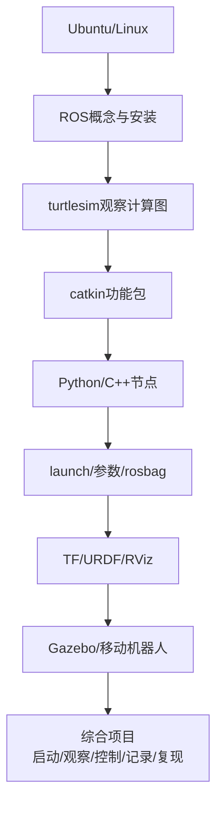
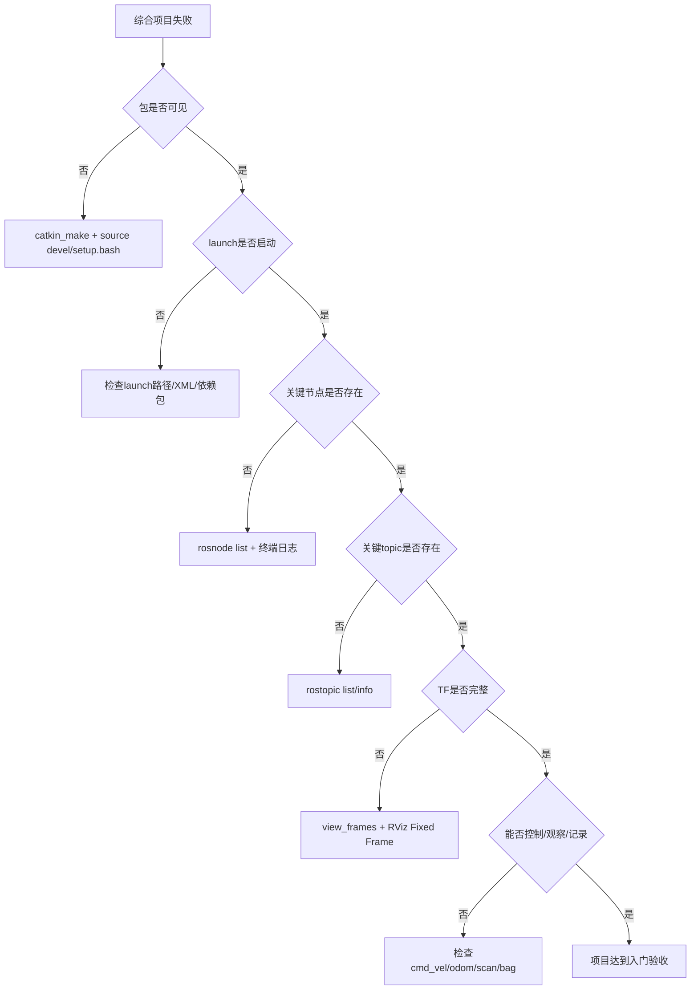

# 第 10 章 综合项目

## 本章解决什么问题

前九章分别学习了 Ubuntu、ROS 概念、安装、turtlesim、catkin、节点编程、launch/参数/bag、TF/URDF/RViz、Gazebo 与移动机器人。本章把这些内容合成一个小型综合项目。

项目目标不是堆功能，也不是一步到位实现完整自动导航。目标是建立一个能启动、能观察、能控制、能记录、能复现的 ROS1 系统。一个项目如果只能在作者电脑上靠手动开多个终端运行，不能算合格的 ROS 工程。

本章给出综合项目的结构、交付物、验收流程和排障路径。你可以基于 TurtleBot3 仿真，也可以基于前面自定义的 `my_robot_description` 继续扩展。关键是系统必须清楚、可解释、可复现。

## 学完以后你应该能做到

- 设计一个小型 ROS1 移动机器人仿真项目目录。
- 把模型、启动、参数、脚本和记录流程分开。
- 用一个 bringup launch 启动核心系统。
- 用 CLI 和 RViz/Gazebo 观察系统。
- 录制并回放关键 topic。
- 编写项目说明，解释节点、topic、参数和 TF。
- 按验收标准判断项目是否真的可复现。

## 10.1 本章在全书中的位置

本章不是新的孤立知识点，而是对前九章的整合验收。



如果你无法解释综合项目中的每个包、每个节点、每条关键 topic 和每个参数，那么项目即使能启动，也只是“跑起来了”，还不算真正学会。

## 10.2 项目目标与边界

最低目标：

- 一条命令启动主体系统。
- 系统中至少有一个机器人模型或仿真案例。
- 能通过 `/cmd_vel` 控制运动或模拟运动。
- 能观察关键 topic。
- 能显示 TF 或机器人模型。
- 能录制 rosbag 并回放。
- 有清晰文档说明。

建议目标：

- 使用 `my_robot_description` 管理 URDF。
- 使用 `my_robot_bringup` 管理 launch 和参数。
- 使用 `my_robot_tools` 放置辅助脚本。
- 提供 RViz 配置。
- 提供 bag 录制脚本说明。
- 提供一份“启动后检查清单”。

不要求：

- 完整自动导航。
- 真实硬件驱动。
- 复杂 SLAM 参数调优。
- 多机器人系统。
- 跨平台部署。

本章仍只围绕 ROS1 Noetic 基础项目整合，不扩展平台部署主题。

## 10.3 项目总体架构

推荐采用“三包结构”：description、bringup、tools。

```mermaid
flowchart LR
  A[my_robot_description<br/>URDF/RViz模型] --> B[my_robot_bringup<br/>launch/config]
  C[my_robot_tools<br/>辅助脚本] --> B
  B --> D[Gazebo/TurtleBot3仿真]
  B --> E[RViz可视化]
  C --> F[/cmd_vel]
  D --> G[/odom /scan /tf]
  F --> D
  G --> E
  G --> H[rosbag record]
```

包分层的目的：

| 包 | 职责 | 不应该放什么 |
|---|---|---|
| `my_robot_description` | URDF、mesh、RViz 模型配置 | 不放系统总启动逻辑 |
| `my_robot_bringup` | 总 launch、参数、组合启动 | 不放大量业务算法代码 |
| `my_robot_tools` | 小工具节点、测试脚本 | 不放机器人结构描述 |

这个结构参考了很多成熟 ROS 项目的组织方式：描述包负责“机器人长什么样”，bringup 包负责“系统怎样启动”，tools 或 demos 包负责“辅助测试和演示”。这比把所有文件塞进一个包更容易维护。

## 10.4 推荐项目结构

工作空间：

```text
catkin_ws/
  src/
    my_robot_description/
      package.xml
      CMakeLists.txt
      urdf/
        simple_diff_drive.urdf
      launch/
        display.launch
      rviz/
        model.rviz
    my_robot_bringup/
      package.xml
      CMakeLists.txt
      launch/
        simulation.launch
        observe.launch
        record.launch
      config/
        robot.yaml
    my_robot_tools/
      package.xml
      CMakeLists.txt
      scripts/
        cmd_vel_publisher.py
```

分工：

- `description`：只放机器人描述和显示相关内容。
- `bringup`：只放系统启动入口、参数和组合 launch。
- `tools`：放简单工具节点。

不要把 URDF、控制脚本、bag 命令、RViz 配置全部塞进一个包。一个目录能跑，不代表它适合教学、协作和复现。

## 10.5 创建 bringup 包

```bash
source ~/catkin_ws/devel/setup.bash
cd ~/catkin_ws/src
catkin_create_pkg my_robot_bringup rospy roscpp std_msgs geometry_msgs
cd my_robot_bringup
mkdir -p launch config
```

编译：

```bash
cd ~/catkin_ws
catkin_make
source ~/catkin_ws/devel/setup.bash
```

验证：

```bash
rospack find my_robot_bringup
```

正确输出应指向：

```text
/home/你的用户名/catkin_ws/src/my_robot_bringup
```

如果找不到，回到第 5 章检查：包是否在 `src/`，是否编译，是否 source 了 `devel/setup.bash`。

## 10.6 参数文件

创建：

```bash
roscd my_robot_bringup
nano config/robot.yaml
```

写入：

```yaml
robot:
  name: "textbook_bot"
  model: "burger"
  max_linear_speed: 0.3
  max_angular_speed: 0.8
simulation:
  use_sim_time: true
topics:
  cmd_vel: "/cmd_vel"
  odom: "/odom"
  scan: "/scan"
frames:
  fixed_frame: "odom"
  base_frame: "base_link"
  laser_frame: "base_scan"
```

解释：

| 参数 | 含义 |
|---|---|
| `robot.name` | 项目中的机器人名称 |
| `robot.model` | TurtleBot3 模型或自定义模型名 |
| `max_linear_speed` | 工具节点或说明文档中的线速度上限 |
| `max_angular_speed` | 工具节点或说明文档中的角速度上限 |
| `simulation.use_sim_time` | 仿真项目通常使用仿真时间 |
| `topics.*` | 统一记录关键 topic 名 |
| `frames.*` | 统一记录 RViz/TF 使用的关键 frame |

参数文件不是装饰品。后续项目文档要解释每个参数的含义。若某个参数没有任何节点读取，也要在说明中写清楚它只是文档化配置，还是未来扩展预留。

## 10.7 一个最小速度发布工具

创建工具包：

```bash
cd ~/catkin_ws/src
catkin_create_pkg my_robot_tools rospy geometry_msgs
cd my_robot_tools
mkdir -p scripts
```

创建脚本：

```bash
nano scripts/cmd_vel_publisher.py
```

写入：

```python
#!/usr/bin/env python3
import rospy
from geometry_msgs.msg import Twist


def clamp(value: float, limit: float) -> float:
    return max(-limit, min(limit, value))


def main() -> None:
    rospy.init_node("cmd_vel_publisher")
    pub = rospy.Publisher("/cmd_vel", Twist, queue_size=10)

    max_linear = float(rospy.get_param("~max_linear_speed", 0.3))
    max_angular = float(rospy.get_param("~max_angular_speed", 0.8))
    linear = clamp(float(rospy.get_param("~linear_x", 0.1)), max_linear)
    angular = clamp(float(rospy.get_param("~angular_z", 0.0)), max_angular)
    duration = float(rospy.get_param("~duration", 3.0))
    rate = rospy.Rate(10.0)

    msg = Twist()
    msg.linear.x = linear
    msg.angular.z = angular

    start = rospy.Time.now()
    while not rospy.is_shutdown() and (rospy.Time.now() - start).to_sec() < duration:
        pub.publish(msg)
        rate.sleep()

    pub.publish(Twist())
    rospy.loginfo("cmd_vel_publisher finished")


if __name__ == "__main__":
    main()
```

加权限：

```bash
chmod +x scripts/cmd_vel_publisher.py
```

编译：

```bash
cd ~/catkin_ws
catkin_make
source ~/catkin_ws/devel/setup.bash
```

这个节点不是复杂控制器，只是一个可测试的小工具：发布几秒速度，然后停止。它帮助你验证 `/cmd_vel` 链路是否有效。加入限幅是为了养成安全习惯，即使是在仿真中也不应该无约束地发布速度。

## 10.8 simulation.launch

如果使用 TurtleBot3 仿真，先确认仿真包可用：

```bash
source /opt/ros/noetic/setup.bash
source ~/catkin_ws/devel/setup.bash
rospack find turtlebot3_gazebo
rospack find turtlebot3_teleop
```

如果找不到 `turtlebot3_gazebo`，按第 9 章的官方 Noetic 源码路径准备依赖：

```bash
sudo apt update
sudo apt install -y ros-noetic-turtlebot3 ros-noetic-turtlebot3-msgs
cd ~/catkin_ws/src
git clone -b noetic https://github.com/ROBOTIS-GIT/turtlebot3_simulations.git
cd ~/catkin_ws
catkin_make
source ~/catkin_ws/devel/setup.bash
```

如果你的 ROS 软件源已经提供完整二进制包，也可以用：

```bash
sudo apt install -y ros-noetic-turtlebot3 ros-noetic-turtlebot3-simulations
```

确认依赖后，创建：

```bash
roscd my_robot_bringup
nano launch/simulation.launch
```

写入：

```xml
<launch>
  <arg name="model" default="burger" />
  <arg name="world" default="turtlebot3_world.launch" />

  <env name="TURTLEBOT3_MODEL" value="$(arg model)" />

  <rosparam command="load" file="$(find my_robot_bringup)/config/robot.yaml" />
  <param name="/use_sim_time" value="true" />

  <include file="$(find turtlebot3_gazebo)/launch/$(arg world)" />
</launch>
```

启动：

```bash
roslaunch my_robot_bringup simulation.launch
```

切换模型：

```bash
roslaunch my_robot_bringup simulation.launch model:=waffle
```

切换世界：

```bash
roslaunch my_robot_bringup simulation.launch world:=turtlebot3_empty_world.launch
```

另开终端观察：

```bash
source ~/catkin_ws/devel/setup.bash
rosnode list
rostopic list
rostopic echo /odom
rostopic echo /scan
```

如果不使用 TurtleBot3，可以把 include 替换为自己模型的 Gazebo 或 RViz launch。但本书主线推荐先使用成熟的 TurtleBot3 仿真包，因为它已经处理了大量 URDF、Gazebo 插件、传感器和 TF 细节，适合学生把注意力放在 ROS 系统观察上。

## 10.9 observe.launch

综合项目应有一个观察入口。可以把 RViz 和常用观察工具说明分开处理。创建：

```bash
roscd my_robot_bringup
nano launch/observe.launch
```

写入：

```xml
<launch>
  <arg name="rviz_config" default="" />

  <node if="$(eval rviz_config == '')"
        name="rviz"
        pkg="rviz"
        type="rviz"
        output="screen" />

  <node unless="$(eval rviz_config == '')"
        name="rviz"
        pkg="rviz"
        type="rviz"
        args="-d $(arg rviz_config)"
        output="screen" />
</launch>
```

初学阶段可以直接：

```bash
roslaunch my_robot_bringup observe.launch
```

在 RViz 中手动添加：

- TF
- RobotModel
- LaserScan：topic 选择 `/scan`
- Odometry：topic 选择 `/odom`

配置好后，在 RViz 中 File -> Save Config As，保存到：

```text
my_robot_description/rviz/model.rviz
```

以后可以用：

```bash
roslaunch my_robot_bringup observe.launch rviz_config:=$(rospack find my_robot_description)/rviz/model.rviz
```

这一步让“可视化配置”也变成项目的一部分，而不是每次靠手动设置。

## 10.10 record.launch 与数据记录

rosbag 通常直接命令行使用最清楚：

```bash
mkdir -p ~/bagfiles/textbook_bot
cd ~/bagfiles/textbook_bot
rosbag record -O textbook_bot_run /cmd_vel /odom /scan /tf /tf_static /rosout
```

查看：

```bash
rosbag info textbook_bot_run.bag
```

回放：

```bash
rosbag play textbook_bot_run.bag
```

如果希望把记录动作也写成 launch，可以创建：

```bash
roscd my_robot_bringup
nano launch/record.launch
```

写入：

```xml
<launch>
  <arg name="bag_name" default="textbook_bot_run" />
  <node name="rosbag_record"
        pkg="rosbag"
        type="record"
        args="-O $(arg bag_name) /cmd_vel /odom /scan /tf /tf_static /rosout"
        output="screen" />
</launch>
```

运行前进入保存目录：

```bash
mkdir -p ~/bagfiles/textbook_bot
cd ~/bagfiles/textbook_bot
roslaunch my_robot_bringup record.launch bag_name:=textbook_bot_run
```

项目文档中必须说明：

- 录了哪些 topic。
- 为什么录这些 topic。
- 回放时需要启动哪些订阅者。
- 哪些 topic 是仿真产生，哪些是控制输入。
- bag 文件是否纳入提交。如果文件很大，应只提交说明，不提交大文件。

## 10.11 项目数据流

综合项目至少要能画出自己的数据流。对于 TurtleBot3 仿真版本，可以写成：

```mermaid
flowchart LR
  A[teleop或cmd_vel_publisher] -->|geometry_msgs/Twist| B[/cmd_vel]
  B --> C[Gazebo/TurtleBot3控制插件]
  C -->|nav_msgs/Odometry| D[/odom]
  C -->|sensor_msgs/LaserScan| E[/scan]
  C -->|tf2_msgs/TFMessage| F[/tf /tf_static]
  D --> G[RViz Odometry]
  E --> H[RViz LaserScan]
  F --> I[RViz TF/RobotModel]
  B --> J[rosbag]
  D --> J
  E --> J
  F --> J
```

这张图比“运行了哪些命令”更重要。它能说明系统为什么可观察、可记录、可复现。

## 10.12 项目观察清单

每次启动项目后，按这个顺序观察：

```bash
rosnode list
rostopic list
rostopic info /cmd_vel
rostopic echo /odom
rostopic echo /scan
rostopic hz /scan
rosparam list
rosrun tf view_frames
rqt_graph
```

RViz 中观察：

- Fixed Frame 是否正确。
- RobotModel 是否显示。
- TF 是否完整。
- LaserScan 是否出现。
- Odometry 是否更新。

Gazebo 中观察：

- 机器人是否出现。
- 机器人是否能运动。
- 仿真是否卡顿。
- 终端是否报错。

### 预期成果图

项目完成后，学生应能展示三类成果：

```text
1. Gazebo成果
   TurtleBot3 出现在 world 中，能通过键盘或工具节点运动。

2. RViz成果
   能看到 RobotModel、TF、LaserScan、Odometry，Fixed Frame 正确。

3. 数据成果
   rosbag info 显示 /cmd_vel、/odom、/scan、/tf、/tf_static 等关键 topic。
```

这三类成果分别对应“仿真存在”“ROS 数据可视化”“实验可复现”。

## 10.13 项目说明文档模板

每个项目至少写一份 `README.md`，包含：

````markdown
# 项目名称

## 项目目标

说明本项目要完成什么，不要只写“学习 ROS”。

## 环境

- Ubuntu 20.04
- ROS Noetic
- 依赖包

## 包结构

说明 description、bringup、tools 等包的职责。

## 启动方法

```bash
roslaunch my_robot_bringup simulation.launch
```

## 观察方法

```bash
rosnode list
rostopic list
rostopic info /cmd_vel
rostopic echo /odom
rostopic echo /scan
rqt_graph
```

## 节点说明

| 节点 | 作用 | 发布 | 订阅 |
|---|---|---|---|

## Topic 说明

| Topic | 类型 | 含义 |
|---|---|---|

## 参数说明

| 参数 | 默认值 | 含义 |
|---|---|---|

## TF 说明

画出或列出关键 frame，例如 `odom -> base_link -> base_scan`。

## rosbag 录制与回放

说明录制命令、topic、文件保存位置和回放方法。

## 常见错误

列出本项目中最容易发生的 3-5 个错误和检查命令。
````

文档不是形式主义。它迫使你解释系统结构，也让别人能复现你的项目。

## 10.14 最小可运行实验与验收流程

### 启动

```bash
source ~/catkin_ws/devel/setup.bash
roslaunch my_robot_bringup simulation.launch
```

### 观察节点

```bash
rosnode list
```

最低要求：能看到 Gazebo、robot_state_publisher 或移动机器人相关节点。

### 观察 topic

```bash
rostopic list
rostopic info /cmd_vel
rostopic echo /odom
rostopic echo /scan
```

最低要求：

- `/cmd_vel` 有订阅者。
- `/odom` 有发布者。
- `/scan` 有发布者。

### 控制

可以使用 TurtleBot3 teleop：

```bash
roslaunch turtlebot3_teleop turtlebot3_teleop_key.launch
```

或使用自己写的工具：

```bash
rosrun my_robot_tools cmd_vel_publisher.py _linear_x:=0.1 _angular_z:=0.2 _duration:=3.0
```

### 记录

```bash
mkdir -p ~/bagfiles/textbook_bot
cd ~/bagfiles/textbook_bot
rosbag record -O textbook_bot_run /cmd_vel /odom /scan /tf /tf_static
```

### 回放

```bash
rosbag info textbook_bot_run.bag
rosbag play textbook_bot_run.bag
```

### 验收判定

| 验收项 | 最低通过标准 | 证据 |
|---|---|---|
| 启动 | 一条 launch 命令启动主体系统 | 终端命令和节点列表 |
| 控制 | `/cmd_vel` 有发布者和订阅者 | `rostopic info /cmd_vel` |
| 状态 | `/odom` 有持续数据 | `rostopic echo /odom` |
| 传感器 | `/scan` 有持续数据 | `rostopic hz /scan` |
| 坐标 | TF 树存在关键 frame | `rosrun tf view_frames` |
| 可视化 | RViz 显示 RobotModel/TF/LaserScan | 截图或现场展示 |
| 记录 | bag 包含关键 topic | `rosbag info` |
| 文档 | README 能说明节点/topic/参数/排障 | 文档检查 |

## 10.15 评分建议

| 项目 | 分值 | 判定标准 |
|---|---:|---|
| 环境与依赖 | 10 | README 写清 Ubuntu、ROS、依赖包 |
| 包结构 | 15 | description、bringup、tools 边界清楚 |
| launch | 15 | 一个入口能启动主体系统 |
| 参数 | 10 | YAML 参数有意义且能被解释 |
| 可观察性 | 20 | CLI、rqt_graph、RViz/Gazebo 能说明系统状态 |
| 控制链路 | 10 | `/cmd_vel` 能驱动仿真或被正确订阅 |
| 数据记录 | 10 | bag 能录制并说明 topic |
| 文档 | 10 | 能解释节点、topic、参数、错误处理 |

评分不是为了惩罚格式，而是为了强迫项目具备工程可复现性。

## 10.16 高频错误与排查

| 现象 | 高概率原因 | 第一检查命令 | 修复思路 |
|---|---|---|---|
| `roslaunch my_robot_bringup simulation.launch` 找不到包 | 未 source 工作空间或未编译 | `rospack find my_robot_bringup` | `catkin_make` 后 source |
| TurtleBot3 启动失败 | 未安装仿真包或模型变量缺失 | `echo $TURTLEBOT3_MODEL`; `rospack find turtlebot3_gazebo` | 安装包，设置模型 |
| `/cmd_vel` 无订阅者 | 仿真/底盘节点未运行 | `rostopic info /cmd_vel` | 启动对应仿真或驱动 |
| `/odom` 无数据 | 仿真未运行或控制器异常 | `rostopic info /odom` | 查看 Gazebo 终端日志 |
| RViz 不显示激光 | Fixed Frame 或 topic 选择错误 | `rostopic list`; RViz Displays | 设置正确 frame 和 LaserScan topic |
| bag 回放无效果 | 没有启动订阅者，或 topic 名不匹配 | `rostopic list`; `rosbag info` | 启动需要的显示/处理节点 |
| 换机器运行失败 | 依赖未写入 README 或包结构混乱 | `rosdep check --from-paths src --ignore-src` | 补依赖说明和 package.xml |

### 总排障流程



## 10.17 本章自测

1. 为什么综合项目必须有一个统一启动入口？
2. 为什么建议把 description、bringup、tools 分成不同包？
3. `/cmd_vel` 有数据是否一定说明机器人会动？为什么？
4. 一个 bag 文件能复现实验的哪些部分？不能复现哪些部分？
5. 如果 RViz 报 Fixed Frame 错误，你会如何排查？
6. 为什么项目 README 要写节点、topic、参数表？
7. 什么样的项目算“只能在作者电脑上运行”？
8. 如果你要把本项目交给同学运行，最少要提供哪些信息？
9. 为什么综合项目不要求完整自动导航？
10. 如何判断一个项目是“功能堆砌”还是“系统结构清楚”？

### 参考答案

1. 统一启动入口能把节点、参数、命名空间、仿真和可视化配置固化下来，避免靠作者记忆手动打开多个终端。它让别人可以用同一条命令复现主体系统，也让排障有明确起点。没有统一入口的项目，很难判断失败是配置问题、命令遗漏还是代码问题。

2. `description` 放模型和可视化配置，`bringup` 放系统启动和参数，`tools` 放测试脚本和辅助节点。这样分包后，每个包职责清楚，修改 URDF 不会影响启动逻辑，修改工具脚本也不会污染模型描述。成熟 ROS 项目常用类似分层，便于协作和复用。

3. 不一定。`/cmd_vel` 有数据只说明有人发布了速度命令，还要确认底盘或 Gazebo 控制插件是否订阅、速度值是否非零、机器人是否急停、仿真是否暂停、topic 名是否一致、控制器是否正常。必须用 `rostopic info /cmd_vel` 看订阅者，用 Gazebo/RViz 和 `/odom` 看运动反馈。

4. bag 能复现 topic 数据流，例如速度命令、里程计、激光、TF 和日志，使订阅者能在没有原始传感器时接收相同消息。它不能复现源代码、完整依赖环境、Gazebo 内部状态、所有参数文件和启动顺序。因此 bag 必须配合 launch、README、参数和依赖说明，才算可复现实验材料。

5. 先看 RViz 中 Fixed Frame 写的 frame 名是否真实存在；再用 `rosrun tf view_frames` 或 `rostopic echo /tf`、`/tf_static` 检查 TF 树；然后检查 RobotModel、LaserScan 或 Odometry 的 `frame_id` 是否能连接到 Fixed Frame。若是 TurtleBot3，常见选择是 `odom` 或 `base_link`，建图导航时才常用 `map`。

6. README 中的节点、topic、参数表让项目结构可检查、可交流、可复现。别人不应该通过猜 launch 文件来理解系统，而应能从 README 知道每个节点做什么、发布和订阅什么、参数在哪里、如何录 bag、常见错误怎么排查。写文档也是检验自己是否真正理解系统的方式。

7. 只能在作者电脑上运行的项目通常依赖隐含环境：没有写依赖包、没有统一 launch、参数散落在终端历史里、路径写死到个人目录、bag 和 RViz 配置缺失、README 只写一句“运行即可”。换一台机器后，如果别人无法按文档安装、启动、观察和排障，就说明可复现性不合格。

8. 至少提供：Ubuntu 和 ROS 版本、依赖包安装方式、工作空间结构、编译命令、启动命令、关键节点/topic/参数说明、RViz/Gazebo 观察方法、bag 录制与回放命令、常见错误和检查命令。如果使用 TurtleBot3，还要说明模型变量、仿真包来源和 noetic 分支要求。

9. 完整自动导航涉及地图、定位、代价地图、全局规划、局部规划、恢复行为和大量参数调优，已经超出 ROS1 入门上册目标。综合项目的重点是证明学生能组织系统、观察数据、控制机器人、记录实验和解释结构。先把工程闭环做稳，再深入导航算法更合理。

10. 功能堆砌的项目通常 launch 很多东西但解释不清节点关系、topic 方向、参数来源和错误定位；系统结构清楚的项目能画出数据流，能说明每个包职责，能用 CLI 验证关键接口，能录制和回放数据，能让别人按 README 复现。判断标准不是功能数量，而是结构是否可解释、可观察、可维护。

## 10.18 本章小结

本章把全书上册内容合成为一个工程闭环。你现在应理解：ROS 学习的目标不是记住一堆命令，而是能组织一个可解释、可观察、可复现的机器人软件系统。

一个合格的 ROS1 入门项目至少要能回答：

- 节点有哪些？
- topic 有哪些？
- 参数在哪里？
- 坐标系是否完整？
- 机器人如何启动？
- 数据如何记录？
- 出错后先查什么？

掌握这些能力后，再进入更复杂的 SLAM、导航、真实底盘或后续平台部署，才有稳定基础。

## 后续学习路线

本册到此只完成 ROS1 Noetic 基础上册。后续如果研究非 x86 架构上的 ROS1 部署，应在掌握本册内容后，再进入源码构建、依赖适配、包移植和运行验证。那些内容不属于本册正文。

## 延伸阅读

- ROS Tutorials 总目录：https://mirror.umd.edu/roswiki/ROS%282f%29Tutorials.html
- TurtleBot3 e-Manual 仿真页面：https://emanual.robotis.com/docs/en/platform/turtlebot3/simulation/
- TurtleBot3 GitHub：https://github.com/ROBOTIS-GIT/turtlebot3
- TurtleBot3 simulations GitHub：https://github.com/ROBOTIS-GIT/turtlebot3_simulations
- robot_state_publisher 官方仓库：https://github.com/ros/robot_state_publisher
- rosbag 文档：https://mirror.umd.edu/roswiki/rosbag.html
- Autolabor ROS 文档：https://autolaborcenter.github.io/pm1-docs-sphinx/user-guide/using-ros/doc.html
- 鱼香 ROS 官网与论坛：https://fishros.org.cn/
