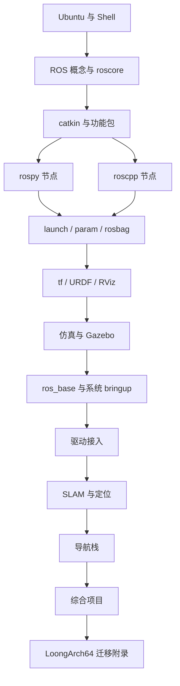
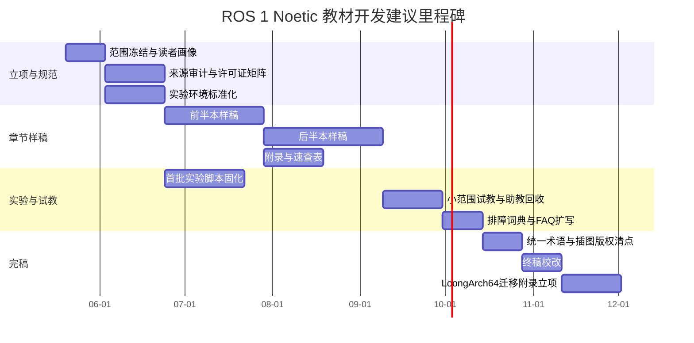

# 面向零基础大学生的 ROS 1 Noetic 教材设计深度研究报告

## 执行摘要

这份报告面向一部**先教 ROS 本体、随后再过渡到 LoongArch64 部署**的教材设计任务。检索结果显示，**最可靠且最值得作为一手依据的材料**仍然是 ROS 官方站点、ROS Wiki、REP-3 目标平台说明、ROS 原始论文、ROS Answers 归档，以及官方 GitHub 仓库；其中，ROS Wiki 仍是 ROS 1 的核心文档入口，而 docs.ros.org 首页在当前已经明显转向 ROS 2，并把最新 ROS 2 LTS 作为推荐入口。因此，教材如果以 ROS 1 Noetic 为主线，就必须明确告诉学生：**这是一个仍有巨大历史存量与教学价值的体系，但它已经在 2025-05-31 到达官方 EOL**，不应被表述为“当前默认首选的新项目平台”。citeturn25search15turn27search0turn24search0turn16search15turn34search13

从中文资料生态看，**Autolabor、鱼香 ROS、古月居**是最值得优先纳入教材参考库的三条线，但角色不同。Autolabor 的官方课程与使用文档覆盖“ROS 概述与环境搭建—通信机制—运行管理—常用组件—移动机器人 SLAM/导航实践”，非常适合做中文主线参考；鱼香 ROS 的强项是**安装工具、论坛答疑和工程化辅助**，对教材的“排障附录”和“课堂环境搭建”价值很高，但其当前核心公开课程重心更多偏向 ROS 2；古月居的“ROS 入门 21 讲”和移动机器人实战课程则适合作为**课堂节奏、案例呈现和视频配套**的二级参考。citeturn26search12turn12search14turn3search0turn38search2turn38search6turn14search9turn26search1turn26search11

在开源教学仓库方面，最应被放进教材写作底座的是：**ros/ros_comm、ros/catkin、ros/ros_tutorials、ROBOTIS-GIT/turtlebot3、ros/robot_state_publisher、ros-perception/image_pipeline、常见 ros-drivers 仓库**。如果教材要为未来 LoongArch64 章节做铺垫，那么还应提前纳入 **ros/meta-ros** 与 **loongros2** 的跟踪资料：前者是嵌入式/Yocto 世界里把 ROS 1/ROS 2 带入定制 Linux 的关键层，后者则显示 LoongArch 社区已在维护 rosdistro、ros_buildfarm 等基础设施分支，但它更偏向**移植与构建供应链**，而不是入门教学。citeturn24search0turn10search3turn10search1turn4search17turn24search1turn24search2turn24search15turn24search7turn13search1turn9search2turn8search3turn39search2

教材结构方面，我建议采用**“Ubuntu 与命令行 → ROS 计算图与 CLI → catkin 与功能包 → rospy/roscpp → launch/param/bag/tf/URDF → 仿真与驱动 → SLAM/导航 → 综合项目 → LoongArch 迁移附录”**的层递设计，而不是一上来就讲 Gazebo、MoveIt、导航堆栈。对完全没有 Ubuntu/ROS 背景的大学生，最稳妥的路径是**先把教程主线建立在 ros_comm 这层之上**：它本身就包含 roscpp、rospy、rostopic、rosnode、rosservice、rosparam 等核心通信与图调试工具，足以支撑前四到六周所有基础实验。之后再从 ros_comm 扩展到 ros_base，再进入驱动、SLAM 与导航。citeturn24search0turn16search20turn6search2

在实验环境上，若单纯从“新手第一次成功率”考虑，**Ubuntu 20.04 虚拟机**通常比从源安装更友好；若从“将来迁移到 LoongArch64 的方法论一致性”考虑，**从源构建一个裁剪版的 ros_comm/ros_base**更有教材价值；若从“课堂批量复现性”考虑，**Docker**最稳；若学生大量使用 Windows，则 **WSL2 + WSLg** 可以承担前期 CLI/RViz 级实验，但不建议把第一轮 Gazebo 重载实验完全押在 WSL 上。微软官方文档已经明确 WSL 支持 Linux GUI 应用，Ubuntu 官方也提供了基于 VirtualBox 的桌面虚拟机教程，而官方 Docker Hub 与 osrf/docker_images 则持续提供 ROS 镜像和镜像定义。citeturn21search0turn21search2turn20search5turn20search11turn20search7

## 研究前提与筛选标准

本报告以用户需求为前提：教材的**主体现在先写 ROS 1 Noetic 基础教学**，LoongArch64 的正式部署章节留到后续展开。因此，这里把“LoongArch64 相关内容”界定为**教材未来迁移方向的技术前情报**，而不是当前主书的核心叙述对象。未被明确给出的条件包括：书稿总页数、出版形态、配套授课周数、是否配套 MOOC 或视频。为便于后续写作落地，我默认采用**16 周课程、32–40 学时、约 350–450 页、纸书 + PDF 双形态、每章带实验与复习**的方案；以下所有结构与进度估算都以这个默认值展开。

围绕 ROS 1 Noetic 的事实边界，需要先写进教材导论。REP-3 仍把 **Noetic Ninjemys**定义为面向 **Ubuntu Focal 20.04** 的目标平台，支持窗口为 **2020-05 到 2025-05**；ROS Wiki 的发行版页面与安装总览也把 Noetic 标记为 ROS 1 的最终发行版；`ros_comm`、`catkin` 等 ROS 1 官方核心仓库在 GitHub 上也已经明确标注 **ROS 1 End-of-life**。这些信息意味着教材若继续选择 Noetic，是在教授一个**成熟、生态完整、但维护期已经结束**的系统。citeturn27search0turn27search3turn25search15turn24search0turn10search3

这也解释了一个看似矛盾的现象：**ROS 的官方首页与开发文档首页都还在更新，但它们的默认叙事中心已经转到 ROS 2**。ros.org 主页与“Why ROS”“The ROS Ecosystem”等页面仍然是定义 ROS 本质、生态分层和价值主张的优秀官方入口；但 docs.ros.org 首页当前显式把 **Jazzy** 标成“latest ROS 2 LTS”并称之为推荐入口，而 ROS Wiki 则会提醒读者“Wiki is for ROS 1”。因此，本教材在信息组织上应该采取一种双层策略：**概念定义与历史背景取自官方总站和论文；ROS 1 具体命令、教程和包说明取自 ROS Wiki 与官方仓库；排障与教学节奏则通过中文社区和大学课程补足。**citeturn6search3turn16search17turn16search20turn16search15turn34search2turn34search13turn6search2

为了让后续写作稳定可控，我建议将参考材料分成四个可靠性层级。**A 级**是官方与上游维护者资料，包括 ros.org、REP、ROS Wiki、官方 GitHub、ROS Answers archive。**B 级**是与上游关系较近、质量稳定的大学课程和长期作者资源，例如 TU Delft 的 ROS 课程、Jason O’Kane 的 *A Gentle Introduction to ROS*。**C 级**是高质量社区教程与中文课程资源，例如 Autolabor、鱼香 ROS、古月居。**D 级**是聚合站、零散博客、未说明来源的转载与 AI 总结页。教材正文尽量以 A/B 级为证据底座，C 级用来做中文解释、教学递进和实验组织，D 级只在排障检索时兜底，不进入主叙述。citeturn35search4turn36search11turn36search12turn26search12turn38search2turn26search1


上图代表我建议的“证据流”与“成书流”：越靠左越接近定义与事实边界，越靠右越偏向教学组织与迁移实践。这样的结构可以最大限度减少教材在多年后失效的速度。citeturn6search2turn27search0turn11search0turn24search0turn13search1turn8search3

## 资源全景与优先级

下表中的“主链接”均以**可点击引文**表示，而不使用裸 URL；它们对应的都是更适合直接引用或继续追踪的一手来源。

### 官方与高优先级英文资源对比

| 站点 | 类型 | 语言 | 可靠性 | 最适合承担的教材功能 | 主链接 |
|---|---|---:|---:|---|---|
| ROS 官方主页 | 官方总入口 | 英文 | A | 定义“ROS 是什么”、生态定位、价值主张 | 主页与概念页 citeturn6search3turn16search17turn16search20 |
| REP-3 Target Platforms | 官方规范 | 英文 | A | 写清 Noetic 的目标平台、支持周期与平台边界 | REP-3 citeturn27search0 |
| ROS 原始论文 | 学术一手文献 | 英文 | A | 解释 ROS 不是传统 OS、peer-to-peer、nodes/topics/services 等基本概念 | 论文与 PDF citeturn6search2turn17view0 |
| ROS Wiki | 官方社区文档 | 英文/多语 | A | ROS 1 命令、包文档、教程索引；Noetic 具体细节的主要入口 | Wiki 总览 citeturn6search7turn34search2 |
| ROS Answers archive | 官方问答归档 | 英文 | A | 排障案例、旧教程常见坑、历史问答检索 | Archive citeturn11search0 |
| docs.ros.org | 官方开发文档入口 | 英文 | A | 当前官方文档总入口，但主要偏 ROS 2；教材导论可借此说明官方叙事重心已迁移 | 首页 citeturn16search15 |
| Jason O’Kane 的 *A Gentle Introduction to ROS* | 作者个人书稿/长期流传教材 | 英文 | B | 适合借鉴写法、章节粒度与“常见误区”表达方式 | 书主页与章节 PDF citeturn36search11turn36search0turn36search3turn36search16 |
| TU Delft Hello Real World ROS | 大学课程 | 英文 | B | 适合借鉴课程化节奏：Ubuntu → ROS 工具 → Gazebo → 导航/操作 → 综合系统 | 课程页与课程仓库许可 citeturn35search4turn35search12turn35search1 |

### 中文与双语教学资源对比

| 站点 | 类型 | 语言 | 可靠性 | 最适合承担的教材功能 | 主链接 |
|---|---|---:|---:|---|---|
| Autolabor 官方课程 | 官方中文视频课 | 中文 | B | 课堂主线参考，适合零基础中文叙述、ROS 概述与通信机制教学 | Bilibili 课程页 citeturn26search12 |
| Autolabor 使用文档 | 官方文档 | 中文 | B | 适合作为移动机器人 SLAM/导航实践参考，尤其是从基础操作过渡到项目化部分 | 文档与设备教程 citeturn12search14turn12search4turn12search8 |
| 鱼香 ROS 官网 | 社区站点/工具入口 | 中文 | B | 环境搭建、工具下载、课堂装机辅助 | 官网与安装页 citeturn13search3turn38search2turn38search10 |
| 鱼香 ROS 论坛 | 社区问答 | 中文 | B | 新手排障、Noetic 安装失败、rosdep/源配置问题汇总 | 论坛与 Noetic 标签页 citeturn14search9turn38search6turn14search2 |
| 古月居 ROS 入门 21 讲 | 视频课程 | 中文 | B | 适合配套视频、课堂翻转教学、实验前预习 | 课程页 citeturn26search1 |
| 古月居 ROS 移动机器人实战 | 视频课程 | 中文 | B | 适合 SLAM/导航章节配套，帮助从概念过渡到应用系统 | 课程页 citeturn26search11 |
| *ROS 理论与实践* GitHub 版 | 开源书稿/整理版 | 中文 | C | 适合观察中文教材章节组织，但必须回溯其上游来源后再做正式写作 | 仓库与简介 citeturn12search0turn13search5 |
| 鱼香 ROS 一键安装系列 | 工具与论坛贴 | 中文 | B | 适合做“课堂安装兜底方案”，不适合直接替代教材正文 | 论坛贴与工具仓库 citeturn13search8turn38search9 |

从教材写作角度，**中文资料不应与官方资料拼成“两条平行主线”**。更好的做法是：正文里的概念、平台边界、命令解释和许可证信息优先回到官方；而中文资料用于把抽象概念“翻译”成适合本科生第一次接受的叙述。Autolabor 很适合拿来做中文表达参考，鱼香 ROS 更适合拿来做装机与排障参考，古月居则适合作为视频配套和实战节奏参考。citeturn26search12turn38search2turn26search1turn26search11

值得单独说明的是 **Hugging Face**。本次检索中，Hugging Face 上能检到的 ROS 相关内容，更多是**论文页、模型讨论页和数据集项目**，例如 `TempleRAIL/semantic2d` 这类要求 Ubuntu 20.04 与 ROS Noetic 的数据/项目页面，以及 ROS-LLM 等研究型论文条目；**没有发现成熟、系统、面向初学者的 ROS 1 Noetic 教材仓库或课程仓库**。因此，Hugging Face 更适合作为本书后半段“语义地图、数据集、具身智能扩展阅读”的资料池，而不是基础章节的核心来源。citeturn7search9turn7search3turn7search5turn7search1

## 开源项目与教学仓库清单

如果把教材写作目标定义为“让学生从 Hello ROS 一直走到可复现实验机器人项目”，那么最应该保留的不是海量链接，而是一组**能覆盖课程层级的代表性仓库**。下面这组仓库，基本可以支撑从 `ros_comm → ros_base → drivers → SLAM/navigation` 的教材骨架。

### 核心教学仓库与课程仓库

| 仓库或项目 | 主要用途 | 在教材中的位置 | 许可与备注 | 主链接 |
|---|---|---|---|---|
| `ros/ros_comm` | ROS 通信核心；含 roscpp、rospy、rostopic、rosnode、rosservice、rosparam 等 | 前半本教材的核心底座；建议先教这一层 | ROS 1 EOL 后已只读，但仍是 Noetic 基础代码核心 | citeturn24search0 |
| `ros/catkin` | ROS 1 常用构建系统 | 第一个工作空间、功能包、CMake 与 package.xml | BSD-3-Clause；教材必须讲透它 | citeturn10search3 |
| `ros/ros_tutorials` | 官方教程示例代码，含 `turtlesim` | 章节内最适合演示 topics/services/turtlesim/rqt 的示例库 | ROS Wiki 与 GitHub 都表明它是教程代码，许可为 BSD | citeturn10search1turn39search0turn39search6 |
| `ROBOTIS-GIT/turtlebot3` | 移动机器人完整教学平台 | SLAM、导航、综合项目主线的首选案例 | 社区极其广泛，适合作为“书中唯一平台型案例” | citeturn4search17 |
| `ros/robot_state_publisher` | 从 URDF 与 `joint_states` 发布到 tf/tf2 | URDF、坐标变换、RViz 章节核心 | 写机器人模型时不可绕开 | citeturn24search1 |
| `ros-perception/image_pipeline` | 图像驱动到视觉前处理通道 | 相机章节、感知章节、标定引入 | 适合讲 camera_info、图像流与处理链 | citeturn24search2 |
| `ros-drivers/nmea_navsat_driver` | GPS/NMEA 驱动示例 | 传感器驱动章节 | BSD-3-Clause；适合讲串口驱动/消息接口 | citeturn24search15 |
| `ros-drivers/velodyne` | 3D 激光雷达支持 | 高阶驱动与 late-project 感知案例 | 适合作为“驱动仓库长什么样”的真实样本 | citeturn24search7 |
| `jingxuanyang/ROS-Theory-Practice` | 中文书稿组织参考 | 观察中文教材章节切法，而非直接复写源 | MIT；但仓库 README 明确说内容主要整理自 Autolabor | citeturn12search0turn13search2turn13search5 |
| TU Delft `Hello-REAL-World-ROS` 相关仓库 | 大学课程作业/项目结构参考 | 借鉴课程节奏、实验组织、评测粒度 | 课程材料为 CC BY-NC-SA 4.0 | citeturn35search1turn34search15 |

### LoongArch 与嵌入式/构建链相关仓库

| 仓库或社区 | 主要用途 | 与当前教材的关系 | 许可与备注 | 主链接 |
|---|---|---|---|---|
| `ros/meta-ros` | 用 OpenEmbedded/Yocto 方式把 ROS 带入嵌入式 Linux | 适合作为后续 LoongArch/嵌入式附录的关键背景 | MIT；Layer Index 中有 `meta-ros1-noetic` | citeturn13search1turn9search2turn9search14 |
| `meta-ros1-noetic` Layer Index | 查看配方覆盖范围与分支状态 | 用于规划“哪些包能进目标系统” | Layer Index 显示 Noetic 层存在；近年仍有更新与修复议题 | citeturn9search2turn9search4turn9search9 |
| `loongros2` 组织 | LoongArch 上游/社区构建基础设施 | 对未来 LoongArch 章节很重要，但对新生入门不是主线 | 有 `rosdistro`、`ros_buildfarm` 等基础设施分叉，体现社区在补生态链 | citeturn8search3turn39search2turn39search5 |
| `fishros/install` | 一键安装与环境辅助工具 | 课堂装机兜底与助教工具，不宜替代教学原理 | 本次检索摘要主要看到使用与贡献指南；正式成书前应手工复核 LICENSE | citeturn38search9turn13search12 |
| Hugging Face `TempleRAIL/semantic2d` 等 | 语义地图/导航相关数据资源 | 可用于后半本项目扩展与数据实验 | 更偏项目与数据，不适合基础起步 | citeturn7search9 |

从这组仓库里，可以读出一个对写教材非常关键的结论：**不要让学生在一开始就面对“完整机器人软件世界”**。最稳妥的做法是先用 `ros_comm + catkin + ros_tutorials` 建立概念和习惯，再用 `robot_state_publisher + TurtleBot3 + 常见 driver` 把他们带到“机器人系统”，最后才进入 SLAM/导航。这样既符合 ROS 的通信—工具—能力层逻辑，也更符合真实开源生态的依赖方式。citeturn24search0turn10search3turn10search1turn24search1turn4search17turn16search20

## 教材架构与逐章教学计划

我建议把本书写成一部**课程化教材**，而不是博客集。结构上应坚持三个原则。第一，**先建立 Linux/Ubuntu 与命令行心智模型，再讲 ROS**，因为大多数 Noetic 安装、编译和排障问题都首先是路径、权限、环境变量与包管理问题。第二，**先讲计算图与 CLI，再讲代码**，这样学生先知道自己在操作什么。第三，**项目平台只收敛到一个移动机器人案例**，避免同时上多平台造成认知分裂。Jason O’Kane 的书、TU Delft 的课程，以及官方生态说明都支持这种“概念 → 命令 → 小程序 → 系统集成”的节奏。citeturn36search11turn36search8turn35search4turn16search20



这张依赖图同时说明了为什么我不建议把“安装整套 desktop-full”放在教材开头当作唯一入口。对完全零基础学生，更合理的教材组织是：**先构建最小可运行 ROS 世界，后扩展到图形化与导航型系统**。这也更有利于日后迁移到 LoongArch64。citeturn24search0turn27search0turn13search1

### 逐章教学计划

| 章名 | 学习目标 | 先修要求 | 课堂与代码实验 | 建议篇幅 | 建议学时 | 考核建议 |
|---|---|---|---|---:|---:|---|
| 导论与课程地图 | 理解教材目标、Noetic 的历史定位、ROS 与机器人软件栈关系 | 无 | 阅读 ROS 论文摘要；识别 nodes/topics/services | 18–22 页 | 2 | 概念问答 + 术语测验 |
| Ubuntu 与 Shell 入门 | 熟悉文件系统、终端、权限、apt、环境变量、SSH、Git 基础 | 无 | `pwd/cd/ls`, `apt`, `git clone`, `.bashrc` 修改 | 24–30 页 | 4 | 上机操作考 |
| ROS 是什么 | 建立“ROS 不是传统 OS，而是机器人 SDK/中间件/生态”理解 | 上章 | `roscore`、`rosnode list`、`rostopic list` 观察系统 | 20–24 页 | 2 | 简答题 |
| 计算图与命令行工具 | 认识 master、node、topic、service、message、parameter | 上章 | `rosnode`, `rostopic`, `rosmsg`, `rossrv`, `rosparam` | 24–30 页 | 4 | CLI 小测 |
| 工作空间与 catkin | 理解 catkin 工作空间、`package.xml`、`CMakeLists.txt` | Shell 基础 | 创建 `catkin_ws` 与 `beginner_tutorials` | 26–32 页 | 4 | 代码检查 |
| Python 节点编程 | 会写 `rospy` talker/listener，并理解回调与循环 | catkin、计算图 | Python talker/listener、日志、参数读写 | 26–34 页 | 4 | 小作业 |
| C++ 节点编程 | 会写 `roscpp` 节点，理解编译与链接 | 上章、C++ 基础 | C++ publisher/subscriber、消息定义 | 28–36 页 | 4 | 编程作业 |
| 运行管理与工程化 | 学会 `roslaunch`、`rosparam`、`rosbag`、日志、命名空间 | 前两章代码 | launch 文件、yaml 参数、bag 录制/回放 | 30–38 页 | 4 | 实验报告 |
| 坐标、模型与可视化 | 学会 tf、URDF、`robot_state_publisher`、RViz 基础 | 前述全部 | 一个两轮小车 URDF；RViz 观察 tf 树 | 32–40 页 | 4 | 模型检查 |
| 仿真基础 | 用 `turtlesim` 与 Gazebo 建立“仿真即系统集成试验场”的认知 | 坐标与模型 | turtlesim、Gazebo 启动、简易 world | 28–36 页 | 4 | 上机考 |
| 从 ros_comm 到 ros_base | 理解最小运行时与系统 bringup，知道如何渐进扩容 | 运行管理 | 从最小运行时扩到 `ros_base` 所需包 | 20–28 页 | 2 | 结构图绘制 |
| 驱动接入 | 理解摄像头、激光雷达、IMU、GPS、串口驱动的 ROS 接口 | bringup | `usb_cam`、GPS/NMEA、Lidar 示例配置阅读 | 30–40 页 | 4 | 配置作业 |
| SLAM 与定位 | 建立地图、里程计、tf、bag 数据回放调试链路 | 驱动、tf | TurtleBot3 SLAM / bag 数据复现实验 | 34–44 页 | 4 | 阶段项目 |
| 导航与路径规划 | 理解 move_base/nav stack 的输入输出与调参思路 | SLAM | TurtleBot3 导航仿真实验 | 34–44 页 | 4 | 阶段项目 |
| 综合项目与迁移前瞻 | 形成完整项目观；理解未来 LoongArch64 与 embedded 路线 | 全书 | 小组项目：从 bringup 到导航；附录预告迁移路线 | 24–32 页 | 4 | 期末项目 |

如果按这个结构展开，整书会自然形成三个层面。前五章是“工具与认知层”，把学生从零带到**能主动看懂工作空间和命令输出**；第六到十章是“单机到系统层”，让学生拥有**写节点、懂 launch、会看 tf、能跑仿真**的能力；后五章则是“机器人工程层”，把学习重心引向**真正的驱动、SLAM、导航与项目组织**。这比按包名堆叠知识点更像一本真正能教学生入门的教材。citeturn24search0turn35search4turn36search11turn26search11

## 实验环境与首批实验配方

对这本书，我建议把实验环境分成“课堂默认环境”和“迁移预备环境”两条线。**课堂默认环境**应该优先保证成功率与一致性，推荐 Ubuntu 20.04 虚拟机或原生机；**迁移预备环境**则应该从一开始就让学生知道 ROS 可以裁剪编译，并为未来 LoongArch64 章节埋下伏笔，所以建议在教师版或挑战实验中提供 `ros_comm` 的从源码构建流程。Noetic 的官方目标平台是 Ubuntu 20.04；Ubuntu 官方提供了桌面虚拟机入门教程；Docker 官方与 OSRF 也持续提供 ROS 镜像；WSL2 则在当前官方文档里已经支持 Linux GUI 应用。citeturn27search0turn20search5turn20search11turn20search7turn21search2

### 实验环境对比

| 环境 | 复现性 | 图形支持 | 上手难度 | 对之后 LoongArch64 的帮助 | 建议用途 | 依据 |
|---|---|---:|---:|---:|---|---|
| 原生 Ubuntu 20.04 | 中 | 高 | 中 | 中 | 教师机、实验室固定机位 | citeturn27search0turn23search2 |
| VirtualBox / VMware Ubuntu 20.04 | 高 | 中 | 低到中 | 中 | 零基础学生首选 | citeturn20search5turn25search19 |
| WSL2 Ubuntu 20.04 | 高 | 中 | 中 | 低 | CLI、轻量 GUI、Windows 学生备用方案 | citeturn21search0turn21search2 |
| Docker ROS 镜像 | 最高 | 中 | 中 | 中 | 批量一致环境、助教兜底、CI | citeturn20search11turn20search7 |
| 自源码构建 `ros_comm/ros_base` | 中 | 取决于宿主机 | 高 | 最高 | 教材挑战实验、后续 LoongArch 过渡 | citeturn24search0turn31search3turn13search1 |
| Yocto / `meta-ros` | 高 | 低 | 很高 | 最高 | 附录与教师版，不适合新生首发 | citeturn9search2turn13search1 |

在实际教学里，我推荐采用如下组合：**课堂主线用 Ubuntu 20.04 VM；助教备用用 Docker；书中“挑战实验”用源码构建 `ros_comm`；LoongArch64 章节未来再引入 `meta-ros` 与 `loongros2` 视角。**这样课堂不会被安装问题拖垮，但学生又不会误以为 ROS 只能“apt 一把梭”。citeturn20search5turn20search11turn24search0turn13search1turn8search3

### 首批实验的总体组织建议

官方教程与社区实践都反复体现出一个事实：新手最容易卡住的不是算法，而是**路径、环境变量和工作空间结构**。因此，第一批实验不应该一开始就追求“炫”，而应该追求“三个确定性”：**确定能启动、确定能观察、确定能解释**。`catkin_create_pkg beginner_tutorials std_msgs rospy roscpp`、`rosrun beginner_tutorials talker(.py)`、`rosbag record -a`、`rosparam list/set/get` 等命令都来自 ROS Wiki 教程链上的经典骨架，非常适合作为实验底板。citeturn29search0turn29search1turn29search13turn29search3turn30search1

### 实验配方一

这个配方不是去编译整套 desktop-full，而是先从**`ros_comm` 的最小可教学闭环**出发。原因很简单：`ros_comm` 已经包含了前几周真正需要的通信与图工具，而完整桌面环境会在零基础课堂里引入太多无关变量。这一做法是面向教材的“教学裁剪”，不是在声称它是官方唯一推荐方式。`ros_comm` 仓库自身就说明了它包含 roscpp、rospy、rostopic、rosnode、rosservice、rosparam 等工具，这足以覆盖前期 ROS 本体教学。citeturn24search0

```bash
# 适用前提：Ubuntu 20.04，建议在干净的 VM 或原生系统中执行
sudo apt update
sudo apt install -y build-essential curl git
sudo apt install -y python3-rosdep python3-rosinstall python3-rosinstall-generator \
                    python3-wstool python3-vcstool

# 初始化 rosdep
sudo rosdep init
rosdep update

# 创建源码工作空间
mkdir -p ~/ros_comm_ws
cd ~/ros_comm_ws
mkdir src

# 生成 ros_comm 及其依赖的源码清单
rosinstall_generator ros_comm --rosdistro noetic --deps --tar > noetic-ros_comm.rosinstall

# 拉取源码
wstool init src noetic-ros_comm.rosinstall

# 安装系统依赖
rosdep install --from-paths src --ignore-src --rosdistro noetic -y

# 编译与安装
./src/catkin/bin/catkin_make_isolated --install -DCMAKE_BUILD_TYPE=Release

# 配置环境
echo "source ~/ros_comm_ws/install_isolated/setup.bash" >> ~/.bashrc
source ~/.bashrc
```

这套步骤的设计依据有三部分。第一，ROS Wiki 搜索摘要明确说明了 **Noetic 可从源码安装**，而且它是“下载并自行编译源代码”的流程；第二，`rosinstall_generator` 的职责就是生成包含 ROS 仓库信息的安装清单；第三，`rosdep install --from-paths src --ignore-src --rosdistro ...` 这组参数的含义在官方 Windows 文档与 ROS 2 rosdep 文档中都有清晰解释，因此可以作为跨平台、跨发行版都相对稳定的“依赖解析套路”。citeturn23search1turn31search3turn33search2turn33search11

建议把这项实验的通过标准写得非常具体：终端里能正常执行 `roscore`；另一个终端执行 `rosnode list` 至少能看到 `/rosout`；学生能用自己的话解释“为什么我们现在只构建 `ros_comm` 而不是完整 ROS 桌面环境”。后一个检查点很重要，因为它决定学生是在“照着敲命令”，还是已经开始理解教材安排。citeturn32search3turn32search11

### 实验配方二

构建完最小运行时之后，下一步不是写节点，而是先建立**自己的 catkin 工作空间**。这是后续所有课堂代码、实验答案、课程项目的组织锚点。多份 ROS 教程与教学页面都沿用同一个骨架：先 `source` 全局环境，再 `mkdir -p ~/catkin_ws/src`，再在工作空间根目录执行 `catkin_make`，最后把 `devel/setup.bash` 写进 `~/.bashrc`。citeturn32search5turn11search11turn32search17

```bash
source ~/ros_comm_ws/install_isolated/setup.bash

mkdir -p ~/catkin_ws/src
cd ~/catkin_ws
catkin_make

echo "source ~/catkin_ws/devel/setup.bash" >> ~/.bashrc
source ~/.bashrc
```

这节实验应该顺便把两个高频错误提前讲掉。第一，**功能包必须建在 `src/` 目录内**，否则 `rospack` 和 catkin 根本找不到它。第二，**`catkin_make` 应该在工作空间根目录执行，而不是在包目录里执行**。这两个坑在 ROS Answers 归档里都是典型新手问题。citeturn11search7turn11search11

### 实验配方三

当工作空间准备好之后，才创建第一个功能包。这里建议先以官方教程同款的 `beginner_tutorials` 为名字，这样学生在查 ROS Wiki、ROS Answers 与社区博客时，能直接复用搜索词。ROS Wiki 搜索摘要明确给出了命令 `catkin_create_pkg beginner_tutorials std_msgs rospy roscpp`。citeturn29search0turn29search8

```bash
cd ~/catkin_ws/src
catkin_create_pkg beginner_tutorials std_msgs rospy roscpp

cd beginner_tutorials
mkdir -p scripts launch config
chmod +x scripts
```

建议在教材里配套一个最小 `rospy` 版 talker/listener，而不是一开始就让学生处理 CMake 细节。这样可以把早期认知负担集中在**消息流**而不是**构建系统**上。下面是一组足够小、足够稳的示例。

`scripts/talker.py`

```python
#!/usr/bin/env python3
import rospy
from std_msgs.msg import String

def main():
    rospy.init_node("talker", anonymous=True)
    pub = rospy.Publisher("chatter", String, queue_size=10)
    rate_hz = rospy.get_param("~rate", 1.0)
    rate = rospy.Rate(rate_hz)
    count = 0

    while not rospy.is_shutdown():
        msg = f"hello ros {count}"
        pub.publish(msg)
        rospy.loginfo(msg)
        count += 1
        rate.sleep()

if __name__ == "__main__":
    main()
```

`scripts/listener.py`

```python
#!/usr/bin/env python3
import rospy
from std_msgs.msg import String

def callback(msg: String):
    rospy.loginfo("I heard: %s", msg.data)

def main():
    rospy.init_node("listener", anonymous=True)
    rospy.Subscriber("chatter", String, callback)
    rospy.spin()

if __name__ == "__main__":
    main()
```

```bash
chmod +x ~/catkin_ws/src/beginner_tutorials/scripts/*.py
cd ~/catkin_ws
catkin_make
source ~/catkin_ws/devel/setup.bash
```

ROS Wiki 关于 publisher/subscriber 的搜索摘要明确表明，官方教程就是通过 `rosrun beginner_tutorials talker` 和 `rosrun beginner_tutorials talker.py` 这种方式来运行示例；这说明用 `beginner_tutorials` 做书中最小例子，与官方教程链是一致的。citeturn29search1turn29search13

### 实验配方四

Talker/listener 能跑起来以后，不要立刻切到 Gazebo，而是先把 **`roslaunch` 与 `rosparam`** 建立起来。因为一旦学生不能用 launch 管理多节点、不能用参数服务器做配置，他们后面会在所有项目里重复踩坑。官方与延伸资料都把 `roslaunch` 定义为**易于启动多个节点并在参数服务器上设置参数**的工具；`rosparam` 的基本命令序列则包括 `list / set / get / dump / load`。citeturn30search3turn30search7turn30search1turn30search0

`config/chatter.yaml`

```yaml
chatter:
  rate: 2.0
```

`launch/chatter.launch`

```xml
<launch>
  <rosparam command="load" file="$(find beginner_tutorials)/config/chatter.yaml" />

  <node pkg="beginner_tutorials" type="talker.py" name="talker" output="screen">
    <param name="rate" value="$(eval param('/chatter/rate'))" />
  </node>

  <node pkg="beginner_tutorials" type="listener.py" name="listener" output="screen" />
</launch>
```

```bash
source ~/catkin_ws/devel/setup.bash
roslaunch beginner_tutorials chatter.launch
```

在另一终端中，配套做参数操作：

```bash
rosparam list
rosparam get /chatter/rate
rosparam set /chatter/rate 5.0
rosparam dump my_params.yaml
rosparam load my_params.yaml
```

教材里应特别解释一个很容易被忽视的点：**launch 文件是“系统组织工具”，不是“顺序执行脚本”**。O’Kane 在 launch 章节里明确提醒过，launch 文件里的节点通常是大致同时启动的，因此不应向学生灌输“写在前面的节点一定先完全就绪”的错觉。这个提醒对后来写 SLAM 与导航系统非常关键。citeturn36search3turn30search13

### 实验配方五

最后才引入 `rosbag`，因为它最适合把前面所有知识点重新串起来：topic、launch、参数、回放、调试、可复现实验。ROS Wiki 的教程摘要给出了“录制与回放数据”的经典骨架，例如 `mkdir ~/bagfiles`、`cd ~/bagfiles`、`rosbag record -a`，而 `rosbag/Commandline` 摘要则再次指出 `record -a` 代表记录全部话题。citeturn29search3turn29search15

课堂上我不建议一开始就真的录制全部话题，而是建议学生先录制自己看得懂的最小集合：

```bash
mkdir -p ~/bagfiles
cd ~/bagfiles

# 在 talker/listener 系统运行时：
rosbag record /chatter /rosout
```

停止后回放：

```bash
rosbag play <你的bag文件名>.bag
```

如果教材要再往前走一步，可以补一个“参数—bag—launch 联动实验”：先用一个 launch 启动 talker/listener，之后记录 bag，再关闭 talker，仅保留 listener，让学生观察“同一个订阅者既可以接真节点，也可以接回放数据”。这正是 bag 在教学中的最大价值：它能把“系统调试”和“实验复现”这两个本来分开的概念统一起来。citeturn36search16turn29search3

## 教学法、误区与排障附录

如果教材面向的是**完全不懂 Ubuntu 与 ROS 的大学生**，那么最有效的教学法不是“把知识讲全”，而是**把抽象系统变成可观察对象**。TU Delft 的课程之所以适合借鉴，是因为它把 ROS 放在“用工具做完整机器人应用”的脉络里；Jason O’Kane 的书之所以一直被广泛推荐，是因为它专门面向新用户，并且会主动指出常见误区。Open Robotics 社区关于大学教学的讨论也提醒过：**不要让中间件教学吞掉机器人学基础本身**。也就是说，教材要讲清楚 ROS，但不能让学生误以为“学会命令行就是学会机器人”。citeturn35search4turn36search11turn36search12turn35search7

### 建议采用的教学法

| 方法 | 具体做法 | 为什么适合这本书 |
|---|---|---|
| 概念—命令—观察三段式 | 每个概念先定义，再给 1–3 个 CLI 命令，再让学生观察输出或图形结果 | ROS 是“可观察系统”，先看现象再写代码更稳 |
| 单平台主线 | 全书只维护一个移动机器人平台案例 | 降低设备分裂导致的认知负担 |
| 先 Python 后 C++ | 先用 `rospy` 建模，再用 `roscpp` 讲工程化与性能 | 让新生先理解消息，再承受编译系统 |
| bag 驱动实验复现 | 每个后期实验都尽量配 bag 数据 | 有利于离线调试与课程复验 |
| 显式讲错误 | 每章都附“本章前三个高频错” | ROS 新手最缺的不是知识点，而是错误模式识别 |
| 图示化依赖 | 经常使用计算图、tf 树、launch 结构图 | 符合 ROS 的图式思维方式 |

### 必须主动纠正的常见误区

| 误区 | 为什么不准确 | 正确表述 | 依据 |
|---|---|---|---|
| “ROS 就是操作系统。” | 官方与原始论文都明确说明它不是传统意义上的 OS | ROS 更像机器人软件开发工具链/SDK/中间件生态 | citeturn17view0turn16search20turn16search19 |
| “所有数据都经过 Master 转发。” | 原始论文强调 ROS 是运行时 peer-to-peer 拓扑，Master 主要承担名称服务/查找机制 | Master 负责注册与发现，不是所有通信流量的中心转发器 | citeturn17view0turn17view0 |
| “roslaunch 是顺序脚本。” | launch 中节点通常近似同时启动 | launch 是系统启动编排工具，不保证业务初始化顺序 | citeturn30search13turn30search3 |
| “Noetic 可以像 ROS 2 一样随便装在新 Ubuntu 上。” | REP-3 与历史安装说明都把 Noetic 的官方目标平台收敛到 Ubuntu 20.04 | 新手应优先使用 Ubuntu 20.04/Focal | citeturn27search0turn27search12 |
| “包放哪里都行，反正 catkin 会找到。” | ROS Answers 归档里最典型的错误就是包不在 `src/` | 功能包默认应位于工作空间 `src/` 内 | citeturn11search7turn29search12 |
| “一个 shell 里 source 过，别的 shell 也自动知道。” | 实际上每个新 shell 都需要正确 source 相应环境 | `source .../setup.bash` 是按 shell 会话生效的 | citeturn23search2turn32search10turn32search5 |

### 高价值排障清单

| 症状 | 高概率原因 | 第一检查项 | 参考依据 |
|---|---|---|---|
| `rospack` / `rosrun` 提示找不到 `beginner_tutorials` | 包不在 `src/`、未编译、未 source 工作空间 | `ls ~/catkin_ws/src`；`catkin_make`；`source ~/catkin_ws/devel/setup.bash` | citeturn11search7turn32search10 |
| `catkin_make` 很快结束但什么也没编 | 在错误目录执行；工作空间结构不对 | 当前目录是否为 `~/catkin_ws` | citeturn11search11turn32search17 |
| `rosdep` 不可用或依赖装不齐 | 没有安装/初始化 rosdep；系统源有问题 | `which rosdep`；`sudo rosdep init`；`rosdep update` | citeturn31search11turn32search4turn32search8 |
| `roslaunch` 能起但节点行为不对 | 误以为启动顺序受 XML 顺序控制 | 检查节点是否在等待 topic/service，而不是等待“先后顺序” | citeturn30search13 |
| FishROS 一键安装失败 | 源配置或三方源污染 | 先清理源并换镜像，再重试 | citeturn14search2turn38search13 |
| WSL 中 GUI/RViz 表现异常 | GUI 支持、图形堆栈、驱动问题 | 先确认 WSLg/GUI 支持，再决定是否切 VM | citeturn21search2 |
| `rosbag` 文件过大、实验不可控 | 对全部 topic 使用 `record -a` | 初学阶段先只记录关键 topic | citeturn29search15turn29search3 |

教材附录我建议至少包含这些材料：**Shell 常用命令速查、ROS CLI 速查、`package.xml` 模板、`CMakeLists.txt` 最小模板、launch XML 模板、YAML 参数模板、bag 实验流程卡、ROS 术语中英对照表、常见错误词典**。这些附录不只是附加物，而是零基础教学能否真正落地的“第二教材”。

## 版权归属与成书里程碑

正式成书之前，版权与引用策略必须先冻结，否则后面很容易出现“能参考但不能复用”的混乱。ROS Wiki 的页面底部搜索摘要明确写明：**除非另有说明，ROS Wiki 采用 CC BY 3.0**；ROS 官方站点则说明 ROS core 多数采用**BSD 三条款**这类宽松许可证；`meta-ros` 是 **MIT**；*ROS Theory and Practice* 的 GitHub 版本也是 **MIT**，但它自己同时声明内容主要整理自 Autolabor，因此正式写书时仍应回溯内容源头而不是把这个仓库当作唯一版权依据；TU Delft 课程材料则是 **CC BY-NC-SA 4.0**。citeturn34search2turn34search10turn34search7turn13search1turn13search2turn12search0turn35search1

这意味着教材的复用策略应该很明确。**概念与事实**可以引用官方与社区页面，但要保留来源。**代码**必须逐仓库看许可证，不能假定整个 ROS 生态都可随意摘录。**视频、截图、课程讲义**则要格外谨慎，尤其是 Bilibili、Autolabor、古月居、鱼香 ROS 这类平台内容，最稳妥的方式通常是**引用并改写，不直接大段转录或复刻图像**。`fishros/install` 仓库在本次快速检索摘要里主要展示了使用和贡献指南，因此我建议在正式成书前单独复核其 LICENSE 文件，再决定是否直接纳入脚本片段。citeturn38search9turn26search12turn26search1turn38search6

### 建议采用的来源优先级

| 优先级 | 来源类别 | 在教材中的用法 |
|---|---|---|
| 最高 | ROS 官方站点、REP、ROS Wiki、官方 GitHub、ROS Answers archive | 定义、平台边界、命令语义、包说明、引用事实 |
| 次高 | 大学课程、长期作者教材 | 章节组织、实验粒度、教学表达方式 |
| 中等 | 中文官方/半官方社区（Autolabor、鱼香 ROS、古月居） | 中文解释、安装经验、配套视频与课堂节奏 |
| 谨慎使用 | 零散博客、聚合站、AI 摘要、二手转载 | 只做补充检索，不进入主叙述 |

下面给出一个**假定从现在开始立项**的教材开发里程碑。因为用户没有指定出版周期，所以我按“先出一版可授课稿，再做试教修订”的路径来规划。



如果只保留一条最重要的执行建议，我会建议这样做：**把主书写成一部“最小可运行 ROS 1 教材”，先以 `ros_comm` 级能力完成零基础教学闭环；再以 `ros_base + TurtleBot3 + 常见驱动` 方式拉升到机器人系统；最后把 LoongArch64 留给附录或第二册。**这样既尊重 Noetic 的历史现实，也能最大化你后续把教材真正迁移到龙芯平台上的成功率。citeturn24search0turn4search17turn13search1turn8search3