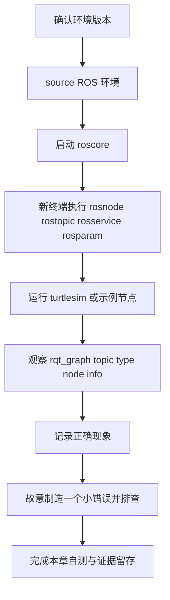
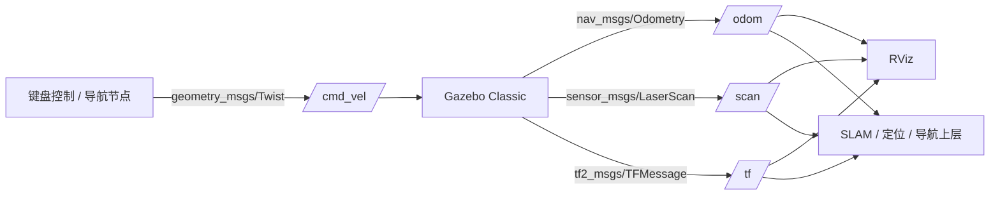

# Xiong-z-x/ROS 教材仓库最终审查报告

## 执行摘要

通过 GitHub 连接器优先审查 `Xiong-z-x/ROS` 后，可以确认这个仓库不是“零散教程集合”，而是已经具备正式教材雏形的项目：`README.md` 明确了读者对象、主线环境、学习目标、章节拆分和范围边界；`docs/03-章节写作模板.md` 规定了统一的章法；`docs/04-资料来源与事实边界.md` 规定了来源优先级；`docs/05-术语与常见误区.md` 已经建立了术语和误区治理框架。就“结构自觉”和“证据意识”而言，这个仓库明显高于大多数 ROS1 入门教程仓库。fileciteturn9file0 fileciteturn10file0 fileciteturn11file0 fileciteturn13file0

我的总体判断是：**这份教材已经达到“可以进入正式审校阶段”的质量，但还不宜立即冻结成最终版**。最需要优先修正的，不是代码示例本身，而是**零基础学习路径的严格性**。当前最大的结构性问题是：第 2 章已经安排了 `roscore`、`rosnode`、`rostopic`、`rosparam` 的运行观察和最小实验，而完整安装在第 3 章；对“完全陌生的大学生”来说，这会制造一个不必要的前置依赖断点。其次，`Action` 目前仍偏概念解释，尚未达到“每个核心概念至少 1 个具体例子或练习”的标准；再其次，作为 2026 年仍在讲 ROS1 Noetic 的教材，书中应更明确地区分**历史可学性**与**现实维护边界**，补入 Noetic EOL、Gazebo Classic EOL、当前求助渠道已转向 Robotics Stack Exchange/Discourse 等现实说明。citeturn28view0turn29view0turn22view0turn22view3

如果只做最少量、最高价值的改动，我建议先完成四件事：**重排或重写第 2 章与第 3 章的可运行内容关系；为 Action 增加最小观察实验；在安装与仿真章节增加“历史官方流程 vs 当前维护现实”的说明框；在运行管理章节补入 `roswtf` 与 `/clock` / `use_sim_time` 的最小说明。**完成这四项之后，本仓库就会从“高质量自学书稿”稳步转入“可作为正式教材试用稿”的状态。citeturn8view0turn20view0turn20view2turn28view0turn18view1

## 审查范围与证据基础

本次审查以 GitHub 连接器直接检索到的仓库内容为主，优先核查了仓库元信息、`README.md`、最终合订版、章节拆分文件路径，以及与教材治理直接相关的设计文档。仓库已经明确将主线锁定为 **Ubuntu 20.04 + ROS1 Noetic + catkin_make + Python 3 / C++14 + RViz + Gazebo Classic**，并把章节拆分为 `chapters/` 与 `docs/` 两层结构；因此本报告**不需要再额外假设主线环境**。fileciteturn9file0

外部对照证据方面，我优先采用了官方或原始来源：REP-3 用于核对 Noetic 的官方目标平台、目标语言与生命周期；ROS Noetic Ubuntu 安装页用于核对安装流程、`desktop-full` / `desktop` / `ros-base` 差异、`setup.bash` 与 `rosdep` 初始化；ROS Tutorials 用于核对入门学习路径与 `roswtf` 的教程位次；ROS Technical Overview 用于核对 Master、Parameter Server 与 topic 数据直连机制；REP-103 用于核对单位制与坐标系约定；`actionlib` 文档用于核对 Action 的“长任务 / 可反馈 / 可取消”语义；ROS 官方 Noetic EOL 公告用于核对 2025-05-31 的生命周期事实与当前官方建议的社区支持入口。citeturn5view0turn5view1turn5view2turn5view3turn9view1turn9view4turn10view0turn8view0turn27view0turn19view0turn20view0turn20view2turn28view0turn29view0

中文与教学节奏的对照，我主要参考了 FishROS、Autolabor 和 *A Gentle Introduction to ROS*。其中 FishROS 更适合解释国内网络、rosdep、换源与一键安装的现实价值；Autolabor 更适合解释“源码编译—source—launch—实体控制”的中文实战节奏；*A Gentle Introduction to ROS* 则直接定位新手与潜在 ROS 用户，非常适合用来校正“概念先行但不过度抽象”的教学强度。citeturn15view0turn16view0turn16view2

## 总体判断与优先级

这套教材的**强项很明确**。第一，它已经不是“命令拼盘”，而是严格按“概念—命令/代码—观察现象—错误路径—自测—延伸阅读”组织，而这正是仓库模板所要求的统一章法。第二，它不是无来源写作，而是先把来源优先级和高风险事实列了出来。第三，它已经内置了“学习成果验收”和“跨章节排障”思维，这一点非常适合大学课堂，也适合真正的零基础自学。fileciteturn13file0 fileciteturn10file0 fileciteturn9file0

但从“正式教材”的标准看，仍有几处关键缺口。最突出的是**前置依赖顺序**：概念先行本身没有问题，问题在于第 2 章已经把可运行实验提前了，而安装在第 3 章之后才正式展开。另一个缺口是**Action 与诊断工具的最低实践覆盖仍不够完整**：官方 Beginner Level 教程明确包含 nodes、topics、services/parameters、roslaunch、msg/srv、publisher/subscriber、service/client、rosbag 以及 `roswtf`；而当前书稿虽然在大多数点上已经覆盖，但 `Action` 和 `roswtf` 仍然偏弱。citeturn8view0turn20view0turn20view2

下面这张表给出我建议的章节改进优先级。表中“优先级”不是对章节质量的否定，而是指**对正式定稿影响程度**。

| 章节名 | 问题摘要 | 建议 | 优先级 |
|---|---|---|---|
| 学习成果验收与排障索引 | 内容有价值，但放在正文最前且篇幅较长，零基础读者一开始可能信息过载 | 前置只保留“如何使用本书”1 页摘要；完整索引移到附录或教师版 | 中 |
| 第 1 章 Ubuntu 与 Linux 入门 | 基础扎实，但开篇铺垫较长，首次“看到 ROS”较晚 | 在章末或书前加一个“本书终点预览”小节，增强动机 | 低 |
| 第 2 章 ROS1 基本概念 | **可运行命令与实验早于安装章节**，对零基础读者形成前置依赖冲突 | 改为纯概念预览，或与第 3/4 章重排；删除/后移本章最小实验 | 高 |
| 第 3 章 ROS1 安装方法完整说明 | 安装流程准确，但建议补一层“历史官方流程 vs 当前 APT/Keyring 现实”说明 | 保留官方主线，同时增加 `apt-key` 背景说明和 keyring 备注框 | 中 |
| 第 4 章 第一个 ROS 系统 | 教学设计良好，但与第 2 章存在观察内容重叠 | 让第 4 章承接第 2 章全部“第一次实际观察”职责 | 高 |
| 第 5 章 catkin 工作空间与功能包 | 结构较完整 | 补一小段“哪些目录不提交到 Git 仓库”的工程最佳实践 | 中 |
| 第 6 章 Python 与 C++ 编写 ROS 节点 | 发布订阅与 service 覆盖较好 | 增补“Action 不在本章实现，但应给出最小观察例子/路标” | 中 |
| 第 7 章 ROS 运行管理 | launch/YAML/remap/rosbag 已较成熟 | 增补 `roswtf`、`/clock`、`use_sim_time` 的最小实践说明 | 中 |
| 第 8 章 坐标、模型与可视化 | 概念与实验质量较高 | 首次出现 `Fixed Frame` 时做中英对照，并用 REP-103 强化单位/坐标约定 | 低 |
| 第 9 章 仿真与移动机器人入门 | TurtleBot3 路线可用，但上游文档版本漂移大 | 增加“Gazebo Classic / Noetic 为 legacy 教学路线”的边界说明框 | 中 |
| 第 10 章 综合项目 | 综合交付设计成熟 | 增补 `.gitignore`、bag 文件处理与仓库提交规范 | 中 |
| README 与 docs/04 docs/05 | 已有治理框架，但现实支持入口仍可更新 | 增加 Robotics Stack Exchange、Discourse；把 ROS Answers 明确标为 archive | 高 |

建议的学习路径与实验依赖关系，我更推荐改成下面这种“先装、先见到、再抽象、再工程化”的组织，而不是在尚未安装前就安排运行实验：

```mermaid
flowchart LR
  A[Ubuntu 与命令行基础] --> B[ROS 安装与环境验证]
  B --> C[第一次运行 roscore 与 turtlesim]
  C --> D[再回看 ROS 核心概念]
  D --> E[catkin 工作空间与功能包]
  E --> F[Python 与 C++ 节点]
  F --> G[launch 参数 命名空间 rosbag]
  G --> H[TF URDF RViz]
  H --> I[Gazebo TurtleBot3 仿真]
  I --> J[综合项目与可复现实验交付]

  B --> B1[验证 rosversion roscore turtlesim]
  C --> C1[rqt_graph rostopic rosnode]
  G --> G1[rosbag roswtf use_sim_time]
  I --> I1[/cmd_vel /odom /scan /tf]
```

这个调整并不改变你的教材主张，反而更符合零基础学习心理：**先让学生见到系统，再要求学生抽象概括系统。**

## 章节级详细审查

从形式规范上看，仓库已经具备较强的一致性。`README.md` 明确写出了目标读者、主线环境、章节顺序、安装边界和资料来源原则；`docs/03-章节写作模板.md` 明确要求每章包含“本章问题—能力—概念—最小实验—正确现象—高频错误—自测—延伸阅读”；`docs/05-术语与常见误区.md` 也已经把“ROS 不是操作系统”“Master 不转发所有 topic 数据”“source 一次不会影响所有终端”等关键误区提前治理了。这些都是正式教材化的强信号。fileciteturn9file0 fileciteturn13file0 fileciteturn11file0

真正需要改的，是**跨章逻辑与少数核心概念的最小实践闭环**。

首先，第 2 章的定位应更清晰地区分“概念预览”和“第一次运行”。按照 ROS 官方教程的传统路径，安装与环境配置是 Beginner Level 的入口，之后才是 filesystem、package、build、nodes、topics、services/parameters、roslaunch、msg/srv、pub/sub、service/client、rosbag、roswtf。你的书稿可以保留“先讲概念”的教学设计，但不应在安装之前就要求读者完成 `roscore`、`rosnode list`、`rostopic list`、`rosparam set/get` 这一整套最小实验。**建议只保留第 2 章中的图、类比、决策表和误区纠正，把可运行实验完全后移到第 3 章“安装验证”或第 4 章“第一个 ROS 系统”。**这一点会显著降低零基础读者的挫败感，也会减少“我是不是漏装了什么”的假性排障。这个建议与 ROS Tutorials 的官方入门顺序是吻合的。citeturn8view0

其次，`Action` 目前还没有进入“最低可操作”层。你在 glossary 和正文里已经把 Action 定义为“可反馈、可取消的长任务接口”，这一定义本身是对的；官方 `actionlib` 文档也明确把它描述为**适合长时、可抢占、需要反馈的任务**，并把 Goal / Feedback / Result / Cancel 作为核心结构。问题不在定义，而在教材目标已经要求每个核心概念都应至少有一个具体例子或练习，而当前 Action 仍主要停留在描述层。建议不要一上来要求学生写 Action Server/Client，而是先加入一个**观察型练习**：例如在存在 action server 的系统中观察 `/goal`、`/cancel`、`/status`、`/feedback`、`/result` 这类底层 topic 如何对应“一个长任务”。这会让 Action 真正进入学生的心智模型，而不是停留在“以后再学”的抽象名词。fileciteturn11file0 citeturn20view0turn20view2

再次，教材的“现实边界说明”还可以更现代一些。仓库已经正确写明 Noetic 于 2025-05-31 EOL，而且 repo 选择继续使用 Noetic 是为了教学 ROS1 体系和维护历史项目，这一点是成熟的；但 EOL 之后，教材更应该同时告诉学生三件事：一是 **Noetic 已停止官方新功能、bug fix 和安全更新**；二是 **现有二进制包不会立刻消失**；三是 **现实中的活跃求助入口已经更偏向 Robotics Stack Exchange 与 Discourse，而不是只看老页面或历史问答**。这类文本不是“政治正确补充”，而是防止学生把教材当成“当前主流工程路线”的必要边界。citeturn28view0turn29view0

安装章节方面，我认为你的主线判断是对的：**Ubuntu 20.04 + 官方 apt** 仍然是最适合零基础教学的 ROS1 Noetic 路径，REP-3 也确实把 Noetic 的 required support 锁定在 Ubuntu Focal 20.04，目标语言为 C++14 和 Python 3.8。ROS Noetic Ubuntu 安装页也确实给出了 `restricted` / `universe` / `multiverse`、ROS source list、`desktop-full` / `desktop` / `ros-base`、`setup.bash` 与 `rosdep` 初始化等步骤。你现在的问题不是“安装错了”，而是还可以更进一步地区分：**正文主线仍然使用历史官方流程；旁注中增加“为什么你会看到 apt-key 警告”“为什么教材仍保留这一写法”“什么情况下应使用 keyring/signed-by 风格”的说明。**这样学生在 2026 年阅读时，不会把工具链时代差异误判为自己操作失误。citeturn5view1turn5view2turn5view3turn9view1turn9view4turn10view0turn18view1

运行管理章节方面，你已经把 launch、YAML、命名空间、remap、rosbag 讲得相当扎实，但从正式教材看，还应补两块小而关键的内容。第一块是 `roswtf`。官方 Beginner Level 教程把它放进了基础工具链，而当前书稿没有系统覆盖它；对零基础学生来说，`roswtf` 不是替代理解的神奇诊断器，但它非常适合做“第一轮自动检查”。第二块是 `/clock` 与 `use_sim_time`。你已经在 rosbag 章节中提到它们，但仍停留在“后续再展开”的程度；既然第 9 章已经进入仿真，最好在第 7 章末增加一个半页说明，把 bag 回放与仿真时间概念接起来。这样能显著提升实验的可复现性。citeturn8view0

坐标、模型与仿真章节的总体质量很高。第 8 章已经抓住了 TF、URDF、`robot_state_publisher`、`RobotModel`、RViz `Fixed Frame` 的核心关系；第 9 章也已经意识到 TurtleBot3 e-Manual 存在多版本页面混排的问题，并且正确提醒读者看到 `ros2`、`colcon`、`rviz2` 时不要直接复制到 Noetic 路线上。这个判断是对的，而且与当前 e-Manual 页面现实一致：同一页面确实混有 Humble/Jazzy 的 `ros2 launch` 命令，也保留了 Noetic 的 `roslaunch turtlebot3_gazebo ...` 路线。唯一建议是**再往前走一步**：明确加一句“本书第 9 章固定使用 TurtleBot3 Noetic + Gazebo Classic 作为历史教学路线；若读者查看到的是 ROS2 / 现代 Gazebo 路线，不属于本书实验边界”。另外，建议在第 8 章首次解释 `Fixed Frame` 时，统一写成 **Fixed Frame（固定参考坐标系）**；在讲 `odom` / `base_link` / `map`、单位制与轴方向时，最好显式对齐 REP-103 的 SI 单位、右手系、x forward / y left / z up 约定。citeturn22view0turn22view3turn19view0

最后，从“仓库工程化”角度，还有一个低成本收益点：既然 README 明确说明仓库既有分章文件，也有最终合订版，那么后续最好补一个**自动合并脚本或明确的生成流程**，避免章节文件与最终版长期手工同步漂移。这个问题不影响教材内容正确性，但会影响仓库长期维护质量。仓库目前已经具备良好的内容治理文档，如果再加一层构建治理，会更像真正可协作维护的教材项目。fileciteturn9file0

## 术语规范与图表建议

下表基于仓库现有术语文档、ROS Technical Overview、`actionlib` 与 REP-103 整理。重点不是“翻译得更漂亮”，而是**让零基础读者第一次见到术语时就不被误导**。尤其建议对 `Action`、`Fixed Frame`、`Gazebo Classic`、`overlay` 这类容易在 2026 年读者环境里产生误读的词，做更严格的首现定义。fileciteturn11file0 citeturn27view0turn20view0turn20view2turn19view0turn28view0

| 中文术语 | 英文术语 | 建议定义 | 出现位置/章节 |
|---|---|---|---|
| ROS | Robot Operating System | 建议定义为“机器人软件中间件与工具生态”，**不要**把它简化成“机器人操作系统” | README；第 2 章导论 |
| ROS Master | ROS Master | 建议定义为“名称注册与发现服务”；强调**不转发 topic 数据** | 第 2 章 2.5、2.6 |
| 参数服务器 | Parameter Server | 建议定义为“ROS1 中用于存储运行时参数的服务，逻辑上依附于 Master，但不等于数据流通道” | 第 2 章 2.11；第 7 章 |
| 节点 | Node | 建议定义为“参与 ROS 通信的运行中进程，而不是源码文件本身” | 第 2 章 2.7；第 4 章 |
| 话题 | Topic | 建议定义为“异步发布订阅通道”；第一次出现时建议配“持续数据流”描述 | 第 2 章 2.8；第 4 章 |
| 消息 | Message | 建议定义为“topic 中传输的数据结构定义” | 第 2 章 2.8；第 4 章 |
| 服务 | Service | 建议定义为“同步请求响应接口” | 第 2 章 2.9；第 6 章 |
| Action 长任务接口 | Action | **不建议单独译为“动作”**；建议首现统一写作“Action（长任务接口）”，避免学生误读为“机械动作” | 第 2 章 2.10；docs/05 |
| 功能包 | Package | 建议定义为“ROS 的基本组织与复用单元，可包含多个节点、launch、msg、srv、配置和资源” | 第 5 章 |
| 工作空间 | Workspace | 建议定义为“catkin 包的组织与构建根”；首次说明 `src/build/devel` 关系 | 第 5 章 |
| 启动文件 | launch file | 建议首现写作“launch 文件（启动编排文件）”；强调**不是顺序脚本** | 第 7 章 |
| 重映射 | remap | 建议定义为“在运行时改名字而不改代码” | 第 7 章 |
| 命名空间 | namespace | 建议定义为“用于组织节点名、topic 名、参数名的层级作用域” | 第 7 章 |
| 固定参考坐标系 | Fixed Frame | 建议首现统一写作“Fixed Frame（固定参考坐标系）” | 第 8 章；第 9 章 RViz 小节 |
| 坐标变换系统 | TF | 建议定义为“描述 frame 之间空间关系的系统，而不是单个 topic 名字” | 第 8 章；第 9 章 |
| 机器人描述格式 | URDF | 建议定义为“描述 link/joint 等机器人结构的 XML 格式” | 第 8 章 |
| Gazebo Classic 仿真器 | Gazebo Classic | 建议显式写出 “Classic”，避免与现代 Gazebo 名称混淆 | README；第 9 章 |
| 叠加环境 | overlay | 建议新增术语：后 source 的工作空间会覆盖前面环境中同名资源的解析结果 | 第 3 章环境配置；第 5 章工作空间 |

建议在教材显式加入一张“命令执行与观察闭环”图，帮助学生理解为何所有实验都必须落到可观察对象上，而不是停留在“运行了命令”：



如果你愿意再补一张更“教材化”的图，我建议在第 9 章加入下面这张“移动机器人实验依赖图”，因为它能把 `/cmd_vel`、`/odom`、`/scan`、`/tf`、RViz 与 Gazebo 的关系一次讲清楚：



## 示例改写片段

下面给出三个最值得直接落地的示例改写。引文中的“原文”均来自当前仓库合订版或对应章节内容；若拆分章节的精确行号在仓库中未单独标注，我在后面的 Codex 指令里会同时给出**合订版行号**与**拆分章节标题**。仓库当前存在最终合订版与拆分章节并行维护的事实，可由 `README.md` 直接确认。fileciteturn9file0

**示例一：修正第 2 章与第 3 章的前置依赖冲突**

原文摘录：  
“本章先建立 ROS1 的运行时心智模型。将使用最小系统观察 `roscore`、`rosnode`、`rostopic`、`rosservice` 和 `rosparam`……”  
建议改写：

> 本章只建立 ROS1 的概念框架，帮助读者先理解 Master、Node、Topic、Service、Action 和 Parameter Server 在系统中的角色。  
>  
> **如果你还没有完成第 3 章安装，不需要在本章执行任何 ROS 命令。** 本章中的命令名称只用于“先建立名字和对象的对应关系”；真正的第一次运行与观察，统一放到第 3 章“安装验证”和第 4 章“第一个 ROS 系统”中完成。  
>  
> 这样安排的目的，是避免零基础读者在还没有 ROS 环境时，被 `roscore`、`rosnode list` 之类的命令打断学习节奏。

这样改的好处是：保留你“概念先行”的思想，但不再让第 2 章承担实际运行责任。它也更接近 ROS 官方 Beginner Tutorials 的节奏。citeturn8view0

**示例二：给 Action 增加最小观察型练习**

原文摘录：  
“后续导航章节再深入 action。现在不应急于写 action 代码，先能判断它解决的问题。”  
建议改写：

> 后续不要求你马上编写 Action Server 或 Action Client，但**本章至少要会观察一个 Action 的表面结构**。  
>  
> 当系统中存在某个 Action Server 时，通常可以观察到与该任务同名前缀相关的一组接口，例如：  
> `goal`、`cancel`、`status`、`feedback`、`result`。  
>  
> 你现在至少应建立这样的映射：  
> - `goal`：我要做什么  
> - `feedback`：做到哪一步了  
> - `result`：最后结果是什么  
> - `cancel`：能否中途取消  
> - `status`：当前任务状态如何  
>  
> 这样，哪怕你还没有写过 Action 代码，也已经知道它为什么不是普通 Service。

这段改法的优点是**不强迫新手立刻写 Action 代码**，但又满足“每个核心概念至少 1 个具体例子或练习”的教学要求。citeturn20view0turn20view2

**示例三：把安装章节的时代差异写清楚**

原文摘录：  
“注意：`apt-key` 在较新 Ubuntu 中已不推荐作为长期方式，但 ROS Noetic 官方安装文档仍使用这套历史流程。本书为 Noetic 主线保留官方文档方式。”  
建议改写：

> 注意：本书这里保留的是 **ROS Noetic 官方安装页的历史命令写法**，因为它与 Ubuntu 20.04 + Noetic 的教学主线一致。  
>  
> 如果你在较新的 APT 环境、较新的 Ubuntu 文档或一些现代 Linux 教程里看到了基于 keyring / `Signed-By` 的仓库配置方式，不要把这种差异误判成“本书命令错了”或“你的安装失败了”。  
>  
> 更准确的理解是：**你正在学习一个已经进入维护尾声的历史平台，因此官方原始文档与当前 Linux 生态习惯之间会出现时代差异。**  
>  
> 本书主线仍以“能解释 Noetic 官方安装流程”为目标；扩展写法可作为教师补充或附录阅读。

这样写，学生就会知道：问题不是“谁对谁错”，而是“你现在学的是一个有生命周期背景的旧平台”。citeturn9view1turn9view4turn10view0turn18view1turn28view0

## 可交付给 Codex 的修改指令

下面的指令按“**文件路径 → 位置 → 修改动作 → 可直接写入的文字**”组织。  
说明：`ROS1零基础自学指导书-最终版.md` 的行号基于本次审查所对照的合订版副本；拆分章节文件如仓库未单独标注精确行号，则以**章节标题**为准。

| 文件路径 | 行号范围或章节标题 | 修改动作 | 优先级 |
|---|---|---|---|
| `ROS1零基础自学指导书-最终版.md` | 903–1419；`第 2 章 ROS1 基本概念` | 把本章定位改为“概念预览章”；删除或后移本章最小可运行实验；在章首插入“未完成第 3 章安装时不执行命令”的提示 | 高 |
| `chapters/02-ros1基本概念.md` | `2.13 最小可运行实验` | 将整节改为“观察预告”或迁移到第 4 章；保留概念、图、决策表 | 高 |
| `ROS1零基础自学指导书-最终版.md` | 1232–1250；`2.10 Action` | 增加一个最小观察型练习，至少让学生知道 Action 对应 goal/feedback/result/cancel/status | 高 |
| `chapters/02-ros1基本概念.md` | `2.10 Action：可反馈、可取消的长任务` | 按上条同步修改 | 高 |
| `README.md` | `关键参考链接` 与 `资料来源原则` 相邻位置 | 增加 Robotics Stack Exchange、Discourse；将 ROS Answers 明确为 archive/历史检索材料 | 高 |
| `docs/04-资料来源与事实边界.md` | `来源优先级`、`关键官方资料` | 把“ROS Answers archive”改成“历史归档资料”；新增“Robotics Stack Exchange（优先 Q&A）”“Discourse（社区讨论）” | 高 |
| `ROS1零基础自学指导书-最终版.md` | 1729–1741；`3.4 添加密钥` | 保留官方 `apt-key` 主线，但新增“历史写法说明框”与“现代 keyring 备注框” | 中 |
| `chapters/03-ros1安装方法完整说明.md` | `添加密钥` | 按上条同步修改 | 中 |
| `ROS1零基础自学指导书-最终版.md` | `第 7 章 ROS 运行管理`，建议插入在 `7.16 rosbag 回放时要理解什么` 之后 | 新增 `7.x 诊断工具 roswtf` 小节；新增 `7.x /clock 与 use_sim_time` 小节 | 中 |
| `chapters/07-ros运行管理.md` | 相同章节标题 | 同步新增 | 中 |
| `ROS1零基础自学指导书-最终版.md` | `第 8 章` 与 `第 9 章` 内首次出现 `Fixed Frame` 的位置 | 首现统一写成“Fixed Frame（固定参考坐标系）” | 中 |
| `docs/05-术语与常见误区.md` | `基础术语` 表 | 新增 `Fixed Frame`、`Gazebo Classic`、`overlay` 三项 | 中 |
| `ROS1零基础自学指导书-最终版.md` | 5915 附近；`第 9 章` TurtleBot3 版本提醒段 | 增加“Noetic + Gazebo Classic 为 legacy 教学路线”的边界说明 | 中 |
| `chapters/09-仿真与移动机器人入门.md` | `特别注意官方资料版本` 相邻位置 | 按上条同步修改 | 中 |
| `ROS1零基础自学指导书-最终版.md` | `第 10 章 综合项目` 中交付清单位置 | 增加 `.gitignore`、不提交 `build/ devel/ logs/ *.bag` 大文件的仓库规范 | 中 |
| `README.md` 或新建 `scripts/build_book.py` / `docs/07-构建说明.md` | 未指定 | 增加“如何由 `docs/` + `chapters/` 生成合订版”的说明或脚本 | 低 |

可直接给 Codex 的高优先级文本指令如下：

```text
任务 1：
文件：chapters/02-ros1基本概念.md
位置：章首“本章解决什么问题”之后
操作：插入一段醒目的学习提示
写入文本：
“注意：如果你还没有完成第 3 章 ROS 安装，本章只阅读概念、图和决策表，不执行任何 ROS 命令。真正的第一次运行与观察，统一放到第 3 章安装验证和第 4 章 turtlesim 实验中完成。”
```

```text
任务 2：
文件：chapters/02-ros1基本概念.md
位置：2.10 Action 小节末尾
操作：新增一个“最小观察练习”
写入文本：
“最小观察练习：当系统中存在某个 Action Server 时，观察与该任务同名前缀相关的一组接口，重点识别 goal、cancel、status、feedback、result 五类信息分别对应‘任务目标、取消、状态、进度反馈、最终结果’。当前不要求编写 Action 代码，但必须能把这五类接口和长任务语义对应起来。”
```

```text
任务 3：
文件：docs/04-资料来源与事实边界.md
位置：来源优先级表与关键官方资料列表
操作：更新社区支持来源
写入要求：
- 把“ROS Answers archive”明确标注为“历史检索材料，不作为当前优先求助入口”
- 新增“Robotics Stack Exchange：当前优先 Q&A”
- 新增“ROS Discourse：社区讨论与公告”
- 在注释中说明：Noetic EOL 后，教材应优先引导读者去仍活跃的平台提问
```

```text
任务 4：
文件：chapters/07-ros运行管理.md
位置：rosbag 小节之后，高频错误之前
操作：新增两个短小节
小节一标题：7.x roswtf：第一轮自动诊断
小节二标题：7.x /clock 与 use_sim_time：回放和仿真时间
要求：
- 每个小节控制在 15~25 行
- 提供最小命令
- 强调这两个工具/概念不替代理解，但能提升实验可复现性
```

```text
任务 5：
文件：chapters/09-仿真与移动机器人入门.md
位置：TurtleBot3 版本提醒段之后
操作：新增一个“边界说明”框
写入文本：
“边界说明：本章固定采用 TurtleBot3 Noetic + Gazebo Classic 作为 ROS1 教学路线。若你查到的是 ROS2、colcon、rviz2 或现代 Gazebo 的命令，请不要直接复制到本章实验中。它们属于不同技术栈，不在本书当前实验边界内。”
```

```text
任务 6：
文件：README.md
位置：关键参考链接下方
操作：新增‘如何求助与核对版本’小节
要求：
- 说明 Noetic 已 EOL，但二进制包不会立刻消失
- 说明当前活跃求助入口优先为 Robotics Stack Exchange 与 Discourse
- 说明仓库正文默认以 Ubuntu 20.04 + ROS Noetic 为唯一主线
```

## 开放问题与局限

本报告已经足以支持正式审校与第一轮改稿，但仍有两个需要坦诚说明的局限。其一，仓库同时维护了**合订版**与**拆分章节文件**；本次给出的精确行号主要依据合订版副本，拆分章节更适合按标题定位。其二，我已核对了最关键的官方与中文来源，但并没有逐页穷尽所有外链，因此本报告更适合用作**定稿前的结构性审校清单**，而不是逐字逐句的出版校样。尽管如此，Noetic 的目标平台、C++14 / Python 3.8、官方安装路径、Master/Parameter Server 机制、Action 语义、REP-103 坐标约定、Noetic EOL、TurtleBot3 多版本文档漂移、FishROS 与 Autolabor 的辅助角色，这些本报告所依赖的关键事实，都已经有足够的一手或准一手证据支撑。citeturn5view1turn5view2turn5view3turn9view1turn10view0turn27view0turn20view0turn20view2turn19view0turn28view0turn22view0turn22view3turn15view0turn16view0turn16view2

综合结论只有一句：**这份教材已经“像教材”，现在要做的不是大推翻，而是把最关键的三四个逻辑断点补平，让它真正成为一份对零基础大学生友好、对正式课堂负责、对 2026 年技术现实诚实的 ROS1 教材。**